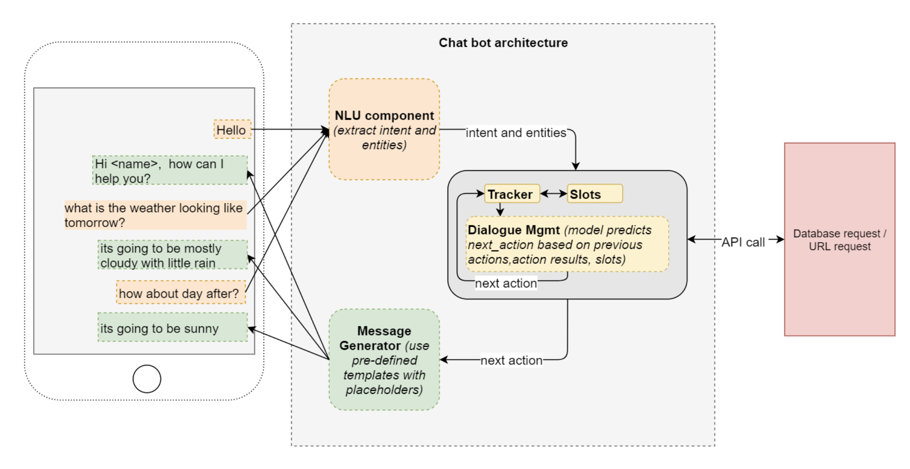
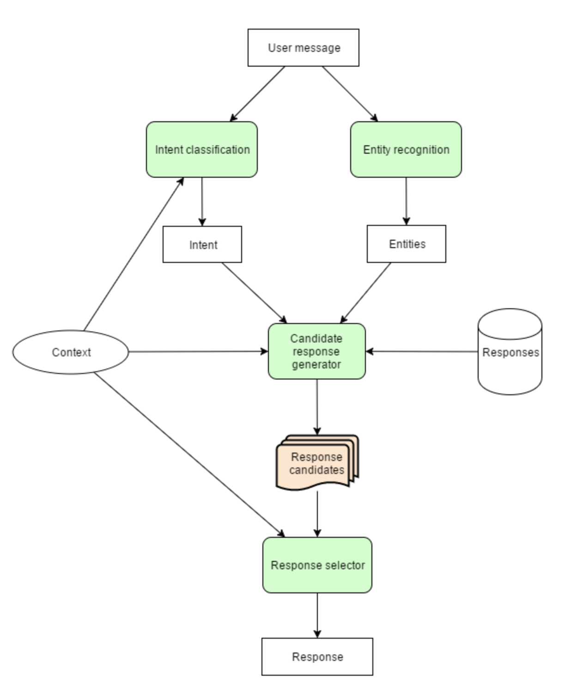

# [Chat Bot] Chat Bot Basic
> date - 2018.11.03  
> keyword - ai, chat bot  
> chat bot의 기본 개념 및 핵심 기술에 대해 정리

 

## Chat Bot이란?
* 채팅하는 로봇
  * 정해진 응답 규칙에 따라 사용자 질문에 응답할 수 있도록 만들어진 SW
  * AI를 기반으로 사람과 자동으로 대화를 나눌 수 있는 SW
    * AI + Messenger
* 별도로 웹사이트나 앱을 실행하지 않고도 대화하듯 정보를 얻을 수 있는 SW
  * Messenger에서 제공하는 Message API와 message를 해석해서 적절한 응답 메시지(text, image, url 등)를 제공하는 Chat Bot API가 필요

 

## 사용 사례
* Customer support
  * 24시간 응대
* Transactions
  * 대화형 커머스
* Getting things done
  * 개인 비서 서비스
* WeChat의 호텔, 병원 등 예약 서비스
* Unialo IQ(상품 추천 챗봇 서비스)
  * 매주 추천 코디 및 트렌드 단어 통지
  * 코디, 카테고리, 트렌드 3가지 방식 상품 검색
  * 원하는 상품 장바구니에 넣고 온라인 스토어에서 구매
  * 원하는 상품 인근 매장에서 재고 확인
  * 매장 체크인 시, 관심 상품 추천 또는 재고 확인

 

## Chat Bot 형태

### 1. Menu-Driven
* 버튼을 눌러서 원하는 바를 사용자가 직접 알려주는 방식

### 2. AI-based NLP
* 일반적인 문장으로 물어봤을 때 Bot이 `의도`가 무엇인지 파악하는 방식
* NLP Engine 필요

 

## Chat bot architecture
* Chat bot architecture

* Chat bot flow

위 과정을 쉽게 요약하면  
1. 사용자로부터 메시지 수신
2. 자연어 처리(NLP) - 메시지 이해(NLU) 후 응답 메시지 생성(NLG)
3. 응답 메시지 송신

> #### NLP? NLU? NLG?
> * NLP - Natural Language `Processing`
> * NLU - Natural Language `Understanding`
> * NLG - Natural Language `Generation`

 

## 용어

### Intent
* `의도`
* Bot의 행동 단위
* intent를 기반으로 응답을 어떻게 처리할지 결정
* 여러가지 자연어로 물어봐도 어떠한 `의도`로 말하느냐에 따라서 어떤 행동을 할지 정해진다
* 10개의 의도를 파악하기 위해서는 각각의 의도에 여러가지 문장으로 각각의 의도 학습 필요

### intent matching
* 문장을 학습해 화자의 `의도 파악`

### Training Data
* `의도를 학습시키기 위한 데이터`
* Engine의 특성에 따라 최적의 Training Data로 Training 시키는 것이 중요
* Training Data Quality와 Engine 성능이 Bot의 성능을 좌우

### entity
* 사용자에게 답변을 하기위해 어떤 행동을 수행할 때 필요한 중요 정보

### entity extraction
* 사용자가 말한 핵심 단어와 구(phrases)를 식별
* 오늘 날씨 어때? 라고 물어보면 날씨를 묻는 의도를 파악한 후, `오늘`이라는 entity를 extract해올 수 있어야 한다

### flow
* 각 비즈니스에서 디자인할 대화의 흐름
* 레스토랑 예약시 flow
  * 프랜차이즈 레스토랑
    * 사용자) 예약을 하고 싶습니다
    * 레스토랑) 어느 지점이요?
    * 레스토랑) 몇명인가요?
    * ...
  * 개인 레스토랑
    * 사용자) 예약을 하고 싶습니다
    * 레스토랑) 몇명인가요?
    * ...

### slot-filling
* 반드시 필요한 정보는 재질의

### Analysis
* 호출 빈도에 따른 intent 및 응답 시간
* 사용자의 flow
* agent별 일별 session 수

### Training
* intent matching이 안되었거나 잘못된 경우 재학습 필요
* 1번의 학습으로 모든 경우를 커버할 수 없으므로 지속적인 학습 필요

 

## 주요 핵심 기술
* 도형, 문자, 음성 등의 패턴을 인식하여 자연어를 처리할 수 있어야 하며, 논리적인 추론
* 사용자가 요구하는 정보를 비정형 데이터에서 추출
* 현실의 상황을 정보화하고 활용하는 지능화된 서비스 제공

### Pattern Recognition
* 기계에 의해 도형, 문자, 음성 등을 식별

### Natural Language Processing
* 자연어 처리
* 정보 검색, 질의 응답, 자동 번역 등

### Semantic Web
* 정보자원의 뜻을 이해하고, 논리적 추론까지 할 수 있는 지능형 웹

### Text Mining
* 비정형 텍스트에서 새롭고 유용한 정보를 찾아내는 기법

### Text Aware Computing
* 현실 상황을 정보화하고 사용자 중심의 서비스 제공

 

#### Reference
> * [챗봇이란 무엇인가. 챗봇 용어 및 개념 완벽 정리 - 오라클 클라우드 기술 블로그](http://www.oracloud.kr/post/chatbot_terms/)
> * [Unialo IQ](https://www.uniqlo.com/us/en/us/en/help/chatbot.html)
> * [Chatbot이란 무엇이고 어디에 사용하는가?](https://gobooki.net/archives/1324)
> * [인공지능 기반의 ‘챗봇(ChatBot)’ 개념과 사례 소개](http://www.snpo.kr/bbs/board.php?bo_table=npo_aca&wr_id=3201&sfl=wr_4&stx=%EB%8C%80%ED%99%94)
