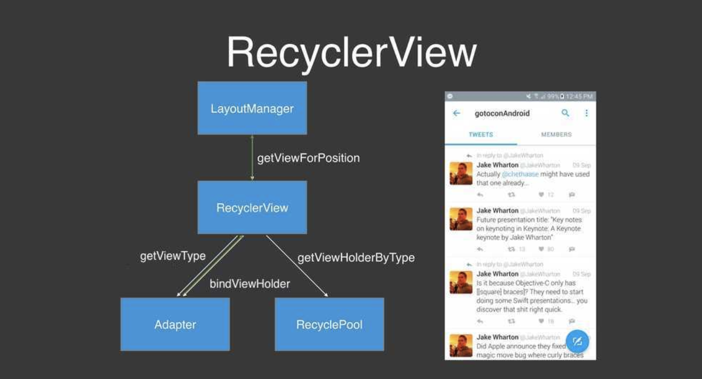

# [Android] Android UI 멋지게 만들기: 예제로 배우는 팁과 노하우 요약
> date - 2017.03.24  
> keyword - android, recycler view  
> [Android UI 멋지게 만들기: 예제로 배우는 팁과 노하우](https://realm.io/kr/news/gotocph-israel-ferrer-camacho-android-ui/)를 요약  

<br>



* infinite scroll 방식의 타임라인을 위해 동시에 **수천개의 View를 인스턴스화할 수는 없다**
* RecyclerView는 **인스턴스화된 View를 재사용**하는 방식을 채택


<br>

## RecyclerView가 View를 재활용하는 과정
1. 다음 위치를 보여줄 때 `LayoutManager`가 `RecyclerView의 getViewForPosition()`을 호출
2. RecyclerView가 `Adapter에게 ViewType을 묻는다`
3. `View Type`을 얻으면 재활용할 수 있는 모든 ViewHolders가 있는 `RecyclePool`에게서 `해당 Type의 ViewHolder`를 받는다
  * 없다면 Adapter로 가서 새로 생성 -> `onCreateViewHolder()`
  * 있는 경우라면 Adapter에게 건네주고 ViewHolder를 새 데이터와 새 위치로 바인딩할 수 있냐고 묻는다 -> `onBindViewHolder()`
4. 받은 정보를 RecyclerView로 다시 돌려주고, `LayoutManager가 해당 View를 화면에 보여준다`

<br>

> ### LayoutManager의 역할
> * Item View들을 측정
> * Item View의 위치 지정
> * 더이상 보이지 않는 View를 언제 재활용할 것인지 결정


<br>

## Shared Element Transition
* 액티비티 전환 상태를 호출해서 새 전환을 시작 -> `ActivityTransitionCoordinator`가 호출
* 프레임워크의 기본 전환은 `ViewOverlay` 사용

### ActivityTransitionCoordinator
* 기본 클래스로 2개의 Coordinator를 가짐
  1. 들어오는 전환 처리하는 `EnterTransitionCoordinator`
  2. 나가는 전환 처리하는 `ExitTransitionCoordinator`
* 이들은 TransitionManager를 가지고 있음
  * default Transition을 가지고 있지만 테마 등을 커스텀할 수 있다

### ViewOverlay
* `View 위`에 투명한 레이어를 제공
* 모든 유형의 시각적 contents를 추가할 수 있고 **맨위의 레이어에 영향을 주지 않도록 한다**
* 레이어 계층 구조를 망치지 않으면서 무엇이든 움직일 수 있도록 해주기 때문에 **애니메이션에서 즐겨 사용**된다

```java
ViewOverlay overlay = LinearLayout.getOverlay();
overlay.add(ImageView);  // ImageView는 LinearLayout에서 Overlay에 속한다
```
* 모든 터치 이벤트, 애니메이션이 ViewOverlay로 위임

### Shared Element Transition 제약
* 사용자가 터치로 전환을 제어X -> 한시점에서 다른 시점으로 넘어가는 간단한 애니메이션이라
* 대상 목적지를 추적하지 않기 때문에 실행되는 동안 모든 터치 이벤트를 무효화하지 않으면 이상해 보인다.
```java
public static interface TransitionListener {
    void onTransitionStart(Transition transition);  
    void onTransitionEnd(Transition transition);  
    void onTransitionCancel(Transition transition);  
    void onTransitionPause(Transition transition);  
    void onTransitionResume(Transition transition);
}
```
* `TransitionListener.onTransitionStart()`에서 모든 터치 이벤트를 무효화


<br>

## 이미지의 중요 속성
* 아래 2가지 속성은 `Parent View 밖에서 그려질 수` 있는 속성

### ClipChildren
* ViewGroup의 속성(default true)
* Child View가 Parent ViewGroup의 경계를 넘지 않게 해준다
  * false면 Child View가 Parent View를 넘어서 그려진다

### ClipPadding
* true면 padding을 넘어 그려질 수 없다

### View의 모든 부모를 찾아서 false로 바꾸는 유틸
```java
public static void disableParentsClip(@NonNull View view){
    while(view.getParent() != null &&
        view.getParent() instanceof ViewGroup){
            ViewGroup viewGroup = (ViewGroup)view.getParent();
            viewGroup.setClipChildren(false);
            viewGroup.setClipToPadding(false);
            view = viewGroup;
        }
}

public static void enabledParentsClip(@NonNull View view){
    while(view.getParent() != null &&
        view.getParent() instanceof ViewGroup){
            ViewGroup viewGroup = (ViewGroup)view.getParent();
            viewGroup.setClipChildren(true);
            viewGroup.setClipToPadding(true);
            view = viewGroup;
        }
}
```


<br>

## 빠르게 움직이면 괜찮게 보인다
* 빠른 전환과 애니메이션을 통해 어색한 부분을 감출 수 있다


TODO: 조금 더 이해 필요

<br><br>

> #### Reference
> * [Android UI 멋지게 만들기: 예제로 배우는 팁과 노하우](https://realm.io/kr/news/gotocph-israel-ferrer-camacho-android-ui/)
