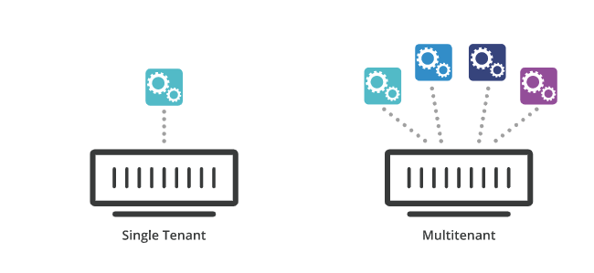

# [Architecture] What is multitenancy?
> date - 2021.07.13  
> keyworkd - tenancy, tenant, cloud  
> cloud computing에서 사용되는 multitenancy에 대해 정리  

 

## Tenant
* 특정 리소스의 접근 권한을 공유하는 사용자들의 그룹
* e.g. Cloud service에서는 account로 AWS라면 root account에 의해 관리되는 환경

 

  

 

## Single-Tenancy
* 사용자별로 독립적인 리소스를 사용하여 서비스를 제공

 

### Benefits
* Security - 단일 사용자와 단일 인프라로 리소스 공유로 인한 보안 취약점이 없다
* Dependability - 단일 서비스를 위한 환경이므로 리소스를 풍부하게 사용
* Customization - 전체 환경을 사용자별로 설정

 

### Drawbacks
* Maintenance - 더 많은 유지보수 리소스 필요
* Setup/Management - multi-tenancy에 비해 효율성이 떨어짐
* Cost - multi-tenancy에 비해 효율성이 떨어짐

 

## Multi-Tenancy
* 여러 사용자에게 공유되는 리소스(SW, infra)를 사용하여 서비스를 제공
* 사용자별로 데이터, 설정, Look and Feel(메뉴 구성, 디자인) 등을 개인화
* data는 격리되어 다른 tenant에게 보이지 않는다
* cloud computing의 중요한 요소

 

### Use case
* SaaS(Software-as-a-Service)
  * E-mail 서비스에서 사용자 독립적인 메일함을 사용하고, 다른 사용자의 메일을 확인할 수 없다
* Cloud service
  * 서로 다른 사용자가 computing 리소스를 나누어 사용하는 shared hosting
* Container architecture
* Container Orchestration(i.e. Kubernetes)
  * 여러개의 project를 서비스하는 single cluster
* Serverless computing
  * FaaS(Function-as-a-Service) - function이 필요할 때만 실행되는 모델

 

### Benefits
* Cost - 리소스를 유연하게 할당할 수 있어 SW 라이센스, 관리 비용, 리소스 사용 등이 효율적
* Integrations - 하나의 시스템을 여러 사용자가 공유하는 구조이므로 데이터 통합이 쉽다
* Setup/Management - 중앙에서 진행하므로 single-tenancy에 비해 효율적

 

### Drawbacks
* Customization - 정교한 개인화 지원을 위해 상당한 리소스 필요
* Security - 데이터가 통합되어 있어 강력한 보안 체계 필요
* noisy neighbor effect - 한 tenant의 과도한 리소스 사용으로 다른 tenant의 성능이 저하될 수 있다

 

## Conclusion
tenant, single-tenancy, multi-tenancy에 대해 알아보았다  
Cloud 등의 infrastructure layer 뿐만 아니라 multi-tenancy를 제공하는 OSS도 상황에 따라 적절한 tenancy를 선택할 필요가 있다  
예를 들어 서비스 별로 kubernetes cluster를 사용하면 maintenance, cost 등의 효율성이 떨어지므로 multi-tenancy를 어떻게 제공할지 고민하는게 더 효율적일 수 있다

  

> #### Reference
> * [SaaS: Single Tenant vs Multi-Tenant - What's the Difference?](https://digitalguardian.com/blog/saas-single-tenant-vs-multi-tenant-whats-difference)
> * [What is multitenancy? - Cloudflare](https://www.cloudflare.com/ko-kr/learning/cloud/what-is-multitenancy/)
> * [멀티테넌시란? - RedHat](https://www.redhat.com/ko/topics/cloud-computing/what-is-multitenancy)
