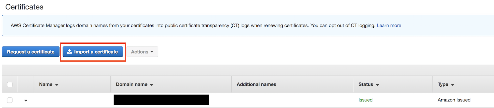
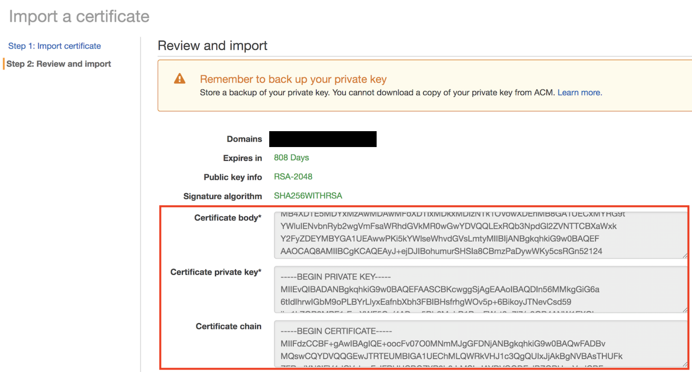
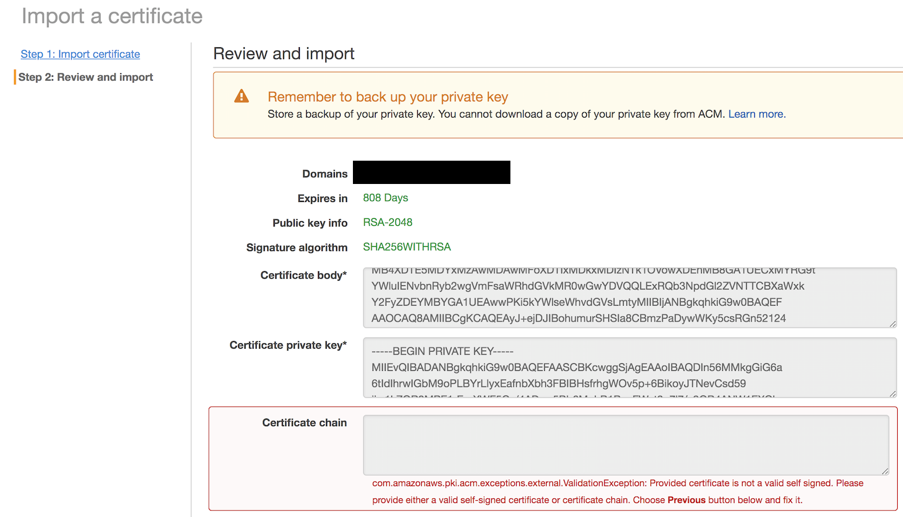
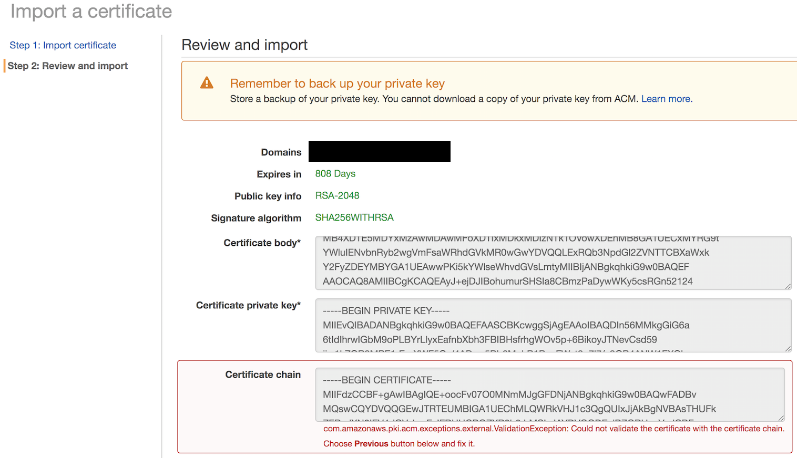
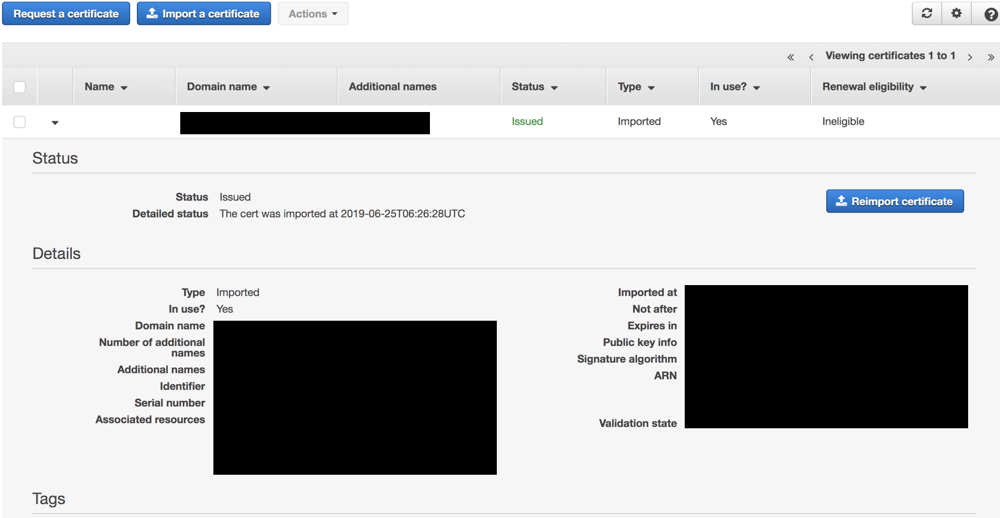

# [ACM] Using external certificates in ACM
> date - 2019.11.05  
> keyworkd - aws, acm, certificate  
> AWS Certificate Manager에서 Let’s Encrypt, GoGetSSL 같은 외부에서 발급받은 SSL 인증서를 사용하기 위해 import하는 방법을 정리  

<br>

## AWS Console

### 1. import certificate 버튼 클릭



<br>

### 2. 발급 받은 인증서에 대한 내용 작성

* Certificate body
  * 발급 받은 인증서
  * e.g. xxx.crt
* Certificate private key
  * CSR 생성 과정에서 생성한 private key
  * e.g. xxx.key
* Certificate chain
  * 중간 CA 인증서
  * e.g. xxxCA.crt, xxx.ca-bundle

<br>

#### Certificate chain 미기입시 에러 발생

```java
com.amazonaws.pki.acm.exceptions.external.ValidationException: Provided certificate is not a valid self signed.
Please provide either a valid self-signed certificate or certificate chain.
Choose Previous button elow and fix it.
```
* Self sign이 아니므로 certificate chain에 발급받은 인증서를 sign한 인증서 필요
* Self sign이면 필요 없다

<br>

#### Root CA의 인증서 기입시 발생 에러

```java
com.amazonaws.pki.acm.exception.external.ValidationException: Could not validate the certificate with the certificate chain.
Choose Previous button below and fix it.
```
* Root CA에서 sign된게 아니므로 중간 인증서를 기입해주어야 한다

<br>

#### certificate 
```java
com.amazonaws.pki.acm.exceptions.external.ValidationException: Unable to validate certificate chain.
The certificate chain must start with the immediate signing certificate, followed by any intermediaries in order.
The index within the chain of the invalid certificate is: -1
```
* certificate chain이 여러개일 때 1개만 입력한 경우
* **역순**으로 기입
  * certificate -> `chain2 -> chain1` -> Root CA


<br>

### 3. 완료


<br>

## AWS CLI
* `import-certificate`가 성공하면 `ARN(Amazon Resource Names)`이 반환
```sh
$ aws acm import-certificate --certificate file://Certificate.pem \
                             --certificate-chain file://CertificateChain.pem \
                             --private-key file://PrivateKey.pem \
                             --certificate-arn arn:aws:acm:region:123456789012:certificate/12345678-1234-....
```

<br>

## Conclusion
* ACM을 사용하면 ELB(Elastic Loadbalancer), CF(CloudFront)에 `ARN`으로 간단하게 SSL을 적용할 수 있으니 AWS를 사용하고, SSL이 필요하다면 ACM을 사용하는게 편리하므로 고려해보자


<br><br>

> #### Reference
> * [인증서 다시 가져오기 - AWS Docs](https://docs.aws.amazon.com/ko_kr/acm/latest/userguide/import-reimport.html)
