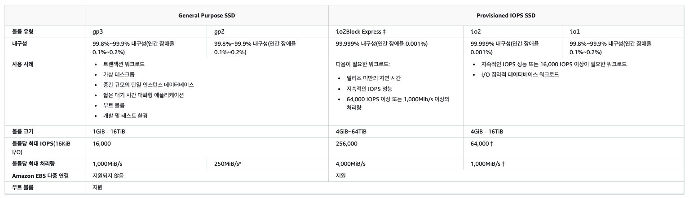
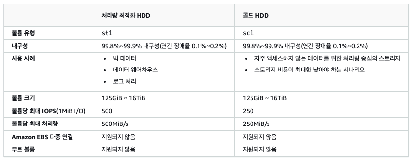
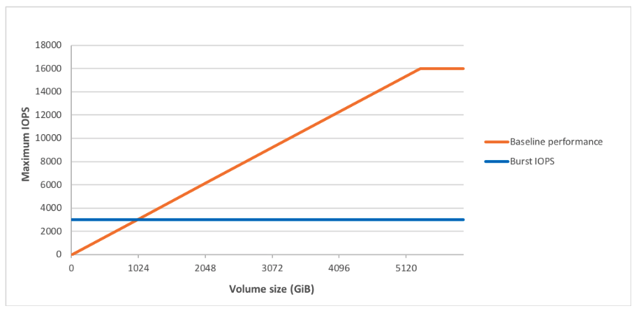
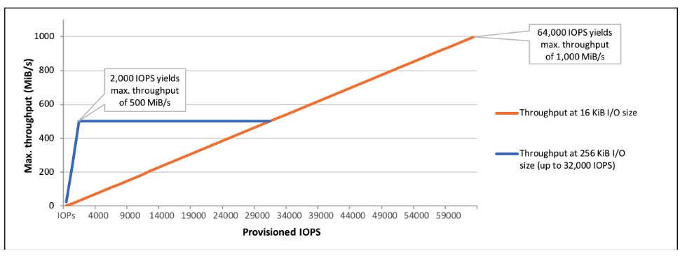
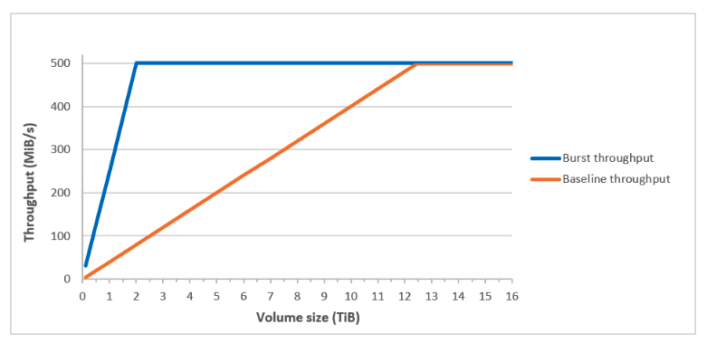
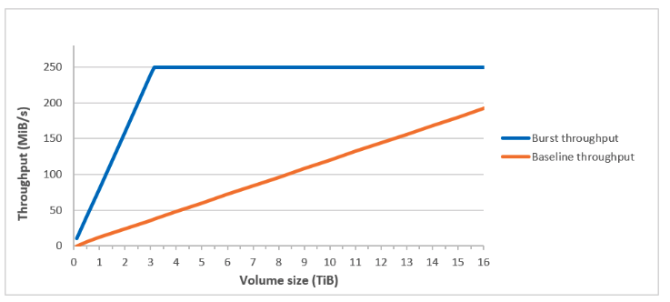
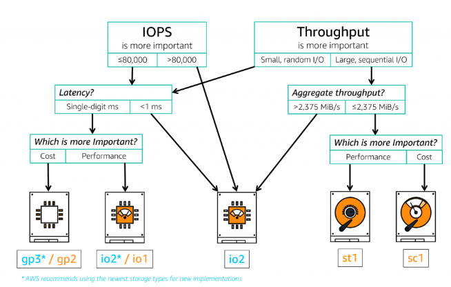

# [AWS] Amazon EBS cost optimization
> date - 2022.08.01  
> keyword - aws, cloud, ebs, iops  
> AWS를 사용할 때의 수많은 선택 중 하나가 성능과 비용을 고려한 volume type, size 등의 EBS 설정이다  

<br>

## IOPS(Input/Output Operation Per Second)란?
```
IOPS = 초당 데이터 전송량 / block size
```
* **초당 처리되는 I/O의 개수**로 높을수록 disk 속도가 빠르다는 것을 뜻한다
* HDD, SSD, NVMe 등 저장 장치의 속도에 단위로 사용
* IOPS 100 -> 1초에 100 x block size 만큼의 I/O 가능


<br>

## Amazon EBS(Elastic Block Store)란?
* EC2 instance에서 쉽게 사용할 수 있는 persistent volume
* 사용자의 workload에 따라 다양한 volume type 제공
* instance 구성, I/O 특성 및 workload 요구량 등 여러 요인이 EBS volume 성능에 영향을 미칠 수 있다


<br>

## Amazon EBS volume type
* SSD(Solid-State Drive)
  * IOPS가 중요한 작은 I/O 크기의 read/write를 자주 처리하는 transaction workload에 최적화
  * 일반적인 workload에 적합한 General Purpose SSD `gp3`, `gp2`
  * IOPS가 매우 중요한 DB 등에 적합한 Provisioned IOPS SSD `io1`, `io2`
* HDD(Hard disk Drive)
  * throughput(처리량)이 중요한 대규모 streaming workload에 최적화
  * throughput이 중요한 batch 작업 등에 적합한 HDD 기반의 `st1`, `sc1`

<br>

<div align="center">
  
</div>
<div align="center">
  
</div>

<br>

### General Purpose SSD

#### gp3
* volume size에 무관하게 IOPS 지정 가능
* volume size, IOPS와 무관하게 throughput 지정 가능
* 3,000 IOPS 및 125Mib/s의 일관된 속도를 제공하며 최대 16,000 IOPS, 1,000MiB/s throughput을 Provionsing 가능
  * volume size 대비 IOPS는 최대 GiB당 500 IOPS
    * 500 IOPS/GiB x 32GiB = 16,000 IOPS -> 32GiB 이상이면 최대 IOPS 사용
  * IOPS 대비 throughput은 IOPS당 0.25Mib/s
    * 4,000 IOPS x 0.25MiB/s/IOPS = 1,000MiB/s -> 8GiB 이상 및 4,000 IOPS 이상이면 최대 throughput 사용
* `gp2`처럼 burst가 아닌 baseline으로 제공
* 비용은 IOPS, throughput을 무료 제공 값을 초과하여 설정하지 않는다면 `gp2`보다 저렴
  * 무료 제공되는 IOPS나 throughput은 1TB 이하에서 `gp2` 보다 항상 좋다
* `gp2` 대비 약 20% 비용 절감 효과를 볼 수 있고, 대부분의 경우 성능이 향상된다
* 16,000 IOPS 이하의 `io1`, `io2`를 `gp3`로 변경하면 비용 절감 효과를 볼 수 있다

#### gp2
* IOPS는 100(33.33GiB 이하) ~ 16,000(5,334GiB 이상) IOPS 사이에서 GiB당 3 IOPS로 계산되므로 높은 IOPS를 사용하기 위해서는 volume size 증가 필요
  * 100GiB = 300 IOPS
* 용량이 클 필요가 없지만 IOPS가 많이 필요한 workload에는 부적합
  * `io1`, `io2`는 IOPS를 지정할 수 있지만, `gp2` 보다 비싸기 때문에 RDS가 아닌 일반적인 workload에 사용하기에는 비용 문제가 있다
* baseline performance 이상이 필요한 경우 I/O credit를 사용하여 최대 3,000 IOPS까지 **burst**
  * baseline performace가 3,000 IOPS 이하면 burst, 이상이면 해당 없음
* I/O credit balance가 없으면 baseline performace IOPS 제공
* CloudWatch의 `BurstBalance` metrics으로 I/O credit monitoring 필요
  * [볼륨에 대한 버스트 버킷 밸런스 모니터링](https://docs.aws.amazon.com/ko_kr/AWSEC2/latest/UserGuide/ebs-volume-types.html#monitoring_burstbucket)
  * [Amazon EBS에 대한 Amazon CloudWatch 지표](https://docs.aws.amazon.com/ko_kr/AWSEC2/latest/UserGuide/using_cloudwatch_ebs.html)
  * [CloudWatch 지표를 사용하여 EBS 볼륨이 제공하는 평균 처리량과 평균 IOPS 수를 계산하려면 어떻게 해야 합니까?](https://aws.amazon.com/ko/premiumsupport/knowledge-center/ebs-cloudwatch-metrics-throughput-iops/)
* 성능이 자주 baseline performace로 제한되는 경우 `gp3`로 전환
* Throughput(MiB/s) = volume size(GiB) * IOPS(GiB) * I/O size(KiB)

<br>

<div align="center">
  
</div>

<br>

| Volume size(GiB) | Baseline performance(IOPS) | Burst 지속 시간 | I/O가 없을시 credit balance 충전 소요 시간(초) |
|:--|:--|:--|:--|
| 100 | 300 | 2,000 | 18,000 |
| 750 | 2,250 | 7,200 | 2,400 |
| 1,000 | 3,000 | - | - |
| 5,334(최대 IOPS를 위한 최소 size) | 16,000 | - | - |

<br>

### Provisioned IOPS SSD
* 미리 정해진 IOPS를 확보할 수 있는 type으로 `io1`, `io2`가 있으며 비싸다
* low latency가 필요한 OLTP형 DB에 적합
* volume size와 IOPS로 비용 계산
* volume size는 4GiB ~ 16TiB, IOPS는 100 ~ 64,000 provionsing 가능
* volume size에 대한 IOPS의 최대 비율
  * io1 - 50:1
  * io2 - 500:1
* 32,000 IOPS까지 500MiB/s throughput 제공, 32,000 IOPS 초과시 IOPS 당 16KiB의 속도로 선형 증가

<br>

<div align="center">
  
</div>

<br>

| Type | Volume size(GiB) | Provisioned IOPS | Throughput(MiB/s) |
|:--|:--|:--|:--|
| io1 | 100 | 5,000 = 50 * 100 | 500 |
| io2 | 100 | 50,000 = 500 * 100 | 500 |
| io1 | 640 | 32,000 = 50 * 640 | 500 |
| io1 | 960 | 48,000 = 50 * 960 | 750 |
| io1 | 1,280 | 64,000(max) = 50 * 1,280 | 1,000|
| io2 | 128 | 64,000(max) = 500 * 128 | 1,000 |

<br>

### Throughput Optimized HDD
* IOPS가 아닌 throughput으로 성능을 정의하는 저비용 HDD 스토리지로 `st1`가 있다
* AWS EMR, 빅데이터, Analytics 같은 application에 적합
* throughput에 대한 burst bucket model 제공
* baseline throughput = volume size(TiB) * 40 MiB/s

<br>

<div align="center">
  
</div>

<br>

| Volume size(TiB) | Baseline throughput(MiB/s) | Burst Throughput(MiB/s) |
|:--|:--|:--|
| 1	| 40	| 250 |
| 2	| 80	| 500 |
| 3	| 120	| 500 |
| 12.5 | 500 | 500 |
| 13 | 500 | 500 |
* 12.5TiB 이상에서 baseline throughput이 최대 500 MiB/s가 되므로 burst가 의미 없어진다

<br>

### Cold HDD
* throughput으로 성능을 정의하는 저비용 HDD 스토리지로 `sc1`가 있다
* 자주 access하지 않는 application에 적합
* throughput에 대한 burst bucket model 제공
* baseline throughput = volume size(TiB) * 12 MiB/s

<br>

<div align="center">
  
</div>

<br>

| Volume size(TiB) | Baseline throughput(MiB/s) | Burst Throughput(MiB/s) |
|:--|:--|:--|
| 1	| 12 | 80 |
| 2	| 24 | 160 |
| 3.125	| 37.5 | 250 |
| 4 | 48 | 250 |
* 3.125TiB 이상에서 baseline throughput이 최대 250 MiB/s가 되므로 burst가 의미 없어진다


<br>

## 가격 비교
* 서울 리전(ap-northeast-2) 기준

<br>

### 1,000 GiB, 3,000 IOPS, 256MiB/s Throuthput
| Type |  Volume size(GiB) | IOPS | Throughput(MiB/s) | Price($) |
|:--|:--|:--|:--|:--|
| gp2	| 1,000 | 3,000 | 256 | 114(=1000 * 0.114) |
| gp3	| 1,000 | 3,000 | 256 | 91.2(=1000 * 0.0912) |
| io2	| 1,000 | 3,000 | 500 | 328.8(=1000 * 0.1278 + 3000 * 0.067) |
| io1	| 1,000 | 3,000 | 500 | 327.6(=1000 * 0.1278 + 3000 * 0.0666) |
* 3,000 IOPS 이상 필요하지 않을 경우 `io1`, `io2` 보다 `gp2`, `gp3`를 사용하는게 저렴

<br>

### 1,000 GiB, 3,000 IOPS, 500MiB/s Throuthput
| Type |  Volume size(GiB) | IOPS | Throughput(MiB/s) | Price($) |
|:--|:--|:--|:--|:--|
| gp2 | - | - | -	| - |
| gp3	| 1,000 | 3,000 | 500	| 108.3(=1000 * 0.0912 + (500 - 125) * 0.0456) |
| io1	| 1,000 | 3,000 | 500	| 327.6(=1000 * 0.1278 + 3000 * 0.0666) |
| io2	| 1,000 | 3,000 | 500	| 328.8(=1000 * 0.1278 + 3000 * 0.067) |
* 500MiB/s throuthput이 필요할 경우 `gp2`는 사용 불가하고 `io1`, `io2` 보다 `gp3`를 사용하는게 저렴

<br>

### 300 GiB,	16,000 IOPS,	256MiB/s Throuthput
| Type |  Volume size(GiB) | IOPS | Throughput(MiB/s) | Price($) |
|:--|:--|:--|:--|:--|
| io1	| 300 | 16,000 | 500 | 1103.94(=300 * 0.1278 + 16000 * 0.0666) |
| io2	| 300 | 16,000 | 500 | 1110.34(=300 * 0.1278 + 16000 * 0.067) |
| gp2	| 5,334 | 16,000 | 256 | 608.076(=5334 * 0.114) |
| gp3	| 300 | 16,000 | 256 | 104.8136(=300 * 0.0912 + (16000-3000) * 0.0057 + (256-125) * 0.0256) |
* 대부분의 경우 `gp3`가 저렴

<br>

### EBS decision tree
<div align="center">
  
</div>

* 80,000 IOPS 이하에서 비용이 중요하면 `gp3`, 성능이 중요하면 `io2`
* 80,000 IOPS 초과면 `io2`


<br>

## 비용 최적화
* 미사용 volume, snapshot 제거
  * Lambda, script을 사용해 미사용 volume, snapshot을 주기적으로 찾아서 제거
  * EC2 instance에 연결되지 않거나 사용하지 않는 경우(일정 기간 IOPS, throughput이 0)
  * [AWS ops automator](https://aws.amazon.com/solutions/implementations/ops-automator) 참고
* volume type 변경
  * 적절한 type 사용
  * 평균 IOPS가 85 이하, 순간 최고 IOPS가 200 이하일 경우 `sc1`, `st1`로 변경하면 50% 비용 절감
* volume size, IOPS 변경
  * 적절한 volume size 및 IOPS 수치를 확인 및 조절을 통해 비용 절감 가능
* `io1`, `io2` 관리
  * 가장 비싼 type이므로 IOPS를 확인하여 `gp2`, `gp3`로 변경 가능하다면 비용 절감 가능


<br>

## CloudWatch metrics으로 I/O monitoring
* `gp2`, `st1`, `sc1`의 burst credit balance
  * `BurstBalance`가 0이되면 I/O(gp2), throughput(st1, sc1)이 baseline으로 throttling
* `st1`, `sc1`은 1,024KiB 최대 I/O size의 workload에 적합
  * 평균 I/O size는 64KiB 미만, I/O size가 큰 경우 성능 개선 필요
  * 평균 write I/O size = `VolumeWriteBytes` / `VolumeWriteOps`
  * 평균 read I/O size = `VolumeReadBytes` / `VolumeReadOps`
* I/O latency가 긴 경우 `VolumeQueueLength`를 확인해 application이 provisioned IOPS보다 더 많은 IOPS를 필요로하는지 확인
  * latency 감소를 위해 `gp3`, 대용량 `gp2`, `io1`, `io2`로 변경을 고려
* 실제 평균 throughput(byte/s) = (sum(VolumeReadBytes) + sum(VolumeWriteBytes)) / volume active time(period - sum(VolumeIdleTime))
* 실제 평균 IOPS = (sum(VolumeReadOps) + sum(VolumeWriteOps)) / volume active time(period - sum(VolumeIdleTime))


<br><br>

> #### Reference
> * [볼륨 크기 조정 후 Linux 파일 시스템 확장](https://docs.aws.amazon.com/ko_kr/AWSEC2/latest/UserGuide/recognize-expanded-volume-linux.html#extend-linux-file-system)
> * [Amazon EBS 볼륨 유형](https://docs.aws.amazon.com/ko_kr/AWSEC2/latest/UserGuide/ebs-volume-types.html)
> * [Amazon EBS 프로비저닝된 IOPS 볼륨의 성능을 최적화 하려면 어떻게 해야 하나요?](https://aws.amazon.com/ko/premiumsupport/knowledge-center/optimize-ebs-provisioned-iops/)
> * [Amazon EBS 요금](https://aws.amazon.com/ko/ebs/pricing)
> * [I/O characteristics and monitoring](https://docs.aws.amazon.com/AWSEC2/latest/UserGuide/ebs-io-characteristics.html)
> * [볼륨에 대한 버스트 버킷 밸런스 모니터링](https://docs.aws.amazon.com/ko_kr/AWSEC2/latest/UserGuide/ebs-volume-types.html#monitoring_burstbucket)
> * [Amazon EBS에 대한 Amazon CloudWatch 지표](https://docs.aws.amazon.com/ko_kr/AWSEC2/latest/UserGuide/using_cloudwatch_ebs.html)
> * [CloudWatch 지표를 사용하여 EBS 볼륨이 제공하는 평균 처리량과 평균 IOPS 수를 계산하려면 어떻게 해야 합니까?](https://aws.amazon.com/ko/premiumsupport/knowledge-center/ebs-cloudwatch-metrics-throughput-iops/)
> * [Storage for I/O-intensive SQL Server using Amazon EBS io2 Block Express](https://aws.amazon.com/blogs/storage/storage-for-i-o-intensive-sql-server-using-amazon-ebs-io2-block-express/)

<br>

> #### Further reading
> * [EBS GP3 Vs. GP2 – Pricing Comparison](https://cloudwiry.com/ebs-gp3-vs-gp2-pricing-comparison/)
