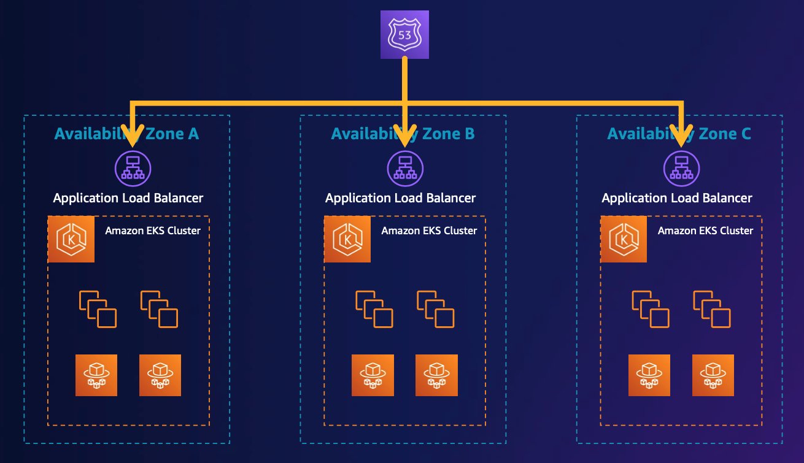
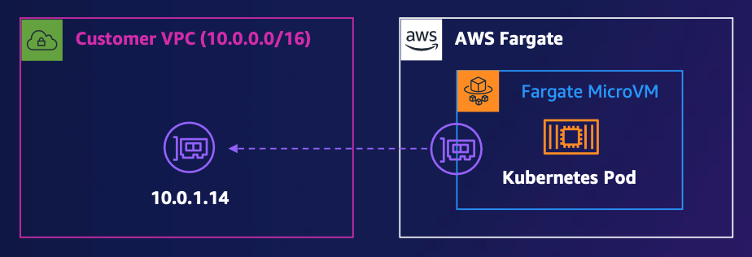
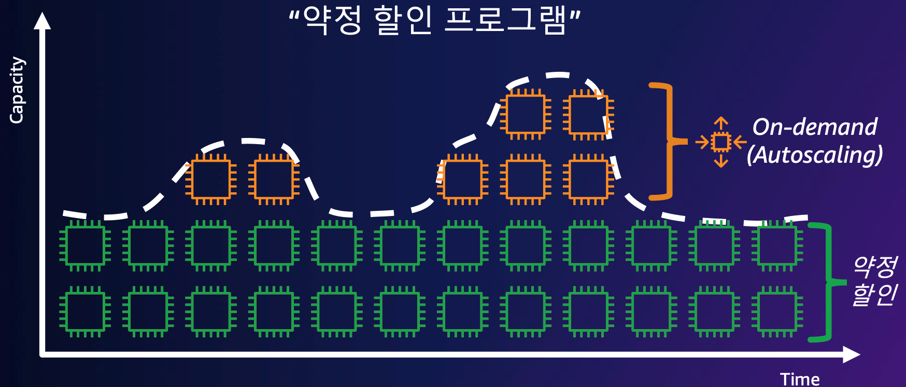
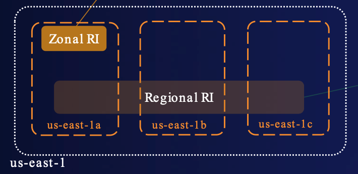
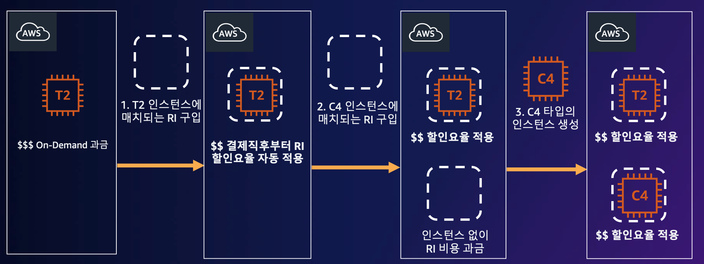
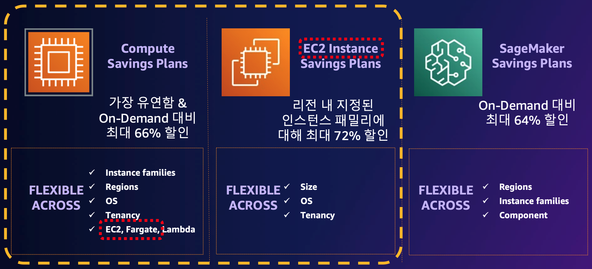
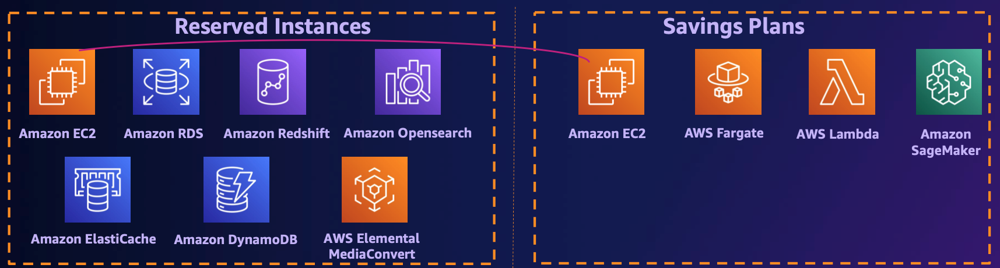
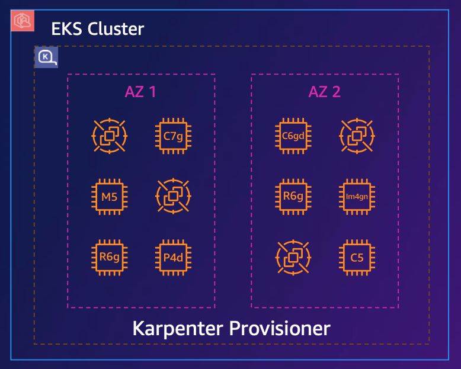

# [AWS] Amazon EKS Cost Optimization
> date - 2023.10.22  
> keyworkd - kubernetes, k8s, eks, finops, cost  
> Amazon EKS 비용 최적화에 대한 내용 정리  

<br>

## Cost Structure
* 비용 최소화 vs 성능 & 가용성 SLO 달성
* 성능, 가용성은 비용과의 반비례 관게로 **적절한 비용으로 원하는 성능, 가용성 달성**하는 것을 목표로 해야한다

<br>

### Cost Optimization Priority
1. application 최적화를 통한 computing, stroage, network 사용량 절약
2. architecture 최적화를 통한 cost overhead 제거

<br>

### Amazon EKS Cost Structure
* Amazon EKS cluster
  * $0.1/hours
* Network(Data Transfoer In/Out)
  * internet traffic
  * cross zone(AZ) traffic
* Compute(Node)
  * Amazon EC2
  * AWS Fargate
* Storage
  * Amazon EBS

> AWS 비용 구조에 대한 통계를 보면 
> * compute 70%
> * storage 20%
> * network 10%
> 그러므로 compute -> storage -> network 순으로 최적화하는게 효율적

<br>

### AWS Network traffic type
#### AWS <-> Internet traffic
<div align="center">
  
</div>

* DTO(Data Transfer Out) 비용 발생
  * region별 비용 다름
* DTI(Data Transfer In) 비용 무료

#### Region <-> Region traffic
<div align="center">
  
</div>

* 다른 region으로의 DTO 비용 발생
  * 출발/목적지 region별 비용 다름
  * ap-northeast-2(Seoul) -> us-east-1(N. Virginia) - $0.02/GB
  * us-east-1(N. Virginia) -> ap-northeast-2(Seoul) - $0.01/GB
* 다른 region으로부터 DTI 비용 무료

#### AZ <-> AZ traffic
<div align="center">
  
</div>

* region내 AZ 사이의 통신에 DTI, DTO 비용 발생
* AZ 내에서 private ip를 이용한 통신 비용 무료
* AZ 내에서 EC2, RDS, ElastiCache, ENI(Elastic Network Interface)간 통신 비용 무료

<br>

### AWS compute type
* Amazon EKS는 Amazon EC2, AWS Fargate를 지원
* EC2 - self managed EC2 intance 사용
* Fargate - AWS managed container 환경 사용

<br>

## Network Cost Optimization

### Problem
* 같은 region 내에서 다른 AZ 사이(cross zone) traffic에 과금
* HA(High Availability)를 위해 여러 AZ를 사용하고, Pod를 AZ에 최대한 균등하게 분산시키면 cross zone traffic으로 인해 latency가 증가하며, 성능 저하 발생

<div align="center">
  
</div>

| DTI / DTO | Cost |
|:--|:--|
| NLB(Network Load Balancer) <-> Node | $0.01/GB |
| ALB(Application Load Balancer) <-> Node | 무료 |
| EKS Node <-> Node | $0.01/GB |

> #### Cross zone traffic cost
> * 100GB - $1
> * 1TB - $10.24
> * 1PB - $1,064.96

<br>

### 1. AWS Load Balancer Controller IP mode 사용
* AWS ELB(ALB/NLB)의 instance target type 사용시 kube-proxy의 iptables rule을 경유하기 때문에 cross zone traffic 발생
* [AWS Load Balancer Controller](https://kubernetes-sigs.github.io/aws-load-balancer-controller/v2.6/) IP mode 사용하여 external traffic이 Pod로 바로 도달하게 설정
* zero downtime deployment를 위해 pod readiness gate + preStop + graceful shutdown 설정 필요
  * 신규 request 처리를 위해 readiness/liveness probe + pod readiness gate 설정
  * in-flight request 처리를 위한 graceful shutdown + preStop 설정

#### Instance mode vs IP mode
<div align="center">
  
  
</div>

* Cluster IP를 이용한 cluster internal traffic은 여전히 cross zone traffic cose 발생

#### Usage
```yaml
apiVersion: v1
kind: Namespace
metadata:
  name: test
  labels:
    elbv2.k8s.aws/pod-readiness-gate-inject: enabled
---
apiVersion: networking.k8s.io/v1
kind: Ingress
metadata:
  name: 2048-game
  annotations:
    alb.ingress.kubernetes.io/certificate-arn: arn:aws:acm:ap-northeast-2:<account id>:certificate/xxxxxxxxxx-xxxxxxxxx
    alb.ingress.kubernetes.io/listen-ports: '[{"HTTP":80,"HTTPS": 443}]'
    alb.ingress.kubernetes.io/actions.ssl-redirect: >
      {"type": "redirect", "redirectConfig": { "protocol": "HTTPS", "port": "443", "statusCode": "HTTP_301"}}
    alb.ingress.kubernetes.io/scheme: internal

      # here

    alb.ingress.kubernetes.io/group.name: 2048-game
    alb.ingress.kubernetes.io/tags: |-
      service=2048-game,
      environment=dev
spec:
  ingressClassName: alb
  rules:
    - host: 2048-game.dev.example.com
      http:
        paths:
          - path: /
            pathType: Prefix
            backend:
              service:
                name: ssl-redirect
                port:
                  name: use-annotation
          - path: /
            pathType: Prefix
            backend:
              service:
                name: 2048-game
                port:
                  number: 80
---
apiVersion: v1
kind: Service
metadata:
  name: 2048-game
  annotations:
    alb.ingress.kubernetes.io/target-type: ip  # here
    alb.ingress.kubernetes.io/healthcheck-path: /health
    alb.ingress.kubernetes.io/target-group-attributes: |
      deregistration_delay.timeout_seconds=70
spec:
  ports:
    - port: 80
      targetPort: 80
      protocol: TCP
  type: NodePort
  selector:
    app.kubernetes.io/name: app-2048
---
apiVersion: apps/v1
kind: Deployment
metadata:
  name: 2048-game
spec:
  selector:
    matchLabels:
      app.kubernetes.io/name: app-2048
  replicas: 4
  template:
    metadata:
      labels:
        app.kubernetes.io/name: app-2048
    spec:
      terminationGracePeriodSeconds: 60
      containers:
        - image: public.ecr.aws/l6m2t8p7/docker-2048:latest
          imagePullPolicy: IfNotPresent
          name: app-2048
          ports:
            - containerPort: 80
              name: http
          readinessProbe:
            httpGet:
              port: http
              path: /health
          livenessProbe:
            httpGet:
              port: http
              path: /health
          startupProbe:
            httpGet:
              port: http
              path: /health
            initialDelaySeconds: 10
            failureThreshold: 30
          lifecycle:
            preStop:
              exec:
                command: ["sleep", "10"]  # here
```

<br>

### 2. Multi Cluster per AZ
<div align="center">
  
</div>

* cross zone traffic을 없애기 위해 AZ마다 cluster를 구성
  * [Kubernetes Infrastructure At Medium](https://medium.engineering/kubernetes-infrastructure-at-medium-d9e2444932ef) 참고
* cluster 수 증가, 구성에 따라 서비스간 통신을 위해 North-South 통신 필요

<br>

### 3. Topology Aware Routing
<div align="center">
  
</div>

* [Topology Aware Routing](https://kubernetes.io/docs/concepts/services-networking/topology-aware-routing)으로 같은 zone 내부 통신을 선호하도록 구성해 data transfer 비용 절감, network latency 감소로 인한 성능 개선
* 최대한 같은 zone 내부에서 통신하도록 설정하고 HA를 위해 모든 zone에 균등하게 Pod를 배치

#### Topology Aware Routing?
* traffic이 시작된 zone에 traffic을 유지하는 것을 선호하도록 `ClusterIP`, `NodePort` Service의 routing을 조정
* `ClusterIP`, `NodePort` Service traffic은 kube-proxy가 설정한 iptables rule에 의해 routing
  * iptables rule - linux kernel에서 제어하는 규칙
  * 기본적으로 임의의 Pod로 packet을 전송하여 cross zone traffic 발생
* `Topology Aware Routing`을 사용하면 kube-proxy에 의해 iptables rule이 동일한 zone의 Pod에게만 packet을 전송하도록 설정하기 때문에 cross zone traffic이 발생하지 않는다
  * Endpoints보다 확장성이 뛰어난 EndpointSlice controller가 제어
* traffic routing을 제어하는 강력한 메커니즘이지만, workload에 부정적인 영향을 미칠 가능성이 있어서 적용되기 위한 [조건](https://kubernetes.io/docs/concepts/services-networking/topology-aware-routing/#safeguards)이 달성되면 활성화된다
* 각 zone 마다 최소 Pod 개수를 충족해야 하며 최소 개수는 각 zone에 존재하는 node의 CPU 합의 비율로 결정
  * zone의 Pod 불균형으로 인해 Pod가 적은 zone의 Pod들이 과한 부하를 받는 것을 방지하기 위함
  * 각 zone의 CPU 비율을 파악하고 그에 비례하여 Pod를 배포하는 것은 매우 어려우므로 각 zone별로 **비슷한 규모의 node**를 할당하고, `Topology Spread Constraints`를 이용해 zone별로 균등한 개수의 Pod를 배포하여 `Topology Aware Routing`의 조건을 충족시키는게 좋다
  * HPA(Horizontal Pod Autoscaler)에 의한 scale in시 `Topology Spread Constraints`를 고려하지 않고 Pod를 제거하기 때문에 `Topology Aware Routing`이 비활성화될 수 있으므로 [Descheduler](https://github.com/kubernetes-sigs/descheduler) 사용 고려

<div align="center">
  
</div>

#### Advantages
* reducing network latency
  * network hop을 최소화하여 latency 감소
  * latency 감소를 통해 real-time processing 같이 latency에 민감한 workload의 UX를 향상시킬 수 있다
* optimizing network traffic flow
  * traffic이 발생한 zone에서 사용 가능한 endpoint에 traffic을 분산하여 network traffic flow 최적화
  * cross zone traffic을 최소화하여 성능 개선과 data transfer 비용 절감

#### Usage
* `Topology Aware Routing` 설정
```yaml
apiVersion: v1
kind: Service
metadata:
  name: my-app
  annotations:
    service.kubernetes.io/topology-mode: auto  # here
...
```

* `topologySpreadConstraints`으로 AZ에 균등하게 분산
```yaml
apiVersion: apps/v1
kind: Deployment
metadata:
  name: my-app
  labels:
    app: my-app
spec:
  selector:
    matchLabels:
      app: my-app
  template:
    metadata:
      labels:
        app: my-app
    spec:
      topologySpreadConstraints:
        - maxSkew: 1
          topologyKey: topology.kubernetes.io/zone
          whenUnsatisfiable: DoNotSchedule
          labelSelector:
            matchLabels:
              app: my-app
```

* zone 확인
```sh
$ kubectl get nodes -L topology.kubernetes.io/zone

NAME                                               STATUS   ROLES    AGE     VERSION               ZONE
ip-10-xxx-xxx-xxx.ap-northeast-2.compute.internal   Ready    <none>   41d    v1.27.4-eks-xxx       ap-northeast-2a
ip-10-xxx-xxx-xxx.ap-northeast-2.compute.internal   Ready    <none>   41d    v1.27.4-eks-xxx       ap-northeast-2b
```


* 적용되었는지 확인하기 위해서는 `EndpointSlice`에 `hints` 필드가 존재하면 `Topology Aware Routing`이 동작하고 있다는 것을 의미
  * `EndpointSlice`에 topology hints가 추가되어 traffic이 원래 위치에 더 가깝게 routing 된다
  * 동작하지 않고 있다면 control plane의 controller manager log에서 이유를 확인할 수 있다

```yaml
## As-is
apiVersion: discovery.k8s.io/v1
kind: EndpointSlice
...
- 10.xxx.xxx.xxx
  conditions:
    ready: true
    serving: true
    terminating: false
  nodeName: ...
  zone: ap-northeast-2b
  targetRef:
    kind: Pod
    name: my-app-fccd7868c-84lkh
  
---
## To-be
  - 10.xxx.xxx.xxx
  conditions:
    ready: true
    serving: true
    terminating: false
  hints:  ## here
    forZones:
    - name: ap-northeast-2a
  nodeName: ...
  zone: ap-northeast-2b
  targetRef:
    kind: Pod
    name: my-app-fccd7868c-84lkh
```

<br>

### Istio
* istio sidecar proxy <-> Istiod Pod 구간
  * Istiod Pod에 `Topology Spread Constraints` + `Topology Aware Routing` 적용하여 cross zone traffic 제거
* `Virtual Service`, `Destination Rule` 구간
  * [Locality Load Balancing](https://istio.io/latest/docs/tasks/traffic-management/locality-load-balancing) 적용하여 cross zone traffic 제거

<br>

### [ingress-nginx](https://github.com/kubernetes/ingress-nginx)
* NLB -> ingress-nginx 구간에서는 ip target type를 사용해서 ingress-nginx Pod로 바로 전달할 수 있지만
ingress-nginx Pod는 iptables rule과 비슷하게 Pod로 routing하므로 cross zone traffic 발생
* [v1.6.8](https://github.com/kubernetes/ingress-nginx/releases/tag/controller-v1.6.4) 추가된 `--enable-topology-aware-routing`을 사용하자


<br>

## Compute Cost Optimization

### AWS compute type

#### Amazon EC2
* self managed node group
  * ASG(Auto Scaling Group) 기반의 node group
  * [EKS optimized AMI](https://docs.aws.amazon.com/eks/latest/userguide/eks-optimized-amis.html) or custom AMI 사용
  * customer VPC에서 실행
* eks managed node group
  * ASG를 wrapping
  * [EKS optimized AMI](https://docs.aws.amazon.com/eks/latest/userguide/eks-optimized-amis.html) 사용
  * customer VPC에서 실행

#### AWS Fargate
<div align="center">
  
</div>

* AWS managed container 환경 사용
  * 인프라에 대한 patch, upgrade는 AWS에서 수행하므로 container만 관리하면 된다
* CPU, memory, storage 공유 없이 구동되어 안전한 격리를 지원
* Pod spec(CPU, memory)을 기반으로 적절한 instance를 생성하여 사용
* AWS managed VPC에서 실행되며 customer VPC에 할당된 ENI로 통신
* 고려할 점
  * DaemonSet 사용 불가
  * ELB 구동시 IP mode만 지원
  * privileged container 사용 불가
  * private subnet에서만 사용 가능

<br>

### 1. RI(Reserved Instances) & SP(Savings Plan)
<div align="center">
  
</div>

#### RI(Reserved Instances)?
* **할인된 시간당 요금을 제공**하며, 조건에 따라 Capacity reservation 제공
  * Capacity reservation을 걸어두면 해당 type을 항상 사용 가능, p type 같이 특이한 type에 사용하면 유용
* 실행 중인 EC2 instance와 활성화된 RI의 속성이 맞으면 자동으로 적용
* RI는 regional/zonal로 분류
  * regional RI - capacity reservation 미제공되며, region 내 모든 AZ의 EC2 instance에 할인 적용
  * zonal RI - capacity reservation이 제공되며, 특정 AZ의 EC2 instance에 할인 적용

<div align="center">
  
</div>

* RI 구입 및 적용
<div align="center">
  
</div>

#### SP(Savings Plan)
* RI보다 **유연한 과금 모델**로 최대 72% 할인율 제공
* 최초 구입 or RI 만료시 추천

<div align="center">
  
</div>

* 서비스별 적용 가능 할인 유형
<div align="center">
  
</div>

* EC2 외 서비스에 대한 할인
  * capacity reservation 미제공으로 **할인만 적용**
  * RDS(MySQL, PostgreSQL, Aurora...)는 instance size에 유연
  * AWS Organizations 내에서 공유 가능

<br>

### 2. AWS Graviton
* cloud 기반 workload에 최적화된 AWS의 64 bit ARM processor
* Graviton3는 Graviton2 대비 최대 25% 더 높은 성능 제공
  * 최대 2배 높은 부동소수점 연산, 암호화 성능
  * 최대 3배 높은 ML 성능
* 유사한 다른 EC2 instance type 대비 60% 높은 에너지 효율성으로 가격대비 최고의 성능 제공

#### 고려할 점
* Arm64, x86 호환을 위해 application eco system의 multi-arch 지원 필요

#### Usage
* EKS managed node group
```yaml
apiVersion: eksctl.io/v1alpha5
kind: ClusterConfig
metadata:
  name: eks-graviton-cluster
  region: ap-northeast-2
managedNodeGroups:
  - name: mng-arm-m7
    instanceType: m7g.2xlarge
    desiredCapacity: 2
```

* Karpenter
```yaml
apiVersion: karpenter.sh/v1alpha5
kind: Provisioner
metadata:
  name: default
spec:
  requirements:
    - key: kubernetes.io/arch
      operator: In
      values: [ "arm64" ]
```

<br>

### 3. Spot instance
* [Amazon EC2 Spot Instances](https://aws.amazon.com/ec2/spot) 사용

#### EC2 Spot?
* 여유분의 EC2 용량을 사용
  * On-demand와 동일한 인프라
* On-demand 대비 최대 90% 할인
  * 장기적 수요 및 공급 기반 책정
  * AWS Web Console -> EC2 -> Spot Requests -> Pricing History 에서 확인 가능
* On-demand의 수요에 따라 중단 가능
  * 중단 2분전 경고 발생
* 유연성이 핵심으로 **다양한 instance type, size, AZ별로 이용하도록 구성**

#### EC2 Spot best practice
* instance type, size, AZ에 대한 다양성을 극대화하면 spot instance의 가용성을 높이고, 중단을 최소화할 수 있다
* spot을 사용하기 적합한 workload - spot instnace를 사용 가능한 시간까지 기다렸다가 실행할 수 있는 **시간에 유연한 workload**
* spot instance는 짧은 실행 시간을 가진 중단 가능한 stateless workload에 적용
  * Stateful workload에 사용은 피하는게 좋다
* EKS managed node group, Karpenter에서는 spot 중단 처리를 built-in으로 제공

#### Usage
* EKS managed node group
```yaml
apiVersion: eksctl.io/v1alpha5
kind: ClusterConfig
metadata:
...
managedNodeGroups:
  - name: mng-spot
    desiredCapacity: 2
    spot: true
    instanceTypes:
      - m5.2xlarge
      - m6g.2xlarge
      - m7g.2xlarge
    taints:
      - key: faultTolerant
        effect: NoSchedule
```

* Karpenter
```yaml
apiVersion: karpenter.sh/v1alpha5
kind: Provisioner
...
spec:
  requirements:
    - key: karpenter.sh/capacity-type
      operator: In
      values: [ "spot" ]
    - key: karpenter.k8s.aws/instance-size
      operator: NotIn
      vaules: [ "nano", "micro", "small", "medium" ]
  taints:
    - key: faultTolerant
      effect: NoSchedule
```

<br>

### 4. Karpenter
* 고성능의 지능형 Kubernetes cluster autoscaler [Karpenter](https://karpenter.sh) 사용

<div align="center">
  
</div>

* 최적의 EC2 instance type을 동적으로 선택
* 사용되지 않는 node 종료
* 자동 workload 통합 기능으로 시간이 지남에 따라 cluster 효율성 증가
  * 활용도가 낮은 node를 대체하기 위해 더 비용 효율적인 node provisioning & pod reschedule
* EC2 Spot 사용
* 일관성 있게 빠른 node provisioning 시간을 통해 시간/비용 낭비 최소화
* 운영 overhead를 줄여 비즈니스 가치 제공에 집중 가능

#### Usage
<div align="center">
  
</div>

```yaml
apiVersion: karpenter.sh/v1alpha5
kind: Provisioner
...
spec:
  consolidation:
    enabled: true
  requirements:
    - key: karpenter.sh/capacity-type
      operator: In
      values: [ "spot", "on-demand" ]
    - key: kubernetes.io/arch
      operator: In
      vaules: [ "amd64", "arm64" ]
```


<br><br>

> #### Reference
> * [Amazon EC2 On-Demand Pricing](https://aws.amazon.com/ec2/pricing/on-demand)
> * [Topology Aware Routing](https://kubernetes.io/docs/concepts/services-networking/topology-aware-routing)
> * [KEP: Topology Aware Hints](https://github.com/kubernetes/enhancements/tree/master/keps/sig-network/2433-topology-aware-hints)
> * [Amazon EKS에서 Topology Aware Hint 기능을 활용하여 Cross-AZ 통신 비용 절감하기](https://aws.amazon.com/ko/blogs/tech/amazon-eks-reduce-cross-az-traffic-costs-with-topology-aware-hints)
> * [Exploring the effect of Topology Aware Hints on network traffic in Amazon Elastic Kubernetes Service](https://aws.amazon.com/ko/blogs/containers/exploring-the-effect-of-topology-aware-hints-on-network-traffic-in-amazon-elastic-kubernetes-service)
> * [Optimizing Network Performance using Topology Aware Routing with Calico eBPF and Standard Linux dataplane](https://www.tigera.io/blog/optimizing-network-performance-using-topology-aware-routing-with-calico-ebpf-and-standard-linux-dataplane)
