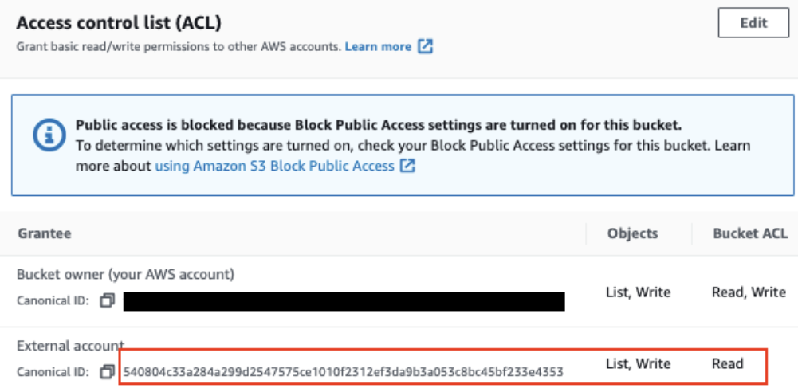

# [AWS] ElastiCache for Redis Cross region migration
> date - 2022.08.03  
> keyword - aws, cloud, elasticache, redis  
> 서비스에서 사용하는 기본 리전을 변경하기 위해 진행했던 작업 중 ElastiCache for Redis 이관 작업을 정리  
> [글로벌 데이터 스토어를 사용한 AWS 리전 간 복제](https://docs.aws.amazon.com/ko_kr/AmazonElastiCache/latest/red-ug/Redis-Global-Datastore.html) 등 다른 방법을 사용할 수도 있으나 여기서는 snapshot을 이용한 방법을 작성

 

## Prerequisites
**아래 내용 정독**
* [백업 제약 조건](https://docs.aws.amazon.com/ko_kr/AmazonElastiCache/latest/red-ug/backups.html#backups-constraints)
* [백업의 성능 영향](https://docs.aws.amazon.com/ko_kr/AmazonElastiCache/latest/red-ug/backups.html#backups-performance)

 

## Backup
* 특정 시점의 Redis cluster의 copy인 snapshot을 생성
* 사용 가능한 memory에 따라 forkless or forked backup 방법을 선택
* redis의 기본 메커니즘을 통해 .rdb 파일로 snapshot으로 생성하고 Amazon S3에 저장

 

### 필요한 이유
* Node 장애, HW 장애 등으로 인해 data loss가 발생한 경우 유용하게 사용할 수 있다
* 아카이빙을 위해 사용
* redis cluster 이관시 사전에 load된 data와 함께 cluster를 warm start할 수 있다

 

### forkless backup
* memory가 충분하지 않을 경우
* cooperative background processing
* backup 중 write load가 높으면 cache write에 지연 발생하고 backup이 성공적으로 수행되지 않는다

 

### forked backup
* memory가 충분할 경우
* `BGSAVE`로 backup 생성
* child process를 생성하여 .rdb 파일로 모든 데이터를 쓴다
* child process를 생성하는데 최대 10초가 소요
  * 그동안 parent process는 request를 처리 불가
  * child process 실행 후 parent process는 request 처리 가능

 

### Improving backup performance
* `reserved-memory-percent` 파라미터 설정
  * 모든 사용 가능한 메모리를 소비하고 페이징양을 줄여 과도한 페이징을 완화시킬 수 있다
* read replica로 backup 생성
  * node가 2개 이상인 redis cluster라면 primary or replica node에서 backup 생성 가능
  * `BGSAVE`를 위한 리소스를 위해 read replica에서 backup을 생성하는게 좋다
  * backup 중에도 primary node는 요청을 처리할 수 있다

 

## Migration
* snapshot export -> 다른 리전으로 복사 -> snapshot을 사용해 ElastiCache 생성으로 진행

### 1. 같은 리전에 있는 S3 bucket으로 snapshot을 export
* 같은 리전의 Amazon S3 bucket으로만 export 가능
* export 대상 bucket에 아래처럼 권한이 설정되어 있어야 한다

  

 

### 2. S3 PUT object - Copy API로 다른 리전의 bucket으로 복사
* Amazon S3 API를 이용해 다른 리전의 bucket으로 copy

 

### 3. 복사한 .rdb 파일을 이용해 warm start cluster 생성
* Redis cluster 생성시 Amazon S3 bucket의 snapshot을 사용하여 warn start cluster를 생성할 수 있다
* AWS console의 [Advanced Redis settings] - [Import data to cluster]에 `bucket/folder/backup.rdb`에 생성시 사용할 snapshot 지정

  

> #### Reference
> * [ElastiCache for Redis 백업 및 복원](https://docs.aws.amazon.com/ko_kr/AmazonElastiCache/latest/red-ug/backups.html)
> * [백업 내보내기](https://docs.aws.amazon.com/ko_kr/AmazonElastiCache/latest/red-ug/backups-exporting.html#backups-exporting-default-region)
> * [Amazon ElastiCache FAQ](https://aws.amazon.com/ko/elasticache/faqs/)
> * [외부에서 생성된 백업으로 새 클러스터 시드](https://docs.aws.amazon.com/ko_kr/AmazonElastiCache/latest/red-ug/backups-seeding-redis.html)
