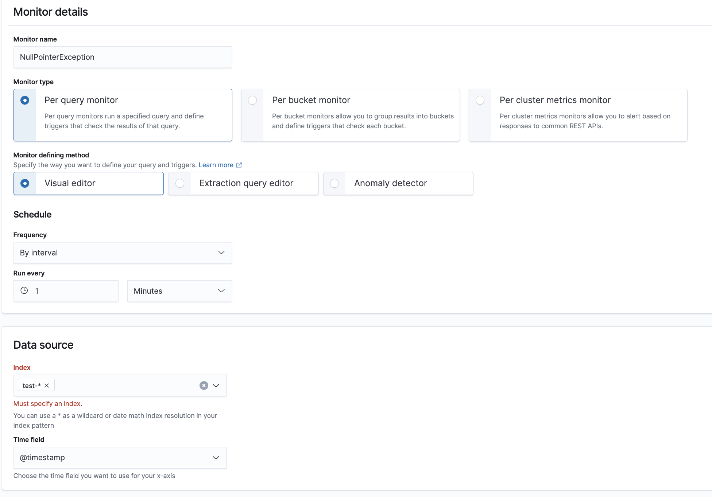

# [AWS] Upgrade Elasticsearch 5.6 to OpenSearch 1.3 in Amazon OpenSearch Service
> date - 2022.10.29  
> keyword - aws, elasticsearch, es, opensearch  
> dual write + restore snapshot API로 Elasticsearch 5.x -> OpenSearch 1.x로 업그레이드한 과정을 정리  

<br>

## Dual write

### As-is
<div align="center">
  
</div>

### Dual write
* Elasticsearch로 데이터를 저장하는 [Fluentd](https://www.fluentd.org)의 output plugin을 [Opensearch output plugin](https://docs.fluentd.org/output/opensearch)을 사용하도록 변경한 Fluentd를 새로 추가한다

<div align="center">
  
</div>

### To-be
* 기존 Fluentd를 제거한다
<div align="center">
  
</div>


<br>

## Snapshot
* snapshot 생성은 2가지 방법을 지원한다
  * Automated snapshots - 14일 보관
  * Manual snapshots - 영구 보관을 위해 사용
* Manual snapshots + ISM(Index State Management)으로 자동으로 snapshot을 생성할 수 있다  


<br>

## Upgrade Process
Elasticsearch 5.6 -> Elasticsearch 6.8 -> OpenSearch 1.3로 진행하며 Elasticsearch cluster migration에 널리 사용되는 index snapshot을 사용하여 아래의 순서로 진행한다

<div align="center">
  
</div>

1. snapshot repository로 사용할 Amazon S3 bucket 생성
2. snapshot을 S3 bucket에 저장할 수 있는 IAM Role 생성
3. old version cluster에 snapshot repository 지정
4. old version cluster의 snapshot 생성
5. new version cluster 생성
6. new version cluster에 snapshot repository 지정
7. new cluster에 restore snapshot
8. 3 ~ 7을 원하는 version까지 반복

<br>

### 1. snapshot repository로 사용할 Amazon S3 bucket 생성
* snapshot 저장에 사용할 Amazon S3 bucket 생성
* traffic 비용이나 latency 등에 이점이 있기 때문에 OpenSearch와 동일한 region이면 좋다

<br>

### 2. snapshot을 S3 bucket에 저장할 수 있는 IAM Role 생성
* OpenSearch에서 Amazon S3 bucket 에 snapshot을 저장할 때 사용할 IAM Role을 생성하고 아래의 IAM Policy를 설정한다
```json
// IAM Policy
{
  "Version": "2012-10-17",
  "Statement": [
    {
      "Action": [
        "s3:ListBucket"
      ],
      "Effect": "Allow",
      "Resource": [
         "arn:aws:s3:::<s3-bucket-name>"
      ]
    },
    {
      "Action": [
        "s3:GetObject",
        "s3:PutObject",
        "s3:DeleteObject"
      ],
      "Effect": "Allow",
      "Resource": [
        "arn:aws:s3:::<s3-bucket-name>/*"
      ]
    }
  ]
}
```

* trust relationship 설정
```json
{
  "Version": "2012-10-17",
  "Statement": [{
    "Effect": "Allow",
    "Principal": {
      "Service": "es.amazonaws.com"
    },
    "Action": "sts:AssumeRole"
  }]
}
```

* snapshot repository 등록시 사용할 IAM Role/User/Group에 위에서 생성한 IAM Role assume 권한 부여
```json
{
  "Version": "2012-10-17",
  "Statement": [{
      "Effect": "Allow",
      "Action": "iam:PassRole",
      "Resource": "arn:aws:iam::<account>:role/<role name>"  // <role name>에 위에서 생성한 IAM Role name으로 대체
    },
    {
      "Effect": "Allow",
      "Action": "es:ESHttpPut",
      "Resource": "arn:aws:es:region:<account>:domain/<domain-name>/*"
    }
  ]
}
```

<br>

### 3. old version cluster에 snapshot repository 지정
```json
// s3://<bucket name>/es-migration
PUT _snapshot/<snapshot repository>
{
  "type": "s3",
  "settings": {
    "bucket": "<bucket name>",
    "base_path": "es-migration",
    "region": "ap-northest-2",
    "role_arn": "arn:aws:iam::<account>:role/<role name>"  // snapshot을 s3에 업로드하기 위한 것으로 위에서 생성한 IAM Role 사용
  }
}
```
* Amazon OpenSearch Service는 위의 API를 사용하기 위해 서명이 필요하므로 아래 python code를 사용
```python
import boto3
import requests
from requests_aws4auth import AWS4Auth

url = 'https://xxxxxx.es.amazonaws.com/_snapshot/<snapshot repository>'
headers = {"Content-Type": "application/json"}
payload = {
    "type": "s3",
    "settings": {
        "bucket": "<bucket name>",
        "base_path": "es-migration",
        "region": "ap-northest-2",
        "role_arn": "arn:aws:iam::<account>:role/<role name>"
    }
}

credentials = boto3.Session().get_credentials()
aws_auth = AWS4Auth(credentials.access_key, credentials.secret_key, "ap-northest-2", "es", session_token=credentials.token)

response = requests.put(url, auth=aws_auth, json=payload, headers=headers)

print(response.status_code)
print(response.text)
```

<br>

### 4. old version cluster의 snapshot 생성
* migration이 필요한 index만 snapshot으로 생성(`.kibana` 같은 Elasticsearch에서 사용되는 index는 제외)
```json
PUT _snapshot/<snapshot repository>/<snapshot name>
{
  "indices": "<index pattern>",  // optional. opensearch-dashboards*,my-index*
  "ignore_unavailable": true,
  "include_global_state": false
}
```
* Amazon OpenSearch Service는 위의 API를 사용하기 위해 서명이 필요하므로 아래 python code를 사용
```python
import boto3
import requests
from requests_aws4auth import AWS4Auth

url = 'https://xxxxxx.es.amazonaws.com/_snapshot/<snapshot repository>/<snapshot name>'
headers = {"Content-Type": "application/json"}
payload = {
    "indices": "<index pattern>",  # optional. opensearch-dashboards*,my-index*
    "ignore_unavailable": True,
    "include_global_state": False
}

credentials = boto3.Session().get_credentials()
aws_auth = AWS4Auth(credentials.access_key, credentials.secret_key, "ap-northest-2", "es", session_token=credentials.token)

response = requests.put(url, auth=aws_auth, json=payload, headers=headers)

print(response.status_code)
print(response.text)
```

<br>

### 5. new version cluster 생성
* [Index compatibility](https://www.elastic.co/guide/en/elasticsearch/reference/current/snapshot-restore.html#snapshot-index-compatibility)이 있기 때문에 old version에 따라 new version의 cluster를 생성한다

| Old version | New version | Etc |
|:--|:--|:--|
| Elasticsearch 5.6 | Elasticsearch 6.8 | index에 하나의 mapping type만 있는지 확인 |
| Elasticsearch 6.8 | Opensearch 1.3 | [Amazon OpenSearch Service - 변경 사항 요약](https://docs.aws.amazon.com/ko_kr/opensearch-service/latest/developerguide/rename.html) 확인<br>Elasticsearch 5.6에서 생성된 index에 대하여 reindexing 필요 |


#### Multiple source reindexing
```sh
#/bin/bash

endpoint="localhost:9200"

for index in i1 i2 i3 i4 i5; do
  curl -H "Content-Type:application/json" -X POST $endpoint/_reindex?wait_for_completion=false -d'{
    "source": {
      "index": "'$index'"
    },
    "dest": {
      "index": "'$index'-reindexed"
    }
  }'
done
```

<br>

### 6. new version cluster에 snapshot repository 지정
* [3. old version cluster에 snapshot repository 지정](#3-old-version-cluster에-snapshot-repository-지정)과 동일하게 진행

<br>

### 7. new cluster에 restore snapshot
* [4. old version cluster의 snapshot 생성](#4-old-version-cluster의-snapshot-생성)에서 생성한 snapshot을 이용해 index를 복원한다
```json
POST /_snapshot/<snapshot repository>/<snapshot>/_restore
{
	"indices": "<index pattern>",  // optional. opensearch-dashboards*,my-index*(default. all index)
	"ignore_unavailable": true,
	"include_global_state": false
}
```

* Amazon OpenSearch Service는 위의 API를 사용하기 위해 서명이 필요하므로 아래 python code를 사용
```python
import boto3
import requests
from requests_aws4auth import AWS4Auth

url = 'https://xxxxxx.es.amazonaws.com/_snapshot/<snapshot repository>/<snapshot name>'
headers = {"Content-Type": "application/json"}
payload = {
    "indices": "<index pattern>",  # optional. opensearch-dashboards*,my-index*(default. all index)
    "ignore_unavailable": True,
    "include_global_state": False
}

credentials = boto3.Session().get_credentials()
aws_auth = AWS4Auth(credentials.access_key, credentials.secret_key, "ap-northest-2", "es", session_token=credentials.token)

response = requests.put(url, auth=aws_auth, json=payload, headers=headers)

print(response.status_code)
print(response.text)
```

<br>

### 8. 3 ~ 7을 원하는 version까지 반복


<br>

## curator -> OpenSearch ISM(Index State Management)으로 대체
* storage 관리를 위해 index lifecycle 관리 필요
* index lifecycle 관리를 위해 curator 같은 tool을 추가로 사용하지 않고 `ISM(Index State Management)`을 사용하여 Amazon OpenSearch Service Domain 내에서 index 기간, 크기 등의 조건을 기반으로 자동화하는 ISM Policy 생성

<br>

### OpenSearch ISM(Index State Management) policy 만들기
* [OpenSearch Dashboard] - [Index Management] -[Create policy]로 생성
* test-* index pattern을 가지면 7일 후 replica shard를 0으로 설정, 14일 후 제거하는 ISM Policy
```json
{
  "policy": {
    "policy_id":"how-delete-workflow",
    "description": "Changes replica count and deletes.",
    "schema_version": 1,
    "default_state": "hot",
    "states": [{
        "name": "hot",
        "actions": [],
        "transitions": [{
          "state_name": "old",
          "conditions": {
            "min_index_age": "7d"
          }
        }]
      },
      {
        "name": "old",
        "actions": [{
          "replica_count": {
            "number_of_replicas": 0
          }
        }],
        "transitions": [{
          "state_name": "delete",
          "conditions": {
            "min_index_age": "14d"
          }
        }]
      },
      {
        "name": "delete",
        "actions": [{
          "delete": {}
        }],
        "transitions": []
      }
    ],
    "ism_template": {
        "index_patterns": [
            "test-*"
        ],
        "priority": 100
    }
  }
}
```
* states
  * policy가 가지는 여러 state를 정의
  * 각 state에는 state가 될 때 실행되는 `action`과 action 완료 후 state를 변경하는 `transition`을 정의
* action
  * state 변경에 따라 순차적으로 실행되는 작업
  * snapshot 생성, index 제거 등의 작업 정의
* transition
  * 변경될 state와 조건을 정의
* ism_template
  * policy를 자동으로 적용할 index pattern 정의
  * index pattern에 맞는 index가 생성되면 자동으로 policy를 적용하며, 기존에 생성되어 있던 index들은 [Index Management] - [Indices]에서 수동으로 적용해야한다


<br>

## elastalert -> OpenSearch Alerting으로 대체
* 데이터 모니터링을 위해 [elastalert](https://github.com/Yelp/elastalert) 대신 OpenSearch Alerting 사용
* 하나 이상의 index에 있는 데이터가 특정 조건을 충족하면 Slack, Amazon Chime, Webhook, Amazon SNS로 알림 발생
  * e.g. 1시간에 HTTP 503 에러를 6개 이상 기록하면 이메일 발송, 지난 20분간 indexing된 document가 없으면 알림 발생 등
* Amazon SNS를 이용해 E-mail, SMS 발송 및 AWS Lambda 실행도 가능

<br>

### OpenSearch Alerting 생성하기
* [OpenSearch Dashboard] - [Alerting]에서 설정

#### 1. Destinations 생성
* [Alerting] - [Destinations] - [Add destination]에서 생성
* Slack, Amazon Chime, Webhook, Amazon SNS 지원
<div align="center">
  
</div>

#### 2. Monitor 생성
* [Alerting] - [Monitors] - [Create monitor]에서 생성
<div align="center">
  
  
</div>

#### 3. Monitor를 trigger할 조건 정의
<div align="center">
  
</div>

#### 4. Action 정의
<div align="center">
  
</div>

* Message Sample
```
최근 1시간 동안 {{ctx.monitor.name}}이 {{ctx.results.0.hits.total.value}}건 발생했습니다.
자세한 내용은 <https://xxx.com|여기>에서 확인해주세요

- Period start: {{ctx.periodStart}}
- Period end: {{ctx.periodEnd}}
```

* Result
```
최근 1시간 동안 TestError이 10건 발생했습니다.
자세한 내용은 여기에서 확인해주세요

- Period start: 2022-11-07T07:36:33Z
- Period end: 2022-11-07T07:36:33Z
```

<br>

### Sample
* 1분 마다 최근 1시간 이내 error 발생시 alert
```json
{
  "name": "TestError",
  "type": "monitor",
  "monitor_type": "query_level_monitor",
  "enabled": true,
  "schedule": {
    "period": {
      "unit": "MINUTES",
      "interval": 1
    }
  },
  "inputs": [
    {
      "search": {
        "indices": [
          "test-*"
        ],
        "query": {
          "size": 0,
          "aggregations": {},
          "query": {
            "bool": {
              "filter": [
                {
                  "range": {
                    "@timestamp": {
                      "gte": "{{period_end}}||-1h",
                      "lte": "{{period_end}}",
                      "format": "epoch_millis"
                    }
                  }
                },
                {
                  "bool": {
                    "filter": [
                      {
                        "bool": {
                          "should": [
                            {
                              "match_phrase": {
                                "kubernetes.labels.app": "test-app"
                              }
                            }
                          ],
                          "minimum_should_match": "1",
                        }
                      },
                      {
                        "bool": {
                          "should": [
                            {
                              "match_phrase": {
                                "level": "error"
                              }
                            }
                          ],
                          "minimum_should_match": "1",
                        }
                      }
                    ]
                  }
                },
                ...      
              ]
            }
          }
        }
      }
    }          
  ],
  "triggers": [
    {
      "query_level_trigger": {
        "name": "TestError",
        "severity": "2",
        "condition": {
          "script": {
            "source": "ctx.results[0].hits.total.value > 1",
            "lang": "painless"
          }
        },
        "actions": [
          {
            "id": "xxxxxxxxx",
            "name": "TestError",
            "destination_id": "xxxxxxxxx",
            "message_template": {
              "source": "최근 1시간 동안 {{ctx.monitor.name}}이 {{ctx.results.0.hits.total.value}}건 발생했습니다.\n자세한 내용은 <https://xxx.com|여기>에서 확인해주세요\n\n  - Period start: {{ctx.periodStart}}\n  - Period end: {{ctx.periodEnd}}",
              "lang": "mustache"
            },
            "throttle_enabled": true,
            "subject_template": {
              "source": "TestError",
              "lang": "mustache"
            },
            "throttle": {
              "value": 10,
              "unit": "MINUTES"
            }
          }
        ]
      }
    }
  ],
  ...
}
```

<br>

### Monitor
#### Type
| Type | Description |
|:--|:--|
| per query | query를 실행하고 일치하는 기준에 따라 알림 생성 |
| per bucket | dataset의 집계된 값을 기반으로 trigger 기준을 평가하는 query를 실행 |
| per cluster metrics | cluster에서 API를 호출하여 상태를 모니터링 |
| per document | alert trigger 조건과 일치하는 document를 반환하는 query(or tag로 결합된 multiple query)를 실행 |

#### Key terms
| Term | Definition |
|:--|:--|
| Monitor | schedule에 따라 실행되어 query를 수행하는 job, query 결과는 하나 이상의 trigger에 대한 input으로 사용 |
| Trigger | alert을 생성하는 조건 |
| Tag | `OR`와 결합하기 위해 여러 query에 적용할 수 있는 label로 `per document` monitor에서만 사용 |
| Alert | trigger와 연결된 event로 alert이 생성되면 trigger는 action을 수행한다 |
| Action | trigger된 monitor가 보낼 정보로 destination, message subject, message body가 있다 |
| Destination | Action이 정보를 보낼 곳으로 Amazon Chime, E-mail, Slack, custom web hook이 있다 |

> Monitor가 감시 -> trigger의 조건이 충족되면 alert 생성 -> destination으로 action 전송


<br>

## Troubleshooting

### 1. elastic curator가 동작하지 않는다
* index lifecycle management를 위해 사용하던 curator가 동작하지 않는 이슈로 OpenSearch ISM 사용 or 호환성 모드 사용
* enable compatibility mode - Elasticsearch OSS client, plugin은 연결하기 전에 cluster version을 확인하기 때문에 OpenSearch가 해당 버전을 7.10으로 응답하여 계속 동작하도록한다
```json
PUT _cluster/settings
{
 "persistent" : {
 "compatibility.override_main_response_version" : true
 }
}
```

<br>

### 2. snapshot_restore_exception - cannot restore index [index name] because an open index with same name already exists in the cluster
```json
{
   "error":{
      "root_cause":[
         {
            "type":"snapshot_restore_exception",
            "reason":"[snapshot-repository:test-2022-10-24/xxxxx] cannot restore index [test-2022-10-24] because an open index with same name already exists in the cluster. Either close or delete the existing index or restore the index under a different name by providing a rename pattern and replacement name"
         }
      ],
      "type":"snapshot_restore_exception",
      "reason":"[snapshot-repository:test-2022-10-24/xxxxx] cannot restore index [test-2022-10-24] because an open index with same name already exists in the cluster. Either close or delete the existing index or restore the index under a different name by providing a rename pattern and replacement name"
   },
   "status":500
}
```
restore index시 index name이 중복되서 발생하는 것으로 해당 index 제거 or 전체 index 제거 필요
* index 단건 삭제
```json
DELETE <index name>
```

* index 전체 삭제
```json
DELETE _all
```

<br>

### 3. snapshot_restore_exception - cannot restore index [index name] because it cannot be upgraded
```json
{
   "error":{
      "root_cause":[
         {
            "type":"snapshot_restore_exception",
            "reason":"[snapshot-repository:test-2022-10-24/xxxxx] cannot restore index [test-2022.10.20] because it cannot be upgraded"
         }
      ],
      "type":"snapshot_restore_exception",
      "reason":"[snapshot-repository:test-2022-10-24/xxxxx] cannot restore index [test-2022.10.20] because it cannot be upgraded",
      "caused_by":{
         "type":"illegal_state_exception",
         "reason":"The index [[test-2022.10.20/xxxxxxx-TQ]] was created with version [5.6.17] but the minimum compatible version is [6.0.0-beta1]. It should be re-indexed in OpenSearch 6.x before upgrading to 1.3.2."
      }
   },
   "status":500
}
```
* minimum compatible version 이슈로 5.6에서 생성된 index를 OpenSearch 1.3으로 restore 불가
* 5.6 -> 6.8 -> 6.8에서 reindexing 후 snapshot 생성 -> OpenSearch 1.3에서 restore
```json
POST _reindex?wait_for_completion=false
{
  "source": {
    "index": "test-2022.10.14"
  },
  "dest": {
    "index": "test-new-2022.10.14"
  }
}
```


<br><br>

> #### Reference
> * [Amazon OpenSearch Service에서 인덱스 스냅샷 생성](https://docs.aws.amazon.com/ko_kr/opensearch-service/latest/developerguide/managedomains-snapshots.html)
> * [자습서: Amazon OpenSearch Service로 마이그레이션](https://docs.aws.amazon.com/ko_kr/opensearch-service/latest/developerguide/migration.html)
> * [스냅샷을 사용하여 데이터 마이그레이션](https://docs.aws.amazon.com/ko_kr/opensearch-service/latest/developerguide/version-migration.html#snapshot-based-migration)
> * [Amazon OpenSearch Service의 인덱스 상태 관리](https://docs.aws.amazon.com/ko_kr/opensearch-service/latest/developerguide/ism.html)
> * [자습서: 인덱스 상태 관리 프로세스 자동화](https://docs.aws.amazon.com/ko_kr/opensearch-service/latest/developerguide/ism-tutorial.html)
> * [Amazon OpenSearch Service의 알림 구성](https://docs.aws.amazon.com/ko_kr/opensearch-service/latest/developerguide/alerting.html)
> * [한 Amazon OpenSearch Service 도메인에서 다른 Amazon OpenSearch Service 도메인으로 데이터를 마이그레이션하려면 어떻게 해야 합니까?](https://aws.amazon.com/ko/premiumsupport/knowledge-center/migrate-amazon-es-domain)
> * [Use Amazon S3 to Store a Single Amazon Elasticsearch Service Index](https://aws.amazon.com/ko/blogs/database/use-amazon-s3-to-store-a-single-amazon-elasticsearch-service-index)
> * [How to Migrate from Elasticsearch to OpenSearch](https://opster.com/guides/opensearch/opensearch-basics/migrate-from-elasticsearch-to-opensearch)
> * [Amazon OpenSearch Service - 변경 사항 요약](https://docs.aws.amazon.com/ko_kr/opensearch-service/latest/developerguide/rename.html)
> * [Reindex API](https://www.elastic.co/guide/en/elasticsearch/reference/master/docs-reindex.html)
> * [Alerting - OpenSearch Docs](https://opensearch.org/docs/latest/monitoring-plugins/alerting)
