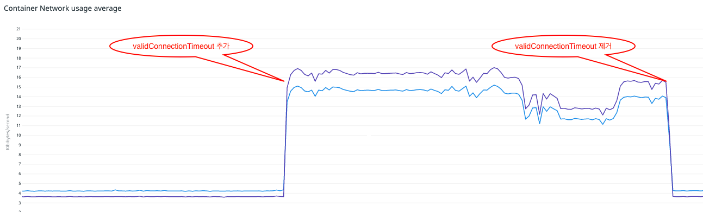
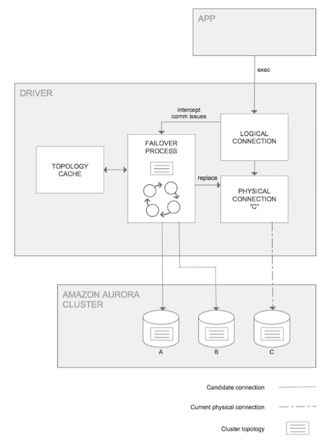
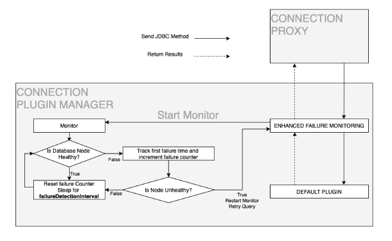

# [AWS] Various ways to access Amazon Aurora using JDBC Driver
> date - 2022.10.06  
> keyword - mysql, aurora, jdbc, spring  
> Spring Boot application에서 Amazon Aurora MySQL 접근시 어떤 JDBC Driver를 사용하면 좋을지 알아본 내용 정리  

<br>

## [MySQL Connector/J](https://dev.mysql.com/doc/connector-j/8.0/en)

### Usage
* build.gradle
```gradle
dependencies {    
  implementation 'mysql:mysql-connector-java'
}
```
```yaml
spring:
  datasource:
    hikari:
      jdbc-url: jdbc:mysql://<host>:3306/<db_name>
      driver-class-name: com.mysql.cj.jdbc.Driver
      ...
```

<br>

### Read-Write splitting
#### driver의 read-write splitting 사용
* [9.4 Configuring Source/Replica Replication with Connector/J](https://dev.mysql.com/doc/connector-j/8.0/en/connector-j-source-replica-replication-connection.html)
```
jdbc:mysql:replication://[source host][:port],[replica host 1][:port][,[replica host 2][:port]]...[/[database]][?propertyName1=propertyValue1[&propertyName2=propertyValue2]...]

## example
jdbc:mysql:replication://source:3306,replica1:3306,replica2:3306/test?autoReconnect=true&roundRobinLoadBalance=true
```

#### Spring Boot에서 구현
* application.yml
```yaml
spring:
  datasource:
    replication:
      writer:
        driver-class-name: com.mysql.cj.jdbc.Driver
        jdbc-url: jdbc:mysql://<host>:3306/<db_name>
        username: <user name>
        password: <password>
        pool-name: writer
        maximum-pool-size: 10
      reader:
        driver-class-name: com.mysql.cj.jdbc.Driver
        jdbc-url: jdbc:mysql://<host>:3306/<db_name>
        username: <user name>
        password: <password>
        pool-name: reader
        maximum-pool-size: 10
```
* application.yml에 설정한 값들을 `ReplicationDatasourceProperties`로 만든다 
```java
@Getter
@Setter
@Configuration
public class ReplicationDatasourceProperties {
    protected String username;
    protected String password;
    protected String driverClassName;
    protected String poolName;
    protected String jdbcUrl;
    protected Integer maximumPoolSize;

    @ConfigurationProperties(prefix = "spring.datasource.replication.writer")
    public static class Writer extends ReplicationDatasourceProperties {
    }

    @ConfigurationProperties(prefix = "spring.datasource.replication.reader")
    public static class Reader extends ReplicationDatasourceProperties {
    }
}
```

* Transaction의 read-only 여부에 따라 사용할 DataSource를 분기하기 위한 설정
```java
public class ReplicationRoutingDataSource extends AbstractRoutingDataSource {
    public static final String READ = "read";
    public static final String WRITE = "write";

    @Override
    protected Object determineCurrentLookupKey() {
        return TransactionSynchronizationManager.isCurrentTransactionReadOnly() ? READ : WRITE;
    }
}
```

* read/write 용 DataSource를 생성
```java
@Configuration
@EnableConfigurationProperties(value = {
        ReplicationDatasourceProperties.Writer.class,
        ReplicationDatasourceProperties.Reader.class
})
public class ReplicationDatasourceConfiguration {

    @Bean
    public DataSource dataSource(ReplicationDatasourceProperties.Writer writerProperties,
                                 ReplicationDatasourceProperties.Reader readerProperties) {
        var dataSourceMap = Map.<Object, Object>of(ReplicationRoutingDataSource.WRITE, createDataSource(writerProperties),
                ReplicationRoutingDataSource.READ, createDataSource(readerProperties));
        var replicationDataSource = new ReplicationRoutingDataSource();
        replicationDataSource.setTargetDataSources(dataSourceMap);
        replicationDataSource.setDefaultTargetDataSource(dataSourceMap.get(ReplicationRoutingDataSource.WRITE));
        replicationDataSource.afterPropertiesSet();
        return new LazyConnectionDataSourceProxy(replicationDataSource);
    }

    private DataSource createDataSource(ReplicationDatasourceProperties properties) {
        var hikariConfig = new HikariConfig();
        hikariConfig.setDriverClassName(properties.getDriverClassName());
        hikariConfig.setPoolName(properties.getPoolName());
        hikariConfig.setMaximumPoolSize(properties.getMaximumPoolSize());
        hikariConfig.setJdbcUrl(properties.getJdbcUrl());
        hikariConfig.setUsername(properties.getUsername());
        hikariConfig.setPassword(properties.getPassword());
        return new HikariDataSource(hikariConfig);
    }
}
```

* JPA 설정
```java
@Configuration
public class JpaConfiguration {
    @Bean
    public LocalContainerEntityManagerFactoryBean entityManagerFactory(EntityManagerFactoryBuilder builder, DataSource dataSource) {
        return builder.dataSource(dataSource)
                      .packages(me.dong.test.domain.TestDomainPackages.class)
                      .build();
    }

    @Bean
    public PlatformTransactionManager transactionManager(EntityManagerFactory entityManagerFactory) {
        return new JpaTransactionManager(entityManagerFactory);
    }
}
```

* test
```java
@Slf4j
@Service
public class ReplicationService {

    private final DataSource dataSource;

    public ReplicationService(DataSource dataSource) {
        this.dataSource = dataSource;
    }

    @Transactional(readOnly = true)
    public void read() {
        try (var connection = dataSource.getConnection()) {
            log.info("read url : {}", connection.getMetaData().getURL());
        } catch (SQLException e) {
            log.error(e.getMessage(), e);
        }
    }

    @Transactional
    public void write() {
        try (var connection = dataSource.getConnection()) {
            log.info("write url : {}", connection.getMetaData().getURL());
        } catch (SQLException e) {
            log.error(e.getMessage(), e);
        }
    }
}
```


<br>

## [MariaDB Connector/J](https://mariadb.com/kb/en/about-mariadb-connector-j)
* [MySQL Connector/J](https://dev.mysql.com/doc/connector-j/8.0/en) 대비 차이점은 AuroraProtocol, AuroraListener 등 aurora failover 관련이 구현되어 있다
```
jdbc:mariadb:[replication:|loadbalance:|sequential:]//<hostDescription>[,<hostDescription>...]/[database][?<key1>=<value1>[&<key2>=<value2>]] 
```
* host - DNS name, IP address
  * IPv6라면 `[]` 내에 있어야한다
* failover, load-balancing mode가 replication이고, type이 없을 경우 1번째가 master, 나머지가 slave라고 가정한다
* JDBC url에 `jdbc:mariadb:aurora://xxxx.amazonaws.com` 처럼 `aurora`가 있으면 Amazon Aurora cluster failover와 read-write split 지원
  * Amazon Aurora cluster failover는 DB instance에 대한 failover라서 application에서 별도로 처리가 필요한데 aurora mode가 그것을 지원한다
  * `@Transactional(readOnly = true)` or `DataSource.setReadOnly(true)` 처럼 read-only connection이라면 replica instance에 대해 load-balancing 한다
    * general log 활성화해서 확인 가능(성능 이슈가 있으니 주의)
  * [Failover and Load-Balancing Modes](https://mariadb.com/kb/en/about-mariadb-connector-j/#failover-and-load-balancing-modes)를 보면 `aurora` failover prefix는 2.x까지 사용 가능한 것으로 명시

<br>

### Usage
* build.gradle
```gradle
// aurora failover mode를 2.x에서만 지원하므로 2.x의 최신 버전인 2.7.6 사용
dependencies {    
  implementation 'org.mariadb.jdbc:mariadb-java-client:2.7.6'
}
```
```yaml
spring:
  datasource:
    hikari:
      jdbc-url: jdbc:mariadb:aurora://<host>:3306/<db_name>
      driver-class-name: org.mariadb.jdbc.Driver
      ...
```

#### JDBC option 추천
* [connectTimeout](https://mariadb.com/kb/en/about-mariadb-connector-j/#essential-parameters)
  * 5 ~ 10s(default. 30s)
* [socketTimeout](https://mariadb.com/kb/en/about-mariadb-connector-j/#infrequently-used-parameters)
  * connection을 무제한으로 연결하지 않게하여 DB의 종료 및 failover, network 장애시 자동 복구되려면 필수
  * API라면 30s 미만, batch라면 60s 이상 추천
* [queryTimeout](https://mariadb.com/kb/en/about-mariadb-connector-j/#set-a-query-timeout)
  * socketTimeout 발생시 DB 감소를 위해 필요
  * query 실행 중 해당 시간을 초과하면 중지 후 exception 반환
  * socketTimeout만 발생하면 DB는 query를 계속 수행하지만 응답을 전달하지 못하여 과부하로 인한 장애시 도움이 되지 않아 fast fail을 위해 **socketTimeout 보다 1초 이상 작은 값** 설정

<br>

### Read-Write split
* aurora cluster endpoint + `aurora` failover mode 사용시 primary, replica `AuroraProtocol`이 각각 생성되고,  `Connection.setReadOnly(boolean)`이 true면 replica, false(default)면 primary 연결 사용
  * Spring이라면 `@Transactional(readOnly = true)`로 제어 -> `PlatformTransactionManager`에 의해 `Connection.setReadOnly(true)`이 동작
* test code
```java
connection = DriverManager.getConnection("jdbc:mariadb:aurora://<cluster endpoint>:<port>/<db>");
stmt = connection.createStatement();
connection.setReadOnly(false);
stmt.execute("SELECT 1"); // primary로 query
connection.setReadOnly(true);
stmt.execute("SELECT 1"); // replica로 query
```

#### 1. jdbc url에 `aurora`가 포함되어 있으면 AuroraProtocol의 FailoverProxy로 AuroraListener 생성
* DB와 통신시 Protocol을 사용하고 `AuroraProtocol`, `MastersReplicasProtocol`, `MasterProtocol`가 있다
* Protocol의 특정 method 호출시 FailoverProxy에서 AuroraListener의 method를 먼저 호출한다
```java
// https://github.com/mariadb-corporation/mariadb-connector-j/blob/2.7.6/src/main/java/org/mariadb/jdbc/internal/util/Utils.java#L603
public class Utils {
  ...
  public static Protocol retrieveProxy(final UrlParser urlParser, final GlobalStateInfo globalInfo)
      throws SQLException {
    final ReentrantLock lock = new ReentrantLock();
    final LruTraceCache traceCache =
        urlParser.getOptions().enablePacketDebug ? new LruTraceCache() : null;
    Protocol protocol;
    switch (urlParser.getHaMode()) {
      case AURORA:
        return getProxyLoggingIfNeeded(
            urlParser,
            (Protocol)
                Proxy.newProxyInstance(
                    AuroraProtocol.class.getClassLoader(),
                    new Class[] {Protocol.class},
                    new FailoverProxy(
                        new AuroraListener(urlParser, globalInfo), lock, traceCache)));
  ...
```


#### 2. FailoverProxy의 생성자에서 Connection을 생성한다
* FailoverProxy의 생성자 -> AuroraListener.initializeConnection() -> AuroraListener.reconnectFailedConnection() -> AuroraProtocol.loop()
```java
// https://github.com/mariadb-corporation/mariadb-connector-j/blob/2.7.6/src/main/java/org/mariadb/jdbc/internal/protocol/AuroraProtocol.java#L170
public class AuroraProtocol extends MastersReplicasProtocol {
  ...
  public static void loop(AuroraListener listener, final GlobalStateInfo globalInfo, final List<HostAddress> addresses, SearchFilter initialSearchFilter) throws SQLException {
    ...
    while (!loopAddresses.isEmpty() || (!searchFilter.isFailoverLoop() && maxConnectionTry > 0)) {
      protocol = getNewProtocol(listener.getProxy(), globalInfo, listener.getUrlParser());
      ...
      // writer와 connection 생성
      protocol.setHostAddress(host);
      protocol.connect();
    ...
    
    // 내부에서 AuroraListener.getCurrentEndpointIdentifiers()을 사용해 모든 instance endpoint 조회
    listener.retrieveAllEndpointsAndSet(protocol);
    ...
}

// https://github.com/mariadb-corporation/mariadb-connector-j/blob/2.7.6/src/main/java/org/mariadb/jdbc/internal/failover/impl/AuroraListener.java#L259
public class AuroraListener extends MastersReplicasListener {
  private List<String> getCurrentEndpointIdentifiers(Protocol protocol) throws SQLException {
    ...
    // Deleted instance may remain in db for 24 hours so ignoring instances that have had no change for 3 minutes
    Results results = new Results();
    protocol.executeQuery(
      false,
      results,
      "select server_id, session_id from information_schema.replica_host_status "
      + "where last_update_timestamp > now() - INTERVAL 3 MINUTE");
    results.commandEnd();
    ResultSet resultSet = results.getResultSet();

    while (resultSet.next()) {
      endpoints.add(resultSet.getString(1) + "." + clusterDnsSuffix);
    }

    // randomize order for distributed load-balancing
    Collections.shuffle(endpoints);
    return endpoints;
  }
}
```

#### 3. Transaction 시작시
* Connection.setReadOnly(true) -> AuroraProtocol.setReadonly(true) -> FailoverProxy.invoke() -> AuroraListener.switchReadOnlyConnection() 호출
```java
// https://github.com/mariadb-corporation/mariadb-connector-j/blob/2.7.6/src/main/java/org/mariadb/jdbc/MariaDbConnection.java#L836
public class MariaDbConnection implements Connection {
  public void setReadOnly(final boolean readOnly) throws SQLException {
    ...
    protocol.setReadonly(readOnly);
    ...
  }
}

// https://github.com/mariadb-corporation/mariadb-connector-j/blob/2.7.6/src/main/java/org/mariadb/jdbc/internal/failover/FailoverProxy.java#L209
public class FailoverProxy implements InvocationHandler {
  ...
  @Override
  public Object invoke(Object proxy, Method method, Object[] args) throws Throwable {
    String methodName = method.getName();
    switch (methodName) {
      ...
      case METHOD_SET_READ_ONLY:
        this.listener.switchReadOnlyConnection((Boolean) args[0]);
  ...
```

* 현재 Connection에서 사용하는 AuroraProtocol을 writer or reader로 변경해준다
* Connection.setReadOnly(false)에는 cluster endpoint를, Connection.setReadOnly(true)에는 AuroraListener.getCurrentEndpointIdentifiers()에서 조회한 instance endpoint를 사용하여 생성한 AuroraProtocol을 사용
* query 실행 후 switchReadOnlyConnection()을 다시 호출하면서 reader protocol에서 writer protocol로 교체한다
```java
// https://github.com/mariadb-corporation/mariadb-connector-j/blob/2.7.6/src/main/java/org/mariadb/jdbc/internal/failover/impl/MastersReplicasListener.java#L683
// 아래는 이해하기 쉽게 단순화된 code
public class MastersReplicasListener extends AbstractMastersReplicasListener {

  public void switchReadOnlyConnection(Boolean mustBeReadOnly) throws SQLException {
    currentReadOnlyAsked = mustBeReadOnly;
    // Connection.setReadOnly(true)
    if (currentReadOnlyAsked) {
      // switching to secondary connection
      currentProtocol = this.secondaryProtocol;
    } else {
      // Connection.setReadOnly(false)
      // switching to master connection
      currentProtocol = this.masterProtocol;
      ...
    }
  ...
  }
}
```

<br>

### Failover
* Amazon Aurora 사용시 언제든 모종의 이유로 failover가 발생할 수 있다
  * connection이 활성 상태이고, instance의 역할이 변경되지 않았는지 확인해야한다
* failover시 cluster endpoint에 대한 변경 발생하므로 DNS caching을 사용한다면 failover에 반응할 수 없다
  * [Amazon Aurora의 고가용성](https://docs.aws.amazon.com/ko_kr/AmazonRDS/latest/AuroraUserGuide/Concepts.AuroraHighAvailability.html)을 보면 primary에 장애 발생시 reader 중 하나가 primary로 promotion되며 cluster endpoint가 변경된다

<br>

> [Specifics for Amazon Aurora](https://mariadb.com/kb/en/failover-and-high-availability-with-mariadb-connector-j-for-2x-driver/#specifics-for-amazon-aurora)의 아래 내용을 참고
> * Aurora endpoints and discovery
> * Aurora connection loop
> * Aurora master verification
> * Aurora connection validation thread

<br>

#### HikariCP에서 확인
* HikariPool.getConnection() -> Connection.isValid() -> AuroraProtocol.isValid() 순으로 호출
```java
// https://github.com/brettwooldridge/HikariCP/blob/HikariCP-3.2.0/src/main/java/com/zaxxer/hikari/pool/HikariPool.java#L165
public final class HikariPool extends PoolBase implements HikariPoolMXBean, IBagStateListener {
  // 단순화하기 위해 try-catch는 제거했음
  public Connection getConnection(final long hardTimeout) throws SQLException {
    final long startTime = currentTime();
    long timeout = hardTimeout;
    do {
      PoolEntry poolEntry = connectionBag.borrow(timeout, MILLISECONDS);
      if (poolEntry == null) {
        break; // We timed out... break and throw exception
      }

      final long now = currentTime();

      // isConnectionAlive()에서 Connection.isValid() 호출
      if (poolEntry.isMarkedEvicted() || (elapsedMillis(poolEntry.lastAccessed, now) > ALIVE_BYPASS_WINDOW_MS && !isConnectionAlive(poolEntry.connection))) {
        closeConnection(poolEntry, poolEntry.isMarkedEvicted() ? EVICTED_CONNECTION_MESSAGE : DEAD_CONNECTION_MESSAGE);
        timeout = hardTimeout - elapsedMillis(startTime);
      } else {
        metricsTracker.recordBorrowStats(poolEntry, startTime);
        return poolEntry.createProxyConnection(leakTaskFactory.schedule(poolEntry), now);
      }
    } while (timeout > 0L);
   }
}

// https://github.com/mariadb-corporation/mariadb-connector-j/blob/2.7.6/src/main/java/org/mariadb/jdbc/MariaDbConnection.java#L1228
public class MariaDbConnection implements Connection {
  ...

  public boolean isValid(final int timeout) throws SQLException {
    if (timeout < 0) {
      throw new SQLException("the value supplied for timeout is negative");
    }
    if (isClosed()) {
      return false;
    }

    try {
      return protocol.isValid(timeout * 1000);
    } catch (SQLException e) {
      if (pooledConnection != null) {
        MariaDbPooledConnection poolConnection = this.pooledConnection;
        poolConnection.fireConnectionErrorOccurred(e);
        poolConnection.close();
      }
      return false;
    }
  }
  ...
}
```

#### validConnectionTimeout 설정시 MariaDB connector에서 확인
* AbstractMastersListener.initializeConnection()에서 connection validation loop를 시작하며 validConnectionTimeout(JDBC option) 주기로 connection validation 수행
```java
// https://github.com/mariadb-corporation/mariadb-connector-j/blob/2.7.6/src/main/java/org/mariadb/jdbc/internal/failover/AbstractMastersListener.java#L130

public abstract class AbstractMastersListener implements Listener {
  ...
  public void initializeConnection() throws SQLException {
    long connectionTimeoutMillis = TimeUnit.SECONDS.toMillis(urlParser.getOptions().validConnectionTimeout);
    lastQueryNanos = System.nanoTime();
    if (connectionTimeoutMillis > 0) {
      // jdbc-url의 validConnectionTimeOut이 0보다 크면 validation loop 설정
      // validConnectionTimeout default: 0s
      connectionValidationLoop.addListener(this, connectionTimeoutMillis);
  }
}
```
```java
// https://github.com/mariadb-corporation/mariadb-connector-j/blob/2.7.6/src/main/java/org/mariadb/jdbc/internal/failover/thread/ConnectionValidator.java#L78
public class ConnectionValidator {

  private static final int MINIMUM_CHECK_DELAY_MILLIS = 100;
  ...
  public void addListener(Listener listener, long listenerCheckMillis) {
    queue.add(listener);

    long newFrequency = Math.min(MINIMUM_CHECK_DELAY_MILLIS, listenerCheckMillis);

    // first listener
    if (currentScheduledFrequency.get() == -1) {
      if (currentScheduledFrequency.compareAndSet(-1, newFrequency)) {
        // validConnectionTimeOut 주기를 갖는 scheduler 생성
        fixedSizedScheduler.schedule(checker, listenerCheckMillis, TimeUnit.MILLISECONDS);
      }
    } else {
      long frequency = currentScheduledFrequency.get();
      if (frequency > newFrequency) {
        currentScheduledFrequency.compareAndSet(frequency, newFrequency);
      }
    }
  }

  private class ListenerChecker implements Runnable {
    ...
    private void doRun() {
      Listener listener;
      Iterator<Listener> tmpQueue = queue.iterator();
      long now = -1;
      while (tmpQueue.hasNext()) {
        listener = tmpQueue.next();
        if (!listener.isExplicitClosed()) {
          long durationNanos =
              (now == -1 ? now = System.nanoTime() : now) - listener.getLastQueryNanos();
          long durationSeconds = TimeUnit.NANOSECONDS.toSeconds(durationNanos);
          // 마지막 query 후 validConnectionTimeout 만큼 지났으면 status check 수행
          if (durationSeconds >= listener.getUrlParser().getOptions().validConnectionTimeout
              && !listener.isMasterHostFail()) {
            boolean masterFail = false;
            if (listener.isMasterConnected()) {
              listener.checkMasterStatus(null);  // AuroraListener.checkMasterStatus() -> AuroraProtocol.checkIfMaster() 순서로 호출
            } else {
              masterFail = true;
            }

            if (masterFail && listener.setMasterHostFail()) {
              try {
                listener.primaryFail(null, null, false, false);
              } catch (Throwable t) {
                // do nothing
              }
            }
          }
        }
      }
    }
  }
}
```
```java
// https://github.com/mariadb-corporation/mariadb-connector-j/blob/2.7.6/src/main/java/org/mariadb/jdbc/internal/failover/impl/AuroraListener.java#L440

public class AuroraListener extends MastersReplicasListener {
  // aurora endpoint를 인식해야 동작하므로 다른 url pattern을 사용하면 안된다
  private final Pattern auroraDnsPattern = Pattern.compile(
          "(.+)\\.(cluster-|cluster-ro-|cluster-custom-)?([a-zA-Z0-9]+\\.[a-zA-Z0-9\\-]+\\.rds\\.amazonaws\\.com)",
          Pattern.CASE_INSENSITIVE);

  @Override
  public boolean checkMasterStatus(SearchFilter searchFilter) {
    if (!isMasterHostFail()) {
      try {
        if (masterProtocol != null && !masterProtocol.checkIfMaster()) {
          // master has been demote, is now secondary
          setMasterHostFail();
          if (isSecondaryHostFail()) {
            foundActiveSecondary(masterProtocol);
          }
          return true;
        }
      ...
    }
    ...
  }
}
```

* `select @@innodb_read_only`시 primary는 0, replica는 1을 응답하므로 해당 query로 primary인지 확인
```java
// https://github.com/mariadb-corporation/mariadb-connector-j/blob/2.7.6/src/main/java/org/mariadb/jdbc/internal/protocol/AuroraProtocol.java#L406
public class AuroraProtocol extends MastersReplicasProtocol {
  public boolean checkIfMaster() throws SQLException {
    proxy.lock.lock();
    try {
      Results results = new Results();

      // check query
      executeQuery(this.isMasterConnection(), results, "select @@innodb_read_only");
      results.commandEnd();
      ResultSet queryResult = results.getResultSet();
      if (queryResult != null && queryResult.next()) {
        this.masterConnection = (0 == queryResult.getInt(1));

        reader.setServerThreadId(this.serverThreadId, this.masterConnection);
        writer.setServerThreadId(this.serverThreadId, this.masterConnection);
      } else {
        this.masterConnection = true;
      }

      this.readOnly = !this.masterConnection;
      return this.masterConnection;

    } catch (SQLException sqle) {
      throw new SQLException(
          "could not check the 'innodb_read_only' variable status on "
              + this.getHostAddress()
              + " : "
              + sqle.getMessage(),
          CONNECTION_EXCEPTION.getSqlState(),
          sqle);
    } finally {
      proxy.lock.unlock();
    }
  }
}
```

#### Failover test case
* traffic이 유입되는 상황에서 DB failover를 수행
  * promote되는 DB로 DML이 정상적으로 실행되는지 파악 및 failover 소요 시간 측정
* 일정 시간 connection 맺은 상태로 대기
  * health check 관련 query 측정
* 일정 시간 application으로 traffic을 발생시킨다
  * query 수행 및 추가적으로 유입되는 show statement 등을 파악하고 성능 측정

#### Failover Result
<div align="left">
  
</div>
validConnectionTimeout 여부에 따라 network 사용률에 큰 차이가 있다

* 아래와 같은 설정일 때 connection validation만으로 50 * 초당 0.5개(2s 마다) * 10 = 250QPS query 발생
  * connection pool - 50개
  * validConnectionTimeout - 2s
  * application - 10개
* 마지막 query 후 validConnectionTimeout 만큼 시간이 지나면 check query가 발생
  * 실제 query가 빈번할 경우 check query가 발생하지 않는다
* [CONJ-430](https://jira.mariadb.org/browse/CONJ-430), [CONJ-241](https://jira.mariadb.org/browse/CONJ-241)을 보면 `validConnectionTimeout`을 설정하면 `ConnectionValidator`(validConnectionTimeout마다 connection validation하는 추가 thread)가 생성된다
  * 대부분의 Connection Pool에서 `Connection.isValid()`를 사용해 처리하기 때문에 connection validation 중복되므로 1.5.8부터 validConnectionTimeout의 default가 0으로 변경되었다
  * Connection Pool에 의존하는게 좋다
* 위에서 보았듯 HikariCP는 `Connection.isValid()`을 사용해 connection 활성화와 instance의 역할을 확인하므로 `validConnectionTimeout`을 설정하지 않아도 된다
  * 너무 길지 않은 maxLifetime(e.g. max 15분)을 설정해주자

<br>

## [AWS JDBC Driver for MySQL](https://github.com/awslabs/aws-mysql-jdbc)
* Aurora cluster의 상태를 모니터링하고, cluster topology를 caching하여 failover 시간을 최소화한다
  * MariaDB Connector/J 보다 짧은 downtime을 가진다
* 1.1.0에서 read-write splitting 지원 X
  * connection pool 분리해서 구현 필요
* [Amazon Aurora DB 클러스터에 연결](https://docs.aws.amazon.com/ko_kr/AmazonRDS/latest/AuroraUserGuide/Aurora.Connecting.html)을 보면 MariaDB Connector/J 3.0.3은 Aurora DB cluster에 대한 지원을 중단하므로 AWS JDBC Driver for MySQL 사용을 권장

<br>

### Usage
* build.gradle 
```gradle
dependencies {
  implementation("software.aws.rds:aws-mysql-jdbc:1.1.0")
}
```
```
jdbc:mysql:aws://<host>:3306/<db_name>
```

<br>

### Failover
<div align="center">
  
</div>

* AWS JDBC Driver를 사용해 primary와의 logical/physical connection을 생성
* application에서는 logical connection을 사용해 query
* primary에 문제 발생시 failover되고, AWS JDBC Driver도 failover를 인지하여 failover process 시작
* topology cache를 사용해 replica에 연결하고, new primary가 확인될 때까지 topology cache를 query
  * DB에 query하여 얻은 topology(primary, replica)를 caching하여 failover시 DNS 처리로 인한 지연 없이 빠르게 처리 가능
  * topology cache 갱신 주기는 `clusterTopologyRefreshRateMs(default. 30s)`로 조절
* new primary 확인시 session을 재구성

#### 사용하는 endpoint에 따라 동작 방식이 다르다
> [Connection URL Descriptions](https://github.com/awslabs/aws-mysql-jdbc#connection-url-descriptions)

| URL Type | Example | Driver Behavior |
|:--|:--|:--|
| Cluster Endpoint | jdbc:mysql:aws://db-identifier.cluster-XYZ.us-east-2.rds.amazonaws.com:3306 | initial connection - primary <br>failover - new primary |
| Read-Only Cluster Endpoint | jdbc:mysql:aws://db-identifier.cluster-ro-XYZ.us-east-2.rds.amazonaws.com:3306 | initial connection - replica <br>failover - replica에 우선 연결, primary가 더 빠른 연결을 제공할 경우 primary에 연결 |
| Instance Endpoint | jdbc:mysql:aws://instance-1.XYZ.us-east-2.rds.amazonaws.com:3306 | initial connection - 명시한 instance <br>failover - primary |
| Custom Endpoint | jdbc:mysql:aws://db-identifier.cluster-custom-XYZ.us-east-2.rds.amazonaws.com:3306 | initial connection - 명시한 instance <br>failover - primary |

<br>

### Enhanced failure monitoring
<div align="center">
  
</div>

* monitor thread가 주기적으로 연결된 DB node의 정상 여부를 확인하며 비정상이라고 판단되면 새로운 DB node에서 다시 monitor 수행
  * 주기는 `failureDetectionTime(default. 30s)`으로 설정
* 다른 DB node를 확인하는 주기는 `failureDetectionInterval(default. 5s)`로 설정
* node의 정상 여부를 확인하는 
* node를 비정상으로 판단하는 수는 `failureDetectionCount(default. 3)`로 설정
* RDS Proxy와 함께 사용하는 것을 비권장
  * RDS Proxy가 자체 기준으로 request 별로 DB instance 중 하나로 라우팅하므로 instance health monitoring 측면에서 plugin을 쓸모 없게 만든다
  * Enhanced failure monitoring plugin과 RDS Proxy를 동시에 사용하지 않는게 좋다


<br><br>

> #### Reference
> * [9.4 Configuring Source/Replica Replication with Connector/J](https://dev.mysql.com/doc/connector-j/8.0/en/connector-j-source-replica-replication-connection.html)
> * [Amazon Web Services (AWS) JDBC Driver for MySQL](https://awslabs.github.io/aws-mysql-jdbc)
> * [MySQL용 Amazon Web Services JDBC 드라이버로 신속하게 데이터베이스 장애 조치](https://aws.amazon.com/about-aws/whats-new/2022/03/amazon-web-services-jdbc-driver-mysql-failover)
> * [awslabs/aws-mysql-jdbc](https://github.com/awslabs/aws-mysql-jdbc)
> * [Amazon Aurora MySQL DB 클러스터에 연결](https://docs.aws.amazon.com/ko_kr/AmazonRDS/latest/AuroraUserGuide/Aurora.Connecting.html#Aurora.Connecting.AuroraMySQL)
> * [Improve application availability with the AWS JDBC Driver for Amazon Aurora MySQL](https://aws.amazon.com/ko/blogs/database/improve-application-availability-with-the-aws-jdbc-driver-for-amazon-aurora-mysql)
> * [AWS re:Invent 2016: Deep Dive on Amazon Aurora](https://www.youtube.com/watch?time_continue=1667&v=duf5uUsW3TM&feature=emb_logo)
> * [Amazon Aurora DB 클러스터가 장애 조치된 후 읽기 전용 오류가 발생하는 이유는 무엇입니까?](https://aws.amazon.com/ko/premiumsupport/knowledge-center/aurora-mysql-db-cluser-read-only-error/)
> * [Understanding Database Failover: Part 2 – Amazon](http://blog.heimdalldata.com/2016/04/12/understanding-database-failover-in-the-cloud-and-across-regions-amazon/)
> * [Specifics for Amazon Aurora](https://mariadb.com/kb/en/failover-and-high-availability-with-mariadb-connector-j-for-2x-driver/#specifics-for-amazon-aurora)
