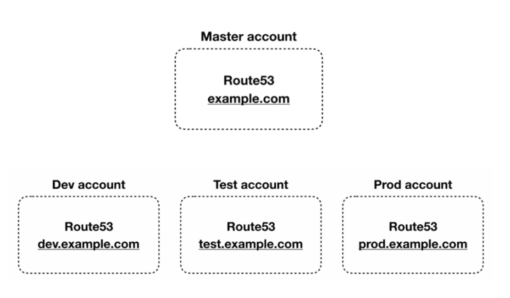

# [AWS] How to manage Route53 hosted zones using DNS delegation 
> date - 2023.01.21  
> keyworkd - aws, route53, dns  
> 도메인 위임으로 multi account에서 도메인을 관리하는 방법을 정리  

 

## 도메인 위임
* `example.com`의 도메인을 가지고 하위 도메인을 용도별로 구분하여 사용하기 위한 방법으로 도메인에 대한 정보를 관리할 수 있는 name server를 다른 곳에서 관리하도록 위임하여 사용한다
  * e.g. CDN, GSLB 사용, app.example.com을 환경별로 구분하여 app.dev.example.com, app.prod.example.com으로 사용
* `*.example.com`, `*.dev.example.com`, `*.prod.example.com` 총 3개의 Route53 hosted zone에 NS record를 생성하면 된다

 

## 도메인 위임을 사용하여 AWS Multi account에서 도메인 관리
1. master account에서 root domain의 Route53 hosted zone 생성
2. sub account에서 sub domain의 Route53 hosted zone 생성
3. sub domain의 Route53 hosted zone의 NS record를 기록
4. root domain의 Route53 hosted zone에서 sub domain에 대한 NS record를 생성하고 sub domain의 NS record 값으로 생성

 

  

### dev account hosted zone 예시
| Record name | Type | Value |
|:--|:--|:--|
| dev.example.com | NS | ns-222.aws.dns-22.net, ... |
| ... | ... | ... |

### prod account hosted zone 예시
| Record name | Type | Value |
|:--|:--|:--|
| prod.example.com | NS | ns-333.aws.dns-33.net, ... |
| ... | ... | ... |

### master account hosted zone 예시
| Record name | Type | Value |
|:--|:--|:--|
| example.com | NS | ns-111.awsdns-11.net, ... |
| dev.example.com | NS | ns-222.aws.dns-22.net, ... |
| prod.example.com | NS | ns-333.aws.dns-33.net, ... |
| ... | ... | ... |

  

> #### Reference
> * [Migrating DNS service for a subdomain to Amazon Route 53 without migrating the parent domain](https://docs.aws.amazon.com/Route53/latest/DeveloperGuide/MigratingSubdomain.html)
> * [How to manage Route53 hosted zones in a multi-account environment](https://theburningmonk.com/2021/05/how-to-manage-route53-hosted-zones-in-a-multi-account-environment)
