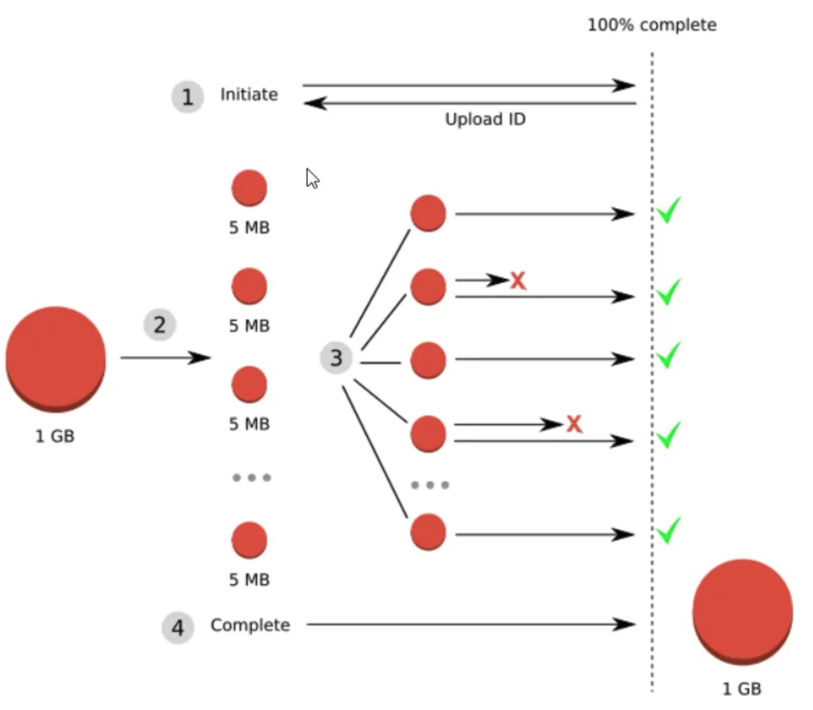

# [AWS] Comparison of File Upload Methods and AWS Multipart Upload Optimization
> date - 2025.03.25  
> keyworkd - aws, s3  
> S3에 파일 업로드시 사용할 수 있는 방법에 대해 정리  

<br>

## Stream 방식 사용
* 대용량 파일 전송시 client/server network 환경에 따라 속도 편차가 크기 때문에 속도에 대한 충분한 test 필요
* client에게 현황 제공이 불가하므로 client가 기다릴 수 있을 만큼의 적당한 파일 크기 제한 필요
* 중간에 에러 발생시 전체 파일을 다시 처음부터 진행해야하기 때문에 시간과 대역폭이 낭비될 수 있다

<br>

## MultipartFile 방식 사용
* [Spring MultipartFile](https://docs.spring.io/spring-framework/docs/current/javadoc-api/org/springframework/web/multipart/MultipartFile.html) 사용
* 임시 파일이 Disk에 저장
* 파일 전송 중 배포 or 장애 발생시 임시 파일의 garbage가 발생하여 관리 필요

<br>

## S3AsyncClient, S3TransferManager 사용
* AWS SDK의 S3AsyncClient, S3TransferManager를 이용한 stream, multipart 방식에서 다수의 동시 요청이 발생할 경우, long task로 인한 http request thread 소진의 이슈가 있다
  * resilience4j의 bulkhead 패턴을 활용하여 동시에 처리될 수 있는 작업의 최대 수를 제한
  * 별도의 thread pool을 사용(적절한 thread pool 설정 필요)
  * 파일 up/download 기능을 별도의 application으로 분리


<br>

## [AWS Multipart upload](https://docs.aws.amazon.com/AmazonS3/latest/userguide/mpuoverview.html)
<div align="center">
  
</div>

* 작은 part로 나누어 upload 후 모든 part가 upload되었다면 하나의 object로 합쳐서 저장
* 몇개의 part가 upload되었는지 확인하여 진행 사항 제공 가능
* application을 경유하지 않고 client가 S3에 직접 upload하게 구현하면 application의 부하를 고려하지 않아도 된다
* AWS high level API(e.g. TransferManager)를 사용하면 multipart upload가 자동으로 적용되며, low level API로 직접 분할 가능

<br>

### Scenario

#### 1. multipart upload 시작
initiate-upload(multipart upload 시작)를 요청하면 multipart upload에 대한 `Upload ID`를 응답
이후 part upload에서 `Upload ID`를 사용해야하므로 client가 잘 저장하고 있어야한다

#### 2. presigned URL 발급
* `Upload ID` + `PartNumber`로 upload를 위한 Presigned URL 발급
* part의 위치를 식별하기 위한 `PartNumber`는 1 ~ 10,000로 지정하며 sequence할 필요는 없다(e.g. 1,5, 14로 사용해도 무방)
* 동일한 `PartNumber`로 upload시 overwrite


#### 3. presigned URL part upload
* presigned URL에 PUT method로 binary를 upload
* part size는 5MB ~ 5GB 내에서 client가 결정
  * 마지막 part는 5MB 이하여도 가능
  * 최대 5GB까지 10,000개까지 upload 가능하므로 5TB까지 가능
* part upload response의 MD5 checksum인 eTag(Entity Tag)를 PartNumber와 매칭하여 저장하고 추후 upload 완료 요청에 사용

#### 4. multipart upload 완료
* Upload ID, PartNumber와 매칭되는 eTag를 사용하여 수행
* S3에서 PartNumber, eTag를 기준으로 object 조립하며 큰 object는 시간이 걸릴 수 있다
* upload를 완료하지 않으면 bucket에 object가 생성되지 않는다
* 1개 이상의 part가 upload되었다면 완료 or 취소해야 upload된 part에 대해 storage 비용이 청구되지 않는다
* upload 중 오류 발생시 multipart upload를 취소해야한다


<br>

## AWS CRT 기반 S3 client 사용
* AWS CRT(Common Runtime) 기반 S3 client는 S3 async client로 [multipart upload](https://docs.aws.amazon.com/AmazonS3/latest/userguide/mpuoverview.html)와 [Byte-Range Fetches](https://docs.aws.amazon.com/whitepapers/latest/s3-optimizing-performance-best-practices/use-byte-range-fetches.html)를 자동으로 사용하여 향상된 성능과 안정성을 바탕으로 Amazon S3와 object를 주고 받는다
* 전송을 처음부터 다시 실행하지 않고, 파일 전송의 실패한 part를 다시 시도하여 network failure에 대한 전송 reliability 개선
* connection pooling, DNS load balancing으로 throughput 개선
```java
implementation(platform("software.amazon.awssdk:bom:${awsSdkVersion}"))  // bom으로 AWS SDK version 관리
implementation("software.amazon.awssdk:s3")
implementation("software.amazon.awssdk:s3-transfer-manager")
implementation("software.amazon.awssdk:aws-crt-client")  // aws-crt
```
```java
var s3AsyncClient = S3AsyncClient.crtBuilder()
                                 .credentialsProvider(DefaultCredentialsProvider.create())
                                 .region(Region.US_WEST_2)
                                 .targetThroughputInGbps(20.0)
                                 .minimumPartSizeInBytes(8 * MB)
                                 .build();      
```

<br>

## Conclusion
* 최대 20MB의 파일 전송 기능을 구현하면서 AWS Multipart upload로 구현한다면 over engineering
* 기술을 선택할 때 최고의 방식도 좋지만, 상황에 따라 타협적인 방식도 필요
  * 작은 파일 -> `Stream` or `MultipartFile`, 대용량 -> `AWS Multipart`

|                       | Stream    | MultipartFile   | AWS Multipart   | 
|:----------------------|:----------|:----------------|:----------------|
| file size limit       | X         | disk/memory에 의존 | 최대 5TB          |
| binary application 경유| O(buffer) | O(설정에 따라 발생)    | X               |
| 구현 복잡도              | 하         | 중               | 상               |
| 전송 과정 복잡도          | 하         | 중               | 상               |
| AWS S3 의존성           | 하         | 하               | 상               |
| 진행 상태 표시           | X         | X               | O               |
| CORS 설정 필요          | X         | X               | O               |
| 유지 보수               | X         | O(주기적인 임시파일 정리) | X(S3 Lifecycle) |


<br><br>

> #### Reference
> * [Use a performant S3 client: AWS CRT-based S3 client](https://docs.aws.amazon.com/sdk-for-java/latest/developer-guide/crt-based-s3-client.html)
> * [AWS S3 Multi-part Upload using AWS CLI in Windows Host machine](https://hrshshh9.medium.com/aws-s3-multi-part-upload-using-aws-cli-in-windows-host-machine-4981a48bc95b)
