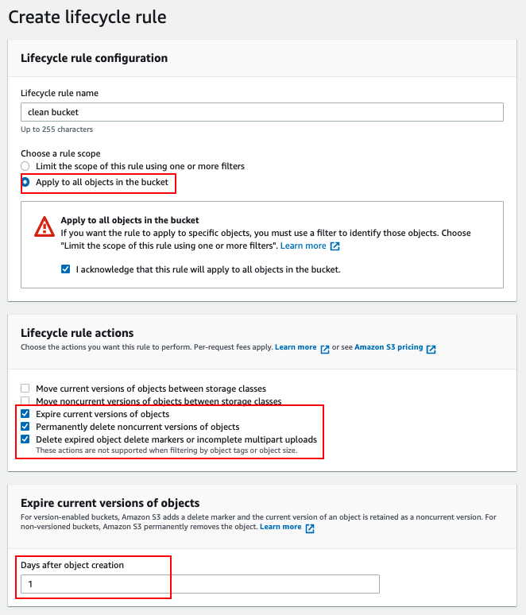
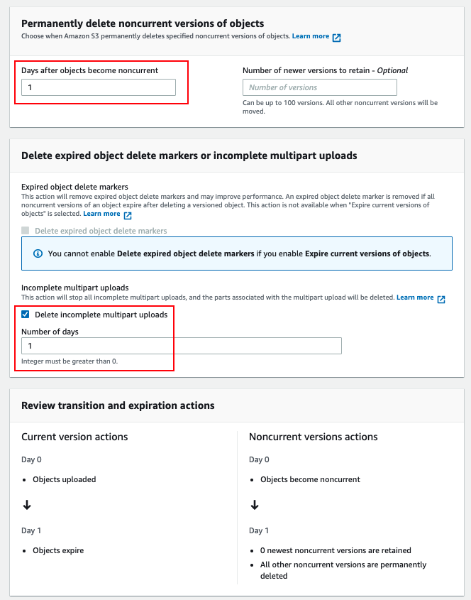

# [AWS] Remove large scale object in S3 bucket
> date - 2022.05.04  
> keyworkd - aws, s3  
> Amazon S3의 대규모 object를 저장하고 있는 bucket을 제거하기 위한 방법에 대해 정리  

 

## Issue. 100,000개 이상의 objcet가 있는 bucket을 제거해야한다
* Amazon S3 Web console에서 제거할 수 없다
* versioning을 사용하고 있는 경우 AWS CLI를 사용하여 제거할 수 없다
* versioning이 중지된 bucket에서 제거된 데이터는 복구할 수 없으니 확인 후 제거 필요

 

## Resolve
1. bucket에서 versioning 중지
2. 아래와 같은 설정으로 `Lifecyle Rules`을 생성
3. `Lifecyle Rules`은 UTC 00:00경에 실행되며 수일내에 empty bucket이 되면 bucket을 제거

  
  

* `This rule applies to all objects in the bucket` -> bucket 전체에 적용
* 현재 version objcet 제거를 위해 `Number of days after object creation`을 1로 `Expire current versions of objects`를 설정
* `Number of days after objects become previous versions`을 1로 `Permanently delete previous versions of objects`를 생성 -> 이전 version 제거
* `Number of days`를 1로 `Delete expired delete markers or incomplete multipart uploads` 생성

 

## Conclusion
* Amazon S3에서 bucket을 별도로 backup을 하지 않으면 versioning 활성화를 권장하나 bucket 제거시에는 비활성화 후 제거를 해야하므로 확인이 필요하다

  

> #### Reference
> * [전체 또는 루트 권한이 있는데도 Amazon S3 콘솔 또는 AWS CLI를 사용하여 S3 버킷을 삭제할 수 없는 이유는 무엇입니까?](https://aws.amazon.com/ko/premiumsupport/knowledge-center/delete-bucket-s3-console-cli/)
