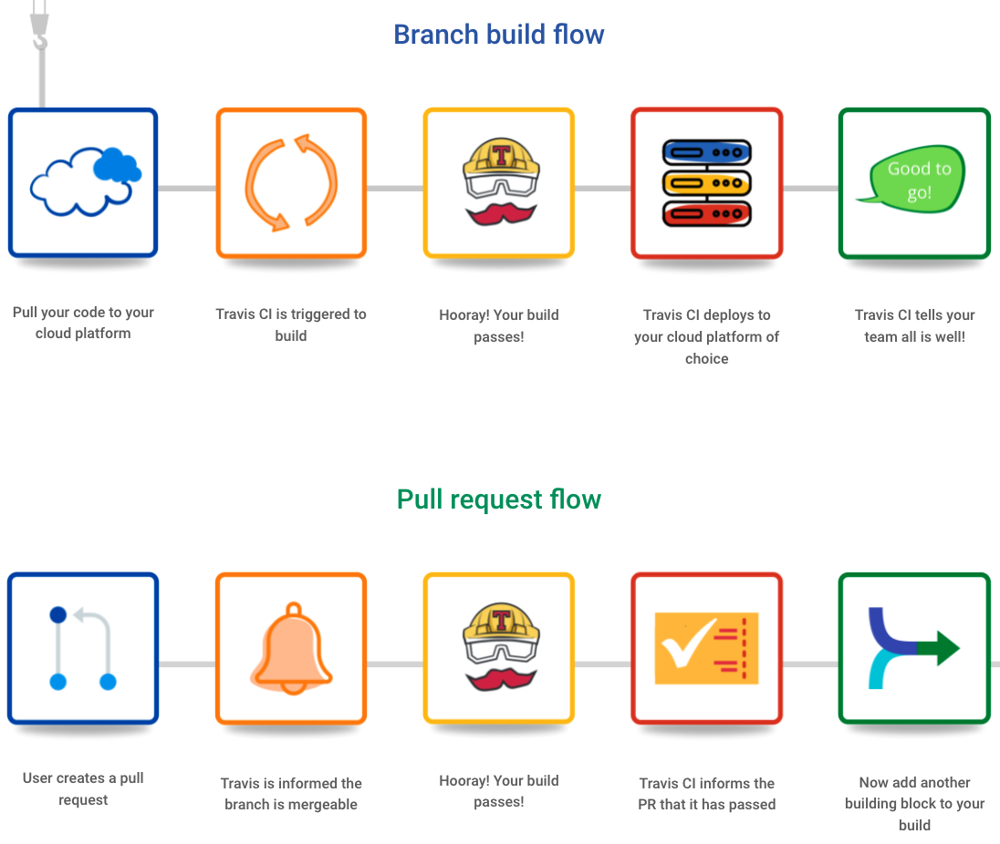

# [Travis CI] About Travis CI
> date - 2019.01.06  
> keyword - continuous integration  
> Travis CI를 셋팅하던 중 build job lifecycle 등 TravisCI에 대해 좀 더 알기 위해 정리

<br>

## Travis CI란?
* 몇 초만에 code를 test하는 CI tool
<div align="center">
  
</div>


<br>

## Travis CI의 job은 2가지 주요 부분으로 구성
* install
* script


<br>


## The job lifecycle
> git checkout 후 

### 1. install `apt addons`
* optional

### 2. install `cache components`
* optional

### 3. `before_install`
* dependency 구성을 위해 필요한 작업 수행
  * dependency management tool 설치 등

```yaml
...
env:
  - DEP_VERSION="0.5.0"

before_install:
  # Download the binary to bin folder in $GOPATH
  - curl -L -s https://github.com/golang/dep/releases/download/v${DEP_VERSION}/dep-linux-amd64 -o $GOPATH/bin/dep
  # Make the binary executable
  - chmod +x $GOPATH/bin/dep
...
```

### 4. `install`
* dependency package 구성
* 언어별로 dependency management tool이 다르기 때문에 script를 제공하면 `.travis.yml`을 재사용할 수 있다
```yaml
install:
  - ./install-dependencies.sh
```

### 5. `before_script`
* build 수행 전 필요한 작업 수행

### 6. `script`
* build script 실행
* 복잡한 build script는 파일로 만들어 실행하자

```yaml
# simple build script
script:
  - ./pre-commit
  - go test

# complex build script
script:
  - ./ci/test-with-cover.sh
```

### 7. `before_cache`
* optional
* 기존 cache 정리 작업 수행

### 8. `after_success` or `after_failure`
* build 결과에 대한 추가 작업 수행
* `$TRAVIS_TEST_RESULT`로 결과에 접근할 수 있다

### 9. `before_deploy`
* optional
* deploy 전 필요 작업 수행

### 10. `deploy`
* optional
* build 결과물을 Heroku, AWS, Docker Hub 등에 배포하기 위해 Continuous Deploy Provier를 사용해 정의
* build가 깨지면 skip한다
* Provider를 사용해 배포시 빌드 중 변경 내용을 삭제하지 않도록 아래 설정 추가
```yaml
deploy:
  skip_cleanup: true
```

### 11. `after_deploy`
* optional
* deploy 결과 노티 등 작업 수행

### 12. `after_script`


<br>

> before_deploy, after_deploy는 deploy provider 전후에 실행  
> 여러 deploy provider가 있는 경우 여러번 실행된다


<br>

## Breaking the Build
* job lifecycle의 처음 4단계 중 하나가 실패하면 build가 깨진다
* `before_install`, `install`, `before_script`
  * build가 error가 생겨 즉시 중지
* `script`
  * build failed로 masking
* `after_success`, `after_failure`, `after_script`, `after_deploy`는 build 결과에 영향을 주지 않지만, 시간 초과시에는 build failed로 masking


<br>

## Deployment

### Deploying to Multiple Providers
* 여러 provider를 사용하면 여러 곳에 deploy 가능
```yaml
deploy:
  - provider: cloudcontrol
    email: "YOUR CLOUDCONTROL EMAIL"
    password: "YOUR CLOUDCONTROL PASSWORD"
    deployment: "APP_NAME/DEP_NAME"
  - provider: heroku
    api_key: "YOUR HEROKU API KEY"
```

<br>

### Conditional Releases
* `on`을 사용하면 조건 지정 가능
```yaml
deploy:
  provider: s3
  access_key_id: "YOUR AWS ACCESS KEY"
  secret_access_key: "YOUR AWS SECRET KEY"
  bucket: "S3 Bucket"
  skip_cleanup: true
  on:  # 모든 조건 충족시 deploy
    repo: travis-ci/dpl  # 특정 repo에서
    branch: release  # 특정 branch에서
    condition: $MY_ENV = super_awesome  # condition 충족시
```

* staging/production branch일 때 deploy
```yaml
deploy:
  provider: script
  script: deploy.sh
  on:
    all_branchs: true
    condition: $TRAVIS_BRANCH =~ ^(staging|production)$
```


<br>

## Cache
* pip, npm, gradle 등 언어별 dependency를 쉽고 빠르게 설치하기 위해 cache 사용
* install은 빠르지만 download는 느린 large files는 cache에서 download하는 시간이 오래 걸리므로 caching의 이점이 없다
  * Android SDKs
  * Debian packages
  * JDK packages
  * Compiled binaries
  * Docker images
    * build 마다 새로운 VM을 provisioning하기 때문에 caching 되지 않는다
* 정의된 directory를 storage provider에 upload하므로 network bandwidth, DNS resolutions에 영향 받는다

<br>

### node.js
```yaml
language: node_js
node_js: '6'
cache: npm  # $HOME/.npm or node_modules
```

<br>

### gradle, maven
```yaml
cache:
  directories:
    - $HOME/.m2  # gradle, maven
    - node_modules  # NPM packages
```

<br>

### Python
```yaml
language: python
cache: pip  # $HOME/.cache/pip
```


<br>

## Architecture
<div align="center">
  
</div>
> 정확하진 않고 대략적으로 이해하는 용도로만 사용하자


<br><br>

> #### Reference
> * [Job Lifecycle - Travis CI Docs](https://docs.travis-ci.com/user/job-lifecycle/)
> * [Deployment - Travis CI Docs](https://docs.travis-ci.com/user/deployment)
> * [Travis architecture. #3501](https://github.com/travis-ci/travis-ci/issues/3501)
