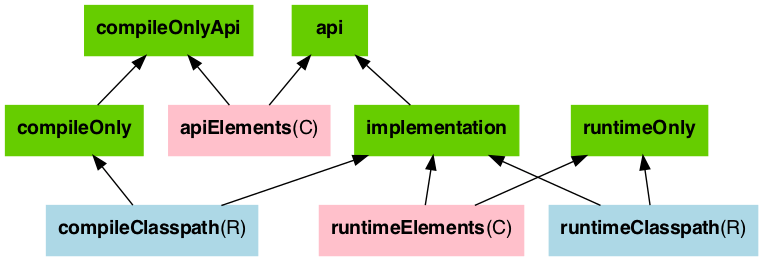
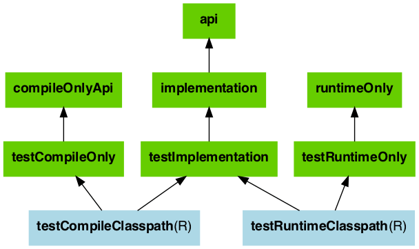

# [Gradle] Gradle Dependency Configuration
> date - 2022.11.23  
> keyword - gradle, dependencies  
> gradle에서 의존성 선언시 사용하는 keyword에 대해 정리  

<br>

## The Java Library plugin configurations
<div align="center">
  
  
</div>

* green - 의존성 선언시 사용
* pink - 구성 요소가 library를 compile하거나 실행할 때 사용
* blue - 구성 요소 자체에서 사용

<br>

### compileOnly
* compile 시점에 꼭 필요한 의존성을 지정
* compileOnly로 설정한 의존성은 compile 이후 실제 실행할 때는 불필요하여 빌드된 최종 결과물에 포함되지 않는다
```gradle
compileOnly 'org.projectlombok:lombok'
```

<br>

### runtimeOnly
* compile 시점에는 사용하지 않고, runtime에 사용할 의존성을 지정
* 실행 시점에 꼭 필요한 의존성으로 빌드된 최종 결과물에 포함된다
* 호환 가능한 의존성이 있으면 compile 이후에 compile 하지 않고, 다른 호환 가능한 의존성으로 교체 가능
```gradle
runtimeOnly 'org.mariadb.jdbc:mariadb-java-client:2.7.7'
```

<br>

### testRuntimeOnly
* test runtime에 필요한 의존성 지정
```gradle
testRuntimeOnly 'com.h2database:h2'
```

<br>

### implementation
* 내부적으로만 사용하고 의존성을 노출하지 않으며 의존성이 수정되는 경우 해당 의존성까지 rebuild
* A -> B -> C 일 때, C에서 A를 접근할 수 없고, A 수정시 B까지 rebuild
```gradle
implementation 'org.springframework.boot:spring-boot-starter-web'
```

<br>

### api
* `api`로 설정한 의존성에서 사용한 의존성을 상위의 의존성에게 공개된다
* compile time, runtime에 의존성을 노출하며 의존성이 수정되는 경우 모든 module rebuild
* A -> B -> C 일 때, C에서 A를 접근할 수 있고, A 수정시 C까지 rebuild
```gradle
api 'org.springframework.boot:spring-boot-starter-web'
```

<br><br>

> #### Reference
> * [The Java Library Plugin](https://docs.gradle.org/current/userguide/java_library_plugin.html)
