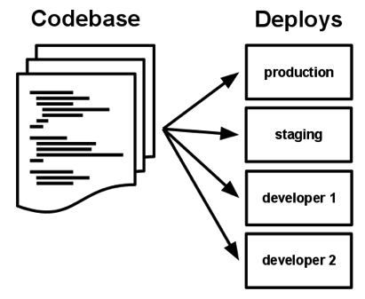
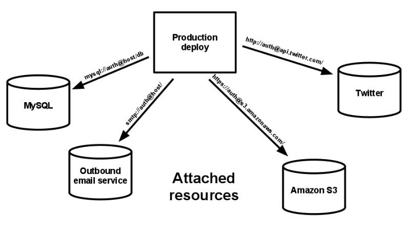
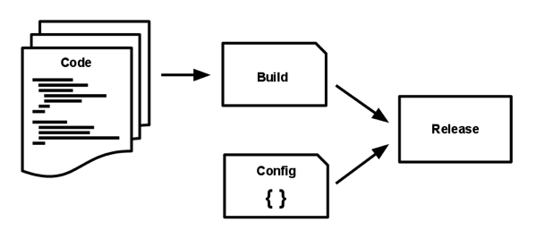
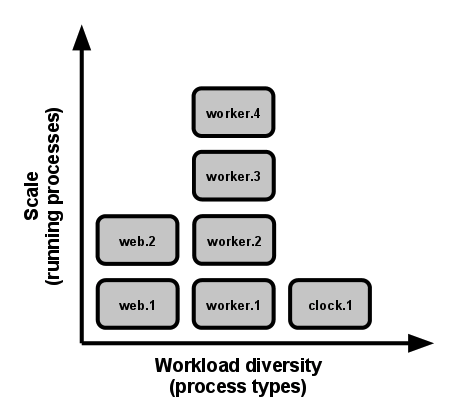

# [Cloud] Twelve Factor
> date - 2022.07.05  
> keyworkd - cloud, cloud native, saas, 12 factor  
> 12 Factor에 대해 정리

 

## Twelve Factor란?
* 다음의 특징을 가지는 SaaS(Software As A Service) application을 만들기 위한 방법론
  * 설정 자동화에 **declarative(선언적)** format을 사용해 프로젝트에 참여하는 신규 개발자의 시간, 비용을 최소화
  * **clean contract** - OS에 따라 달라지는 부분을 명확히하여 maximum portability를 제공
  * Cloud platform에 배포하는데 적합하고, 서버 및 시스템 관리가 필요 없다
  * development와 production의 차이를 최소화하고 continuous deployment를 통해 민첩성을 극대화
  * tool, architecture, development practices에 큰 변경 없이 **scale up** 가능
* 개발자, 인프라 엔지니어를 위한 best practice
* Cloud Native Application 구현을 위한 조건
* 일부 지침은 serverless application의 best practice와 부합

 

## Twelve Factor
1. [Codebase](#1-codebase) - One codebase tracked in revision control, many deploys
2. [Dependencies](#2-dependencies) - Explicitly declare and isolate dependencies
3. [Config](#3-config) - Store config in the environment
4. [Backing services](#4-backing-services) - Treat backing services as attached resources
5. [Build, release, run](#5-build-release-run) - Strictly separate build and run stages
6. [Processes](#6-processes) - Execute the app as one or more stateless processes
7. [Port binding](#7-port-binding) - Export services via port binding
8. [Concurrency](#8-concurrency) - Scale out via the process model
9. [Disposability](#9-disposability) - Maximize robustness with fast startup and graceful shutdown
10. [Dev/prod parity](#10-devprod-parity) - Keep development, staging, and production as similar as possible
11. [Logs](#11-logs) - Treat logs as event streams
12. [Admin processes](#12-admin-processes) - Run admin/management tasks as one-off processes

 

위의 Twelve Factor는 다음과 같이 분류해볼 수 있다  
* isolate & dependency management
  * Codebase
  * Dependencies
  * Config
* Deplyment Automation
  * Build, release, run
  * ev/prod parity
* Computing
  * Concurrency
  * Processes
  * Port binding
  * Disposability
* Application Support
  * Logs
  * Admin processes
  * Backing services

 

## 1. Codebase

  

버전 관리되는 하나의 codebase와 다양한 deploy
* Git 같은 VCS(Version Control System)을 사용하여 code의 변경을 추적
* code revision tracking database를 code repository/repo라고 부른다
* codebase와 app은 항상 1:1 관계
  * codebase가 여러개일 경우 distributed system이며 구성 요소인 app은 Twelve Factor를 따른다
  * 여러 app이 사용하는 공유 code는 library로 만들어 [dependency](#2-dependencies)를 관리
* app의 codebase는 1개지만 deploy는 여러개가 될 수 있다
  * e.g. development, staging, production

 

## 2. Dependencies
dependencies를 명시적으로 선언하고 격리
* 대부분의 프로그래밍 언어는 packaging system 제공
  * Ruby - [RubyGems](https://rubygems.org/)
  * Python - [pip](https://pip.pypa.io)
* library는 packaging system을 통해 시스템 전체(site packages) 또는 app이 포함된 directory(vendoring, bundling)에 설치
* 암묵적으로 존재하는 것에 dependency를 가지지 않는다
  * dependency declaration manifest를 이용해 명시적으로 선언하여 사용
  * dependency isolation tool을 사용해 암묵적 dependency 배제
  * Ruby
    * [Bundler](https://bundler.io/) = `Gemfile`(dependency declaration) + `bundle exec`(dependency isolation)
  * Python
    * [Pip](https://pip.pypa.io)(dependency declaration) + [Virtualenv](https://virtualenv.pypa.io)(dependency isolation)
  * **dependency declaration과 dependency isolation을 항상 같이 사용**
* `curl` 같은 tool은 대부분의 시스템에 존재하지만, 모든 시스템에 존재하는 것이 보장되지 않는다
  * application에 필요한 tool은 application에 통합

 

## 3. Config
환경에 설정 저장
* application의 설정이란? 
  * deploy(staging, production 등)마다 달라질 수 있는 모든 것
  * e.g. DB 등 backend service의 접근 정보, Amazon S3 등의 external service 접근 정보
* 설정은 deploy마다 다르지만, code는 같다
* 설정을 환경 변수에 저장
  * 환경 변수는 OS에 의존하지 않는 표준

 

> #### 환경 변수 & security
> * 환경 변수는 보안이 떨어지므로 configuration을 관리하는 별도의 서비스를 사용
> * AWS System Manager Parameter Store, AWS Secrets Manager, Spring Cloud Config Server, HashiCorp Vault

 

## 4. Backing services

  

backend service를 연결된 리소스로 취급
* backend service
  * DB - MySQL, CouchDB, ...
  * Message Queue - RabbitMQ, ...
  * Cache - Redis, Memcached, ...
  * SMTP service - Postfix, ...
  * APM - New Relic, ...
  * Storage - Amazon S3, ...
  * ...
* backend service를 동일한 API로 접근하고, 설정 수정만으로 local service에서 3rd party service로 전환이 가능해야한다
  * e.g. MySQL -> Amazon RDS

 

## 5. Build, release, run

  

build, release, run 단계를 엄격하게 분리
* codebase는 `build -> release -> run` 단계를 통해 배포로 변환
* build stage
  * build라는 실행 가능한 bundle로 변환시키는 단계
  * dependency + binary + assets
  * code가 배포될 때마다 개발자에 의해 시작
* release stage
  * build stage에서 생성된 build와 deploy의 config를 결합
  * release = build + config = 바로 실행 가능한 형태
* run stage(runtime)
  * application을 실행
  * server restarting, process restart에 의해 시작
    * 개발자가 항상 대응할 수 없으므로 변화가 최대한 적어야한다
  * runtime에서 코드 변경 불가
    * runtime에서 변경된 내용을 build stage로 전달할 방법이 없기 때문
* 모든 release는 timestamp, [Semantic Versioning 2.0.0](https://semver.org/) 같은 유니크한 release id를 사용

 

## 6. Processes
application을 하나 이상의 stateless process로 실행

* 실행 환경에서 application은 하나 이상의 process로 실행된다
  * `python my_script.py` 같은 stand-alone script가 가장 간단한 case
* process는 stateless이며, `Shared-nothing architecture`로 아무 것도 공유하지 않는다
* 유지되야하는 모든 데이터는 DB 같은 backend service에 저장
* 짧은 단일 트랜잭션 내에서 캐시로 process의 memory/file system 사용 가능
  * memory/file system의 데이터는 언제든 유실될 수 있다
* asset packaging은 build stage에서 수행
* `Sticky Session` 대신 `Redis`, `Memcached`를 session store로 사용

 

## 7. Port binding
port binding을 사용해 service 공개
* application code에서 web server library를 사용하여 구현하고, 실행 환경의 port에 binding
  * Java application - tomcat, jetty, ...
  * Python application - django, flask, ...
* 하나의 application이 다른 application을 위한 backend service가 될 수 있다

 

## 8. Concurrency

  

process model을 사용한 scale out

* 모든 컴퓨터 프로그램은 하나 이상의 process로 표현
* JVM은 시작될 때 시스템 리소스(CPU, memory)를 예약하는 부모 process를 제공, 내부 thread를 통해 concurrency 관리
* application의 task를 적절한 type의 process에 할당함으로써 다양한 처리를 할 수 있도록 설계
  * HTTP request는 web process가 처리
  * 시간이 오래 걸리는 background task는 worker process가 처리
* process는 stateless하고 아무것도 공유하지 않으므로 scale out하는 것만으로도 간편하게 concurrency를 높일 수 있다

 

## 9. Disposability
fast startup, graceful shutdown을 통한 안정성 극대화

* process는 `disposability`
  * 바로 시작/종료 가능
* startup time을 최소화하도록 노력해야한다
  * 짧은 startup time은 release와 scaling의 속도를 높인다
* `SIGTERM` signal 수신시 graceful shutdown
  * web process
    * 신규 request 수신을 중지하고, 현재 처리 중인 request가 완료되길 기다린 뒤 종료
  * worker process
    * 현재 처리 중인 작업 중지하고, queue로 넣는다
    * 모든 작업은 재입력 가능 -> 즉, `idempotent`하게 구현

 

## 10. Dev/prod parity
development, staging, production을 최대한 비슷하게 유지

* 시간, 담당자, tool의 차이를 최소화함으로써 각 환경을 비슷하게 유지하여 `Continuous Deployment` 가능하게 디자인
  * 시간 - 개발자가 작성한 code는 몇분 ~ 시간내에 배포
  * 담당자 - code를 작성한 개발자가 모니터링에 깊게 관여
  * tool - development, staging, production을 최대한 비슷하게 유지
* 모든 환경에서 동일한 backend service 사용
  * Python의 Celery 같은 library가 Redis, RabbitMQ 같은 backend service를 추상화해준다고해도, backend service 사이의 약간의 불일치가 production에서 오류를 일으킬 수 있기 때문
  * virtual environment(Docker, Vagrant) + declarative provisioning tools(Chef, Puppet) 사용해 production과 유사한 local 환경을 구성할 수 있다

 

## 11. Logs
log를 event stream으로 처리

* log
  * 실행 중인 application의 동작을 확인할 수 있는 방법
  * 시간 순서로 정렬된 event stream
* application은 output stream의 전달/저장에 관여하지 않는다
* event stream을 buffering 없이 `stdout`에 출력
  * local - 개발자는 각자 원하는 터미널에서 이 stream을 볼 수 있다
  * production - `Fluentd` 같은 것을 이용해 모든 stream을 하나 이상의 최종 목적지(Splunk, Hadoop/Hive)로 전달
* 최종 목적지에서 모아진 event stream은 장시간 보관 가능하고, 다양하게 활용할 수 있다
  * 과거의 특정 event 찾기
  * request/min 같은 트렌드를 그래프로 표현
  * error count/min이 임계 값을 넘는 경우 알람 발생

 

## 12. Admin processes
admin/management task는 일회성 process로 실행

* DB migration 같은 일회성 관리나 유지 보수 작업은 일회성 process로 실행

  

> #### Reference
> * [The Twelve-Factor App](https://12factor.net/ko/)
