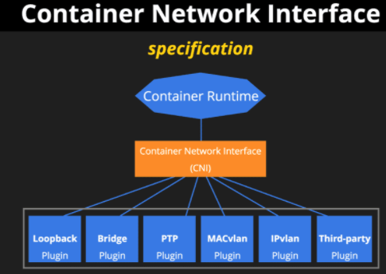

# [Container] CNI(Container Network Interface)
> date - 2021.12.05  
> keyworkd - container, cni, kubernetes  
> Kubernetes 사용시 필수 개념인 CNI에 대해 정리  

<br>

## [CNI(Container Network Interface)](https://github.com/containernetworking/cni)
* **Automated network provisioning in containerized environments**
* **container networking을 제어**할 수 있는 plugin의 표준
  * **container들의 network 연결**과 **container 제거시 할당된 자원을 제거**가 주요 역할
  * network layer plugins와 container runtime 사이의 commcon interface 제공
  * overlay network 구성하고 L3 등과 통합하는데 적합
* CNCF incubating project
* **network interface를 구성하기 위해 필요한 plugin spec, library로 구성**
* Kubernetes 뿐만 아니라 Amazon ECS 등에서도 사용
* CNI plugin 선정 기준 중 하나는 network 통신 방식
* 여러 CNI plugin을 chaning하여 사용할 수 있다


<br>

## CNI main components
* CNI Specification
  * container network 설정을 위한 runtime과 network plugins 간의 API 정의
* Plugins
  * 다양한 use-case에 대한 network 설정 제공
  * CNI spec을 준수하는 plugin의 reference 제공
* Library
  * runtime이 CNI를 쉽게 사용할 수 있는 CNI spec의 Go implementation 제공

CNI specification과 library는 container에서 network interface를 구성하기 위한 plugin을 작성하기 위해 존재  
plugin은 container network interface의 추가/제거 지원  

<br>

<div align="center">
  
</div>

* Main - interface-creating
  * Loopback, Bridge, PTP, MACvlan, IPvlan, Third-party
* IPAM - IP address allocation
  * dhcp, host-local
* Meta - other plugins
  * flannel, tuning, portmap


<br>

## CNI 기능
* kernel routing
* dynamic routing
* Pod interface 생성, IP, subnet, routing table 설정
* proxy ARP


<br>

## CNI 동작
container runtime에 CNI configuration으로 container network를 구성
<div align="center">
  
</div>

* configuration
```json
{
	"cniVersion": "0.2.0",
	"name": "mynet",
	"type": "bridge",
	"bridge": "cni0",
	"isGateway": true,
	"ipMasq": true,
	"ipam": {
		"type": "host-local",
		"subnet": "10.22.0.0/16",
		"routes": [
			{ "dst": "0.0.0.0/0" }
		]
	}
}
```


<br>

## CNI 종류
* [Calico](https://github.com/projectcalico/calico)
  * standard L3 approach
  * `iptables` 사용
    * 속도가 중요하다면 IPVS 기반의 CNI 선택
* [Flannel](https://github.com/flannel-io/flannel)
  * L3 network fabric approach
  * Kubernetes API를 직접 사용하여 VXLAN network 설정
* [Canal](https://github.com/projectcalico/canal)
  * Calico(network policy) + flannel(networking)를 위한 CNI
  * network policy를 포함한 Calico와 같은 CNI plugin을 활용해 VXLAN network 설정
* [amazon-vpc-cni-k8s](https://github.com/aws/amazon-vpc-cni-k8s)
* [Weave Net](https://github.com/weaveworks/weave)
* [kubenet](https://kubernetes.io/docs/concepts/extend-kubernetes/compute-storage-net/network-plugins/)
  * Kubernetes default networking provider
  * 다양한 cloud provider와 함께 동작하는 network plugin
  * 기능이 별로 없다
    * AWS에서 EC2 50개로 제한
    * network topology가 여러 routing table을 사용하기 때문에 VPC에서 cluster 설정 불가
    * BGP, egress control, mesh network를 위해서는 다른 CNI 필요


<br><br>

> #### Reference
> * [containernetworking/cni - GitHub](https://github.com/containernetworking/cni)
> * [Container Network Interface, CNI](https://medium.com/@lhs6395/container-network-interface-e36b199be83f)
> * [Network Plugins - Kubernetes Docs](https://kubernetes.io/docs/concepts/extend-kubernetes/compute-storage-net/network-plugins/)
> * [CNCF hosts Container Networking Interface (CNI)](https://www.cncf.io/blog/2017/05/23/cncf-hosts-container-networking-interface-cni/)

<br>

> #### Further reading
> * [Introduction to CNI](https://www.youtube.com/watch?v=YjjrQiJOyME)
> * [CNI deep dive](https://www.youtube.com/watch?v=zChkx-AB5Xc)
> * [Container Network Interface: Network Plugins for Kubernetes and beyond](https://www.slideshare.net/kubecon/container-network-interface-network-plugins-for-kubernetes-and-beyond)
