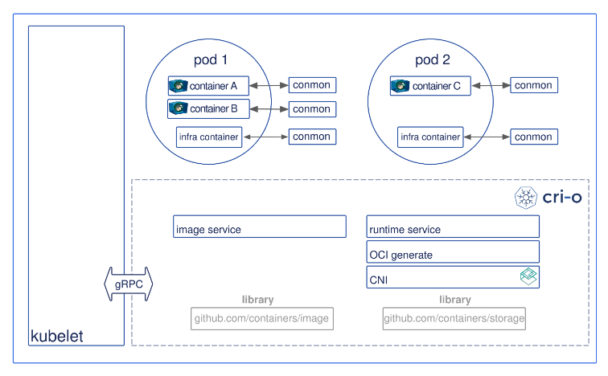
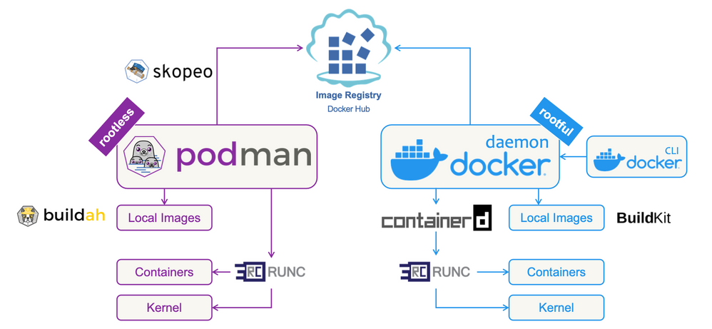

# [Container] CRI-O
> date - 2023.10.14  
> keyworkd - container, oci, cri  
> cri-o에 대해 정리    

<br>

## cri-o

### Docker의 문제
* 무거운 docker deamon
  * image build, management, container 실행 등 많은 기능을 담당
  * 모든 container를 child process로 소유하므로 docker daemon이 SPOF(Single point of failure)
    * docker daemon(parent process)에 장애 발생시 container(child process)에 영향
* 보안에 취약할 수 있는 root 권한 필요

<br>

### [cri-o](https://cri-o.io)
<div align="center">
  
</div>

* Kubernetes를 위한 lightweight container runtime
* OCI(Open Container Initiative) container runtime으로 Docker를 대체하는 목적으로 개발
* container 실행을 목적으로 경량화
* container 생성, iamge build 등 Docker의 기능을 `Buildah`, `Podman`, `Skopeo`가 역할별로 나눠서 제공
* `Buildah`, `Podman`, `Skopeo`는 docker의 문제를 개선
  * fork-exec 모델 사용
  * user namespace를 이용해 container를 실행하여 SPOF, root 권한 개선


<br>

## [Buildah](https://buildah.io)
* **container image build tool**
* CRI-O에서 image build시 docker dependency 제거를 위해 개발
* Dockerfile 없이 script 언어로 image build를 목표
  * Containerfile, Dockerfile 사용 가능


<br>

## [Podman](https://podman.io)
<div align="center">
  
</div>

* **container image 관리 tool**
* Docker CLI command를 동일하게 수행 가능
* OCI image 기반으로 생성한 container를 관리하는 tool
* Docker와 달리 daemon을 실행하지 않아 실행한 유저의 권한을 가진다
* [Podman Desktop](https://podman-desktop.io) 사용 가능
* Podify와 Kubify로 container를 Pod로 변환
* macOS에서 virtualization을 위해 [Rancher Desktop](https://docs.rancherdesktop.io/ui/preferences/virtual-machine/emulation) 같이 [QEMU](https://www.qemu.org) 사용


<br>

### Install
* macOS
```sh
$ brew install podman podman-compose podman-desktop
$ podman machine init
$ podman machine start

$ cat <<EOF >> ~/.zshrc
alias docker=podman
alias docker-compose=podman-compose
EOF

$ source ~/.zshrc
```


<br>

## [Skopeo](https://github.com/containers/skopeo)
* **container image registry 관리 tool**
* image registry에서 search, push, pull 등 다양한 작업을 수행하는 non-root, daemonless CLI

<br>

### Install
* macOS
```sh
$ brew install skopeo
```

* Container image
```sh
$ podman run docker://quay.io/skopeo/stable:latest copy --help

$ docker run quay.io/skopeo/stable:latest copy --help
```

<br>

### Copying images
* 다양한 storage mechanisms에서 image를 복사
* Container registries
  * Quay, Docker Hub...
* Container Storage backends
  * [github.com/containers/storage](https://github.com/containers/storage)
  * Docker daemon storag
* Local directories
* Local OCI-layout directories

```sh
$ skopeo copy docker://quay.io/buildah/stable docker://registry.internal.company.com/buildah

$ skopeo copy oci:busybox_ocilayout:latest dir:existingemptydirectory
```

<br>

### Deleting images
```sh
$ skopeo delete docker://localhost:5000/<image>:<tag>
```

<br>

### Syncing registries
* air-gapped deployments를 위해 external image repository를 internal registry에 동기화
```sh
$ skopeo sync --src docker --dest dir registry.example.com/busybox /media/usb
```

<br>

### Authenticating to a registry
```sh
$ skopeo login --username USER myregistrydomain.com:5000

$ skopeo inspect docker://myregistrydomain.com:5000/busybox

$ skopeo logout myregistrydomain.com:5000
```
```sh
$ skopeo inspect --creds=testuser:testpassword docker://myregistrydomain.com:5000/busybox
```

<br><br>

> #### Reference
> * [cri-o](https://cri-o.io)
> * [Buildah](https://buildah.io)
> * [Podman](https://podman.io)
> * [Skopeo](https://github.com/containers/skopeo)
> * [podman-compose](https://github.com/containers/podman-compose)