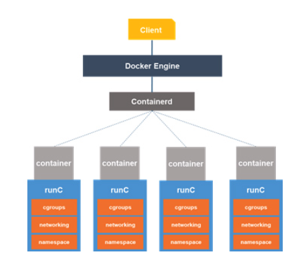
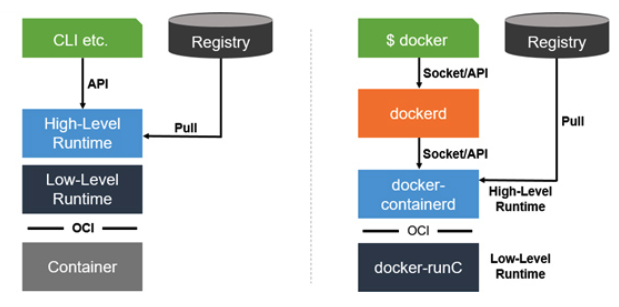

# [Container] CRI(Container Runtime Interface) & OCI(Open Container Initiative)
> date - 2021.12.03  
> keyworkd - container, cri, oci, kubernetes  
> CRI(Container Runtime Interface)와 OCI(Open Container Initiative)에 대해 정리  

<br>

## CRI(Container Runtime Interface)란?
```
+---------+     +----------------+     +------------------+ 
| kubelet | --> | docker runtime | --> | docker container |
+---------+     +----------------+     +------------------+
```
* Docker 기반의 Kubernetes는 위처럼 docker runtime을 통해 container를 제어(생성, 삭제 등의 lifecycle 관리)
* `kubelet`에서 Docker 이외의 container runtime(e.g. rkt) support를 위해서는 수정이 불가피

```
                +-------------+     +----------------+
+---------+     | Docker shim | --> | Docker runtime |
|         | --> +-------------+     +----------------+
| kubelet |
|         | --> +-------------+     +----------------+
+---------+     |   rktlet    | --> |       rkt      |
                +-------------+     +----------------+
```
* 새로운 container runtime이 추가될 때 마다 `kubelet`을 수정할 수는 없어서 `kubelet`과 container runtime 사이의 interface의 표준화 spec으로 CRI(Container Runtime Interface)가 등장
  * protocol buffers, gRPC API, libraries로 구성
  * 신규 container runtime은 CRI spec에 따라 구현되면 `kubelet`에서 사용 가능
    * `kubelet`은 gRPC framework를 사용하여 unix socket으로 container runtime(or CRI shim)과 통신
  * Docker에서는 `Docker shim(CRI)`, rkt에서는 `rktlet(CRI)`를 구현
* container runtime 마다 CRI 구현체가 필요하게되어 container runtime 표준화를 위해 OCI spec이 등장했고, OCI spec의 CRI 구현체인 `CRI-O(Container Runtime Interface - Open Container Initiative)` 등장
  * container runtime이 OCI spec을 준수하면 `kubelet`은 `CRI-O`를 통해 container 제어 가능


<br>

## Container runtime의 이해

### container 실행 단계
```
+----------------+   decompress   +--------+  execution   +-----------+ 
| Image Download | -------------> | bundle | -----------> | container |
+----------------+                +--------+              +-----------+
```
* container 실행을 위해서 image download, image를 bundle로 압축 해제 등의 과정 필요
* 위 과정을 위해서 Low/High-level container runtime 필요

<br>

### Low-level container runtume
* container를 실제로 실행하는 runtime으로 linux namespace, cgroup을 사용하여 구현
  * container image 관련 API는 high-level container runtime에서 제공
* `runC`는 OCI spec을 준수하는 대표적인 low-level container runtime

<div align="center">
  
</div>

<br>

### High-level container runtume
* image 전송(up/download), 압축 풀기 등을 실행하는 runtime
* low-level container runtime 위에서 동작
* Docker는 high-level container runtime으로 `docker-containerd` 사용

<div align="center">
  
</div>


<br>

## OCI(Open Container Initiative)?
* application portability 관점에서 container formats and runtime에 대하여 docker image format이 `de facto standard`였지만 더욱 공식적이고, open된 표준 필요하여 OCI(Open Container Initiative) 등장
  * 특정 client, orchestration stack 같은 상위 계층의 구조에 종속되지 않은 container
  * 특정 vendor, project에 종속되지 않은 container
  * 다양한 OS, HW, Cloud 등에 호환성이 있는 container

<br>

### OCI(Open Container Initiative)란?
* container formats and runtime에 대한 open governance structure
* 현재 runtime-spec, image-spec 2가지 specification 포함
* runtime-spec은 disk에 압축이 풀린 filesystem bundle을 실행하는 방법을 설명
  * OCI image 다운로드 -> OCI runtime bundle로 압축 해제 -> OCI runtime에 의해 실행
* docker, rkt 같은 container engine에서 추가 인수 없이 이미지를 실행
```sh
$ docker run example.com/org/app:v1.0.0
$ rkt run example.com/org/app,version=v1.0.0
```
* 위와 같이 동일한 UX를 지원하기 위해 OCI image format에는 target platform에서 실행하기 위한 정보(e.g. command, arguments, environment variables 등) 포함
* OCI image를 생성하고 [image manifest](https://github.com/opencontainers/image-spec/blob/main/manifest.md), [filesystem(layer) serialization](https://github.com/opencontainers/image-spec/blob/main/layer.md), [image configuration](https://github.com/opencontainers/image-spec/blob/main/config.md) output 방법을 정의

<br>

### OCI standard container
| 원칙 | 내용 |
|:--|:--|
| Standard Operations | standard container tool로 container create/start/stop 가능 <br>standard filesystem tool로 container의 snapshot, restore 가능 <br>standard network tool로 container upload, download 가능 |
| Content-agnostic | container 내부의 application에 상관 없이 표준 동작이 동일하게 동작 |
| Infrastructure-agnostic | OCI support infrastructure라면 container 실행이 가능 |
| Designed for Automation | container 내용과 infrastructure에 상관없이 동일한 표준 동작을 지원하기 때문에 자동화 용이 |
| Industrygrade delivery | 기업 규모에 상관 없이 산업 수준의 배포가 가능해야 함 |

<br>

### OCI 구성 요소
| 구성 요소 | 내용 |
|:--|:--|
| [image-spec](https://github.com/opencontainers/image-spec) | image format spec |
| [image-tools](https://github.com/opencontainers/image-tools) | OCI image-image spec에 따라 동작하는 tools |
| [runtime-spec](https://github.com/opencontainers/runtime-spec) | runtime, 설정 방법, lifecycle spec |
| [runtime-tools](https://github.com/opencontainers/runtime-tools) | OCI runtime-spec에 따라 동작하는 tools |
| [runc](https://github.com/opencontainers/runc) | OCI spec에 따라 container를 생성하고 실행하기 위한 CLI tool |
| [go-digest](https://github.com/opencontainers/go-digest) | container ecosystem에서 사용할 common digest package |
| [selinux](https://github.com/opencontainers/selinux) | container ecosystem에서 사용할 common SELinux package  |


<br><br>

> #### Reference
> * [Introducing Container Runtime Interface (CRI) in Kubernetes](https://kubernetes.io/blog/2016/12/container-runtime-interface-cri-in-kubernetes/)
> * [Open Container Initiative](https://opencontainers.org/)
> * [opencontainers - GitHub](https://github.com/opencontainers)
> * [컨테이너 기술에 대한 표준화 – OCI (OPEN CONTAINER INITIATIVE)](http://www.opennaru.com/kubernetes/open-container-initiative/)
