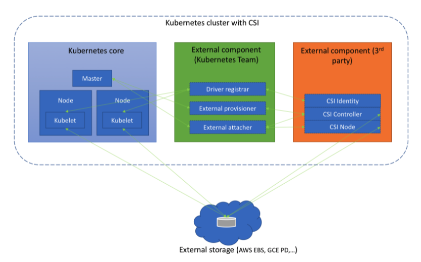

# [Container] CSI(Container Storage Interface)
> date - 2021.12.06  
> keyworkd - container, csi, kubernetes  
> Container Storage Interface에 대해 정리  

<br>

## CSI(Container Storage Interface)란?
* Kubernetes에서 container에 storage를 제공하는 open standard API
* CSI 이전에 Volume은 Kubernetes binary에 포함된 vendor별 storage driver에서 관리
  * Kubernetes에 포함되어 있지 않으면 사용 불가
  * Kubernetes release 주기를 따라가므로 다양한 storage 지원이 어려움
* CSI driver를 사용하면 Kubernetes에서 기본적으로 지원하지 않는 storage로 사용 가능
  * 새로운 storage를 위해 Kubernetes code를 수정하지 않아도 된다
  * snapshot, resize 등 storage에서 지원하는 최신 기능도 사용 가능
* storage backend에 대하여 여러 CSI driver 실행 가능


<br>

## Architecture
* Container Orchestration system과 CSI plugin은 `gRPC` 통신
* CSI driver는 아래의 sidecar container와 함꼐 cluster에 배포되어야 한다

<div align="center">
  
</div>

* [external-attacher](https://github.com/kubernetes-csi/external-attacher)
  * `VolumeAttachment` object watch
  * CSI endpoint에 대해 `ControllerPublish`, `ControllerUnpublish` 실행
* [external-provisioner](https://github.com/kubernetes-csi/external-provisioner)
  * `PersistentVolumeClaim` object watch
  * CSI endpoint에 대해`CreateVolume`, `DeleteVolume` 실행
* [node-driver-register](https://github.com/kubernetes-csi/node-driver-registrar)
  * [kubelet device plugin mechanism](https://kubernetes.io/docs/concepts/extend-kubernetes/compute-storage-net/device-plugins/#device-plugin-registration)을 사용하여 kubelet에 CSI driver를 등록
* [cluster-dirver-register](https://github.com/kubernetes-csi/cluster-driver-registrar)
  * `CSIDriver` object를 생성하여 Kubernetes cluster에 CSI driver를 등록
* [external-snapshotter](https://github.com/kubernetes-csi/external-snapshotter)
  * `VolumeSnapshot` CRD object watch
  * CSI endpoint에 대해 `CreateSnapshot`, `DeleteSnapshot` 실행
* [livenessprobe](https://github.com/kubernetes-csi/livenessprobe)
  * Kubernetes LivenessProbe mechanism 활성화를 위해 CSI plugin Pod에 포함될 수 있다


<br>

## Volume Lifecycle
* Dynamic provisioning
```
   CreateVolume +------------+ DeleteVolume
 +------------->|  CREATED   +--------------+
 |              +---+----^---+              |
 |       Controller |    | Controller       v
+++         Publish |    | Unpublish       +++
|X|          Volume |    | Volume          | |
+-+             +---v----+---+             +-+
                | NODE_READY |
                +---+----^---+
               Node |    | Node
            Publish |    | Unpublish
             Volume |    | Volume
                +---v----+---+
                | PUBLISHED  |
                +------------+
```

* pre-provisioned volume
```
    Controller                  Controller
       Publish                  Unpublish
        Volume  +------------+  Volume
 +------------->+ NODE_READY +--------------+
 |              +---+----^---+              |
 |             Node |    | Node             v
+++         Publish |    | Unpublish       +++
|X| <-+      Volume |    | Volume          | |
+++   |         +---v----+---+             +-+
 |    |         | PUBLISHED  |
 |    |         +------------+
 +----+
   Validate
   Volume
   Capabilities
```


<br>

## CSI driver 종류
* [aws-ebs-csi-driver](https://github.com/kubernetes-sigs/aws-ebs-csi-driver)
* [aws-efs-csi-driver](https://github.com/kubernetes-sigs/aws-efs-csi-driver)
* ...
> [Dirvers - Kubernetes CSI Docs](https://kubernetes-csi.github.io/docs/drivers.html)에서 확인할 수 있다


<br>

## Usage
* CSI storage plugin이 설치되어 있다면 Kubernetes storage API objects를 통해 CSI volume 사용
  * PersistentVolumeClaims
  * PersistentVolumes
  * StorageClasses

<br>

### Dynamic Provisioning
* `StorageClass` 사용
```yaml
kind: StorageClass
apiVersion: storage.k8s.io/v1
metadata:
  name: fast-storage
provisioner: csi-driver.example.com
parameters:
  type: pd-ssd
  csi.storage.k8s.io/provisioner-secret-name: my-secret
  csi.storage.k8s.io/provisioner-secret-namespace: my-namespace
---
apiVersion: v1
kind: PersistentVolumeClaim
metadata:
  name: my-request-for-storage
spec:
  accessModes:
  - ReadWriteOnce
  resources:
    requests:
      storage: 5Gi
  storageClassName: fast-storage
```


<br><br>

> #### Reference
> * [CSI(Container Storage Interface)](https://github.com/container-storage-interface/spec)
> * [Container Storage Interface(CSI) for Kubernetes GA](https://kubernetes.io/blog/2019/01/15/container-storage-interface-ga/)
> * [Kubernetes CSI Docs](https://kubernetes-csi.github.io/docs/)
> * [Understanding the Container Storage Interface(CSI)](https://medium.com/google-cloud/understanding-the-container-storage-interface-csi-ddbeb966a3b)
