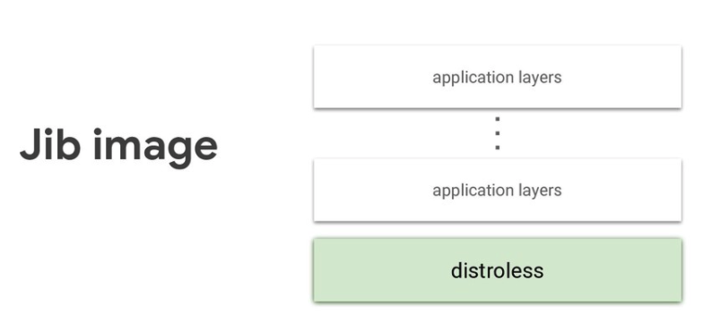
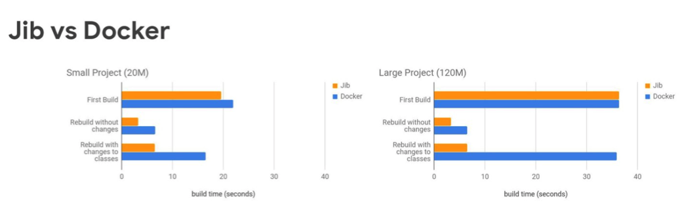
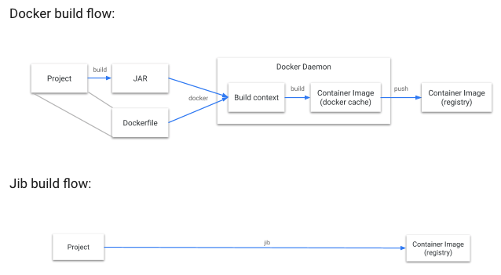

# [Container] Jib - Build container images for your Java applications
> date - 2021.11.19  
> keyworkd - container, java, spring boot  
> java application의  containerize를 간편하게 해주는 jib에 대해 정리  
> source code는 [여기](https://github.com/opklnm102/hello-jib)에 있다

<br>

## Containerize 과정
1. docker daemon(root permission) 실행
2. jar bulid & copy 등 작업이 포함된 Dockerfile 작성
3. image 최적화를 위해 .dockerignore 작성 등의 작업을 한다
4. cache를 적극적으로 활용하기 위해 dependencies layering
5. image를 registry로 push

> 단순하지만 Java 개발자가 Container 전문가도 아니고 다 챙겨야 하나..?  
> 그래서 나온 것이 jib  

<br>

## Jib란?
* A `compiler` for containers
* **Docker best-pratices에 대한 지식이 없이, Docker daemon 없이** Java application을 위한 Docker & [OCI](https://github.com/opencontainers/image-spec) image를 build 해준다
* Java application에 최적화된 방법으로 containerizing
  * 직접 dependency 분리 등의 작업을 하지 않아도 된다
* plugin으로 쉽게 사용할 수 있다
  * Maven - See the jib-maven-plugin [Quickstart](https://github.com/GoogleContainerTools/jib/tree/master/jib-maven-plugin#quickstart)
  * Gradle - See the jib-gradle-plugin [Quickstart](https://github.com/GoogleContainerTools/jib/tree/master/jib-gradle-plugin#quickstart)
  * Jib Core - See the Jib Core [Quickstart](https://github.com/GoogleContainerTools/jib/tree/master/jib-core#adding-jib-core-to-your-build)
  * Jib CLI - See the Jib CLI [doc](https://github.com/GoogleContainerTools/jib/tree/master/jib-cli)
* runtime에 불필요한 dependency(e.g. shell)가 없는 [distroless](https://github.com/GoogleContainerTools/distroless)를 base image로 사용
<div align="center">
  
</div>

* jib가 docker보다 build time이 더 빠르다
<div align="center">
  
</div>


<br>

## Goal
* Fast
  * application을 multiple layer로 구성하여 변경된 layer만 적용하여 빠르다
  * docker가 application을 build할 때까지 기다리지 않아도 된다
* Reproducible
  * 항상 동일한 image를 build하기 때문에 불필요한 업데이트를 trigger하지 않아도 된다
* Daemonless
  * Maven, Gradle에서 image build하여 CLI dependency를 제거
  * `Dockerfile` 작성, `docker build/push`를 하지 않아도 된다


<br>

## How Jib Works
* Java application은 jar로 single image layer로 빌드하지만 more granular incremental build를 위해 Java application을 multiple layer로 분리

<br>

<div align="center">
  
</div>

<br>

### Steps
1. Apply the plugin
2. `mvn jib:build` or `gradle jib`


<br>

## Getting Started
* 옵션은 [extended-usage](https://github.com/GoogleContainerTools/jib/tree/master/jib-gradle-plugin#extended-usage) 참고
```groovy
plugins {
    id 'com.google.cloud.tools.jib' version '3.1.4'
}

jib.to.image = 'gcr.io/my-project/image-built-with-jib'
```

<br>

### Builds to a container image registry
```sh
$ gradle jib

## CLI에서 image name 설정
$ gradle jib --image=<your image, eg. gcr.io/my-project/spring-boot-jib>
```
* jib gradle task를 실행하면 image를 생성하여 registry에 push
* docker daemon에 image를 load하지 않아 local에 docker에 image가 남지 않는다
  * docker daemon을 사용하지 않기 때문
  * build machine의 disk를 절약할 수 있다

<br>

### Builds to a Docker daemon
```sh
$ gradle jibDockerBuild
```
* local docker에 image가 남는다


<br>

### Build an image tarball
```sh
$ gradle jibBuildTar

$ docker load --input build/jib-image.tar
```
* image를 `.tar`로 build하고, `.tar`는 docker에 load해서 사용


<br>

## VM option 적용
* `jib.container.jvmFlags` 사용
```groovy
jib {
    from {
        // base image
        image = 'adoptopenjdk:11-jre'
    }

    // build할 image name, push를 위한 credentials
    to {
        image = "opklnm102/${project.name}"
        // additional tags - latest + version + version-date
        tags = [version.toString().toLowerCase(),
                String.format("%s-%s", "${version}".toLowerCase(), new Date().format('yyyyMMddHHmmss'))]
    }

    // container 실행시 옵션
    container {
        mainClass = "com.example.demo.DemoApplication"

        labels =[maintainer: "opklnm102 <opklnm102@gmail.com>"]

        // EXPOSE port
        ports = ["8080"]
        jvmFlags = ["-Xms128m", "-Xmx128m"]
    }
}

// docker inspect
...
"Entrypoint": [
    "java",
    "-Xms128m",
    "-Xmx128m",
    "-cp",
    "@/app/jib-classpath-file",
    "com.example.demo.DemoApplication"
]
```

* `jib.container.environment` 사용
```groovy
...
jib {
    container {
        environment = [
                "JAVA_TOOL_OPTIONS": "-Xms128m -Xmx128m",
                "SPRING_PROFILES_ACTIVE": "production",
                "TZ": "Asia/Seoul"
        ]
    }
}
```


<br>

## 환경별로 다른 옵션을 적용
> https://github.com/GoogleContainerTools/jib/blob/master/docs/faq.md#configuring-jib
* `jib.container.jvmFlags`로 설정하면 build time에 모든 값이 있어야해서 runtime마다 다르게 설정할 수 없다
  * 환경별로 heap memory 다르게 설정, runtime에서 확인할 수 있는 정보 설정 등
* `JAVA_TOOL_OPTIONS` environment variable 사용
  * `JAVA_TOOL_OPTIONS`는 JRE images마다 다를 수 있으니 확인 필요

### Using Docker
```sh
$ docker run -e "JAVA_TOOL_OPTIONS=<JVM flags>" [image name]
```

### Using Kubernetes
```yaml
apiVersion: v1
kind: Pod
spec:
  containers:
  - name: <name>
    image: <image name>
    env:
    - name: JAVA_TOOL_OPTIONS
      value: <JVM flags>

## example
    - name: POD_NAME
      valueFrom:
        fieldRef:
          fieldPath: metadata.name
    - name: JAVA_TOOL_OPTIONS
      value: >-
        -Dcustom.option=$(POD_NAME)
        -Xms128m 
        -Xmx128m
```


<br>

## APM agent 사용

### binary copy
* `src/main/jib` 하위에 agent binary를 저장하고, VM option 사용
```groovy
jib {
    // default - src/main/jib
    extraDirectories.paths = ["src/main/jib", "/src/main/jib-extras"]
    container {
        jvmFlags = ['-javaagent:/myfolder/agent.jar']
    }
}
```

* `jvmFlags` 대신 `JAVA_TOOL_OPTIONS` 사용
```sh
$ docker run -e "JAVA_TOOL_OPTIONS=-javaagent:/myfolder/agent.jar" [image name]
```

```yaml
## example
    - name: POD_NAME
      valueFrom:
        fieldRef:
          fieldPath: metadata.name
    - name: JAVA_TOOL_OPTIONS
      value: >-
        -Dcustom.option=$(POD_NAME)
        -javaagent:/myfolder/agent.jar
```

<br>

### Download plugin 사용
> [jib java-agent](https://github.com/GoogleContainerTools/jib/tree/master/examples/java-agent) 참고

```groovy
plugins {
    id 'com.google.cloud.tools.jib' version '3.1.4'
    id 'de.undercouch.download' version '4.1.2'
}

ext {
    pinpointAgentUrl = 'https://github.com/pinpoint-apm/pinpoint/releases/download/v2.3.1/pinpoint-agent-2.3.1.tar.gz'
    jibExtraDirectory = "${buildDir}/jib-agents"
}

task downloadAgent(type: Download) {
    src pinpointAgentUrl
    dest "${buildDir}/pinpoint-agent.tar.gz"
}

task extractAgent(dependsOn: downloadAgent, type: Copy) {
    from tarTree(downloadAgent.dest)
    into "${jibExtraDirectory}"
}

jib {
    extraDirectories.paths = [file(jibExtraDirectory)]
    container {
       jvmFlags = ["-Xms128m", "-Xmx128m",
                   "-javaagent:pinpoint-agent-2.3.1/pinpoint-bootstrap.jar"]
    }
}

tasks.jib.dependsOn extractAgent
tasks.jibDockerBuild.dependsOn extractAgent
tasks.jibBuildTar.dependsOn extractAgent
defaultTasks 'jib'
```

<br>

### javaagent-gradle-plugin 사용
> [ryandens/javaagent-gradle-plugin](https://github.com/ryandens/javaagent-gradle-plugin) 참고

```groovy
plugins {
    id 'com.google.cloud.tools.jib' version '3.1.4'
    id 'com.ryandens.javaagent-jib' version '0.2.1'
}

dependencies {
    javaagent("io.opentelemetry.javaagent:opentelemetry-javaagent:1.6.0:all")
}

jib {
    container {
        mainClass = "com.example.demo.DemoApplication"
    }
}
```

<br>

## Conclusion
* Java application을 containerize시 Dockerfile 생성, docker build/push 과정을 편하게 해주는 jib를 사용해보는 것도 좋은 선택지가 될 수 있을 것 같다


<br><br>

> #### Reference
> * [GoogleContainerTools/jib - GitHub](https://github.com/GoogleContainerTools/jib)
> * [jib spring-boot example - GitHub](https://github.com/GoogleContainerTools/jib/tree/master/examples/spring-boot)
> * [GoogleContainerTools/distroless - GitHub](https://github.com/GoogleContainerTools/distroless)

<br>

> #### Further reading
> * [Build containers faster with Jib, a Google image build tool for Java applications](https://www.youtube.com/watch?v=H6gR_Cv4yWI)
>   * [slides](https://speakerdeck.com/coollog/build-containers-faster-with-jib-a-google-image-build-tool-for-java-applications)
> * [jib FAQ](https://github.com/GoogleContainerTools/jib/blob/master/docs/faq.md)
