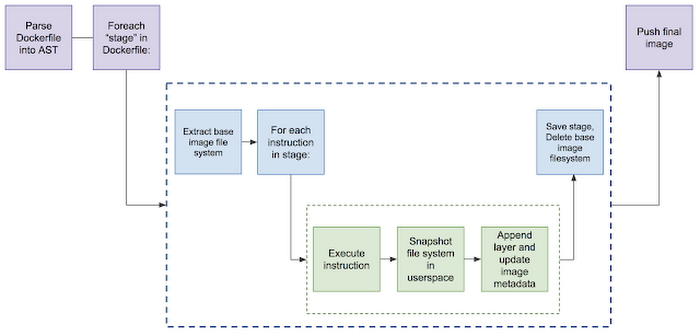

# [Container] About Kaniko
> date - 2021.12.10  
> keyworkd - container, image build  
> container image build를 위한 Kaniko에 대해 정리

<br>

## Kaniko란?
* container 내부의 Dockerfile에서 container image build를 위한 tool
* docker daemon을 사용하지 않는다
  * userspace에서 Dockerfile의 command를 실행
  * docker daemon을 쉽고, 안전하게 실행할 수 없는 환경(e.g. Kubernetes cluster)에서 container image build 가능
* DinD(Docker-in-Docker) build에서 발생하는 2가지 이슈 해결
  * [privileged mode](https://docs.docker.com/engine/reference/run/#runtime-privilege-and-linux-capabilities)로 인한 security issue
  * 일반적으로 build performance 저하 발생
* not support windows containers
* `gcr.io/kaniko-project/executor:debug` 사용 권장
  * shell을 가지고 있어, 출력 확인 가능
* docker credentials helper를 이용해 registry에 push


<br>

## How does kaniko work?
<div align="center">
  
</div>

* kaniko executor는 Dockerfile에서 image build 후 registry로 push하는 역할
* base image의 filesystem을 추출한 뒤 각 명령어 실행 후 userspace의 filesystem을 snapshotting


<br>

## Kaniko build context
* kaniko가 image build에 사용할 Dockerfile이 포함된 directory

<br>

### Support storage
* GCS bucket
* S3 bucket
* Azure blob storage
* Local directory
* Local tar
* Standard input
* Git repository

<br>

## Caching
* remote repository에 cache layer 생성
* Pod의 PV(PersistentVolume)를 cache로 사용 가능
  * cache는 read-only라서 `gcr.io/kanoko-project/warmer`(cache warming image)로 warming up 필요

```sh
$ docker run -it --rm 
    -v $(pwd):/workspace \
    -v $(pwd)/config.json:/kaniko/.docker/config.json:ro \
    gcr.io/kaniko-project/executor:latest \
    --dockerfile=Dockerfile \
    --destination=${IMAGE}:${TAG} \
    --cache=true  \  # enable cache
    --cache-ttl=6h  \  # cache TTL
    --cache-repo=<remote repository> \  # cache remote repository 지정, 없으면 --destination으로 유추
    --cache-dir=/workspace/cache \
    --image=<image to cache> \
    --image=<another image to cache>
```


<br>

## Usage

### Docker
* docker로 kaniko 사용시 root permission 필요
  * docker는 root permission으로 실행되므로...
* container registry 정보를 `kaniko/.docker/config.json`에 생성해야 한다

```
$ DOCKER_USERNAME=xxx
$ DOCKER_PASSWORD=xxx
$ AUTH=$(echo -n "${DOCKER_USERNAME}:${DOCKER_PASSWORD}" | base64)
$ cat << EOF > config.json
{
    "auths": {
        "https://index.docker.io/v1/": {
            "auth": "${AUTH}"
        }
    }
}
EOF
```

```sh
$ IMAGE=<user-name>/<repo>  # replace with your image
$ TAG=xxx
$ docker run -it --rm 
    -v $(pwd):/workspace \
    -v $(pwd)/config.json:/kaniko/.docker/config.json:ro \
    gcr.io/kaniko-project/executor:latest \
    --dockerfile=Dockerfile \
    --destination=${IMAGE}:${TAG}
```

<br>

### Kubernetes
* registry credentials을 secret로 생성
```sh
$ kubectl create secret docker-registry regcred \
  --docker-server=https://index.docker.io/v1/ \
  --docker-username=<your-name> \
  --docker-password=<your-pword> \
  --docker-email=<your-email>

## example - docker hub
$ kubectl create secret docker-registry regcred \
  --docker-server=https://index.docker.io/v1/ \
  --docker-username=<your-name> \
  --docker-password=<your-pword> \
  --docker-email=<your-email>
```

* 아래의 manifest를 `kubectl apply`
```yaml
kind: PersistentVolumeClaim
apiVersion: v1
metadata:
  name: dockerfile-claim
spec:
  accessModes:
    - ReadWriteOnce
  resources:
    requests:
      storage: 8Gi
  storageClassName: local-storage
---
apiVersion: v1
kind: PersistentVolume
metadata:
  name: dockerfile
  labels:
    type: local
spec:
  capacity:
    storage: 10Gi
  accessModes:
    - ReadWriteOnce
  storageClassName: local-storage
  hostPath:
    path: <local-directory> # replace with local directory, such as "/home/<user-name>/kaniko"
---
apiVersion: v1
kind: Pod
metadata:
  name: kaniko
spec:
  containers:
    - name: kaniko
      image: gcr.io/kaniko-project/executor:debug
      args: ["--dockerfile=/workspace/dockerfile",
            "--context=dir://workspace",
            "--destination=<user-name>/<repo>"] # replace with your registry
      volumeMounts:
        - name: kaniko-secret
          mountPath: /kaniko/.docker
        - name: dockerfile-storage
          mountPath: /workspace
  restartPolicy: Never
  volumes:
    - name: kaniko-secret
      secret:
        secretName: regcred
        items:
          - key: .dockerconfigjson
            path: config.json
    - name: dockerfile-storage
      persistentVolumeClaim:
        claimName: dockerfile-claim
```

#### Run kaniko as non-root user
* `securityContext` 사용하여 안전한 실행을 보장
```yaml
securityContext:
  readOnlyRootFilesystem: true
  allowPrivilegeEscalation: false
  runAsNonRoot: true
  capabilities:
    drop:
      - ALL
```

<br>

### Google Container Builder
```yaml
steps:
 - name: gcr.io/kaniko-project/executor:latest
   args: ["--dockerfile=<path to Dockerfile>",
          "--context=<path to build context>",
          "--destination=<gcr.io/[PROJECT]/[IMAGE]:[TAG]>"]
```


<br>

## Push multiple tags
* `--destination`을 여러번 사용
```sh
$ IMAGE=<user-name>/<repo>  # replace with your image
$ TAG=xxx
$ docker run -it --rm 
    -v $(pwd):/workspace \
    -v $(pwd)/config.json:/kaniko/.docker/config.json:ro \
    gcr.io/kaniko-project/executor:latest \
    --dockerfile=Dockerfile \
    --destination=${IMAGE}:${TAG}
    --destination=${IMAGE}:latest
    --destination=${IMAGE}:${BARNCH}-${COMMIT_ID}
```


<br><br>

> #### Reference
> * [GoogleContainerTools/kaniko - GitHub](https://github.com/GoogleContainerTools/kaniko)
> * [Use kaniko to build Docker images](https://docs.gitlab.com/ee/ci/docker/using_kaniko.html)
> * [Run kaniko as non-root user within the container #105 ](https://github.com/GoogleContainerTools/kaniko/issues/105)
> * [Introducing kaniko: Build container images in Kubernetes and Google Container Builder without privileges](https://cloud.google.com/blog/products/containers-kubernetes/introducing-kaniko-build-container-images-in-kubernetes-and-google-container-builder-even-without-root-access)
