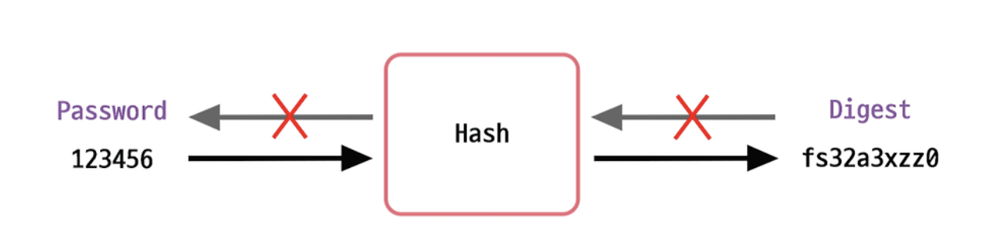
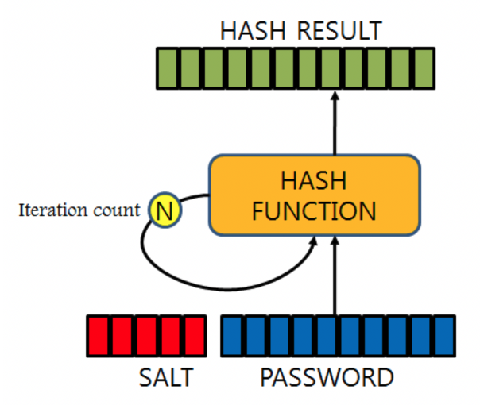

# [Cryptologic] Hash
> date - 2024.09.15  
> keyworkd - cryptologic, hash  
> hash function에 대해 정리  

<br>

## Hash?
<div align="center">
  
</div>

* 가변 길이의 평문(plaintext)을 hash function을 사용해 고정 길이의 hash(message digest)를 만들어내는 방법

<br>

### 특징
* 복호화되지 않는 특성으로인해 one-way encryption라고도 한다
* two-way encryption보다 빠른 속도를 가진다
  * hash는 빠른 데이터 검색을 위한 목적으로 설계된 것으로 빠른 속도 때문에 brute force attack(무차별 대입 공격)에 취약
* 동일한 message로 항상 같은 message digest을 생성하므로 data integrity(무결성) 검증, 디지털 서명에 사용
  * rainbow table(미리 만들어둔 digest의 모음) attack에 취약

<br>

### 보안

#### key stretching
<div align="center">
  
</div>

* hashing 여러번 반복해 최종 digest를 얻는 시간을 지연시켜 brute force attack에 저항력 강화
* 1초에 50억개 이상의 hash 비교가 가능했다면, key stretching을 적용하여 1초에 5번 비교 가능하도록한다

#### salt
* key stretching은 brute force attack에 대한 대응으로 시간을 지연시킬뿐 각 횟수별 digest가 rainbow table에 있을 확률이 있다
* salt(임의의 문자)를 더하여 동일한 message라도 다른 digest가 생성되도록하여 rainbow table attack에 저항력 강화
  * salt의 목적은 rainbow table attack 무력화하여 brute force attack을 할 수 밖에 없도록하는 것으로 노출되어도 문제가 없다
    * 노출된 salt로 새로운 rainbow table을 만드는 것은 비용이 크다
* 32 bit 이상의 salt를 사용하는게 효과적
* salt를 저장하는 여러 방식이 있다
  * digest 생성시 사용한 salt를 별도로 안전한 곳에 저장
  * digest에 붙여서 저장(padding)


<br>

## SHA(Secure Hash Algorithm)

### SHA-1
* bit 회전 연산이 추가된 방식(hash된 문자열의 bit 값을 회전하면서 반복적으로 hashing)
* 40자리 길이의 16진수 문자열로 표시되는 `160 bit(20 byte)` message digest 생성

<br>

### SHA-2
* 8개의 32/64 bit 상태를 업데이트하는 압축 함수를 기반으로 224, 256, 384, 512 등 다양한 길이의 message digest를 생성
* 생성되는 message digest에 따라 SHA-224, SHA-256, SHA-384, SHA-512로 부른다
* message digest가 길수록 더 안전


<br>

## Bcrypt
* adaptive one-way hash로 password를 확인하는데 약 1초가 걸리도록 strength(Bcrypt의 log round)를 조정 필요
  * 클수록 hash를 생성하기 위해 더 많은 작업(기하급수적으로)을 수행
  * (의도적으로) 느린 algorithm으로 brute force attack에 강함
* work factor - strength
* hash별로 고유한 salt를 생성하여 hash와 함꼐 저장하여 rainbow table attack

```
$2<a/b/x/y>$[cost]$[22 character salt(16Byte)][31 character hash(24Byte)]

$2a$10$905//ZsakCVOXpw2Z/cVQeQQu9rSQi3VDlEebKIhraxzle.dbsqcK
```
* `$2a$` - Bcrypt version
* `10` - work factor로 2^10 rounds
* `905//ZsakCVOXpw2Z/cVQe` - base-64 encoded salt(16 Byte)
* `QQu9rSQi3VDlEebKIhraxzle.dbsqcK` - base-64 encoded hash

<br>

> #### work factor?
> * 더 느리게 더 비용이 많이 들게 해주는 요소
> * password cracking 시도에 최대한 느리게 최대한 비용이 많이들게하여 공격이 어렵게 만드는 요소


<br>

## Scrypt
* adaptive one-way hash로 memory intensive algorithm(의도적인 memory overhead 발생)
* password를 확인하는데 더 많은 memory를 사용함으로써 공격에 대한 저항력을 강화
  * 공격자의 memory를 많이 사용하게하여 공격하는 것을 어렵게 하여 brute force attack에 강함
* salt를 사용하여 보안성 강화
* work factor - N(cpu/memory cost), r(block size), p(parallelism)


<br>

## PBKDF2(Password-Based Key Derivation Function)
* salt를 적용한 후 strength를 임의로 선택
```
DIGEST = PBKDF2(PRF, Password, Salt, c, DLen)
```
* `PRF` - 난수(예: HMAC)
* `Password` - password
* `Salt` - salt
* `c` - 원하는 iteration(반복 수)
* `DLen` - 원하는 digest 길이


<br>

## Argon2
* [Password Hashing Competition](https://en.wikipedia.org/wiki/Password_Hashing_Competition)에서 우승한 알고리즘
  * password cracking을 무력화하기 위해 의도적으로 느린 알고리즘
* bcrypt, scrypt는 컴퓨팅 파워가 지금보다 좋지 않고, GPU/전용 ASIC로 병렬 계산이 어려운 시대에 설계되어 대체제 필요
* work factor(memory, time, parallelism)를 설정하여 보안성 강화
* salt를 사용하여 보안성 강화

```
$argon2id$v=19$m=16384,t=2,p=1$8OOiHb49WBwHvt4H+RA58g$8yPn/zejS6Yc/Droo++t9UHGFPVRAUziDfjeSdxb+dI
```
* 각 필드 구분자로 `$` 사용
* `argon2id` - 사용한 argon2 type을 표시, 여기서는 argon2id 사용
* `v=19` - 버전을 의미하며 argon2의 버전 19
* `m=16384,t=2,p=1`
  * m - memory cost
  * t - time cost
  * p - parallelism
* `8OOiHb49WBwHvt4H+RA58g` -  base-64 encoded salt(random)
* `8yPn/zejS6Yc/Droo++t9UHGFPVRAUziDfjeSdxb+dI` - base-64 encoded hash


<br>

## Hash Algorithm 비교
| Algorithm | 속도 | 보안 | 용도 |
|:--|:--|:--|:--|
| MD5 | 매우 빠름 | 취약점이 발견되어 현재는 보안 목적으로 사용 X | 데이터 무결성 검증(보안 필요 없는 경우) |
| SHA-1 | 빠름 | 취약점이 발견되어 현재는 보안 목적으로 사용 X | 데이터 무결성 검증(보안 필요 없는 경우) |
| SHA-256 | 빠름 | SHA-1보다 강력, password에는 부적합 | 데이터 무결성 검증, 디지털 서명 등 |
| bcrypt | 느림(의도적으로) | password hashing에 최적화, brute force Attack에 강함 | password 저장 |
| scrypt | 느림 | memory intensive algorithm, brute force Attack에 강함(공격자의 memory를 많이 사용하게하여 공격하는 것을 어렵게 한다) | password 저장 |
| Argon2 | 조정 가능 | cpu, memory intensive algorithm | password 저장 |


<br>

## Conclusion
* password 저장 용도로는 `bcrypt`, `scrypt`, `Argon2` 사용 권장
* `SHA-256`은 데이터 무결성 검증, 디지털 서명 등 사용
* `MD5`, `SHA-1`은 보안이 필요 없는 데이터 무결성 검증시 사용


<br><br>

> #### Reference
> * [BCrypt](https://en.wikipedia.org/wiki/Bcrypt) 
> * [Scrypt](https://en.wikipedia.org/wiki/Scrypt)
> * [PBKDF2](https://en.wikipedia.org/wiki/PBKDF2)
> * [Argon2](https://en.wikipedia.org/wiki/Argon2)
