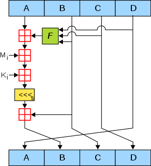

# [Cryptologic] MD5(Message-Digest algorithm 5)
> date - 2021.07.13  
> keyword - cryptologic, hash, md5  
> hash function 중 하나인 MD5에 대해 정리  

<br>

## MD5?
<div align="center">
  
</div>

* 128 bit cryptographic hash function
* RFC 1321
* data(i.e. http body, file..)가 원본 그대로인지 확인하는 무결성 검사 등에 사용
* hash function이라 단방향 암호화이므로 복호화는 불가능
* hash collision을 찾을 수 있는 방법이 발견되어 보안용으로는 현재 SHA-256 이상을 사용하는 것을 권장한다


<br>

## MD5 살펴보기
* [MD5 Hash Generator](https://www.md5hashgenerator.com)에서 간단하게 확인해볼 수 있다
* `kotlin`으로도 확인
```kotlin
// kotlin 1.5.10

import java.math.BigInteger
import java.security.MessageDigest

fun main(args: Array<String>) {
    val messageDigest = md5("plainText")
    println("message digest: $messageDigest")
}

fun md5(plainText: String): String {
    val md = MessageDigest.getInstance("MD5")
    return BigInteger(1, md.digest(plainText.toByteArray())).toString(16).padStart(32, '0');
}
```

<br>

## Algorithm

### 1. Append Padding Bits
* 512 bit의 배수보다 64 bit 모자르게 padding
* 64 bit - padding 전 plain text

<br>

### 2. Append Length
* plain text의 길이를 나타내는 64 bit 정수 값으로 채운다

<br>

### 3. Initialize MD Buffer
* hash function의 중간/최종 값 저장에 사용하는 128 bit buffer를 초기화
* 128 bit buffer는 32 bit의 register A, B, C, D로 표시
* `Little-endian` 방식을 사용하므로 low order bytes를 먼저 저장
```
word A: 01 23 45 67
word B: 89 AB CD EF
word C: FE DC BA 98
word D: 76 54 32 10
```

<br>

### 4. Process Message in 16-Word Blocks
* 4 round에 걸쳐 16 word(512 bit) block 단위로 message digest를 수행
* 3개의 32 bit word를 입력하여 32 bit word의 출력을 생성하도록 정의
* 각 round마다 16단계를 처리하고 4번의 round는 서로 다른 논리 함수로 구성
* 각 round는 현재의 512 bit block과 128 bit buffer 값인 A, B, C, D 입력 메시지의 i번째 32 bit 내용의 입력으로 처리
* 입력 메시지의 i번째 32 bit 내용은 총 64개로 1/4씩 각 round마다 입력
```
1 Round F(x,y,z) == (x∧y)∨(~x∧z)
2 Round F(x,y,z) == (x∧z)∨(y∧~z)
3 Round F(x,y,z) == x⊕y⊕z
4 Round F(x,y,z) == y⊕(x∧~z)

⊕ - XOR
∧ - 논리곱
∨ - 논리합
~ - NOT
```

<br>

### 5. Output
* 4번 과정을 통해 나온 word인 A, B, C, D의 값을 연결하여 128 bit 값을 출력

<br><br>

> #### Reference
> * [MD5 Hash Generator](https://www.md5hashgenerator.com)
> * [MD5](http://wiki.hash.kr/index.php/MD5)
