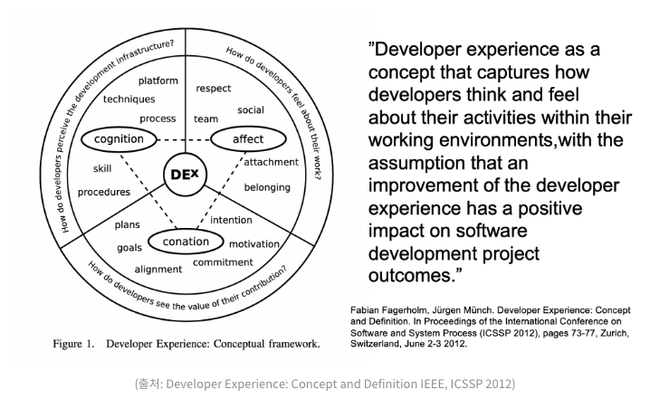

# [Culture] Developer Experience
> date - 2022.07.16  
> keyworkd - experience  
> Developer Experience에 대해 정리  

 

## Developer Experience란?
* UX(User Experience)의 파생된 개념
* 개발자가 조직, 도구 및 시스템과 상호 작용하는 모든 측면을 포함
* 좋은 개발자 경험은 개발자에게 도움이 될 뿐만 아니라 효율성을 높이고 조직의 성과를 높이는 데 필수

 

## Developer Experience 구성

  

 

### Cognition(인지)
* 주의, 기억, 언어 생성 및 이해, 문제 해결, 의사 결정 등 지식을 습득하고, 판단하고, 기억하고, 배우고, 생각하고, 문제 해결 과정에서 쌓은 것들을 바탕으로 인지하는 영역
* IDE, 언어, 라이브러리, 프레임워크, 개발 방법론 등 문제 해결을 위한 것들
* [StackShare](https://stacksare.io/)에서 기술 스택을 확인할 수 있다

 

### Conation(능동적 의지)
* 충동, 욕망, 의지, 노력 등 변화하고자 하는 경향을 나타내는 적극적인 사고방식의 영역
* 나의 기여가 얼마큼의 가치가 있는지를 느낄 수 있는 경험
* 나의 참여가 product의 가치 창출에 얼마나 기여했는지 알 수 있어야 한다
* 오픈 소스에 기여, 세미나를 통한 공유 등

 

### Affect(정서)
* 느낌, 감정 등 주어진 그때 사람의 마음속 느낌. 인간의 감정 즉 쾌감, 불쾌감, 슬픔, 분노, 미움을 말하며 어느 순간 인간의 감정 상태를 총체적으로 잘 나타내는 정신 현상
* 협업하고 있다는 느낌, 동료에 대한 존경심 등 개발하는 동안 느끼는 감정
* retrospective(회고), 실수로 인한 장애 발생시 개인보다는 그 상황 자체에 집중 등
  * 장애를 누가 일으켰는가보다는 왜 일어났는가에 집중
  * 실수가 발생한 상황은 조직의 문제이며, 조직 전체가 실수에 대한 방지책을 고민해야한다
    * 장애가 발생했을 때 얼마나 빠르게 복구시킬 수 있을지
    * 휴먼 에러를 어떻게 방지할 수 있을지

  

> #### Reference
> * [개발자 경험(Dex)이 주목받는 시대](https://yozm.wishket.com/magazine/detail/1436/)
