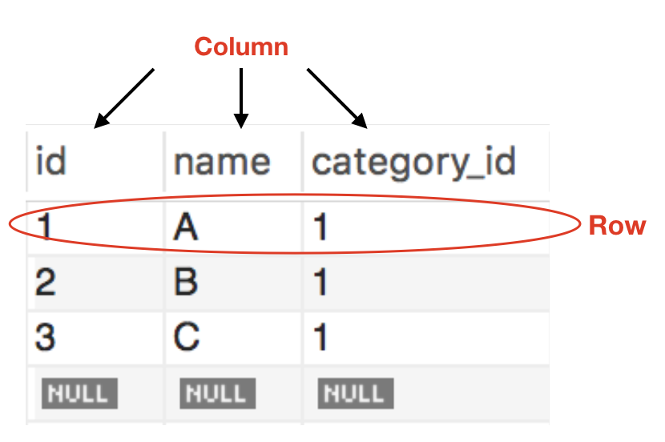

# [DB] About Relational Database
> date - 2019.02.10  
> keyword - db, relational database  
> 1년전 Mash-Up backend team에서 스터디한 RDB에 관해 정리  

<br>


## Relational Database(RDB)란?
* 데이터 항목 간에 정의된 **관계가 있을 때** 그러한 데이터들의 모음
* column(field, item)과 row(record, tuple)로 이루어진 Table의 집합으로 구성



<br>

## Table
* Database에 표시할 객체들에 관한 정보를 표현하는데 사용
* column은 데이터의 속성을 저장
* row
  * 특정 종류의 데이터를 저장하고 **하나의 객체 또는 엔티티**를 표현
  * Primary key라는 고유 식별자를 가질 수 있다
  * 다른 테이블에 있는 row와는 Foreign key를 사용해 상호 연결될 수 있다
  * 테이블을 재구성하지 않고 여러가지 방법(join..)으로 엑세스할 수 있다
  * `Cardinality` - row의 수

<br>

> 쉽게 생각해서 출석부를 생각해보자
> 출석부에는 학생마다 번호, 이름 등의 정보가 있을 것이고, 어떤 학생의 주소를 알고 싶다면 
> x학년 x반 x번 xxx로 학생기록부에서 주소를 찾을 것이다
> 이렇게 관계를 가지고 있는 데이터들을 RDB에 저장할 수 있다


<br>

## RDB의 특징

### SQL(Structured Query Language)
* RDB와 통신하는데 사용되는 기본 인터페이스
* ANSI(미국표준협회)의 표준으로 선정
  * 거의 모든 RDB 엔진에서 지원하며 일부 엔진은 고유 기능을 지원하는 확장된 ANSI SQL을 사용
* 데이터 추가, 업데이트, 삭제, 트랙잭션 처리 등 Database의 모든 측면을 관리하는데 사용

### 데이터 무결성
* 데이터의 전체적인 완전성, 정확성 및 일관성을 의미
* RDB는 일련의 제약 조건을 사용해 무결성을 보장
  * Primary Key
  * Foreign Key
  * Not NULL
  * Unique
  * Default
  * Check
* Database의 작업에 기반해 실행되는 `Trigger`에 사용자 지정 코드를 포함할 수 있다

### 트랜잭션
* 하나의 논리적 작업을 구성하기 위해 하나 이상의 SQL로 구성된 Database 작업
* All or Nothong concept
  * 전체가 완료되어 DB에 기록되거나 아니면 어떤것도 기록되면 안된다
  * Commit, Rollback 사용

```sql
START TRANSACTION;

...  -- Any SQL

COMMIT; -- or ROLLBACK
```
* 각 트랜잭션은 다른 트랜잭션에 상관없이 일관성있게 처리

### ACID
* 트랜잭션은 데이터 무결성 보장을 위해 ACID 준수
* `Atomicity`(원자성)
  * 트랜잭션이 모두 성공하거나 일부 트랜잭션 실패시 전체 트랙잭션 무효화
* `Consistency`(일관성)
  * 모든 데이터는 정의된 규칙 및 제약조건, cascade, trigger를 준수
* `Isolation`(격리)
  * 각 트랜잭션은 독립적으로 실행
  * 동시성 제어를 위해 중요
* `Durability`(내구성)
  * 성공적으로 완료된 트랜잭션의 변경사항은 영구적으로 보존해야 한다


<br>

## RDB의 종류
* [Amazon Aurora](https://aws.amazon.com/ko/rds/aurora/)
* [Oracle Database](https://www.oracle.com/database/)
* [Microsoft SQL Server](https://www.microsoft.com/en-us/sql-server)
* [MySQL](https://www.mysql.com/)
* [PostgreSQL](https://www.postgresql.org/)
* [MariaDB](https://mariadb.org/)


<br><br>

> #### Reference
> * [관계형 데이터베이스란 무엇입니까? - AWS RDS](https://aws.amazon.com/ko/relational-database/)
