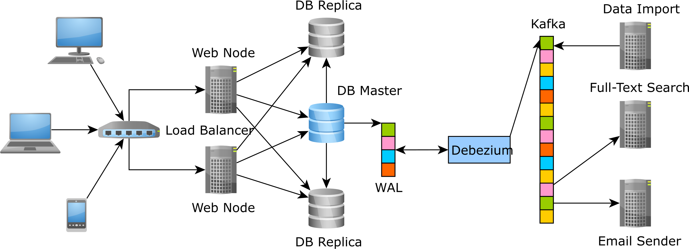

# [CDC] CDC(Change Data Capture)
> date - 2021.05.21  
> keyworkd - db, data, cdc  
> 업무에서 사용하고 있는 CDC(Change Data Capture)에 대해 정리  

 

## CDC(Changed Data Capture)란?

  

 

* data record의 변화를 stable(안정적), scaleable(확장 가능한)하게 capture가 필요한 상황이 있다
  * 특정 event에 대한 변경 사항
    * like시 like_count+=1
    * wiki에서 문서의 변경사항을 email로 전송
* source data의 변경 이력을 사용하여 data를 확인하고, 추적하는데 사용되는 design patterns
  * **변경 이력은 data source에 따라 다르기** 때문에 중요한 정보를 담고 있는 transaction data를 추출하는 것이 CDC solution의 기술력
  * DML(Data Manipulation Language)이 담겨 있는 부분은 log data의 일부에 불과하기 때문
* Downtime 없이 Near real time(준실시간) data integration이 필요한 Data warehouse 등에 사용
* source data system의 부하를 줄이고, 유연성이 높아져 전체적인 작업 생산성 향상
* CDC를 사용해 `Event Sourcing`(모든 event를 기록하고, 최신 snapshot을 생성)을 구현하여 OLTP(Online Transaction Processing) application을 대체할 수도 있다

 

## Methodology
* application logic부터 physical storage까지 여러 가지 방법으로 CDC mechanisms을 구현할 수 있다
* source와 target이 동일한 시스템이 아닐 수 있다

 

### Timestamps on rows
* table에 마지막 변경 시점을 기록하는 timestamp column(e.g. LAST_UPDATE) 존재
* capture된 시점보다 더 최근의 timestamp를 가지는 record는 변경된 것으로 판단
* timestamp column은 optimistic locking에도 자주 사용되므로 더 자주 사용할 수 있다

 

### Version numbers on rows
* table에 version number column(e.g. VERSION_NUMBER) 존재
* 더 최근의(=더 높은) version을 보유한 record는 변경된 것으로 판단
* CDC에서는 optimistic locking의 version과는 다르게 start version을 알아야 처리가 가능하다

 

### Status indicators on rows
* `Timestamps on rows`, `Version numbers on rows`를 보완용으로 활용
* timestamp, version에 따라 data 변경 여부를 저장하는 boolean(true/false) column을 사용하여 변경 여부를 판단

 

### Time/Version/Status on rows
* `Timestamps on rows`, `Version numbers on rows`, `Status indicators on rows`를 모두 활용

 

### Triggers on tables
* [Log trigger](https://en.wikipedia.org/wiki/Log_trigger) pattern으로 알려진 publish/subscribe pattern
* transaction table에서 발생하는 log event를 나중에 `played back`할 수 있는 다른 queue table로 trigger한 후 queue table을 `played back`하여 source data를 복제
  * e.g. account table의 모든 event가 id, table name, row id, timestamp, operation field를 가지는 queue table에 기록
    * 1, account, 76, 2021-05-22 14:00:02, Update
  * 아니면 실제 데이터를 기록
* system 복잡도 증가, 변경 관리의 어려움, 확장성 감소 등의 단점이 있다

 

### Event programming
* data 변경 식별 기능을 적절한 지점에 위치한 application으로 구현
* application의 복잡도를 증가시키나 다양한 조건으로 구현할 수 있어 자유도가 높다

 

### Log scanners
* 대부분의 DBMS가 관리하는 transaction log(data 및 metadata의 변경 사항을 기록)를 읽어 변경 식별 가능을 구현
* 이기종 DB가 많아질수록 복잡도가 높아진다
* 장점
  * DB에 대한 영향도 최소화(특히 log shipping을 사용해 다른 host에서 처리시)
  * 변경 사항 획득에 low latency
  * commit된 순서대로 original transaction을 replay하는 change stream을 생성할 수 있어서 `transactional integrity` 보장
  * DB schema 변경 불필요

 

## Push vs Pull
* Push
  * data source에서 변경 사항의 snapshot을 만들어 downstream으로 전달
* Pull
  * data source를 주기적으로 확인하여 변경 사항의 snapshot 생성하여 downstream으로 전달

 

## CDC를 사용할 수 있는 use case
* [Data warehouse](https://en.wikipedia.org/wiki/Data_warehouse)
* DB Migration
  * Snapshot을 이용해 최초 1회 migration 후 CDC로 data 정합성 유지
  * Multi region database synchronize
    * Amazon Aurora Global Database
    * Amazon ElastiCache for Redis Global Databases
    * Amazon DynamoDB Global Tables
* Search Engine(e.g. Elasticsearch)의 indexing
  * DB -> CDC -> Queue -> Indexer -> Search Engine
  * Queue - scaleable, stable(실패시 retry 보장)
  * Indexer - EC2, Lambda 등으로 구현된 application
* 특정 record 변경에 따른 알림 발송
  * 추천 +1시 게시글 작성자에게 알림
  * 댓글 작성시 상위 댓글 작성자에게 알림
  * 친구 추가시 알림
* Log 저장
  * Audit Logging을 위해 특정 시점의 변경 내역을 저장해야 할 때
  * order 생성/수정/삭제시 order history 저장
  * 상품 정보의 수정이 발생할 때마다 수정 내역 저장

 

## CDC Tool
* [Debezium](https://debezium.io/)
  * [Debezium MySQL CDC Connector](https://www.confluent.io/hub/debezium/debezium-connector-mysql)
* [Maxscale CDC Connector](https://mariadb.com/kb/en/mariadb-maxscale-22-maxscale-cdc-connector/)
* [zendesk/maxwell](http://maxwells-daemon.io/)
* [DynamoDB Stream](https://docs.aws.amazon.com/ko_kr/amazondynamodb/latest/developerguide/Streams.html)
* [Shareplex](https://www.quest.com/products/shareplex/)
* [OGG(Oracle Golden Gate)](https://www.oracle.com/kr/integration/goldengate/)
* [IBM InfoSphere](https://www.ibm.com/kr-ko/analytics/information-server)

 

## CDC(Changed Data Capture) vs ETL(Extract, Transform, Load)

### ETL
* source data storage에 query하여 직접 data를 추출하기 때문에 source data storage에 부하가 발생할 수 있다
* 과도한 부하로 인해 batch processing(일,주,월 단위)을 하기 때문에 CDC에 비해 실시간성을 확보하기 어렵다
  * DW(data warehouse)에 적재하거나 백업하는 용도로 사용
* batch processing이기 때문에 1번에 옮기는 data size가 크고, 그로 인해 network 비용 부담 발생

 

### CDC
* data 자체가 아닌 transcation을 옮기기 때문에 data size가 작다
  * `ETL`에 비해 network 비용 부담이 적다
  * 먼 거리 data 전송에 유리
* transaction data를 target data storage에서 똑같이 실행하는 방식이기 때문에 중간에 별도의 task 없이는 data transform 불가능

 

## Conclusion
* CDC는 다양하게 활용 가능하지만 모든 기술이 그렇듯 항상 정답이 아니므로 발생할 수 있는 문제와 이점을 고려하여 기술을 선택할 필요가 있다

  

> #### Reference
> * [A beginner’s guide to CDC (Change Data Capture)](https://vladmihalcea.com/a-beginners-guide-to-cdc-change-data-capture/)
> * [Change data capture - Wikipedia](https://en.wikipedia.org/wiki/Change_data_capture)
> * [Data warehouse - Wikipedia](https://en.wikipedia.org/wiki/Data_warehouse)
