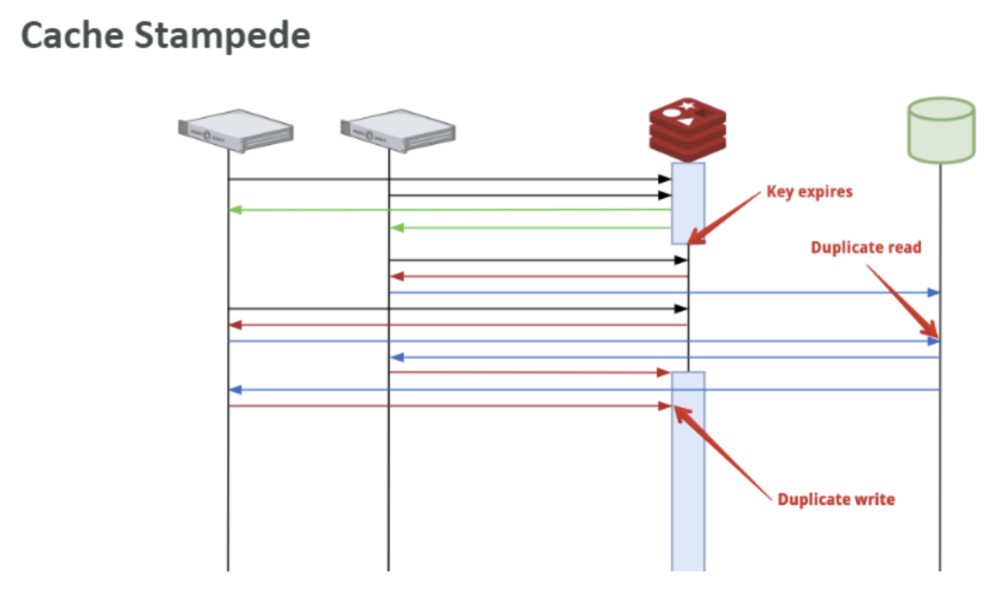

# [Redis] Cache Stampede
> date - 2022.01.29  
> keyworkd - server, cache, redis  
> cache 사용시 발생할 수 있는 cache stampede에 대해 정리  

<br>

## Cache Stampede란?
* DB의 부하를 줄이기 위해 자주 조회되는 data를 caching하여 부하 분산을 구현한다
* cache 구현시 Lazy loading 방식인 `Caching-Look Aside` 전략을 많이 활용

<br>

### Caching-Look Aside
* data 조회시 cache에 있다면 cache에서 응답하고, 없다면 DB에서 조회한 후 cache에 저장하고 응답
* cache data가 존재하는 동안에는 빠른 응답 제공
* DB data가 수정될 때 cache의 data가 불일치한다는 문제점이 있다
* data 불일치를 줄이기 위해 expire time or TTL(Time-To-Live)를 설정

<br>

위 방식에는 2가지 문제가 있다
1. cache data 유무에 따라 응답 속도 차이 발생
2. cache 만료 직후부터 다시 caching될 때 까지 DB로 트래픽이 몰리는 현상 발생 -> Cache Stampede

<br>

### Cache Stampede 현상 발생시
* cache가 없고, DB에 트래픽이 몰리기 때문에 **응답 속도 지연** 발생
* 만료된 cache data의 caching 과정에서 **cache duplicate write** 발생

<div align="center">
  
</div>

<br>


## How?
* External re-computation
* Locking
* PER(Probablistic Early Recomputation) 알고리즘

<br>

### External re-computation
* 주기적으로 backgroud에서 caching하여 cache miss 방지
* 단점
  * 주기적으로 caching할 key list 필요
  * key list의 관리에 따라 cache hit ratio가 저조한 key도 caching될 확률이 있다

<br>

### Locking
* DB duplicate read, cache duplicate write가 발생하지 않도록 cache miss가 발생한 처음 요청에 Lock을 걸고 cache write
* 단점
  * cache 만료시 응답 속도 지연 문제는 그대로 있다

<br>

### PER(Probablistic Early Recomputation) 알고리즘
* Imagine virtual expiry in a fixed random (**gap**) before actual expiry time
* Given created **timestamp**
* And a **ttl**
* We will consider a key expired if: `timestamp + ttl + (rand() * gap) > now()`

> 간단하게 cache expired 전에 cache read시 TTL(random 값) renew하는 알고리즘
```
function fetch(key, ttl):
  value, expiry = cache_read(key)
  gap = D  // distribution
  
  if value.isEmpty() || now() + gap > expiry:
    value = recompute()
    cache_write(key, value, ttl)
  return value
```
확률적으로 gap을 정의

1. uniform distribution(연속 균등 분포) = U(0, ξ)
2. exponential distribution(지수 분포) = Exp(λ)

잘 분산된 분포를 사용하면 stampede를 방지하는데 효과적이고, `Exp(1/x)`가 최적의 함수
βlog(rand()) ≈ Exp (1/β)

```
function fetch(key, ttl, beta = 1):
  value, delta, expiry = cache_read(key)
  
  if value.isEmpty() || now() - delta * beta * log(rand()) >= expiry:
    start = now()
    value = recompute()
    delta = now() - start
    cache_write(key, value, delta, ttl)

  return value
```
* delta - computation time으로 reids에 data를 저장하거나, fetch하는데 걸리는 시간


#### PER가 효과적으로 동작하려면?
* 낮은 TPS로는 cache renew의 효율이 떨어지기 때문에 TPS(최소 50 TPS)가 높을수록 효과적
* DB에 조회하는 시간(computation time)이 클수록 효과적

<br>

### sustainable caching
* cache expired 전에 renew
* computation time이 expire time의 10% 미만일 경우 expire time 비율을 활용해 renew
* renew를 background에서 진행하며 DB duplicate read, cache duplicate write 방지


<br><br>

> #### Reference
> * [Cache stampede](https://en.wikipedia.org/wiki/Cache_stampede)
> * [RedisConf17 - Preventing Cache Stampede with Redis and Xfetch](https://www.youtube.com/watch?v=1sKn4gWesTw)
> * [Improve Cache Speed at Scale - RedisConf 2020](https://www.youtube.com/watch?v=mPg20ykAFU4)
> * [ARCUS에서 지속 가능한 캐싱 적용 방안](https://medium.com/jam2in/arcus%EC%97%90%EC%84%9C-%EC%A7%80%EC%86%8D-%EA%B0%80%EB%8A%A5%ED%95%9C-%EC%BA%90%EC%8B%B1-%EC%A0%81%EC%9A%A9-%EB%B0%A9%EC%95%88-bd4e27637bea)
