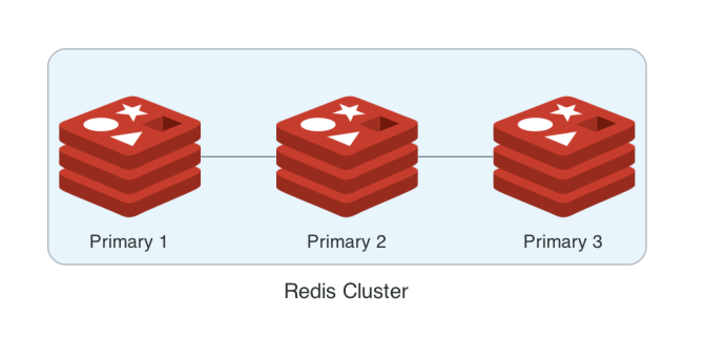
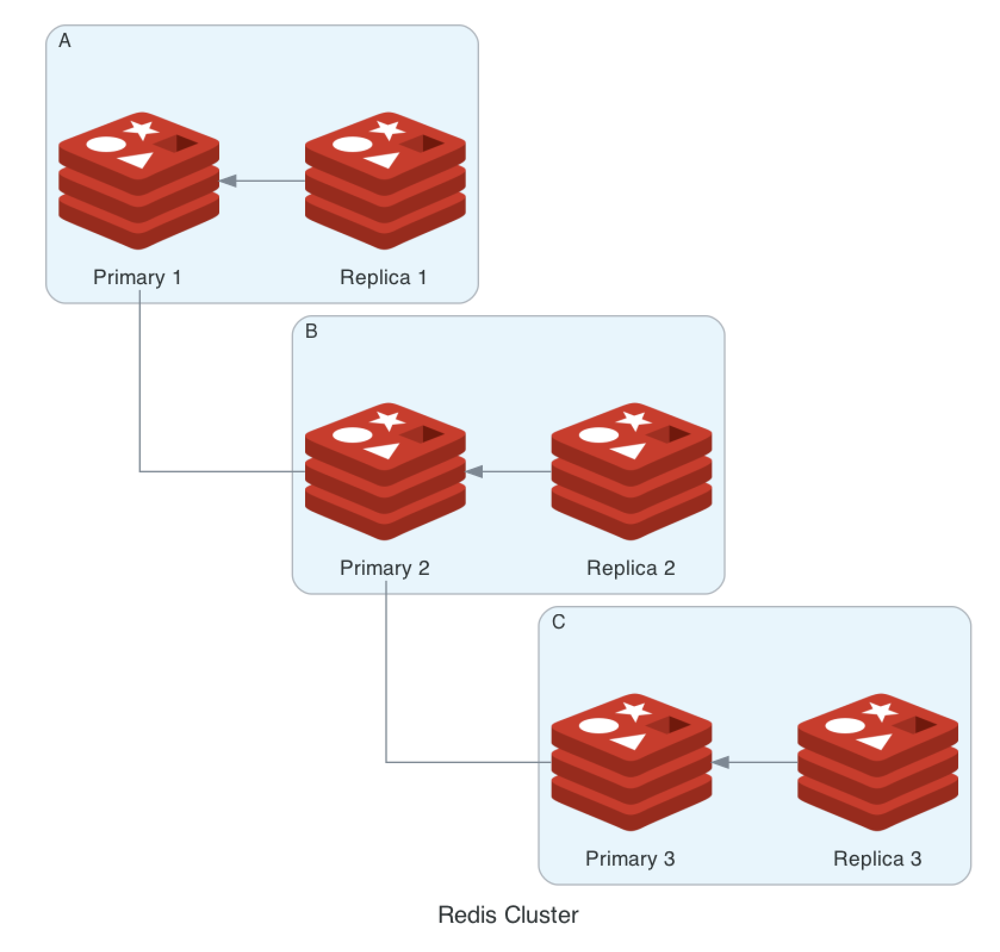

# [Redis] Redis cluster
> date - 2022.08.12  
> keyworkd - redis, cluster  
> redis cluster와 docker compose로 cluster를 구축하는 방법을 정리  
> 사용했던 source code는 [repository](https://github.com/opklnm102/spring-data-sample/tree/main/data-redis-cluster) 참고

<br>

## Redis Cluster?
<div align="center">
  
</div>

* redis에서 horizontal scaling을 지원하는 방법
* data가 cluster의 node에 자동으로 분할되어 저장되는 `sharding` 사용
* cluster node는 client에 서비스를 제공하는 `data port`와 `cluster bus port`라는 2개의 TCP port 사용
* cluster bus port
  * data port +10,000으로 설정
    * data port - 6,379
    * cluster bus port - 16,379
  * 장애 감지, 설정 갱신 등을 위해 binary protocol로 node-to-node 통신에 사용되며 client는 사용하면 안된다
* `NAT`가 있는 환경과 IP/TCP port가 다시 매핑되는 환경을 지원하지 않는다
  * docker로 구성시 host network 사용
* cluster는 16,384개의 `hash slot`을 사용하여 **auto sharding**
  * consistent hashing 사용 X
  * 모든 key는 `hash slot`의 일부로 CRC16의 16,384 modules(key % 16,384) 연산으로 key의 `hash slot`을 알 수 있다
  * node가 3개면?
    * node a - 0 ~ 5,500
    * node b - 5,501 ~ 11,000
    * node c - 11,001 ~ 16,383
  * cluster에 node 추가시 `hash slot` 이동 필요
  * `hash slot`을 가지지 않은 node는 cluster에서 제거 가능
* 최소 3개의 primary로 구성해야하며 3 primary + 3 replica로 6 node로 구성 권장


<br>

## Command

### check cluster
* redis cluster 상태 확인
```sh
$ redis-cli --cluster check [primary node host:port]
```

* cluster 정보 확인
```sh
$ redis-cli -c cluster info
cluster_state:ok
cluster_slots_assigned:16384
cluster_slots_ok:16384
cluster_slots_pfail:0
cluster_slots_fail:0
cluster_known_nodes:3
cluster_size:3
cluster_current_epoch:3
cluster_my_epoch:2
cluster_stats_messages_ping_sent:53
cluster_stats_messages_pong_sent:54
cluster_stats_messages_meet_sent:1
cluster_stats_messages_sent:108
cluster_stats_messages_ping_received:54
cluster_stats_messages_pong_received:54
cluster_stats_messages_received:108
```

* cluster node 확인
```sh
$ redis-cli -c cluster nodes
1a7fc0cf94fb80fbcd8ff5774f3965ef8a3cb310 172.18.0.3:6379@16379 master - 0 1660405228821 1 connected 0-5460
d57784e84cb38c5a6c45b602b62756a48ced15de 172.18.0.2:6379@16379 master - 0 1660405229838 3 connected 10923-16383
c86ae59d5035db384cb3dbdafe1889a51136eb0a 172.18.0.4:6379@16379 myself,master - 0 1660405226000 2 connected 5461-10922
```

<br>

### cluster 생성
* primary로만 cluster 생성
* 최소 3개 이상의 primary node 사용
```sh
$ redis-cli --cluster create [node host:port] --cluster-yes
```

* primary + replicas로 cluster 생성
```sh
$ redis-cli --cluster create [node host:port] --cluster-yes --cluster-replicas 1
```

<br>

### cluster node 추가
* primary node 추가
```sh
$ redis-cli --cluster add-node [new host:port] [primary node host:port]
```

* replica node 추가
```sh
$ redis-cli --cluster add-node --cluster-slave [new host:port] [primary node host:port]
```

<br>

### cluster node 제거
* hash slot이 없는 primary와 replica만 제거 가능
  * hash slot을 다른 primary로 옮긴 후 제거 가능

```sh
$ redis-cli --cluster del-node [primary node host:port] [remove target node id]
```

<br>

### resharding
* `hash slot`을 다른 node로 옮긴다
* resharding 수행중인 key에는 lock이 걸리나 다른 key는 사용 가능
```sh
$ redis-cli --cluster reshard [primary node host:port]
```

#### 대화식이 아닌 자동으로 실행
```sh
$ redis-cli --cluster reshard [primary node host:port] \
            --cluster-from [node-id] \
            --cluster-to [node-id] \
            --cluster-slots [number of slots] \
            --cluster-yes
```

* example
```sh
## hash slot 확인
$ redis-cli -c cluster nodes
751585e3afca76e58dbd80d5dfb4a90459905d68 172.24.0.3:6379@16379 master - 0 1660457939537 3 connected 10923-16383
517c53462d8be7509480697c303a3b1ef73a290c 172.24.0.2:6379@16379 master - 0 1660457940351 1 connected 0-5460
a9f5c648a6fd05a43ea456c33f9b95964175f610 172.24.0.4:6379@16379 myself,master - 0 1660457940000 2 connected 5461-10922

## resharding
$ redis-cli --cluster reshard 127.0.0.1:6379 \
            --cluster-from 517c53462d8be7509480697c303a3b1ef73a290c \
            --cluster-to 751585e3afca76e58dbd80d5dfb4a90459905d68 \
            --cluster-slots 2100 \
            --cluster-yes

## hash slot 확인
$ redis-cli -c cluster nodes
751585e3afca76e58dbd80d5dfb4a90459905d68 172.24.0.3:6379@16379 master - 0 1660458019757 3 connected 0-2099 10923-16383  # here
517c53462d8be7509480697c303a3b1ef73a290c 172.24.0.2:6379@16379 master - 0 1660458018000 1 connected 2100-5460
a9f5c648a6fd05a43ea456c33f9b95964175f610 172.24.0.4:6379@16379 myself,master - 0 1660458017000 2 connected 5461-10922
```

<br>

### rebalance
* `hash slot`을 재분배하여 균형을 맞춘다
```sh
$ redis-cli --cluster rebalance [primary node host:port] --cluster-use-empty-masters
```

* example
```sh
## hash slot 확인
$ redis-cli -c cluster nodes
751585e3afca76e58dbd80d5dfb4a90459905d68 172.24.0.3:6379@16379 master - 0 1660458019757 3 connected 0-2099 10923-16383
517c53462d8be7509480697c303a3b1ef73a290c 172.24.0.2:6379@16379 master - 0 1660458018000 1 connected 2100-5460
a9f5c648a6fd05a43ea456c33f9b95964175f610 172.24.0.4:6379@16379 myself,master - 0 1660458017000 2 connected 5461-10922

## rebalancing
$ redis-cli --cluster rebalance 127.0.0.1:6379 \
            --cluster-use-empty-masters

## hash slot 확인
$ redis-cli -c cluster nodes
751585e3afca76e58dbd80d5dfb4a90459905d68 172.24.0.3:6379@16379 master - 0 1660458037067 3 connected 10923-16383
517c53462d8be7509480697c303a3b1ef73a290c 172.24.0.2:6379@16379 master - 0 1660458038096 4 connected 0-5461
a9f5c648a6fd05a43ea456c33f9b95964175f610 172.24.0.4:6379@16379 myself,master - 0 1660458037000 2 connected 5462-10922
```

<br>

### cluster node에 명령
```sh
$ redis-cli --cluster call [cluster node ip:port] [command]

## example
$ redis-cli --cluster call 172.22.0.4:6379 dbsize
>>> Calling dbsize
172.22.0.4:6379: 1
172.22.0.3:6379: 2
172.22.0.2:6379: 1

$ redis-cli --cluster call 172.22.0.4:6379 scan 0
>>> Calling scan 0
172.22.0.4:6379: 0
list_125
172.22.0.3:6379: 0
list_123
list_122
172.22.0.2:6379: 0
list_124
```


<br>

## Redis Cluster 구축하기
* `docker compose`로 구성해본다

### 3 primary node
<div align="center">
  
</div>

```yaml
version: "3.9"

services:
  redis-node-1:
    image: redis:6.2-alpine
    ports:
      - "6379:6379"
    volumes:
      - ../redis-node.conf:/usr/local/etc/redis/redis.conf
    command: ["redis-server", "/usr/local/etc/redis/redis.conf"]
  redis-node-2:
    image: redis:6.2-alpine
    ports:
      - "6380:6379"
    volumes:
      - ../redis-node.conf:/usr/local/etc/redis/redis.conf
    command: ["redis-server", "/usr/local/etc/redis/redis.conf"]
  redis-node-3:
    image: redis:6.2-alpine
    ports:
      - "6381:6379"
    volumes:
      - ../redis-node.conf:/usr/local/etc/redis/redis.conf
    command: ["redis-server", "/usr/local/etc/redis/redis.conf"]
  redis-cluster-entry:
    image: redis:6.2-alpine
    entrypoint: ["/bin/sh", "-c", "/tmp/cluser-start.sh"]
    volumes:
      - ./cluser-start.sh:/tmp/cluser-start.sh
    depends_on:
      - redis-node-1
      - redis-node-2
      - redis-node-3
```

<br>

### 3 primary + 3 replica node
<div align="center">
  
</div>

```yaml
version: "3.9"

services:
  redis-node-1:
    image: redis:6.2-alpine
    ports:
      - "6379:6379"
    volumes:
      - ../redis-node.conf:/usr/local/etc/redis/redis.conf
    command: ["redis-server", "/usr/local/etc/redis/redis.conf"]
  redis-node-2:
    image: redis:6.2-alpine
    ports:
      - "6380:6379"
    volumes:
      - ../redis-node.conf:/usr/local/etc/redis/redis.conf
    command: ["redis-server", "/usr/local/etc/redis/redis.conf"]
  redis-node-3:
    image: redis:6.2-alpine
    ports:
      - "6381:6379"
    volumes:
      - ../redis-node.conf:/usr/local/etc/redis/redis.conf
    command: ["redis-server", "/usr/local/etc/redis/redis.conf"]
  redis-node-4:
    image: redis:6.2-alpine
    ports:
      - "6382:6379"
    volumes:
      - ../redis-node.conf:/usr/local/etc/redis/redis.conf
    command: ["redis-server", "/usr/local/etc/redis/redis.conf"]
  redis-node-5:
    image: redis:6.2-alpine
    ports:
      - "6383:6379"
    volumes:
      - ../redis-node.conf:/usr/local/etc/redis/redis.conf
    command: ["redis-server", "/usr/local/etc/redis/redis.conf"]
  redis-node-6:
    image: redis:6.2-alpine
    ports:
      - "6384:6379"
    volumes:
      - ../redis-node.conf:/usr/local/etc/redis/redis.conf
    command: ["redis-server", "/usr/local/etc/redis/redis.conf"]
  redis-cluster-entry:
    image: redis:6.2-alpine
    entrypoint: ["/bin/sh", "-c", "/tmp/cluser-start.sh"]
    volumes:
      - ./cluser-start.sh:/tmp/cluser-start.sh
    depends_on:
      - redis-node-1
      - redis-node-2
      - redis-node-3
      - redis-node-4
      - redis-node-5
      - redis-node-6
```


<br><br>
 
> #### Reference
> * [Redis scaling - Redis Docs](https://redis.io/docs/manual/scaling/)
> * [Redis cluster specification - Redis Docs](https://redis.io/docs/reference/cluster-spec/)
