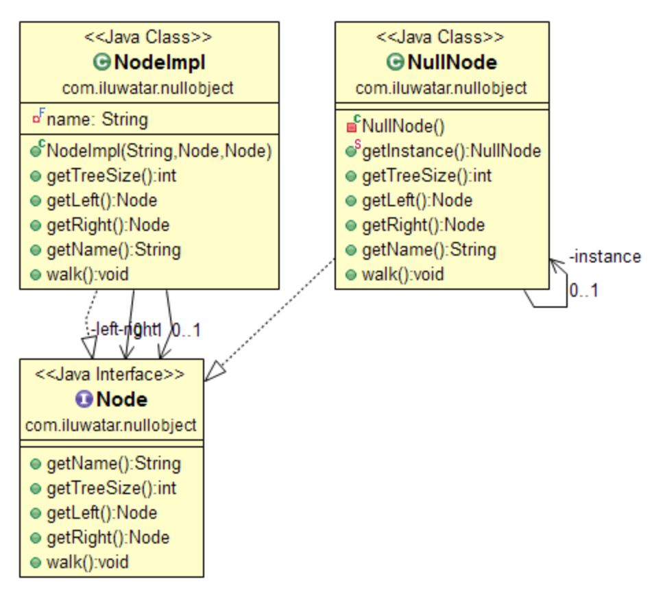

# [Design Pattern] Null Object Pattern
> date - 2018.10.06  
> keyword - design pattern, behavioral  
> null check를 피하기 위해 사용하는 Null Object Pattern에 대해 정리  

<br>

## Null Object란?
* 객체가 존재하지 않음을 표현할시 `exception throw 혹은 null을 사용하지 않고`, `neutral object`(interface를 구현하지만 메소드가 비어있는 객체) 사용
  * null check, exception throw를 사용하면 디자인이 복잡해질 수 있다
* null safe하게 만들 수 있다

### Applicability
* 객체에 대한 명시적인 null check를 피하고 가독성을 높이고 싶은 경우

<br>

## Example 1



```java
/**
 * Interface for binary tree node
 */
public interface Node {

    String getName();

    int getTreeSize();

    Node getLeft();

    Node getRight();

    void walk();
}

/**
 * Implementation for binary tree's normal nodes
 */
public class NodeImpl implements Node {

    private final String name;

    private final Node left;

    private final Node right;

    public NodeImpl(String name, Node left, Node right) {
        this.name = name;
        this.left = left;
        this.right = right;
    }

    @Override
    public String getName() {
        return name;
    }

    @Override
    public int getTreeSize() {
        return 1 + left.getTreeSize() + right.getTreeSize();
    }

    @Override
    public Node getLeft() {
        return left;
    }

    @Override
    public Node getRight() {
        return right;
    }

    @Override
    public void walk() {
        System.out.println(name);

        if (left.getTreeSize() > 0) {
            left.walk();
        }
        
        if (right.getTreeSize() > 0) {
            right.walk();
        }
    }
}

/**
 * Null Object implementation for binary tree node
 */
public class NullNode implements Node {

    private static NullNode instance = new NullNode();

    private NullNode() {
    }

    public static NullNode getInstance() {
        return instance;
    }

    @Override
    public String getName() {
        return null;
    }

    @Override
    public int getTreeSize() {
        return 0;
    }

    @Override
    public Node getLeft() {
        return null;
    }

    @Override
    public Node getRight() {
        return null;
    }

    @Override
    public void walk() {
        // do nothing
    }
}

public class App {

    /*
    root
     └── 1
         ├── 11
         │   └── 111
         └── 12
              └── 122
     */
    public static void main(String[] args) {
        Node root = new NodeImpl("1", new NodeImpl("11", new NodeImpl("111", NullNode.getInstance(),
                NullNode.getInstance()), NullNode.getInstance()), new NodeImpl("12", NullNode.getInstance(), new NodeImpl("122", NullNode.getInstance(), NullNode.getInstance())));

        root.walk();
    }
}
```

<br>

## Example 2
```java
public class NullObjectDemo {

    public static void main(String[] args) {
        Application app = new Application(new NullPrintStream());
        app.doSomething();
    }
}

class NullOutputStream extends OutputStream {

    @Override
    public void write(int b) throws IOException {
        // do nothing
    }
}

class NullPrintStream extends PrintStream {

    public NullPrintStream() {
        super(new NullOutputStream());
    }
}

class Application {
    private PrintStream debugOut;

    public Application(PrintStream debugOut) {
        this.debugOut = debugOut;
    }

    public void doSomething() {
        int sum = 0;
        for(int i=0; i<10; i++) {
            sum+=1;
            debugOut.println("i = " + i);
        }
        System.out.println("sum = " + sum);
    }
}
```

<br>

> #### Reference
> * [Null Object in Java](https://sourcemaking.com/design_patterns/null_object/java/1)
> * [null-object](https://github.com/iluwatar/java-design-patterns/tree/master/null-object)
