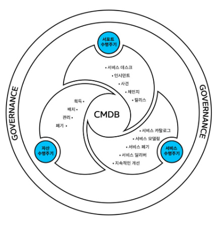

# [DevOps] CMDB(Configuration Management Database)
> date - 2022.03.14  
> keyworkd - cmdb  
> cmdb에 대해 정리  

 

## CMDB란?

  

* **IT 환경에 대한 데이터 웨어하우스**
  * IT 환경을 구성하는 모든 자산에 대한 정보를 저장하는 데이터 저장소
  * AWS라고 하면 EC2, RDS, ElastiCache, Route53의 도메인, S3 bucket 등이 대상
* HW, OS, 서비스 등 모든 비즈니스 자산을 저장하고, 자산의 관계에 대한 인사이트 제공
  * 장애 발생 상황 등에서 특정 키워드로 검색하면 관련된 모든 리소스 정보를 보여주는 기능 포함
  * 정보 흐름을 통합하여 OS install -> OS 설정 -> 서비스 투입 -> 반출 -> 모니터링 등 각 단계별로 모든 정보를 중앙에서 관리
* 자동화된 인프라 구축을 위해 CMDB 관리 중요
  * 낭비되고 있거나 규정에 맞지 않는 것들을 컨트롤
  * 스케일링 컨트롤
  * 최적화된 배포를 통해 비용 효율화

 

## 주요 기능
* 구성 항목(CI, Configuration Items)에 대한 저장, 조회, 버전 관리 및 영향 분석 정보 관리
  * 특정 환경에 의존하지 않는 계층적 개념을 다루는 용어를 통해 자산 현황을 파악
  * 인프라의 각 구성 요소별로 API로 통신하거나 자동으로 처리할 수 있는 방법이 있어야함
    * e.g. 서비스 배포시 또는 다른 서비스에서 사용할 수 있는 metadata(e.g. tag)를 조회할 수 있는 API 제공
  * 감사(audit) 대상인 리소스들을 조회하는 기능 제공  
* 영향 분석, 베이스라인 통제, 형상 정보 통계 현황 및 리포팅
* CI에 대한 계층적, peer to peer 시각화 및 이를 통한 영향도/위험도 분석

 

## Schema
* 구성 항목(CI, Configuration Items) - ID와 이름, 설명, 소유자 정보
* 분류 체계 - 시스템, 서브 시스템, 업무 카테고리
* 이력 정보 - 데이터의 버전 정보, 이력
* 구성 정보 - Configuration Item의 정보
* 연관 정보 - CI의 연관 정보 관리

 

## CMDB 사용의 장단점
### 장점
* 중앙 집중화된 IT 환경에 대한 전체 데이터를 쉽게 접근 가능
* 외부 데이터 소스의 데이터를 통합
* 중요 자산의 구성 및 자산의 종속 구성 요소를 이해할 수 있다
* 다양한 자신이 어떤 용도로 사용되며, 어떤 비즈니스 프로세스 및 사용자가 해당 자산에 의존하는지 파악
* IT 환경, 우녕ㅇ 비용 및 기술과 관련된 의사 결정을 지원하기 위한 정보 제공
* 취약점이 있을 수 있는 기술 자산의 인벤토리 정보를 제공하여 위험 관리 가능

 

### 단점
* 데이터 수집 및 저장 비용
  * 기업의 규모에 따라 데이터 셋의 규모가 커질 수 있기 때문에 데이터 수집 및 저장에 비용이 많이 들 수 있다
* 데이터 최신 상태로 유지
  * 기업의 IT 환경은 끊임없이 변화하기 때문에 자산의 변경 사항을 항상 최신 상태로 유지해야한다
* 데아터 사용의 편의성
  * CMDB의 가치는 보유한 데이터를 사용해야만 얻을 수 있다
  * CMDB를 효과적으로 사용하기 위한 tool 필요(e.g. ITSM application, 데이터 분석 기술, 데이터를 사용하는 프로세스)

 

## 수집 방식
AWS 환경이라면
* AWS account에 agent가 설치되어 정보를 CMDB로 수집
  * agent 관리 필요
* 중앙에서 각 AWS account의 권한을 할당받아(assume role) 수집
  * account 추가시 권한 작업 필요

  

> #### Reference
> * [구성 관리 데이터베이스(Configuration Management Database, CMDB)](https://www.freshworks.com/ko/freshservice/cmdb)
> * [구성 관리 데이터베이스(CMDB)란?](https://www.servicenow.com/kr/products/it-operations-management/what-is-cmdb.html)
