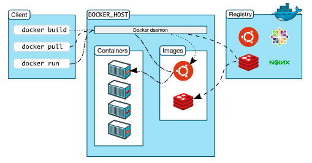
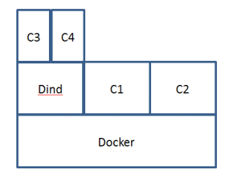
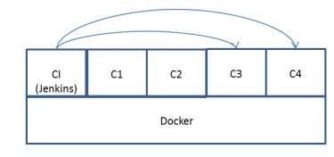

# [Docker] DinD(Docker in Docker) and Dood(Docker out of Docker)
> date - 2021.04.13  
> keyworkd - docker, dind, dood  
> CI tool에서 docker build를 수행할 때 사용하는 개념인 DinD, DooD에 대해서 정리  

<br>

## Docker Architecture
<div align="center">
  
</div>

* Docker는 Docker `daemon`, `client`, `registry`로 구성

<br>

### Docker daemon(dockerd)
* Docker API request를 수신하고, Docker objcet(image, container, network, volume 등) 관리
* 다른 daemon과 통신하여 Docker service를 관리

<br>

### Docker client
* dockerd의 client로 `docker run` 같은 docker command(Docker API)를 `dockerd`로 보낸다

<br>

### Docker Registry
* image를 저장
* 기본적으로 Docker Hub를 사용


<br>

## DinD(Docker in Docker)
* container 내부에서 host와 격리된 `dockerd`를 실행
  * `dockerd`가 **container 내부에서 실행되므로 Docker in Docker**라고 부른다
* CI에서 Task를 수행하는 agent가 `docker client`, `dockerd`의 역할을 같이 수행
* DinD의 주요 목적은 Docker 개발 자체를 지원하는 것이었으나 CI tool에서도 사용된다
  * build task가 매번 새로운 환경에서 실행되어 image layer caching이 되지 않는다
* container가 `privilieged mode`로 실행되어야 한다는 단점이 있다
```sh
$ docker run --privileged docker:dind
```

<br>

<div align="center">
  
</div>

* Dind, C1, C2 - host에서 실행되는 container
* C3, C4 - DinD Container에서 실행되는 container


<br>

## DooD(Docker out of Docker)
* host의 docker socket을 container와 공유하여 host의 `dockerd`에 docker command를 실행
* image layer caching을 이용할 수 있어 CI tool에서는 DinD보다 권장

<br>

<div align="center">
  
</div>

<br>

* docker
```sh
$ docker run -v /var/run/docker.sock:/var/run/docker.sock <image>

## example
$ docker run --rm -v /var/run/docker.sock:/var/run/docker.sock docker docker ps
```

* docker-compose
```yml
version: "3.8"

services:
  serverless:
    image: test-app:tag
    volumes:
      - /var/run/docker.sock:/var/run/docker.sock  # here 
```


<br><br>

> #### Reference
> * [docker - Docker Hub](https://hub.docker.com/_/docker)
> * [jpetazzo/dind](https://github.com/jpetazzo/dind)
> * [~jpetazzo/Using Docker-in-Docker for your CI or testing environment? Think twice.](https://jpetazzo.github.io/2015/09/03/do-not-use-docker-in-docker-for-ci/)
> * [Docker in Docker and play-with-docker](https://sreeninet.wordpress.com/2016/12/23/docker-in-docker-and-play-with-docker/)
> * [Use Docker to build Docker images](https://docs.gitlab.com/ee/ci/docker/using_docker_build.html#enable-docker-commands-in-your-cicd-jobs)
