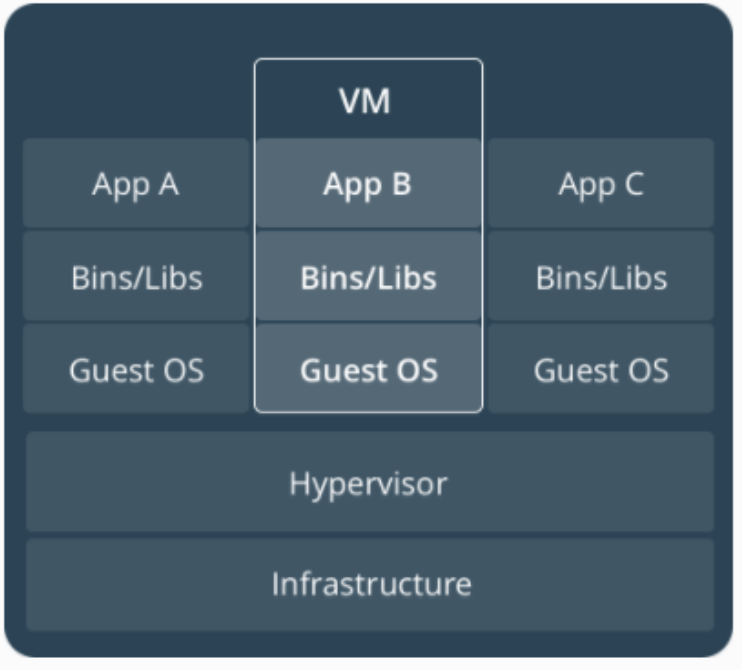
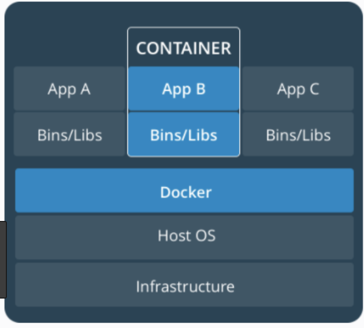
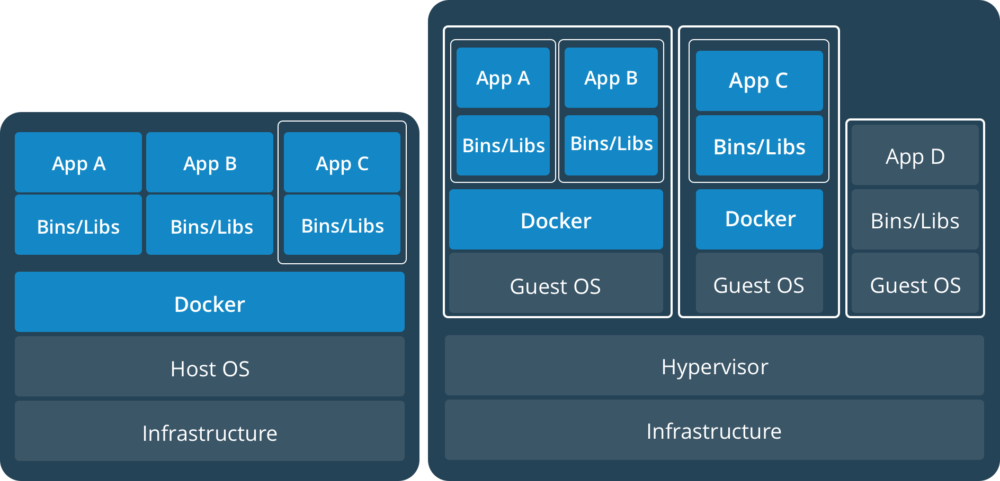
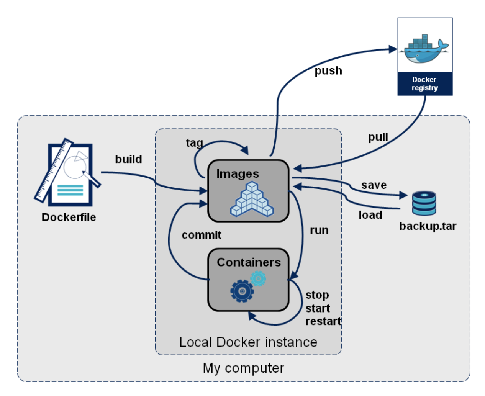

# [Docker] Docker Basic

<br>

## [컨테이너란?](https://www.docker.com/what-container)
* 가상화보다 훨씬 가벼운 기술

<div align="center">
  
    
</div>

<br>

#### Virtual Machines
* Type 1 Hypervisor, Type 2 Hypervisor, Para-Virtualization(반가상화), Full-Virtualization(전가상화) 등 
* Hypervisor 위에 Guest OS 설치하여 가상화
  * 항상 Guest OS 필요
  * 이미지 용량이 커짐
* Xen, Kvm, VMware, Virtualbox 등


#### Container
* isolation(격리) + Resource Management
* Docker Engine 위에 Application 격리
  * Docker 이미지에 Application과 Library만 격리하여 설치
  * OS 자원(System Call)은 호스트와 공유
  * 이미지 용량 감소
* HW 가상화 계층 X
  * 메모리 접근, 파일 시스템, 네트워크 속도가 VM에 비해 월등히 빠르다


ex) VM 위에 Docker 사용  
AWS EC2에 Docker를 사용하면 이런 모습이라고 생각하면 된다


<br>

### 1. 서버의 성능이 좋아졌다 
* 서버가 놀고 있다
* 서버에 VM을 여러개 띄워서 일을 더 시키자

<br>

### 2. IT 기술이 보편화되면서 서버도 많아짐
* 서버자체를 VM에 집어넣어서 돌리자
* VM에 각종 서버 프로그램, DB등을 설치하여 App을 실행
* 미리 구축한 VM 이미지를 여러 서버에 복사하여 실행하면 이미지 하나로 서버를 계속 만들어 낼 수 있음
* 가상화 기술을 이용하여 서버를 임대해주는 서비스가 `클라우드 서비스`

<br>

### 3. 근데 가상머신은 문제가 있어
* 컴퓨터를 통째로 만들어내다 보니 각종 성능 손실이 발생
* 인텔, AMD는 CPU안에 가상화 기능을 넣기 시작
* 그래도 느림
* 호스트와 커널을 공유하는 반가상화 기술 등장

<br>

### 4. 이러나 저러나 VM은 완전한 컴퓨터
* 항상 게스트 OS를 설치해야함  
* 이미지안에 OS가 포함
  * 이미지 용량이 커짐 
  * 네트워크로 가상화 이미지를 주고받는건 꽤 부담스러움

<br>

### 5. 오픈소스 가상화SW는 OS가상화에만 주력
* 배포와 관리 기능이 부족

<br>

### 6. VM의 성능문제가 있다보니 리눅스 컨테이너가 나옴
* 컨테이너 안에 가상공간을 만들지만 실행파일을 호스트에서 직접 실행
* 리눅스 커널의 cgroups, namespaces가 제공하는 기술
* 가상화가 아닌 `격리`!!


<br>

## Docker의 특징

### 1. 게스트 OS를 설치하지 않음 
* 이미지에 서버운영을 위한 프로그램과 라이브러리만 `격리해서 설치`
* 이미지 용량이 크게 줄어듦
* 호스트와 OS자원(system call)을 공유
* 리눅스 커널에서 제공하는 `컨테이너 기술 이용`

<br>

### 2. HW가상화 계층이 없음
* 메모리 접근, 파일 시스템, 네트워크 전송속도가 VM에 비해 월등히 빠름
* 호스트와 Docker Container 사이의 성능차이가 크지 않음(오차범위 안)

<br>

### 3. 이미지 생성과 배포에 특화
* 이미지 버전관리도 제공하고 중앙저장소에 이미지를 올리고 받을 수 있음(Push/Pull)
* 이미지를 공유하는 Docker hub 제공
  * GitHub와 비슷한 방식

<br>

### 4. 다양한 API를 제공하여 원하는 만큼 자동화 가능
* 개발과 서버 운영에 매우 유용
* 개발, 테스트, 서비스 환경을 하나로 통일하여 효율적으로 관리
* 복잡한 리눅스 애플리케이션을 `컨테이너로 묶어서` 실행


<br>

## Docker Image와 Container의 차이?
* 이미지
  * 서비스 운영에 필요한 `서버 프로그램, 소스코드, 컴파일된 실행파일을 묶은 형태`
  * 저장소에 올리고 받는건(push/pull) 이미지
  * OS로 치면 `실행파일`
* 컨테이너
  * `이미지를 실행`한 상태
  * 이미지로 `여러개의 컨테이너`를 만들 수 있음
  * OS로 치면 `프로세스`

> #### 도커의 이미지 처리방식, 도커는 이미지의 바뀐 부분을 어떻게 관리하나?
> * 유니온 파일 시스템 형식(aufs, btrfs, devicemapper)
> * 베이스 이미지에서 `바뀐부분만` 이미지로 생성
> * 컨테이너로 실행할 때는 베이스 이미지와 바뀐 부분을 합쳐서 실행
> * Docker Hub 및 개인저장소에서 이미지를 공유할 때 바뀐 부분만 주고 받음
>   * 각 이미지는 의존관계 형성


<br>

## 서비스 운영과 도커
* 지금까지는 물리서버를 직접 운영
  * 호스팅 또는 IDC 코로케이션 서비스 사용
  * 서버구입과 설치에 돈이 많이들고 시간이 오래걸림
* 가상화가 발전하면서 클라우드 환경으로 변화
  * 가상서버를 임대하여 사용한 만큼만 요금지불
  * 클릭 몇번만으로 가상서버를 생성 - 자동으로 서버를 추가, 삭제
  * 서버 대수가 많아지면서 사람이 일일이 세팅하기 힘들어짐
    * `Immutable Infrastructure`라는 패러다임 등장

<br>

### Immutable Infrastructure
* 호스트 OS와 서비스 운영환경(서버 프로그램, 소스코드, 컴파일된 바이너리)을 분리
* 1번 설정한 운영환경은 변경하지 않는다(Immutable)는 개념
* 서비스 운영환경을 이미지로 생성한 뒤 서버에 배포하여 실행 
* 서비스가 업데이트되면 운영환경 자체를 변경하지 않고, 이미지를 새로 생성하여 배포
* 클라우드 플랫폼에서 서버를 쓰고 버리는 것과 같이 Immutable Infrastructure도 서비스 운영환경 이미지를 1번쓰고 버림

#### Immutable Infrastructure 장점

##### 1. 편리한 관리
* 서비스 환경 이미지만 관리하면 됨
* 중앙 관리를 통한 체계적인 배포와 관리
* 이미지 생성에 버전관리 시스템 활용

##### 2. 확장
* 이미지 하나로 서버를 계속 찍어낼 수 있음
* 클라우드 플랫폼의 Auto Scaling기능과 연동하여 손쉽게 서비스를 확장

##### 3. 테스트
* 개발자 PC, 테스트 서버에서 이미지를 실행만 하면 서비스 운영환경과 동일한 환경이 구성됨
* 테스트가 간편

##### 4. 가볍다
* OS와 서비스 환경을 분리하여 가볍고(Lightweight) 어디서든 실행가능한(Portable) 환경 제공


<br>

## Docker
* `Immutable Infrastructure`를 구현한 프로젝트
* 컨테이너를 싣고 다니는 고래
  * 고래는 서버에서 여러개의 컨테이너(이미지)를 실행하고 이미지 저장과 배포(운반)을 의미
  * 고래 -> Docker(이미지 생성, 저장, 실행, 배포)
  * 고래 위 컨테이너 -> 이미지, 컨테이너
* `Build, Ship, and Run Any App, Anywhere`
  * 서비스 운영환경을 묶어서 손쉽게 배포하고 실행하는 `경량 컨테이너 기술`
  * 애플리케이션과 애플레케이션 실행에 필요한 것들을 `포장`하고, 포장한 것을 손쉽게 이동시켜 어디서나 실행시킬 수 있게 하는 도구와 환경을 제공하는 `오픈소스 컨테이너 플랫폼`
* 중요 기반 기술
  * cgroups
  * namespaces(Process ID, Mount, UTS, User ID, IPC, Network...)
  * union-capable file system(OverlayFS, AuFS...)

<br>

### Workflow



<br>

## Docker 설치하기
* Linux

### 자동으로 설치하기
* 리눅스 배포판 종류를 자동으로 인식하여 Docker Package를 설치해주는 스크립트 제공
```sh
# wget 옵션 참고 - http://coffeenix.net/board_print.php?bd_code=168
$ wget -qO- https://get.docker.com/ | sh
   
# 설치하면 hello-world이미지도 자동 설치, 사용하지 않을것이므로 모두 삭제
$ docker rm 'sudo docker ps -aq'
$ docker rmi hello-world
```

<br>

### 수동으로 설치하기
* 우분투, /usr/bin/docker.io실행 파일을 /usr/local/bin/docker로 링크하여 사용
```sh
$ apt-get update
$ apt-get install docker.io
$ ln -sf /usr/bin/docker.io /usr/local/bin/docker
```

* Centos6, 패키지 저장소에 docker-io가 없으므로 EPEL 저장소를 사용
```sh
$ yum install http://dl.fedoraproject.org/pub/epel/6/x86_64/epel-release-6-8.noarch.rpm
$ yum install docker-io
```

* Centos7, docker 패키지 설치
```sh
$ yum install docker
```
> AWS EC2 - Amazon Linux, EPEL를 설치하지 않아도 됨  

* mac, brew 사용
```sh
$ brew cask install docker
```

<br>

### Docker 서비스 실행하기
```sh
$ service docker start

# 부팅했을 때 자동으로 실행하기
$ chkconfig docker on
```

<br>

### 최신 바이너리 사용하기
* 배포판 별 패키지가 아닌 빌드된 바이너리를 직접 사용하는 방법

#### 이미 패키지로 설치했을 때
```sh
$ service docker stop
$ wget https://get.docker.com/builds/Linux/x86_64/docker-latest \ -0 $(type -P docker)
$ service docker start
```

#### 새로 설치할 때, URL을 지정
* docker-latest(최신 버전)
* docker-1.3.0(특정 버전)
```sh
$ wget https://get.docker.com/builds/Linux/x86_64/docker-latest
$ chmod +x docker-latest
$ mv docker-latest /usr/local/bin/docker
$ /usr/local/bin/docker -d
```


<br>

## 명령어
* 항상 root권한으로 실행
* `root 권한 + docker <command>`
```sh
$ docker <command>
# ex) docker run, docker push
```

<br>

> #### sudo를 매번 입력하지 않으려면
> * root계정 이용
> ```sh
> $ sudo su
> ```
> * 현재 계정을 docker 그룹에 포함(root 권한과 동일하므로 꼭 필요한 계정만 포함)
>   * 재로그인 필요
> ```sh
> $ sudo usermod -aG docker ${USER}
> $ sudo service docker restart
> ```

<br>

### 이미지 검색
```sh
$ docker search <image name>
```
* ubuntu, centos, redis 등 os, `프로그램 이름을 가진 이미지가 공식 이미지`, 나머지는 사용자가 배포한 이미지
* Docker Hub를 통해 이미지를 공유하는 생태계가 구축되어 있다
* 유명 리눅스 배포판, 오픈 소스 프로젝트(Redis, Nginx 등)의 이미지를 모두 Docker Hub에서 구할 수 있음
* `이미지와 관련된 명령은 기본적으로 Docker Hub를 이용`하도록 설정되어 있음

<br>

### Pull 명령어로 이미지 받기
```sh
$ docker pull <image name>:<tag>

# example
$ docker pull ununtu:latest
```
* 이미지 이름뒤에 `latest`를 설정하면 최신버전을 받음
* ubuntu:14.04, ubuntu:12.10처럼 `태그를 지정`할 수 있음
* 이미지 이름에서 pyrasis/ubuntu처럼 / 앞에 사용자명을 지정하면 해당 사용자가 올린 이미지를 받음
  * 공식 이미지는 사용자명 X
* 호스트에 설치된 리눅스 배포판과 도커 이미지의 배포판 종류는 달라도 됨, 즉 Contos에서 Ununtu컨테이너를 실행할 수 있음

<br>

### 이미지 목록 출력
```sh
# 모든 이미지
$ docker image ls

# 이미지 이름을 설정하면 이름은 같지만 태그가 다른 이미지가 출력
$ docker image ls ubuntu  

# 해당 tag 이전의 image 조회
$ docker image ls <image repository> —filter “before=<image repository>:<tag>“
```

<br>

### 컨테이너 생성하기
```sh
$ docker run <options> <image name>

# example
$ docker run -it --name hello ubuntu /bin/bash
```
* ubuntu 이미지를 컨테이너로 생성한 뒤 ubuntu 안의 `/bin/bash`를 실행
* i(interactive), -t(Pseudo-tty)를 사용하면 실행된 `bash쉘에 입력 및 출력 가능`
* `--name` 으로 컨테이너에 이름을 지정할 수 있음. 이름을 지정하지 않으면 도커가 자동으로 이름을 생성하여 지정
* 우분투 이미지에서 /bin/bash 실행파일을 실행했기 때문에 여기서 빠져나오면 컨테이너 stop됨

<br>

> #### centos에서
> `unable to remount sys read only: unable to mount sys as readonly max retries reached 에러` 발생시 /etc/sysconfig/docker 파일에 `--exec-dirver=lxc 추가` 그리고 `$ sudo service docker restart`로 재시작

<br>

### 컨테이너 목록 확인하기
```sh
$ docker ps

# example 1 - 실행되고 있는 컨테이너 출력
$ docker ps

# example 2 - 정지된 컨테이너까지 모두 출력
$ docker ps -a
```

<br>

### 컨테이너 시작하기
```sh
$ docker start <컨테이너 이름 or ID>
```

<br>

### 컨테이너 재시작하기
```sh
$ docker restart <컨테이너 이름 or ID>
```

<br>

### 컨테이너에 접속하기
```sh
$ docker attach <컨테이너 이름 or ID>
```

<br>

### 외부에서 컨테이너 안의 명령 실행하기
```sh
$ docker exec <컨테이너 이름 or ID> <명령> <매개 변수>
```
* 컨테이너가 실행되고 있는 상태에서만 사용
   * 정지된 상태에서는 사용할 수 없음
* 이미 실행된 컨테이너에 apt-get, yum명령으로 패키지를 설치하거나 각종 데몬을 실행할 때 활용

<br>

### 컨테이너 정지하기
```sh
$ docker stop <컨테이너 이름 or ID>
```

<br>

### 컨테이너 삭제하기
```sh
$ docker rm <container name or ID>
$ docker ps -a 해도 안나온다  # 삭제 확인
```

<br>

### 이미지 삭제하기
```sh
$ docker rmi <image>


# example
$ docker rmi ubuntu:latest

# 특정 image 이전의 image 제거
$ docker rmi $(docker image ls opklnm102/test-app --filter "before=opklnm102/test-app" -q)
```
* tag 생략시 이름이 같은 모든 이미지 삭제


<br>

## Docker 이미지 생성하기

### 1. Dockerfile 작성하기
* Docker Image 설정 파일
* `Dockerfile`의 설정을 따라 이미지를 생성
```sh
# ex. Dockerfile 작성하기
# ubuntu 14.04를 기반으로 nginx 서버를 설치한 도커 이미지 생성
FROM ubuntu:14.04  # 어떤 이미지를 기반으로 할지 설정 <image name>:<tag> 형식
MAINTAINER Foo Bar foo@bar.com # 메인테이너 정보

RUN apt-get update  # RUN으로 쉘 스크립트 혹은 명령 실행
RUN apt-get install -y nginx  # 이미지 생성중에는 사용자 입력을 받을 수 없으므로 apt-get install에서 -y옵션 사용
RUN echo "\ndaemon off;" >> /etc/nginx/nginx.conf
RUN chown -R www-data:www-data /var/lib/nginx

VOLUME ["/data", "/etc/nginx/site-enabled", "/var/log/nginx"]  # 호스트와 공유할 디렉토리 목록

WORKDIR /etc/nginx  # 다음 CMD에서 설정한 실행 파일이 실행될 리렉토리

CMD ["nginx"]  # 컨테이너가 시작되었을 때 실행할 실행파일 또는 스크립트

EXPOSE 80  # 호스트와 연결할 포트 번호
EXPOSE 443
```

<br>

### 2. build 명령으로 이미지 생성
```sh
$ docker build hello:0.1 .
```
* `--tag`옵션으로 이미지 이름과 태그를 설정할 수 잇음
* 이미지 이름만 설정하면 태그는 `latest`로 설정됨

```sh
$ docker run --name hello-nginx -d -p 80:80 -v /root/data:/data hello:0.1
```
* `-d`옵션 컨테이너를 `백그라운드로 실행`
* `-p 80:80(host:docker)`옵션으로 호스트의 80번 포트와 컨테이너의 80번 포트를 연결하고 외부에 노출
* `-v /root/data:/data`옵션으로 호스트의 /root/data 디렉토리를 /data 디렉토리에 연결
* `http://<host ip>:80`으로 접속하면 Welcome to nginx! 페이지가 표시됨!

> docker build시 이전 과정에서 build한 layer를 caching하기 때문에 더 빠르다

<br>

### Ex. Docker로 Spring Boot App build 해보기
* Dockerfile
```dockerfile
# container image build에 사용하는 base image를 의미
FROM dockerfile/java:oracle-java8

# docker inspect 커맨드를 통해 볼 수 있는 값을 설정(maintainer 등)
LABEL maintainer="opklnm102 <opklnm102@gmail.com>"

# container image 내부에서 환경 변수 설정
# image build시 환경 변수 때문에  error가 발생할 수 있으므로 build시 필요한 환경 변수라면 RUN을 이용
# ENV_FRONTEND=non-interactive의 경우 다음에 나오는 모든 RUN apt-get install에 영향을 주기 때문에
# 특정 RUN 커맨드에 한해서 비대화형으로 설정하고 싶은 경우
# RUN ENV_FRONTEND=non-interactive apt-get install 로 사용
ENV TZ=Asia/Seoul

# image build시 base image에 dependency를 설치 등의 명령어를 실행
# RUN apt-get install xxx
RUN useradd --create-home app

# 컨테이너 내부에 로컬 디렉토리를 생성하고
# 해당 디렉토리를 workdir 이후에 나오는 모든 커맨드(RUN, COPY) 실행의 작업 디렉토리로 설정
# npm같이 로컬이나 상대경로에 실행해야하는 경우 유용
WORKDIR /home/app

# host의 local file을 container image로 복사
# image에 source code를 복사하는 가장 효과적인 방법
# directory or file 복사
# .dockerignore에 정의된 파일은 제외
COPY build/libs/springboot_demo-0.0.1-SNAPSHOT.jar /home/app/app.jar

# host와 연결할 port 설정
EXPOSE 8080  

# CMD, ENTRYPOINT로 container 실행시 실행해야할 커맨드와 스크립트 등을 명시
# ENTRYPOINT에 실행 파일만 명시되어 있을 경우, CMD로 실행 파일에 대한 매개변수를 명시할 수 있다
CMD ["java", "-jar", "app.jar"]
```

* 위에서 작성한 `Dockerfile`을 기반으로 image build
```sh
$ docker build -t <image name> <dockerfile path>
```

* build한 image를 가지고 host port(8080)과 container port(8080)를 연결하여 외부에 노출하면서 container 생성
```sh
$ docker run -p 8080:8080 <image name/image id>
```


<br><br>

> #### Reference
> * [도커 무작정 따라하기: 도커가 처음인 사람도 60분이면 웹 서버를 올릴 수 있습니다!](https://www.slideshare.net/pyrasis/docker-fordummies-44424016)
> * [What is a Container](https://www.docker.com/what-container)
> * [Spring boot와 docker를 이용한 MSA](https://www.slideshare.net/heungrae_kim/spring-boot-docker-msa)
> * [Dockerfile reference](https://docs.docker.com/engine/reference/builder/)
