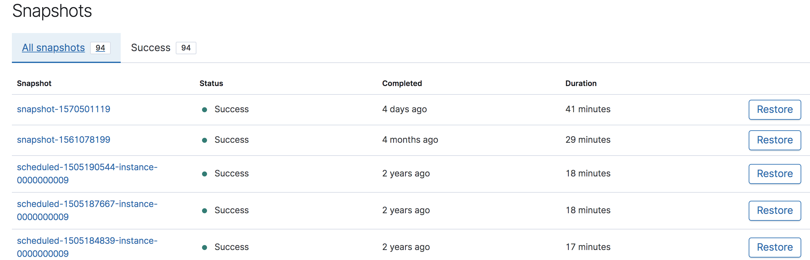
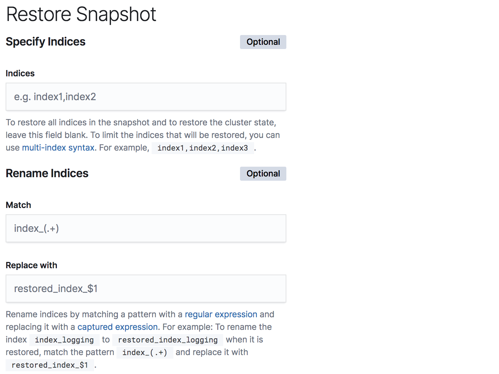
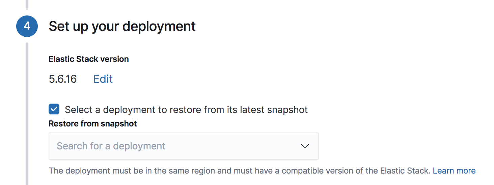

# [Elasticsearch Service] Snapshot and restore
> date - 2019.10.14  
> keyworkd - elasticsearch, es, elasticsearch service, snapshot, restore  
> Elasticsearch Service Documentation 중 Snapshot And restore 읽기

<br>

## Snapshot?
* 즉각적으로 생성되지 않고, 완료하는 데 시간이 걸린다
* snapshot을 시작한 시점에 존재하는 primary shard 포함
  * snapshot 진행 중에도 indexing 가능하지만 이때 변경된 내용은 snapshot에 포함되지 않는다 -> cluster의 완벽한 snapshot이 아니다
* incremental(증분식) snapshot으로 마지막으로 성공한 snapshot 이후로 변경된 data를 저장
* incremental snapshot의 특성으로 자주 생성되는 snapshot과 그렇지 않은 snapshot의 disk size 차이가 거의 없는 경우가 많다는 것을 의미
  * 시간별 snapshot 1주일치(총 168개)와 주말 1번의 snapshot이 큰 차이가 없다
* 자주 snapshot을 생성할수록 걸리는 시간이 줄어든다
  * daily snapshot은 20 ~ 30분 소요된다면, hourly snapshot은 몇 분안에 완료될 수 있다
  * 30분 마다 생성할 수도 있다


<br>

## Snapshot and restore
* data backup을 위한 **모든 Elasticsearch의 Snapshot and Restore API를 지원**
* custom repositories 추가 가능
* 여기서는 Elasticsearch Service에 대해서만 설명하므로 Snapshot, Restore API에 대해서는 [Snapshot and Restore](https://www.elastic.co/guide/en/elasticsearch/reference/7.4/modules-snapshots.html)를 참고

<br>

### Default repository
* cluster 생성시 `found-snapshots repository`가 자동으로 할당
* deployment ID는 repository `base_path`의 일부
  * `/snapshots/[cluster-id]`

<br>

### Sharing a repository across clusters
* 다른 cluster의 repository를 참조하는 custom repository를 생성
* 한 cluster에서 다른 cluster로 snapshot을 restore하려면 모두 동일한 region에 있어야 한다

<br>

* `GET /_snapshot/found-snapshots`로 bucket을 찾을 수 있다
```json
{
  "found-snapshots" : {
    "type" : "s3",
    "settings" : {
      "bucket" : "[RANDOM_STRING]",
      "base_path" : "snapshots/[cluster-id]",
      "server_side_encryption" : "true",
      "compress" : "true"
    }
  }
}
```
* bucket name - regison 내의 모든 cluster가 동일하고, `base_path`만 다르다

<br>

* second repository를 생성해 다른 cluster의 repository를 사용할 수 있다
  * e.g. production cluster에서 dev cluster로 data 복사시 dev cluster에서 `PUT /_snapshot/production`을 실행
* 참조하는 다른 cluster에는 snapshot에 대한 일관성을 보장하기 위해 `readonly` 설정 필요

```json
{
  "type": "s3",
  "settings" : {
    "bucket": "[RANDOM_STRING]",
    "base_path": "snapshots/[production-cluster-id]",
    "server_side_encryption": "true",
    "compress": "true",
    "readonly": "true",
    "aws_account": "[my-operations-account]",
    "client": "[dev-client]"
  }
}

// response
{
  "acknowledged": true
}
```

* `GET /_snapshot/production/_all`로 snapshots 조회
```json
{
    "snapshot": [
        ...
    ],
    ...
}
```

* `POST /_snapshot/production/[my-snapshot]/_resotre`로 snapshot restore
* `DELETE /_snapshot/production`으로 제거


<br>

## Restoring snapshots
* Snapshot으로 index restore 제공
  * Test를 위해 index copy, 실수로 삭제된 index 복구, 다른 deployment migration시 사용
* 기본적으로 30분마다 snapshot 생성
  * 주기는 수정 가능
* Success snapshot에 대해 최소 12 ~ 100개까지 저장
* Manual snapshot 생성도 가능
* Snapshot은 **open index만 backup**
  * Close index는 snapshot에 포함되지 않기 때문에, restore 불가

<br>

### List available snapshots
* Snapshot의 **shard 및 index count와 snapshot 성공 여부 등**을 확인할 수 있다



* List available snapshot에서 restore할 snapshot 선택


* 옵션을 지정하지 않으면 snapshot의 모든 index가 restore
* Specify indices
  * index pattern에 맞는 index를 restore
  * `logstash-*,.kibana`면 .kibana, logstash-로 시작하는 index만 restore
* 동일한 cluster에 restore하는 경우 이미 존재하는 index면 restore할 수 없으므로 `Match`, `Replace with`로 index renaming


<br>

## Restore across clusters
* 다른 cluster로 restore 가능
* cluster 복제를 하려면 snapshot의 모든 index를 다른 cluster에 restore하면 된다
  * X-Pack security feature나 Shield로 생성한 user는 restore되지 않기 때문에 새로운 cluster에서 수동으로 다시 생성해야 한다

<br>

### 유용한 Use case
* Performing ad hoc analytics
  * 대부분의 logging, metrics aggregation시 모든 data를 memory에 적재하는 것은 비용이 많이 들어서 사용 후 폐기할 수 있는 cluster를 사용하면 위험 없이 data를 분석하는데 효율적이다
* Testing upgrades
  * index와 application이 새로운 버전에 대한 호환성을 확인하기 위해 사용
* Enabling your developers
  * 개발을 위해서 production의 data를 사용
* Testing mapping changes
  * mapping 변경시 reindexing 필수인데, 최상의 indexing 성능을 찾기 위해 parameter 수정 테스트시 사용
  * source cluster에 scan, scroll query를 직접 사용해 처리할 수 있지만 long lived scroll은 scan query가 가벼운 경우에도 merge blocking이 발생하는 side effect가 있을 수 있다
* Integration testing
  * 실제 data를 사용해 application test를 자동화하여 performance metrics을 집계하면 application으로 인해 성능 저하가 발생했는지 감지할 수 있다

<br>

* `create a new deployment`의 Restore from snapshot에서 기존의 deployment를 선택하면 가장 최근 snapshot으로 restore


<br>

> snapshot restore시 
> 같은 region에서만 가능
> 다른 regison으로 restore시 custom repository 사용


<br>

## Snapshot and restore with custom repositories
* Elasticsearch Service는 AWS S3와 GCS(Google Cloud Storage)를 지원
* automated snapshot은 `found snapshots repository`에만 가능
  * custom repository는 manual snapshot만 저장

<br>

### Configure a snapshot reposotry using AWS

#### Prepare a bucket
* AWS account로 **cluster와 동일한 region에 bucket 생성**
* AWS IAM User 생성 후 `access key` 발급
* IAM User에 **생성한 bucket에 대한 policy 생성**
```json
{
    "Statement": [
        {
            "Action": [
                "s3:*"
            ],
            "Effect": "Allow",
            "Resource": [
                "arn:aws:s3:::bucket-name",
                "arn:aws:s3:::bucket-name/*"
            ]
        }
    ]
}
```

#### Create the repository
* `PUT /_snapshot/repository_name` 사용
```json
{
    "type": "s3",
    "settings": {
        "bucket": "name-of-bucket",
        "region": "region-of-bucket-same-as-cluster",
        "access_key": "your-access-key",
        "secret_key": "secret-key-with-just-permission-to-that-bucket-do-not-use-a-master-key",
        "compress": true,
    }
}
```

<br>

### Configure a snapshot repository using GCS
* GCS account로 cluster와 동일한 region에 bucket 생성

#### Configure the keystore
* `repository-gcs` plugin 활성 후 Elasticsearch keystore에서 GCS client에 대한 설정 추가

#### Create the repository
`PUT /_snapshot/repository_name` 사용
```json
{
    "type": "s3",
    "settings": {
        "bucket": "name-of-bucket",
        "region": "region-of-bucket-same-as-cluster",
        "access_key": "your-access-key",
        "secret_key": "secret-key-with-just-permission-to-that-bucket-do-not-use-a-master-key",
        "compress": true,
    }
}
```


<br><br>

> #### Reference
> * [Snapshot and restore - Elasticsearch Service Documentation](https://www.elastic.co/guide/en/cloud/current/ec-snapshot-restore.html)

<br>

> #### Further reading
> * [Snapshot And Restore - Elasticsearch Docs](https://www.elastic.co/guide/en/elasticsearch/reference/7.4/modules-snapshots.html)
