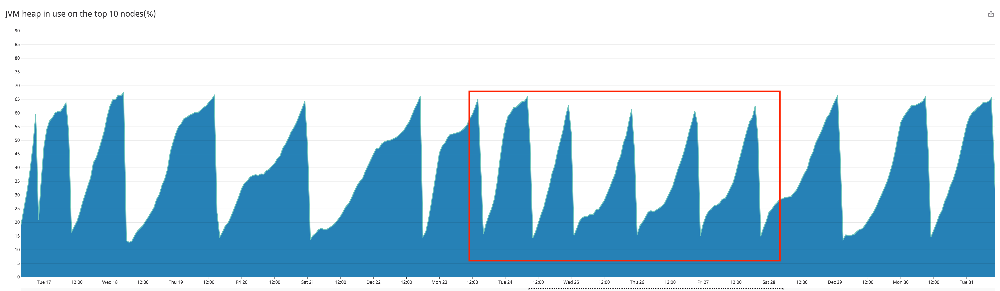
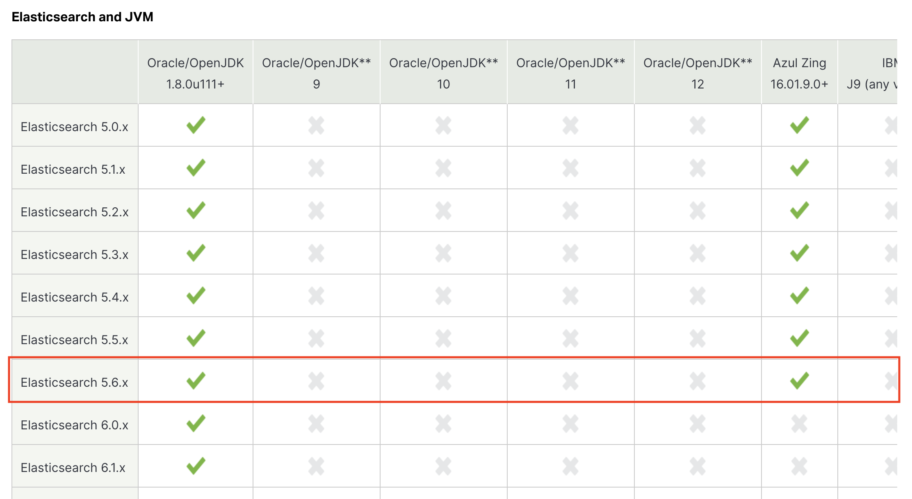
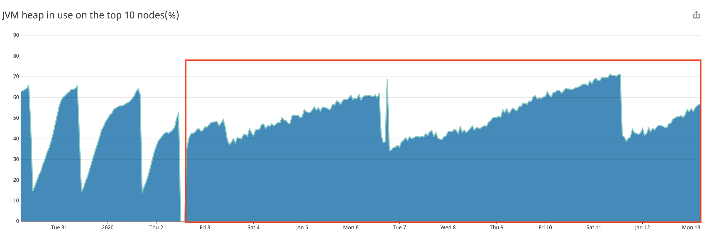

# [ES] Apply Elasticsearch G1 GC and upgrade version
> date - 2020.01.12  
> keyword - elasticsearch  
> Elasticsearch를 CMS GC에서 G1 GC로 변경과 버전 업그레이드 과정을 정리

<br>

## Requirement

### Dependency
```
Elasticsearch 5.6.4
OpenJDK_8u131
```


<br>

## Issue
* Elasticsearch로 query를 날리는 Java application에서 `java.net.SocketTimeoutException: Read timed out` exception 발생



* 기존보다 잦아진 Major GC의 GC pause time으로 인해 발생하는 이슈임을 파악


<br>

## Resolve
* CMS GC의 특성상 응급 처치로 restart라는 방법이 있으나 언제까지 그럴 수는 없으므로 방안을 모색
  1. heap size를 줄여서 **더 잦은 Major GC를 발생시켜 더 짧은 GC pause time**을 가져가도록 한다
  2. 다른 GC를 사용한다
* CMS GC의 튜닝이 시작되면 memory 사용 패턴에 따라 지속적으로 관리가 필요하고, JDK9에서 CMS GC는 deprecated 되었기 때문에 **G1 GC로 변경**하기로 결정

<br>

### Lucene Bug
* G1 GC와 Lucene의 호환성 이슈는 
* [Don't Touch These Settings! - Elasticsearch - The Definitive Guide](https://www.elastic.co/guide/en/elasticsearch/guide/master/_don_8217_t_touch_these_settings.html)에서도 확인할 수 있고, 그 중에 잘 알려진 bug인 [LUCENE-5168](https://issues.apache.org/jira/browse/LUCENE-5168)은 [JDK-8038348](https://bugs.openjdk.java.net/browse/JDK-8038348)가 원인으로 JDK9에서 fix되어 JDK8에 backport가 존재
* 현재 사용하는 JDK인 `OpenJDK_8u131`은 [8u131 Update Release Notes](https://www.oracle.com/technetwork/java/javase/8u131-relnotes-3565278.html)에서 확인할 수 있듯 b11로 backport인 b31보다 낮기 때문에 **JDK 업그레이드 필요**

<br>

### Check JDK
* 현재 사용 중인 Elasticsearch 5.6.4에서는 JDK 1.8.0u111+만 support(9, 10... 선택 불가)



* [Install Elasticsearch with Docker - Elasticsearch Reference 5.6](https://www.elastic.co/guide/en/elasticsearch/reference/5.6/docker.html)에서 제공하는 Elasticsearch 5.6.16의 JDK version check
```sh
$ java -version
openjdk version "1.8.0_212"
OpenJDK Runtime Environment (build 1.8.0_212-8u212-b01-1~deb9u1-b01)
OpenJDK 64-Bit Server VM (build 25.212-b01, mixed mode)
```
* Lucene bug가 patch된 버전인 1.8.0_8u212라서 G1 GC 사용 가능한 것을 확인

<br>

### Make Dockerfile
* plugin 수정 등 custom하기 위해 `Dockerfile` 생성
```dockerfile
FROM docker.elastic.co/elasticsearch/elasticsearch:5.6.16

LABEL maintainer="Hue Kim <opklnm102@gmail.com>"

# copy elasticsearch config file - elasticsearch.yml, log4j2.properties, jvm.options
COPY config /usr/share/elasticsearch/config

RUN bin/elasticsearch-plugin remove --purge x-pack  \
    && bin/elasticsearch-plugin remove --purge ingest-geoip \
    && bin/elasticsearch-plugin remove --purge ingest-user-agent
```

<br>

### G1 GC로 설정
* jvm.options 파일에 아래와 같이 GC 설정
```yaml
# jvm.options
## JVM configuration
## GC configuration
-XX:+UseG1GC
-XX:MaxGCPauseMillis=300
```

<br>

### Upgrade Elasticsearch
* 5.6.4 -> 5.6.16은 [Upgrading Elasticsearch - Elasticsearch Docs 5.6](https://www.elastic.co/guide/en/elasticsearch/reference/5.6/setup-upgrade.html)에서 Rolling upgrade가 가능한 것을 확인하여 rolling upgrade를 진행
* elasticsearch cluster를 kubernetes에서 container로 사용하고 있으므로 upgrade는 image만 교체해주면 되므로 비교적 간단하지만 shard가 유실되지 않게 주의해야할 필요가 있다

#### 1. Disable shard allocation
* node shutdown시 발생하는 shard rebalancing을 비활성하여 **I/O가 낭비되지 않도록한다**
```http
PUT _cluster/settings
{
  "transient": {
    "cluster.routing.allocation.enable": "none"
  }
}
```

#### 2. Stop-non essential indexing and perform a synced flush(optional)
* synced flush를 통해 **shard recovery가 빨리되도록 한다**
* **best effort** operation으로 필요한 경우 여러번 호출한다
```http
POST _flush/synced
```

#### 3. Stop and upgrade a single node
* 하나씩 기존 버전의 node를 shutdown 후 새로운 버전의 image로 교체

#### 4. Check cluster join to single node
* upgrade된 버전의 node가 cluster에 join
```http
GET _cat/nodes
```

#### 5. Reenable shard allocation
* node의 cluster join이 확인되면 shard allocation을 활성화
```http
PUT _cluster/settings
{
  "transient": {
    "cluster.routing.allocation.enable": "all"
  }
}
```

#### 6. Wait for the node to recover
* shard의 유실을 방지하기 위해 shard allocation을 기다린다
* `_cat/health`로 **green**이 될 때까지 기다린다
```http
GET _cat/health
```
* `sync-flushed`되지 않은 shard 복구에는 오래 걸릴 수 있고 `_cat/recovery`로 shard status를 확인
```http
GET _cat/recovery
```
#### 7. Repeat
* cluster가 안정화되면 나머지 모든 node에 대해 위 단계를 반복

<br>

> 물론 위의 과정을 script로 작성하여 진행했다

<br>

### heap memory 패턴 변화
* G1 GC로 변경 후 heap memory의 패턴을 확인


* CMS보다 완만해진 패턴으로 변화한 것을 확인할 수 있다


<br>

## Conclusion
* JDK 9이상을 사용 중이라면 G1 GC로 변경하여 CMS GC의 major GC가 가지고 있는 overhead로 인한 성능 이슈를 개선할 수 있으므로 시도해봐도 좋을듯하다

<br><br>

> #### Reference
> * [G1 GC 적용 과 JVM Upgrade](https://brunch.co.kr/@alden/45)
> * [Don't Touch These Settings! - Elasticsearch - The Definitive Guide](https://www.elastic.co/guide/en/elasticsearch/guide/master/_don_8217_t_touch_these_settings.html)
[LUCENE-5168](https://issues.apache.org/jira/browse/LUCENE-5168)
> * [JDK-8038348](https://bugs.openjdk.java.net/browse/JDK-8038348)
> * [8u131 Update Release Notes](https://www.oracle.com/technetwork/java/javase/8u131-relnotes-3565278.html)
> * [Install Elasticsearch with Docker - Elasticsearch Reference 5.6](https://www.elastic.co/guide/en/elasticsearch/reference/5.6/docker.html)
> * [Upgrading Elasticsearch - Elasticsearch Docs 5.6](https://www.elastic.co/guide/en/elasticsearch/reference/5.6/setup-upgrade.html)
> * [Rolling upgrades - Elasticsearch Docs 5.6](https://www.elastic.co/guide/en/elasticsearch/reference/5.6/rolling-upgrades.html)
