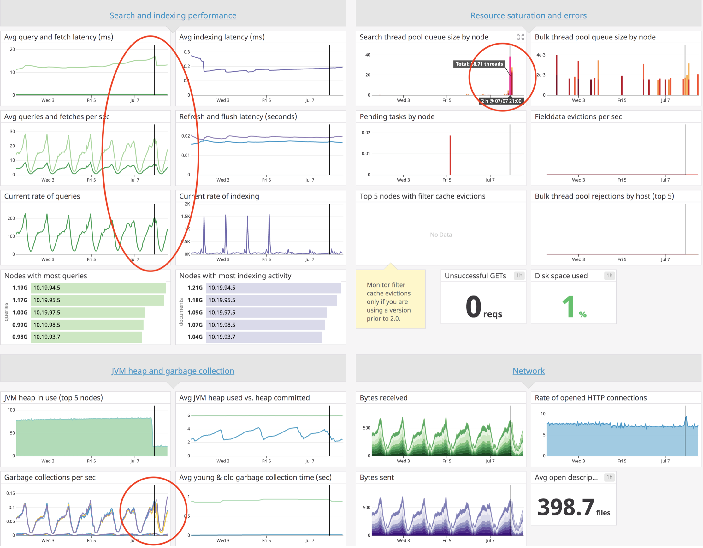
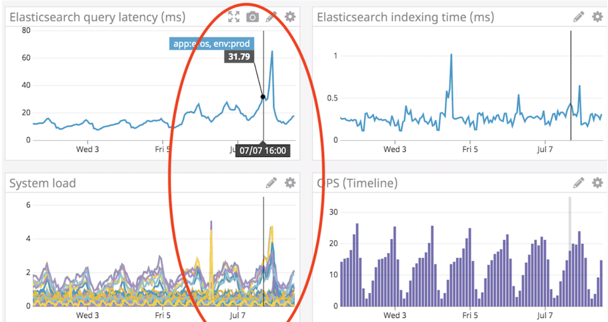
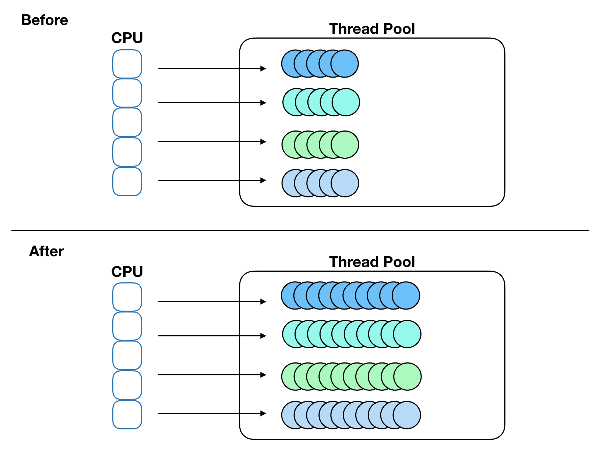

# [ES] Conatiner based Elasticsearch cluster migration experience
> date - 2019.07.14  
> keyword - elasticsearch, container, jdk, jvm  
> Daily에서는 검색에 사용하는 Elasticsearch cluster를 AWS에서 Kubernetes 가반으로 운영하고 있다  
> Elasticsearch가 동작하는 Worker Node를 t2.xlarge에서 m5.2xlarge로 migration하면서 겪은 이슈를 정리  

<br>

## Env
* Elasticsearch 5.6.4
* OpenJDK 1.8.0_131


<br>

## Issue
* traffic이 평소와 다름 없는데 Elasticsearch cluster의 검색 지연이 발생

<br>

* Elasticsearch cluster metrics


<br>

* 문제가 있는 Data Node가 떠있는 EC2 metrics


<br>

* 1 week 내에 query량의 변화는 없었으나, metrics을 봤을 때 다음을 추측
* GC per sec의 수치가 증가 -> system load 증가, query latency 증가 -> search thread pool queue size 증가
* GC 시간이 증가해서 stop the world가 길어지니깐 query 처리 속도가 점점 늦어져서 search thread pool queue에 점점 쌓여서 결과적으로 검색에 지연이 발생


<br>

## Why?
* t2.xlarge -> m5.2xlarge로 migration하면서 spec의 변화
  * 4 vCPU, 16GB memory -> 8 vCPU, 32GB memory

<br>

### Elasticsearch는 processor 수를 auto detect
* 이용 가능한 processor 수를 자동으로 인식하여 thread pool을 자동으로 setting
* `GET _nodes/os` 로 확인할 수 있다
  * [Cluster APIs Nodes Info - Elasticsearch 5.6 Docs](https://www.elastic.co/guide/en/elasticsearch/reference/current/cluster-nodes-info.html)
* `available_processors`
  * JVM이 사용할 수 있는 processor 수
* `allocated_processors`
  * thread pool size를 계산하는데 사용되는 processor 수
  * 명시적으로 설정할 수 있고, default로 OS가 report하는 processor 수 사용
  * 32보다 커지지 않는다

<br>

#### t2.xlarge에서 동작하는 Elasticsearch
```json
// GET _nodes/os
...
"os": {
    ...
    "available_processors": 4,  // here
    "allocated_processors": 4
}
```

<br>

#### m5.2xlarge에서 동작하는 Elasticsearch
```json
// GET _nodes/os
...
"os": {
    ...
    "available_processors": 8,  // here
    "allocated_processors": 8
}
```

<br>

#### Thread Pool Count 비교
| processor | index | search | get | bulk | snapshot | warmer | refresh | listener |
|:-:|:-:|:-:|:-:|:-:|:-:|:-:|:-:|:-:|
| 4 | 5 | 7 | 4 | 5| 2 | 2 | 2 | 2 |
| 8 | 9 | 13 | 8 | 9 | 4 | 4 | 4 | 4 |

* Host spec의 변화로 인해 Elasticsearch Thread Pool에 변화가 발생

<br>

#### Elasticsearch는 `availableProcessors`, `allocatedProcessors`를 어떻게 인식할까?
* Elasticsearch 6.7.2의 code를 따라가보자
* Elasticsearch 5.6.4에서도 해당 feature에 큰 변화는 없었다

```java
public class OsInfo implements Writeable, ToXContentFragment {
    ...
    public OsInfo(
            final long refreshInterval,
            final int availableProcessors,  // here
            final int allocatedProcessors,
            final String name,
            final String prettyName,
            final String arch,
            final String version) {
        this.refreshInterval = refreshInterval;
        this.availableProcessors = availableProcessors;
        this.allocatedProcessors = allocatedProcessors;
        this.name = name;
        this.prettyName = prettyName;
        this.arch = arch;
        this.version = version;
    }
    ...
}

public class OsProbe {
    ...
    OsInfo osInfo(long refreshInterval, int allocatedProcessors) throws IOException {
        return new OsInfo(
                refreshInterval,
                Runtime.getRuntime().availableProcessors(),  // here
                allocatedProcessors,
                Constants.OS_NAME,
                getPrettyName(),
                Constants.OS_ARCH,
                Constants.OS_VERSION);
    }
    ...
}

public class OsService {
    ...
    public OsService(Settings settings) throws IOException {
        ...
        this.info = probe.osInfo(refreshInterval.millis(), EsExecutors.numberOfProcessors(settings));
        ...
    }
}

public class EsExecutors {
    ...
    public static final Setting<Integer> PROCESSORS_SETTING =
        Setting.intSetting("processors", Runtime.getRuntime().availableProcessors(), 1, Property.NodeScope);  // here
    
    public static int numberOfProcessors(final Settings settings) {
        return PROCESSORS_SETTING.get(settings);
    }
    ...
}
```

* `Runtime.getRuntime().availableProcessors()`으로 processor 수를 인식한다

<br>

### JDK 8은 container에 대한 support가 완벽하지 않다
* 현재 사용하고 있는 OpenJDK 1.8.0_131은 container에 대한 최적화가 이루어지지 않은 버전이고 사용하고 있는 Docker image의 default jvm.options에 `-XX:ParallelGCThreads` 옵션이 없으므로 JVM에서 인식한 값을 사용한다

<br>

#### OpenJDK 1.8.0_131
* t2.xlarge - 4 vCPU, 16GB Memory
```sh
$ java -XX:+PrintFlagsFinal -version | grep ParallelGCThreads
    uintx ParallelGCThreads                         = 4                                   {product}
...
```

* m5.2xlarge - 8 vCPU, 32GB Memory
```sh
$ java -XX:+PrintFlagsFinal -version | grep ParallelGCThreads
    uintx ParallelGCThreads                         = 8                                   {product}
...
```

<br>

#### OpenJDK 11.0.2
* container에 CPU 0.5를 할당했을 때
```sh
$ java -XX:+PrintFlagsFinal -version | grep ParallelGCThreads
     uint ParallelGCThreads                        = 0                                         {product} {default}
...
```

* container에 CPU 1을 할당했을 때
```sh
$ java -XX:+PrintFlagsFinal -version | grep ParallelGCThreads
     uint ParallelGCThreads                        = 2                                         {product} {default}
...
```

* Elasticsearch가 구동되는 JVM이 CPU를 제대로 인식하지 못해서 CPU limit의 변화가 없는데 그걸 사용하려는 thread가 증가했기 때문에 thread간 경합이 발생해서 performace issue가 발생한걸로 판단



<br>

## Resolve

### container에 할당된 CPU를 제대로 인식하지 못하는 문제이므로 processor 수를 명시적으로 설정
```yaml
# elasticsearch.yaml
...
processors: 4
```

* 설정 후 확인
```json
// GET _nodes/os
...
"os": {
    ...
    "available_processors": 8,
    "allocated_processors": 4
}
```

<br>

### JVM에서 사용하는 ParallelGCThreads도 명시적으로 설정
* Elasticsearch running argument로 `-XX:ParallelGCThreads=4`를 준다


<br>

## Conclusion
* JDK version에 따라 container support가 완벽하지 않을 수 있다
  * JDK 10 이상부터는 Container에 할당된 CPU, Memory를 자동으로 인식하므로 걱정 없이 사용해도 된다
* Elasticsearch 6.3부터 JDK 10 이후를 지원하므로 [Product and JVM Support Matrix - Elastic](https://www.elastic.co/kr/support/matrix#matrix_jvm)를 참고해 6.3 이상과 JDK 10 이상을 조합해서 사용하면 이런 이슈는 없을 것


<br><br>

> #### Reference
> * [Thread Pool - Elasticsearch 5.6 Docs](https://www.elastic.co/guide/en/elasticsearch/reference/5.6/modules-threadpool.html#processors)
> * [Cluster APIs Nodes Info - Elasticsearch 5.6 Docs](https://www.elastic.co/guide/en/elasticsearch/reference/current/cluster-nodes-info.html)
> * [Product and JVM Support Matrix - Elastic](https://www.elastic.co/kr/support/matrix#matrix_jvm)
> * [Show the default value chosen for XX:ParallelGCThreads](https://stackoverflow.com/a/46178337/6389139)
