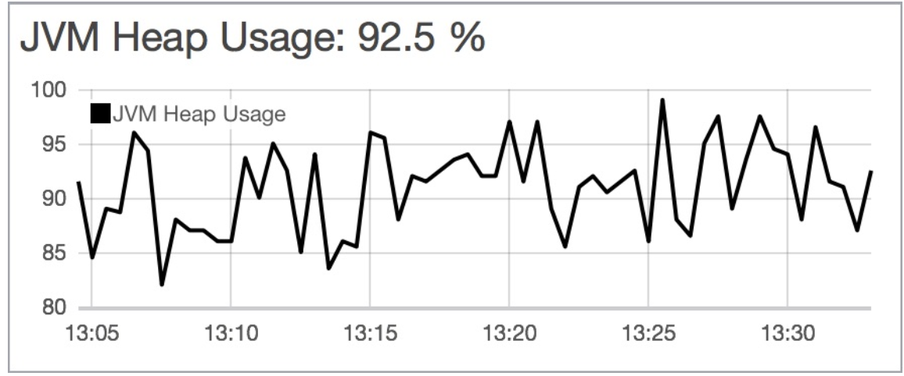
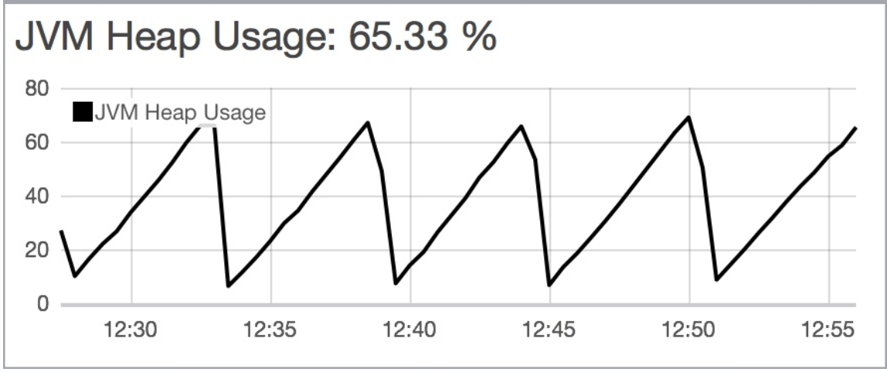

# [ES] A Heap of Trouble: Managing Elasticsearch's Managed Heap
> date - 2019.10.17  
> keyword - elasticsearch, heap, oops  
> [A Heap of Trouble: Managing Elasticsearch's Managed Heap](https://www.elastic.co/blog/a-heap-of-trouble)를 읽고 정리  

<br>

* CPU, Memory 등 리소스가 bottleneck이 아닌 경우 scale up을 하는 것은 낭비지만, 무해하다
* JVM에서 실행되는 Elasticsearch 등에서 heap size를 증가시키는 유혹에 빠질 수 있다


<br>

## heap
* memory runtime area의 영역
* 가득 차면 garbage collection 발생
* maximum size는 application 시작시 지정
* heap size는 allocation speed, garbage collection frequency, garbage collection duration에 영향을 준다(가장 두려운 것은 application의 모든 thread를 중지하는 stop-the-world phase)
* Small heap과 Large heap 사이에서 **적당한 균형을 유지**해야 한다


<br>

## Too Small
* 너무 작은 heap size는 `out of memory`의 위험이 있다
* allocation speed에 비해 너무 작은 heap은 빈번한 Minor GC로 인해 small latency가 발생하고, throughput이 감소한다
* small latency는 사용자에게 영향을 준다
  * Elasticsearch는 **indexing 작업의 수**와 **Queries Per Second(QPS)**가 감소
* indexing buffer, cache 및 memory-hungry feature(aggregation, suggester 등)에 사용할 수 있는 memory를 감소시킨다


<br>

## Too Large
* 너무 큰 heap size는 가끔 발생하는 Full GC(Major GC)로 인해 long latency 발생
* Long pause는 사용자에게 응답시간이 길어지는 등 **UX(user experience)에 영향을 준다**
* Long pause는 정지했거나, cluster에서 격리된 node와 구별할 수 없기 때문에 Elasticsearch와 같은 분산 시스템에 특히 해롭다
* Long pause(stop the world) 중에는 Elasticsearch의 코드는 실행되지 않는다
* Leader master node의 경우
  * Long pause는 master node election 발생
* Data node의 경우
  * master node가 data node를 제거하고 shard rebalancing
  * cluster의 network traffic, Disk I/O가 증가해 cluster가 불안정해진다


<br>

## Oops(Ordinary Object Pointers)
* `compressed oops(ordinary object pointers)` 때문에 heap size는 32GB이하로 유지하는게 좋다
* oops는 object에 대한 managed pointer며 native pointer와 크기가 같다
  * 32bit JVM의 oops size - 32bit
    64bit JVM의 oops size - 64bit
* 32bit JVM의 application과 64bit JVM의 application 중 일반적으로 전자의 속도가 더 빠르다
  * 32bit pointer는 64bit pointer에 비해 절반의 memory만 사용하기 때문
  * 제한된 memory bandwidth, 귀중한 CPU cache에 친화적이며, 사용 가능한 heap이 더 많기 때문에 GC 빈도가 줄어든다

<br>

### 32bit JVM의 application의 maximum heap은 4GB미만으로 제한
* 4GB는 많은 양의 data를 제공하는 distributed system application의 경우 너무 작다
* 4GB 이상 사용할 수 있는 트릭이 있다
* heap을 32GB보다 약간 작게 제한하면 JVM이 35bit oop(since 2^35 = 32 GB)로 JVM을 벗어날 수 있다
  * 35bit를 사용하는 것은 modern CPU architecture에 친숙하지 않으므로 다른 트릭이 사용된다
  * 모든 객체를 8byte boundaries에 정렬한 다음 35bit oops의 마지막 3bit를 0으로 가정하면
  * JVM은 32bit object pointer를 벗어날 수 있지만 여전히 32GB의 heap을 참조한다. 이것을 **compressed oops**라고 부른다

<br>

### 32bit JVM에서 64bit JVM으로 전환하는 상황
* **compressed oops threshold보다** 큰 heap의 application보다 **작은 heap의 application이 더 빠르다**
* 64bit oops가 사용하는 공간만큼 application에서 사용 가능한 heap이 적다
  * 이 상황을 극복하기 위해 heap을 늘리면 long-pause problem에 영향을 받는 heap이 더 커진다
* Elasticsearch의 경우 **compressed oops threshold 미만으로 유지하는 것이 좋다**


<br>

## 2개의 cutoff가 있어서 실제로는 더 복잡
1. heap이 4GB보다 작은 경우 JVM은 32bit pointer만 사용할 수 있다
2. zero-based compressed oops
  * 4GB의 address에 맞지 않으면 32GB의 address내에 heap에 대한 memory를 예약하려고 시도 후 zero base를 사용
  * 예약을 승인할 수 없는 경우에는 JVM은 heap이 **non-zero base를 사용하도록 fall back**

<br>

* zero base를 사용할 수 있는 경우, 64bit pointer와 compressed oops 사이의 encoding/decoding에 필요한 3bit shift만 필요
```
native oop = (compressed oop << 3)
```

<br>

* non-zero base를 사용하는 경우, null check가 필요하고, additional base의 +/- 필요
```
if (compressed oop is null)
    native oop = null
else
    native oop = base + (compressed oop << 3)
```
* 이로 인해 **성능이 크게 저하**된다

> zero base를 사용하기 위한 cutoff는 OS마다 다르지만 **26GB는 다양한 OS에서 전통적인 cutoff**


<br>

## Less is More
* **`compressed oops`의 threshold를 유지하면서 heap을 최대한 높게 설정 권장**
* heap은 가능한 낮게 설정하되 indexing 및 query throughput, end-user의 query response을 충족하면서 indexing buffer와 large consumers(aggregation, suggester)를 위해 충분한 heap size 선정
 * heap size가 작을 수록 long gc pause 가능성이 적고, Elasticcache와 Lucene이 사용하는 filesystem cache에 사용 가능한 physical memory가 많아지기 때문


<br>

## Straight Cache Homie
* Modern OS는 disk에서 access한 page의 `filesystem cache`를 유지
  * **filesystem cache는 free memory만 사용**
* filesystem에서 page를 읽고 caching하면 memory에서 읽는 것처럼 빠르게 엑세스 할 수 있다
* cache는 JVM에서 관리하지 않으므로 heap에 영향을 주지 않으면서 속도의 이점을 얻을 수 있다
* **filesystem cache에 가능한 많은 memory를 사용하는게 좋다**


<br>

## Garbage First
* G1 GC는 JDK 7u4부터 지원해 JDK9부터 default GC로 설정
* heap을 region으로 나누고 대부분이 garbage인 region을 먼저 GC하도록 설계
* 여전히 GC시 모든 application thread가 pause지만, garbage가 가장 많은 region에 focusing하면 매우 효율적이어서 pause time을 적게 가져 간다는 idea 기반
* G1 GC는 예측 가능한 pause time으로 large heap에서 작동할 수 있다
* G1 GC는 Lucene indices를 손상시키는 bug가 있다
  * [Elasticsearch 6.5.0 Released](http://link.elastic.co/b0002pAetMZ1M25n030Yo0B)의 JDK 11 & G1GC 섹션을 보면 G1 GC의 bug로 ES workloads에 영향이 있어 CMS(Concurrent Mark Sweep) GC를 권장했지만, JDK9에서 CMS GC는 deprecated되었고, JDK 10+를 지원하려고 노력하고 있다
  * 기존에 치명적인 bug인 [LUCENE-5168](https://issues.apache.org/jira/browse/LUCENE-5168)은 [JDK-8038348](https://bugs.openjdk.java.net/browse/JDK-8038348)이 원인으로 JDK부터 해결
    * JDK8에는 backport로 8u121-b32, 8u131-b31 등 존재하므로 JDK8에서는 버전과 빌드 확인 후 사용


<br>

## 그러면 어떻게 하면 좋을까?
* heap size는 `ES_HEAP_SIZE` 환경 변수를 통해 지정할 수 있다
* heap size의 가장 이상적인 시나리오는 4GB 미만으로 사용
* 차선택으로 zero-based threshold보다 낮게 유지


<br>

### compressed oops threshold 확인

#### JVM option 이용
* `-XX:+UnlockDiagnosticVMOptions -XX:+PrintCompressedOopsMode` 설정시 아래처럼 확인할 수 있다
```
heap address: 0x000000011be00000, size: 27648 MB, zero based Compressed Oops

// non-zero based
heap address: 0x0000000118400000, size: 28672 MB, Compressed Oops with base: 0x00000001183ff000
```

#### startup log에서 확인
```
heap size [1.9gb], compressed ordinary object pointers [true]
```

#### [Node Infos API](https://www.elastic.co/guide/en/elasticsearch/reference/current/cluster-nodes-info.html)에서 확인
```json
GET _nodes?filter_path=**.using_compressed_ordinary_object_pointers

{
  "nodes": {
    "vdzaYWEIS-aYBxAoOBkc0w": {
      "jvm": {
        "using_compressed_ordinary_object_pointers": "true"
      }
    },
    ...
  }
}
```


<br>

### Large heap을 줄이기 위한 고려 사항
* `field data`의 사용을 줄이고, 가능한 경우 `doc values`를 사용
* Disk-based norms 사용
* `Doc values`는 Elasticsearch 2.2.0부터 multi-fields의 memory를 덜 사용
* **over-shard** X
  * N shard에 대한 검색 요청은 모든 N shard에서 결과를 수집해야 하므로 shard 수가 적을수록 더 작은 result set을 선별해 request cache 활용을 높이고, terms dictionaries를 줄이며 shard 수가 적을수록 cluster state가 작아진다
* 지나치게 큰 bulk indexing batch size 사용 X
  * 32MB는 괜찮지만, 256MB는 괜찮지 않다
* large bulk indexing queue 사용 X
  * request의 total byte를 합리적으로 유지
  * 5.0.0부터 circuit breaker가 제한한다
* single request에서 너무 많은 `hits`를 요청하지 말고, `scrolling`을 사용
* 너무 많은 aggregation bucket이나 deeply-nested aggregation을 사용 X
* memory의 trading 선능을 고려하고 deep aggregation을 위해 `breadth_first` collection mode 사용


<br>

## JVM Heap Monitoring

* 너무 작은 heap size를 사용할 때 나타나는 패턴으로 **GC 후에도 heap 사용률이 높다**

<br>


* 너무 큰 heap size를 사용할 때 나타나는 패턴으로 **GC 후 heap 사용률이 급감하는 것으로 보아 garbage가 많이 쌓인다**
* garbage에서 사용하는 memory는 filesystem cache에서 더 잘 활용될 수 있디


<br>

## Heap dependency를 줄일 수 있는 방법을 찾아라
* field data와 doc values는 aggregation, sorting, script field access에 사용
* Norms는 relevance scoring의 index-time component. disable 가능


<br><br>

> #### Reference
> * [A Heap of Trouble: Managing Elasticsearch's Managed Heap - Elastic Blog](https://www.elastic.co/blog/a-heap-of-trouble)
