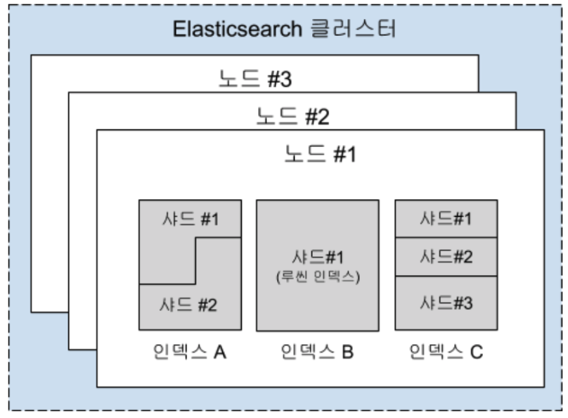

# [ES] How many shards should I have in my Elasticsearch cluster?
> date - 2019.10.10  
> keyworkd - elastic, elasticsearch, index management, shard management  
> [내가 운영하는 Elasticsearch 클러스터에 얼마나 많은 샤드가 필요할까? - Elastic](https://www.elastic.co/kr/blog/how-many-shards-should-i-have-in-my-elasticsearch-cluster)를 요약

 

* 성능 최적화를 위한 shard count 조정은 reindexing이 필수지만, data volume이 커지면 indexing 시간이 증가하므로 운영 환경에서 쉽게 작업할 수 없다
* 성능 이슈 발생시, multi-tenancy 및 time based index 등의 use case에서 cluster의 **index 구성과 shard count를 먼저 확인**
* 이 글에서 time based index(로깅, 보안 분석 등)의 use case를 위한 가이드 라인을 제공한다

 

## Shard란?
* Elasticsearch는 `index`로 data를 저장

 

### Index는 N개의 shard로 구성
* `shard`는 `Lucene index`로 data를 **분산 저장하기 위한 단위**
  * Elasticsearch cluster에서 indexing 및 조회(검색)를 위한 **독립적인 검색 엔진**
* cluster 장애 발생시 data를 재배치하는 속도는 network, disk I/O 성능뿐만 아니라, shard size, count에 영향 받는다
  * **적절한 size의 shard를 유지하자**
  * 너무 크거나 많은 shard는 cluster recovery 능력에 좋지 않다
  * 최대 size의 제한은 없지만 **50GB 이하를 권장**

 

### Shard는 N개의 segment로 구성
* data를 shard에 입력하면 Elasticsearch가 주기적으로 **Disk에 immutable Lucene segment로 저장해야만 조회가 가능**해진다
  * 이 과정을 `refresh`라고 부른다
  * [Inside a Shard - Elasticsearch: The Definitie Guide 2.x](https://www.elastic.co/guide/en/elasticsearch/guide/current/inside-a-shard.html)에서 자세한 내용을 확인할 수 있다
* segment 수가 많아지면 주기적으로 segment merge 수행
* segment는 immutable이므로 신규 segment 생성 후 기존 segment를 삭제하는데, 이 과정에서 disk 사용량이 변화한다
* segment merge는 리소스에 민감하며, 특히 **Disk I/O에 큰 영향을 받는다**
  * 그래서 가급적 SSD를 사용하는게 indexing 성능에 좋겠지?

 

## Index Lifecycle
* segment는 immutable이라서 document update는 **해당 document를 찾은 다음, delete marking 후 새로운 document를 추가**한다
* document delete도 delte marking 후 실제로 제거되지 않는다
  * 삭제된 document는 merge 전까지 disk space를 차지하고, 시스템 자원을 사용하면서 많은 시스템 자원을 소비
* Elasticsearch는 명시적으로 모든 record를 삭제하지 않고, file system에서 바로 삭제할 수 있는 효율적인 기능 제공
  * Elasticsearch에서 data를 제거하는 가장 효율적인 방법
* data lifecycle를 관리하기 위해 **time based index 사용** 권장
  * lifecycle에 따라 data를 grouping하여 index에 저장
  * time based index는 primary/replica shard 수 조정을 쉽게 해주면 data volume과 같은 요구사항을 쉽게 반영할 수 있게 한다

 

## Index와 shard의 cost는?
* `index`에는 **mappings과 state 정보**가 있고, cluster state에 저장하는데 빠른 access를 위해 memory에 저장
  * 대량의 index와 shard는 cluster state를 증가시킨다
  * 특히 `mapping` 정보가 크면 영향을 많이 준다
* cluster state는 분산된 노드간에 data 일관성을 보장하기 위해 single thread로 업데이트
  * 거대한 cluster state가 cluster 전체 업데이트 작업을 느리게하는 원인

 

### 같은 index에 비슷한 구조로 저장하는 것을 고려
* index 숫자를 줄이면서 거대하고 제멋대로 생성되는 `mapping`을 피하기 위해 data 출처에 따라 `index`를 분리하지 않는다
* index/shard count와 index mapping size 사이의 균형점을 찾는게 중요

 

### Cluster state는 각 node(master node 포함)의 heap에 적재
  * heap 사용량은 index count와 index/shard의 필드 개수에 비례
  * heap 사용량을 모니터링하면서 적절한 size인지 확신하는 것이 필요
  
 

### Shard에는 memory에 보관하고 heap을 차지하는 data가 있다
* shard level의 data 구조, segment level의 disk 저장 위치 등
* data 구조의 size는 use case에 따라 다르다

 

### Segment size와 segment 부하는 비례하지 않는다
* 큰 segment는 작은 segment보다 data volume당 부하가 적다
* segment가 2배로 커진다고 해서, 부하가 2배가 되는게 아니라서 상대적으로 큰 segment가 부하를 완화할 수 있다
* Node에 최대한 많은 data를 저장하기 위해서는 **heap 사용량과 overhead를 최대한 줄이는 것**이 중요
  * heap을 많이 차지할수록 더 많은 data와 shard가 필요
  * index와 shard는 리소스 부하에 영향을 주며, cluster 관점에서 공짜라고 볼 수 없다

 

### 작은 shard는 작은 segment를 만들며 부하를 증가시킨다
* time based data를 사용한다면 20 ~ 40GB가 적당
* shard의 부하는 segment count와 size에 영향
* force merge로 segment를 merge하여 큰 segment를 만들어라
  * index에 더 이상 data가 입력되지 않을 때 수행
  * 부하가 큰 작업이니 peak time은 피하자

 

### 하나의 Node에 저장할 수 있는 shard 수는?
* Heap size에 비례하지만, 제한은 없다
* Heap 1GB당 20개를 권장
  * e.g. Heap이 30GB면 약 600개를 권장

 

## Shard size가 성능에 미치는 영향
* Shard 당 single thread로 query를 실행
* 동일한 shard에 여러 query, aggregation을 수행할 수 있는 것처럼, 여러 shard가 동시에 처리될 수 있다
* caching을 사용하지 않을 때, 최소 query 응답 시간은 data, query 유형 및 shard size에 따라 달라진다
* 많은 수의 작은 shard를 조회하면 각 shard 마다 처리속도는 빨라지지만 더 많은 작업을 queue에 넣고 순서대로 처리해야 하므로, 더 적은 개수의 큰 shard를 검색하는 것보다 빠르다고 보장할 수 없다
* 동시에 여러 query가 실행될 때, 여러 작은 shard가 query throughput을 감소시킬 수 있다
  * 각 shard가 최대 크기를 넘지 않는다면, **작은 크기의 여러 shard보다 큰 크기의 적은 shard가 더 효율적**

 

### Query 성능 관점에서 최대 shard size를 결정하는 최고의 방법은 Benchmarking Testing
* [Quantitative Cluster Sizing - Elastic{ON}](https://www.elastic.co/elasticon/conf/2016/sf/quantitative-cluster-sizing) 참고
* 왜곡된 결과를 피하기 위해 항상 운영 환경에서 **실제로 처리해야 하는 query와 indexing 부하를 고려해서 테스트**

 

## shard size 관리
* time based index를 사용시, 일 단위 index는 data lifecycle이 짧거나 일 단위로 대량 data를 저장하는 경우에 많이 사용
* data lifecycle을 정교하게 관리할 수 있다
* 매일 변하는 data volume을 쉽게 조정할 수 있다
* lifecycle이 긴 data는 주/월 단위 index를 만들어 shard 크기를 적당하게 유지
  * 일일 data volume이 작아 일 단위 index로 관리하는 것이 비효율적인 경우
* 고정 주기로 저장되는 time based index 사용시
  * shard size를 유지하기 위해 data lifecycle와 예상 data volume에 따라 각 index를 적절하게 조정

 

### time based index는 예측 가능하고, 변동폭이 적을 때 잘 동작한다
* indexing양이 빈번하게 변하는 경우라면, 균일한 shard size를 유지하기 어렵다
* [Rollover 및 Shrink API](https://www.elastic.co/blog/managing-time-based-indices-efficiently)를 사용
  * time based index를 사용하는 경우 index와 shard 관리시 큰 유연성 제공

 

### [Rollover index API](https://www.elastic.co/guide/en/elasticsearch/reference/current/indices-rollover-index.html)
* time based index고 data volume이 불규칙적인 immutable data일 때 shard size 유지시 유용
* data volume을 예측하기 어려운 경우, 지나치게 크거나 작은 shard를 만드는 것을 파할 수 있다
* cluster가 저장해야 하는 document와 index 개수나 document 최대 저장 기간을 지정
  * 2가지 조건 중 하나에 해당하면 **downtime 없이 신규 index 생성**
  * 각 index가 특정 기간을 처리하는 대신, 특정 크기가 되면 신규 index로 전환하는 것이 가능해지기 때문에 모든 index의 shard size를 원하는 수준으로 유지하기 쉽다
* data를 수정하는 경우, 이벤트 발생 시간 정보와 API 호출시 사용하는 index간의 관계가 끊어지기 때문에, 검색시 매번 업데이트가 실행되는 것과 큰 성능 저하를 야기할 수 있다

 

### [Shrink index API](https://www.elastic.co/guide/en/elasticsearch/reference/current/indices-shrink-index.html)
* 기존 index를 더 적은 개수의 primary shzrd를 가진 신규 index로 변경(shrink)하게 해준다
* 초기에 너무 많은 shard count를 설정한 경우, shard count를 줄이는데 유용
  * 특정 기간을 저장하는 각 index를 큰 규모의 Node에 분산 저장하고 싶을 때, indexing이 없는 시점에 Shrink API로 primary shard count를 감소시킨다
* indexing 중 전체 node에 shard를 균등하게 분배하고 싶은데 shard size가 너무 작다면, 더 이상 indexing이 이뤄지지 않는 index의 primary shard를 줄인다
  * **더 큰 shard를 만들게** 해주며, 긴 기간동안 보관해야 하는 data에 적합

 

## Conclusion
* 더 깊이있게 알아보려면 [Designing for Scale - Elasticsearch: The Definitie Guide 2.x](https://www.elastic.co/guide/en/elasticsearch/guide/2.x/scale.html)를 참고
* 이 글에서 Elasticsearch를 잘모르는 나도 많은걸 알 수 있었다. 정말 좋은 Post다

  

> #### Reference
> * [내가 운영하는 Elasticsearch 클러스터에 얼마나 많은 샤드가 필요할까? - Elastic](https://www.elastic.co/kr/blog/how-many-shards-should-i-have-in-my-elasticsearch-cluster)

 

> #### Further reading
> * [Inside a Shard - Elasticsearch: The Definitie Guide 2.x](https://www.elastic.co/guide/en/elasticsearch/guide/current/inside-a-shard.html)
> * [Quantitative Cluster Sizing - Elastic{ON}](https://www.elastic.co/elasticon/conf/2016/sf/quantitative-cluster-sizing)
> * [Designing for Scale - Elasticsearch: The Definitie Guide 2.x](https://www.elastic.co/guide/en/elasticsearch/guide/2.x/scale.html)
> * [And the big one said "Rollover" - Managing Elasticsearch time-based indices efficiently](https://www.elastic.co/blog/managing-time-based-indices-efficiently)
