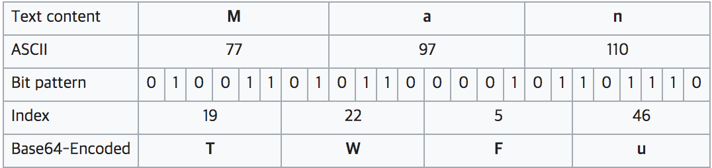
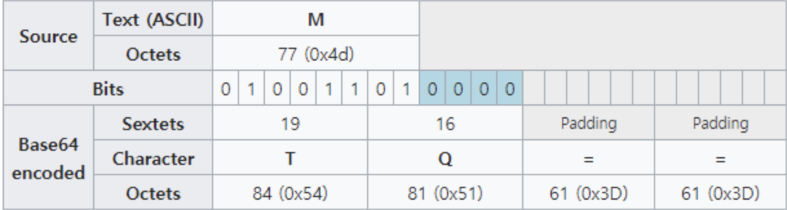
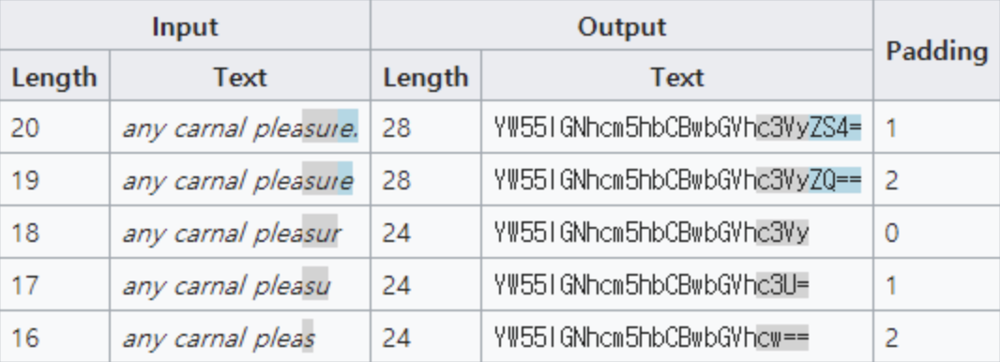

# [Encoding] Base64 Encoding
> date - 2020.03.31  
> keyworkd - encoding, base64  
> base64 encoding에 대해 정리  

 

## Encoding
* 정보의 형태나 형식을 표준화, 보안, 처리 속도 향상, 저장 공간 절약 등을 위해 **다른 형식으로 변환하는 방식**
* 이미지, 영상 등에서 사용

 

## Base64 encoding
* **Binary Data -> ASCII Text**로 8 bit binary data를 문자 코드에 영향을 받지 않는 ASCII 문자로 변환 하는 인코딩 방식
* **64개의 문자 이용**하여 **8 bit data를 6 bit로 표현**
  * ASCII 문자는 8 bit로 묶여 있다
  * 모든 문자를 64개의 문자로 표현하기 위해 6 bit(2^6=64) 필요
  * 혼란스럽지 않게 6과 8의 최소 공배수인 24 bit씩 묶는다
  * **24 bit 단위로 3개의 문자에서 4개의 문자를 얻는다**
* **원본 보다 약 33% 정도 크기가 늘어나고**, encoding/decoding에 추가 CPU 연산이 필요하다는 단점이 있지만 **이기종 시스템에서 공통적으로 사용할 수 있어서 binary data 전송에 많이 사용**
* 이기종 시스템에서 발생할 수 있는 문제
  * 7 bit encoding인 ASCII는 나머지 1 bit를 처리하는 방식이 시스템마다 다르다
  * 일부 제어 문자(e.g. Line ending)는 시스템마다 다른 코드 사용

 

## 원리
* **문자열 -> ASCII binary -> 6bit cut -> base64 encode**

### Base64 Table
| Value | Char | Value | Char | Value | Char | Value | Char |
|:--:|:--:|:--:|:--:|:--:|:--:|:--:|:--:|
| 0 | A | 16 | Q | 32 | g | 48 | w |
| 1 | B | 17 | R | 33 | h | 49 | x |
| 2 | C | 18 | S | 34 | i | 50 | y |
| 3 | D | 19 | T | 35 | j | 51 | z |
| 4 | E | 20 | U | 36 | k | 52 | 0 |
| 5 | F | 21 | V | 37 | l | 53 | 1 |
| 6 | G | 22 | W | 38 | m | 54 | 2 |
| 7 | H | 23 | X | 39 | n | 55 | 3 |
| 8 | I | 24 | Y | 40 | o | 56 | 4 |
| 9 | J | 25 | Z | 41 | p | 57 | 5 |
| 10 | K | 26 | a | 42 | q | 58 | 6 |
| 11 | L | 27 | b | 43 | r | 59 | 7 |
| 12 | M | 28 | c | 44 | s | 60 | 8 |
| 13 | N | 29 | d | 45 | t | 61 | 9 |
| 14 | O | 30 | e | 46 | u | 62 |   |
| 15 | P | 31 | f | 47 | v | 63 | / |

 

* Man ---base 64 encoding---> TWFu

 

## Padding
* 모든 문자열이 3개씩(24 bit) 정확하게 끊어지지 않으므로 **bit 수를 유지하기 위해 padding**으로 (`=`) 사용

### Example
Many  
-> 77 97 110 121  
-> 01001101 01100001 01101110 01111001  
-> 010011 010110 000101 101110 011110 01  
-> **010011 010110 000101 101110 011110 01**0000 남는 bit에 0을 채워 6bit를 맞춤  
-> TWFueQ는 24bit씩 분리했을 때 `Man y__`이므로 2개의 빈공간을 표현하기 위해 padding 추가  
-> TWFueQ==

> 마지막에 =가 1 ~ 2개가 있다면 base64 encoding이라고 유추할 수 있다

 

## Conclusion
* Base64는 HTML, Email 등 문자를 위한 Media로 binary data를 전송할 때 **시스템에 무관하게 전송되는 것을 보장하기 위해 사용**
* binary data를 stream을 통해 직접 안전하게 주고 받을 수 있다면 overhead를 발생시키면서까지 사용할 필요는 없다

  

> #### Reference
> * [Base64 - Wikipedia](https://en.wikipedia.org/wiki/Base64)
> * [Base64 인코딩(Base64 인코딩 이유)](https://ifuwanna.tistory.com/72)

 

> #### Further reading
> * [Base64 인코딩과 성능](https://hyeonseok.com/soojung/dev/2017/02/20/811.html)
> * [Base64 Encoding & Performance, Part 1: What’s Up with Base64?](https://csswizardry.com/2017/02/base64-encoding-and-performance)
> * [Base64 Encoding & Performance, Part 2: Gathering Data](https://csswizardry.com/2017/02/base64-encoding-and-performance-part-2/)
