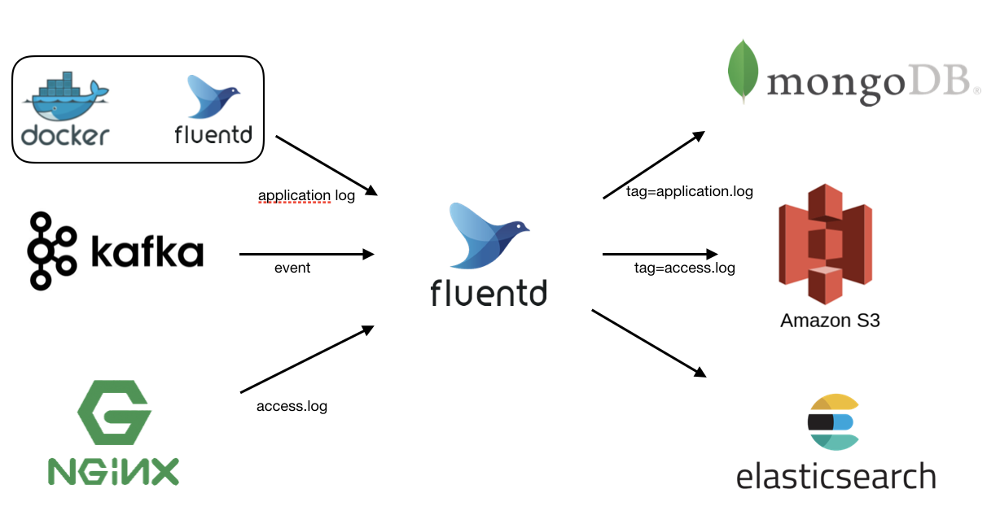
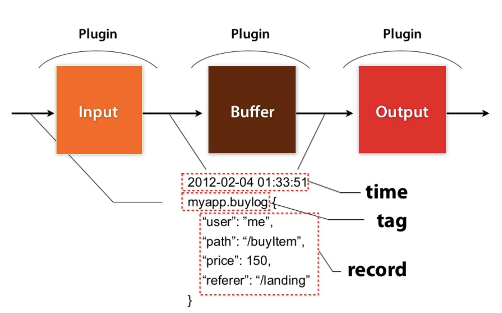
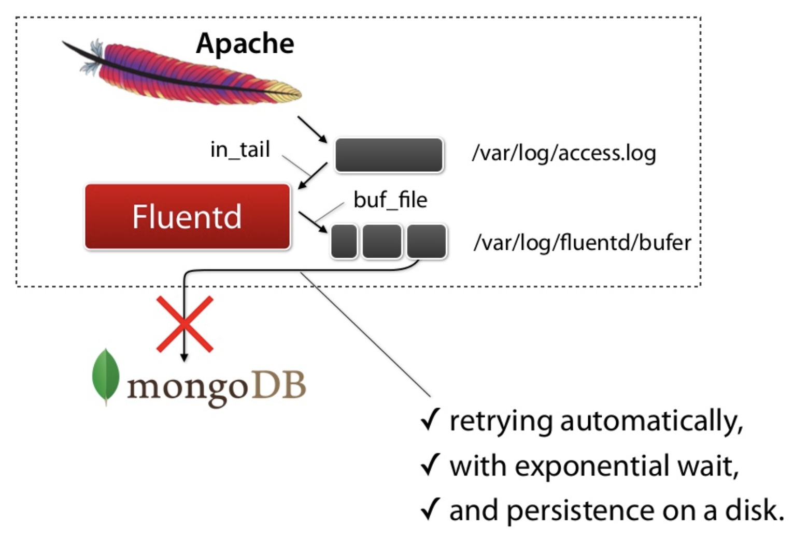

# [Fluentd] About Fluentd
> date - 2018.12.09  
> keyword - fluentd, log collector  
> 사내에서 kafka의 event를 AWS S3에 적제하는 작업을 진행하면서 fluentd를 사용했다. 그래서 fluentd에 대해 정리해보고자 함  
> v1.0 기준으로 작성되었다  

<br>

## Fluentd란?
<div align="center">

</div>

* Open-Source **Log Collector for unified logging layer**
* **다양한 Data Source**에서 event 수집 -> 원하는 형태로 **가공** -> **다양한 목적지**(File, RDBMS, NoSQL, IaaS, SaaS, Hadoop 등)에 저장
* **extensible** & **reliable** data collection tool
  * extensible
    * simple core
    * plugin system
  * reliable
    * buffering
      * memory, file
    * retries
    * High Availability(failover)
    * load balancing
* 간단하게 Logging Infrastructure를 통합할 수 있다
* 주로 C로 구현되고 Ruby로 Wrapping
* 주로 JSON 형식으로 log를 처리
* 더 적은 메모리를 사용해야하는 환경을 위한 경량화 버전인 [Fluentbit](https://github.com/fluent/fluent-bit) 제공


<br>

## Use Case


* Application Log 통합
  * Java, Python, Node.js, Scala...
  * [Centralized App Logging](https://docs.fluentd.org/v1.0/categories/logging-from-apps) 참고
* Monitoring Service Log
  * Elasticsearch, Kibana
* 데이터 분석을 위해 HDFS로 적재
* AWS S3로 데이터 저장
* Stream Processing

> [Use Case - Fluentd Docs](https://docs.fluentd.org/v1.0/categories/logging-from-apps) 참고


<br>

## Internal Architecture


### Fluentd가 읽어들인 Data는 tag, time, record로 구성된 Event로 처리
```
tag="event.user_sign_in" 
time=#<Fluent::EventTime:0x007fb6f4b80788 @sec=1544426167, @nsec=575908560> 
record={
    "event_name": "sign_in_event",
    "timestamp": "2018-12-10T16:16:07.193+09:00",
    "version" : 1.0,
    "user_id": 239924
}
```
```yaml
# input_tail plugin으로 전달된 event에는 nginx.access라는 tag가 붙게된다
<source>
  @type tail
  tag nginx.access
  path /var/log/access.log
</source>

<match nginx.access>
  @type stdout
</match>
```
* tag
  * `.`으로 구분되는 string
    * ex) myapp.access
  * event에 적절한 filter, parser, output plugin을 적용할지 분류할 수 있는 기준
* time
  * event가 발생될 때 기록된 unix time
* record
  * JSON Object format의 Data

> event의 flow는 [Life of an Fluentd event](https://www.slideshare.net/tamuraaa/life-of-an-fluentd-event?ref=https://docs.fluentd.org/v0.12/articles/config-file)를 참고


<br>

### Input plugins
* **receive** or **pull** logs from data sources in **non-blocking** manner
* plugins
  * HTTP + JSON(in_http)
  * File tail(in_tail)
  * Syslog(in_syslog)

### Outpul plugins
* **write** or **send event** logs
* plugins
  * File(out_file)
  * AWS S3(out_s3)
  * MongoDB(out_mongo)

### Buffer plugins


* improve performance
* provide reliability
* provide thread-safety
* plugins
  * memory(buf_memory)
  * file(buf_file)


<br>

## Dockerized Fluentd
TODO: docker container로 띄우기


<br><br>

> #### Reference
> * [Fluentd: Open-Source Log Collector](https://github.com/fluent/fluentd/)
> * [Life of an Fluentd event](https://www.slideshare.net/tamuraaa/life-of-an-fluentd-event?ref=https://docs.fluentd.org/v0.12/articles/config-file)
> * [Fluentbit: Fast and Lightweight Log processor and forwarder for Linux, BSD and OSX](https://github.com/fluent/fluent-bit)
> * [Fluend 101](https://www.slideshare.net/tagomoris/fluentd-101)
