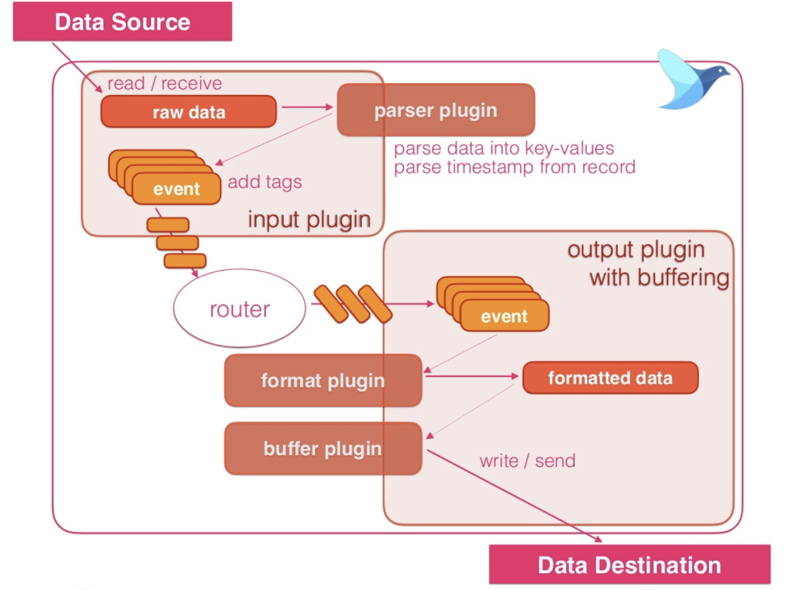

# [Fluentd] About Fluentd
> date - 2018.12.09  
> keyword - fluentd, log collector  
> 사내에서 kafka의 event를 AWS S3에 적제하는 작업을 진행하면서 fluentd를 사용했다. 그래서 fluentd에 대해 정리해보고자 함  
> v1.0 기준으로 작성되었다  

<br>

## Fluentd란?
<div align="center">

</div>

* Open-Source **Log Collector for unified logging layer**
* **다양한 Data Source**에서 event 수집 -> 원하는 형태로 **가공** -> **다양한 목적지**(File, RDBMS, NoSQL, IaaS, SaaS, Hadoop 등)에 저장
* **extensible** & **reliable** data collection tool
  * extensible
    * simple core
    * plugin system
  * reliable
    * buffering
      * memory, file
    * retries
    * High Availability(failover)
    * load balancing
* 간단하게 Logging Infrastructure를 통합할 수 있다
* 주로 C로 구현되고 Ruby로 Wrapping
* 주로 JSON 형식으로 log를 처리
* 더 적은 메모리를 사용해야하는 환경을 위한 경량화 버전인 [Fluentbit](https://github.com/fluent/fluent-bit) 제공


<br>

## Use Case


* Application Log 통합
  * Java, Python, Node.js, Scala...
  * [Centralized App Logging](https://docs.fluentd.org/v1.0/categories/logging-from-apps) 참고
* Monitoring Service Log
  * Elasticsearch, Kibana
* 데이터 분석을 위해 HDFS로 적재
* AWS S3로 데이터 저장
* Stream Processing

> [Use Case - Fluentd Docs](https://docs.fluentd.org/v1.0/categories/logging-from-apps) 참고


<br>

## Internal Architecture

* Input, Parser, Filter, Output, Formatter, Storage, Service Discovery, Buffer, Metrics plugin을 자유롭게 활용

### Fluentd가 읽어들인 Data는 tag, time, record로 구성된 Event로 처리


```
tag="event.user_sign_in" 
time=#<Fluent::EventTime:0x007fb6f4b80788 @sec=1544426167, @nsec=575908560> 
record={
    "event_name": "sign_in_event",
    "timestamp": "2018-12-10T16:16:07.193+09:00",
    "version" : 1.0,
    "user_id": 239924
}
```
```yaml
# input_tail plugin으로 전달된 event에는 nginx.access라는 tag가 붙게된다
<source>
  @type tail
  tag nginx.access
  path /var/log/access.log
</source>

<match nginx.access>
  @type stdout
</match>
```
* tag
  * `.`으로 구분되는 string
    * ex) myapp.access
  * event에 적절한 filter, parser, output plugin을 적용할지 분류할 수 있는 기준
* time
  * event가 발생한 시간으로 event가 발생될 때의 unix time을 기록
* record
  * JSON Object format의 Data

> event의 flow는 [Life of an Fluentd event](https://www.slideshare.net/tamuraaa/life-of-an-fluentd-event?ref=https://docs.fluentd.org/v0.12/articles/config-file)를 참고


<br>

### Input plugins
* **receive** or **pull** logs from data sources in **non-blocking** manner
* plugins
  * HTTP + JSON(in_http)
  * File tail(in_tail)
  * Syslog(in_syslog)

### Outpul plugins
* **write** or **send event** logs
* plugins
  * File(out_file)
  * AWS S3(out_s3)
  * MongoDB(out_mongo)

### Buffer plugins(optional)


* improve performance
* provide reliability
* provide thread-safety
* plugins
  * memory(buf_memory)
  * file(buf_file)

### Parser plugin(optional)
* 전달 받은 데이터를 파싱하기 위해 `<parse>` section 사용
* `<source>`(input plugin), `<match>`(output plugin), `<filter>`(filter plugin) 내부에 정의
* plugins
  * regexp
  * apache2
  * nginx
  * syslog
  * csv
  * tsv
  * json
  * none

### Formatter plugin(optional)
* output plugin을 사용시 저장될 data format 정의
* input에서 parser로 format에 맞게 읽고, output에서 formatter로 format에 맞게 쓴다

### Filter plugin(optional)
* 특정 필드에 대해 필터링 조건 적용
* 새로운 필드를 추가
  * 데이터를 전송한 host name 등을 추가
* 필드를 삭제하거나 값을 숨김
  * 불필요한 필드 삭제
  * 개인 정보 같은 민감 정보 삭제 or 암호화


<br>

## Dockerized Fluentd
* [fluent/fluentd - Docker Hub](https://hub.docker.com/r/fluent/fluentd)
* Dockerfile은 [fluent/fluentd-docker-image](https://github.com/fluent/fluentd-docker-image)에서 확인
* alpine 기반과 debian 기반의 image를 제공하고 있어서 선택에 혼란스러울 수 있다
  * debian version - [jemalloc](https://github.com/jemalloc/jemalloc)을 지원하므로 production에서 권장
  * alpine version - image size가 더 작으므로 small image가 필요할 때 사용

<br>

### 1. docker image 생성
* alpine version
```dockerfile
FROM fluent/fluentd:v1.15-1

# Use root account to use apk
USER root

# below RUN includes plugin as examples elasticsearch is not required
# you may customize including plugins as you wish
RUN apk add --no-cache --update --virtual .build-deps \
  sudo build-base ruby-dev \
  && sudo gem install fluent-plugin-elasticsearch \
                      fluent-plugin-kafka \
  && sudo gem sources --clear-all \
  && apk del .build-deps \
  && rm -rf /tmp/* /var/tmp/* /usr/lib/ruby/gems/*/cache/*.gem

COPY fluent.conf /fluentd/etc/
COPY entrypoint.sh /bin/

USER fluent
```

* debian version
```dockerfile
FROM fluent/fluentd:v1.15-debian-1

# Use root account to use apt
USER root

# below RUN includes plugin as examples elasticsearch is not required
# you may customize including plugins as you wish
RUN buildDeps="sudo make gcc g++ libc-dev" \
  && apt-get update \
  && apt-get install -y --no-install-recommends $buildDeps \
  && sudo gem install fluent-plugin-elasticsearch \
                      fluent-plugin-kafka \
  && sudo gem sources --clear-all \
  && SUDO_FORCE_REMOVE=yes \
  apt-get purge -y --auto-remove \
  -o APT::AutoRemove::RecommendsImportant=false \
  $buildDeps \
  && rm -rf /var/lib/apt/lists/* \
  && rm -rf /tmp/* /var/tmp/* /usr/lib/ruby/gems/*/cache/*.gem

COPY fluent.conf /fluentd/etc/
COPY entrypoint.sh /bin/

USER fluent
```

<br>

### 2. configuration
* $(pwd)/fluent.conf에 작성
```conf
<system>
  log_level "#{ENV['LOG_LEVEL'] ? ENV['LOG_LEVEL'] : 'info'}"
</system>

## monitoring
<source>
  @type monitor_agent
  bind 0.0.0.0
  port 24220
</source>

## fluentd log
<label @FLUENT_LOG>
  <match fluent.*>
    @type stdout
  </match>
</label>

<source>
  @type sample
  sample {"hello":"world"}
  tag sample
  @label @sample
</source>

<label @sample>
  <match sample>
    @type stdout
  </match>
</label>
```

<br>

### 3. run container
```sh
$ docker run --rm -p 24220:24220 -v $(pwd)/fluent.conf:/fluentd/etc/fluent.conf <fluentd image>
```

### 4. Makefile 이용
* Makefile 작성
```makefile
IMAGE_NAME ?= opklnm102/fluentd-test
IMAGE_TAG := $(shell git branch --show-current | sed -e "s/\//-/g")-$(shell git rev-parse HEAD)
IMAGE = $(IMAGE_NAME):$(IMAGE_TAG)

.DEFAULT_GOAL := build-image

build-image:
	docker build -t $(IMAGE) -f ./Dockerfile .

push-image: build-image
	docker push $(IMAGE)

clean-image:
	docker image rm -f $(IMAGE)

run-container:
	docker run --rm $(IMAGE)

run-config-test-container:
	docker run --rm -v ${PWD}/fluent.conf:/fluentd/etc/fluent.conf $(IMAGE)
```

* image build & run container
```sh
$ make && make run-container
```

* run test container
```sh
$ make run-config-test-container
```


<br><br>

> #### Reference
> * [Fluentd: Open-Source Log Collector](https://github.com/fluent/fluentd/)
> * [Life of an Fluentd event](https://www.slideshare.net/tamuraaa/life-of-an-fluentd-event?ref=https://docs.fluentd.org/v0.12/articles/config-file)
> * [Fluentbit: Fast and Lightweight Log processor and forwarder for Linux, BSD and OSX](https://github.com/fluent/fluent-bit)
> * [Fluend 101](https://www.slideshare.net/tagomoris/fluentd-101)
> * [fluent/fluentd - Docker Hub](https://hub.docker.com/r/fluent/fluentd)
> * [fluent/fluentd-docker-image](https://github.com/fluent/fluentd-docker-image)
> * [Docker Image - Fluentd Docs](https://docs.fluentd.org/container-deployment/install-by-docker)
