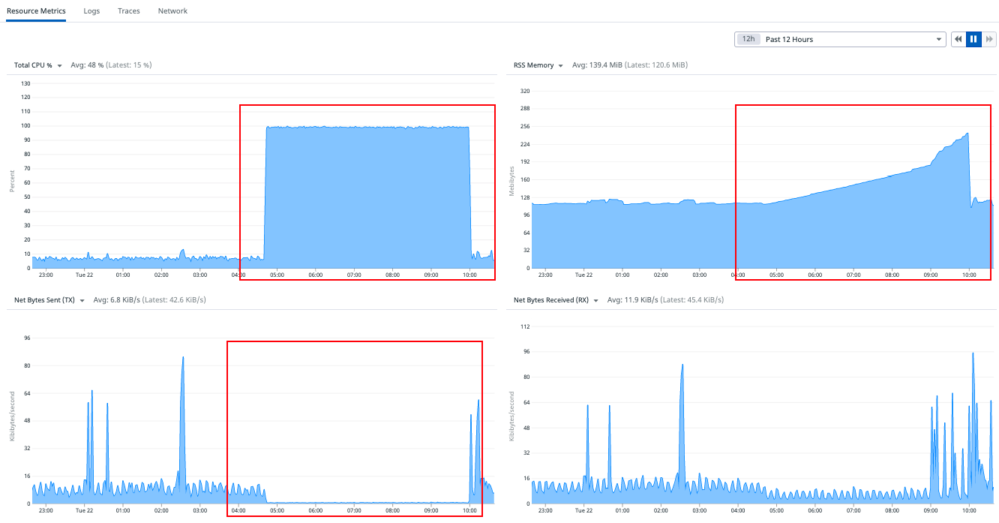

# [Fluentd] elasticsearch connection issue in Fluentd
> date - 2022.06.02  
> keyworkd - fluentd, network, socket, close_wait  
> fluentd에서 Elasticsearch의 connection issue를 해결하는 과정에 대해 정리  

<br>

## Issue
* 간헐적으로 fluentd -> Elasticsearch로 indexing이 되지 않는 이슈 발생


<br>

## Why?
* 일정 시간마다 `SIGKILL`이 발생

<div align="center">
  
</div>

해당 시점의 container metrics를 보면 CPU 사용률 급격히 상승, network sent 정지 → 이후부터 memory 사용률이 점점 증가하는 것을 확인할 수 있다  
위 현상을 분석해보면
```
모종의 이유로 network sent가 정지 및 CPU 사용률 증가 → network sent(Elasticsearch로 indexing)가 발생하지 않아 buffer에 chunk가 쌓이므로 memory 사용률 증가 → memory limit에 도달하여 SIGKILL 발생하여 restart → memory buffer에 있던 log 유실 및 이후 반복
```
network sent 중단과 CPU 사용률 증가는 같은 원인 때문일 것이라고 생각되고, Fluentd에서 buffer의 양이 증가하면 CPU 사용률이 급증하는 것은 정상이라고 한다  
그렇다면 buffer 증가를 유발한 connection이 다시 연결되지 않는 모종의 이유가 root cause로 추측해 볼 수 있다  


<br>

### netstat로 fluentd의 connection 확인
socket이 `CLOSE_WAIT`로 blocking되면 Elasticsearch로의 indexing이 중단될 수 있어서 이슈 발생 시점의 socket 상태 확인

* 평상시의 connection
  * kafka-xxxx - kafka broker connection
  * elasticsearch-xxxx - Elasticsearch connection
```sh
$ netstat
Active Internet connections (w/o servers)
Proto Recv-Q Send-Q Local Address  Foreign Address     State
tcp        0      0 fluentd:53144  kafka-xxxx          ESTABLISHED
tcp        0      0 fluentd:59486  elasticsearch-xxxx  TIME_WAIT
tcp        0      0 fluentd:59496  elasticsearch-xxxx  TIME_WAIT
tcp        0      0 fluentd:59826  elasticsearch-xxxx  ESTABLISHED
...
```

* 이슈 상황에서 connection을 확인해보면 Elasticsearch connection이 없는 것을 확인
```sh
$ netstat
Active Internet connections (w/o servers)
Proto Recv-Q Send-Q Local Address  Foreign Address  State
tcp        0      0 fluentd:42240  kafka-xxxx       ESTABLISHED
...
```

<br>

### TIME_WAIT?
위에서 확인한 `TIME_WAIT`에 대해 알아보자

#### TCP status diagram
<div align="center">
  
</div>

* TCP connection이 해제될 때 `FIN`과 `ACK` packet을 각각 1번씩 주고 받으면서 연결을 종료
* 이때 누가 먼저 close 요청을 했느냐에 따라 active/passive close 대상이 달라진다
  * server와 client 둘다 먼저 연결 해제 요청을 보낼 수 있다
  * active close - TCP 연결 해제를 요청한 대상
  * passive close - TCP 연결 해제를 수신한 대상
* 위 과정에서 유저가 접속할 때 `ESTABLISHED`에서 접속 종료시 `CLOSE_WAIT`로 남아있게되는 현상이 발생할 수 있는데, 계속 쌓이게되면 추후 hang up 현상이나 부하를 줄 수 있어서 해결 필요

#### CLOSE_WAIT
* close 요청을 수신한 passive close의 상태
* kernel option으로 timeout 설정이 가능한 `TIME_WAIT`, `FIN_WAIT`와 달리 port를 잡고 있는 process 종료나 network restart 외에는 제거할 방법이 없다
* application이 정상적으로 close()를 요청하는 것이 가장 좋은 방법
* server와 client가 동시에 close 요청을 받게되면, 양쪽에서 `CLOSE_WAIT` 상태가 되어 deadlock에 빠지게 된다

#### FIN_WAIT2
* active close가 passive close로부터 `FIN` pakcet을 기다리는 상태
* 일정 시간 동안 `FIN` packet을 수신하지 못하면 자동으로 `TIME_WAIT` 상태가 된다

#### TIME_WAIT
* active close가 ACK pakcet을 송신한 후의 상태로 TCP 연결의 마지막 상태
* `TIME_WAIT` 유지 시간은 socket의 최대 개수에 영향을 미칠 수 있다
  * `TIME_WAIT가` 짧으면 지연 packet이 발생했을 때 이슈가 발생할 수 있다

잠시 정리해보면 Elasticsearch connection에서 `TIME_WAIT`가 지속적으로 발생하고, 간헐적으로 모종의 이유로 connection을 맺을 수가 없어서 indexing이 발생하지 않는 것으로 위의 추측이 맞았다는 것에 확신을 얻었다
그렇다면 왜..?

<br>

### fluent-plugin-elasticsearch 사용하는 경우 아래 설정 필요
```conf
resurrect_after 5s
reload_connections false
```
위 설정이 없는 경우 cannot get new connection from pool 오류 발생할 것으로 예상
* resurrect_after: 60s 사용시
  * 트래픽이 많을 때 1s마다 Elasticsearch에 indexing이 발생한다고 가정
  * indexing request 중 일부는 Elasticsearch에 의해 timeout이 발생해 connection pool의 connection이 죽은 것으로 표시
  * 어느 시점에서 connection이 충분하지 않아지고, indexing request가 발생하면 resurrect_after가 connection을 부활 시키는 것을 허용하지 않아 cannot get new connection from pool이 발생하게 된다

그러나 우리와는 다른 case로 보인다

<br>

### fluent/fluentd:v1.11.5-1.0에서 이유 없이 주기적으로 buffer가 가득차기 시작하고 CPU 사용률 100%에 도달하는 case
* 자체적으로 restart가 반복되며, /api/plugins.flushBuffers 호출시 buffer가 flush되고, CPU 사용률이 정상적으로 돌아가는 케이스
  * /api/plugins.flushBuffers에 대한 내용은 [Deployment/RPC - Fluentd Docs](https://docs.fluentd.org/deployment/rpc)를 참고
* strace -c -p <pid> 실행시 gen_random_urandom 호출의 무한 loop를 확인
* excon 0.79.0 -> 0.82.0의 side effect라는 것을 https://github.com/fluent/fluentd/issues/3382#issuecomment-854841099에서 확인
  * excon에서 DNS 로직이 ruby built-in function을 사용하는 것으로 변경되어 발생한 것
* `fluent-gem list`로 dependency를 확인했더니 우리와 동일한 케이스로 확인


<br>

## Resolve
2가지 방법이 있다
1. downgrade excon
```sh
...
gem install
#https://bugs.ruby-lang.org/issues/17781
     excon:0.79.0 \
...
```
2. td-agent v4.2.0에서 patch되어 td-agent v4.2.0을 사용하는 fluentd 1.13.3 이상을 사용


<br>

## Etc
위 이슈를 파악하는 과정에서 알게된 정보들을 정리

### Fluentd dump
* SIGCONT signal을 보내면 dump 가능
* [Trouble Shooting - Fluentd](https://docs.fluentd.org/deployment/trouble-shooting#dump-fluentd-internal-information)
* [fluent/sigdump usage](https://github.com/fluent/sigdump#usage)
```sh
## dump
$ kill -CONT <pid>
 
## dump log 확인
$ cat /tmp/sigdump-<pid>.log
```

<br>

## netstat로 connection 확인
```sh
$ netstat -an | grep "[ip]"

## 특정 port를 사용하여 서버에 연결된 connection의 수 추출
## 
$ netstat -anlp | grep ESTABLISHED | grep [port] | sed 's/ [ ]*/ /g' | cut -d' ' -f5 | cut -d':' -f1 | sort | uniq -c | sort -n -k1 -r
    143 10.x.x.1  # connection count, client ip
    140 10.x.x.2
  ...
     10 10.x.x.3
```


<br>

## Conclusion
* 위의 이슈는 Dockerfile과 fluentd plugin의 gem dependency locking이 되지 않아 발생한 것으로 이 과정을 통해 dependency locking의 중요성을 다시 한번 느낄 수 있었다


<br><br>

> #### Reference
> * [CLOSE_WAIT & TIME_WAIT 최종 분석](https://tech.kakao.com/2016/04/21/closewait-timewait/)
> * [Coping with the TCP TIME-WAIT state on busy Linux servers](https://vincent.bernat.ch/en/blog/2014-tcp-time-wait-state-linux)
> * https://groups.google.com/g/fluentd/c/6y4AvuP7c4U
> * https://groups.google.com/g/fluentd/c/uW87VAOqxeE/m/cfhenicEBAAJ
> * https://discuss.elastic.co/t/elasitcsearch-ruby-raises-cannot-get-new-connection-from-pool-error/36252
> * https://github.com/uken/fluent-plugin-elasticsearch/issues/885
> * https://github.com/fluent/fluentd/issues/3387
> * https://github.com/fluent/fluentd/issues/3382
> * https://github.com/uken/fluent-plugin-elasticsearch/issues/944
