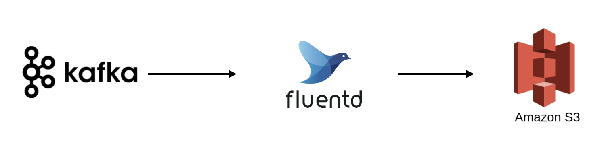

# [Fluentd] dockerized fluentd file buffer permission issue
> date - 2018.12.08  
> keyword - fluentd, data stream, file buffer  
> `fluent-plugin-kafka`과 `fluent-plugin-s3`를 사용해 data를 적제하는 작업을 하던 중 겪은 file buffer관련 issue에 대해 정리

<br>

## Issue
* Data Flow

<div align="center">
  
</div>

```yaml
...
  <buffer>
    @type file
    path /var/log/fluent/*.buffer

    timekey 600 # 10 minutes partition
    timekey_wait 1m
    chunk_limit_size 256m
    queued_chunks_limit_size 256m

    overflow_action drop_oldest_chunk
  </buffer>
```
* [file Buffer Plugin - Fluentd v1.0 Docs](https://docs.fluentd.org/v1.0/articles/buf_file)를 참고해서 fluentd.conf를 위처럼 설정해놓고 container를 실행했는데 아래의 error log가 발생

```
...
2018-12-06 17:28:30 +0900 [error]: #0 no queued chunks to be dropped for drop_oldest_chunk
2018-12-06 17:28:30 +0900 [warn]: #0 failed to write data into buffer by buffer overflow action=:drop_oldest_chunk
...
```


* 자세한 상황을 알 수 없어 exception을 발생시켜보도록 수정
```yaml
...
  <buffer>
    ...
    overflow_action throw_exception
  </buffer>
```

```
2018-12-06 18:40:54 +0900 [warn]: #0 failed to write data into buffer by buffer overflow action=:throw_exception
2018-12-06 18:40:54 +0900 [warn]: #0 emit transaction failed: error_class=Fluent::Plugin::Buffer::BufferOverflowError error="can't create buffer file for /var/log/fluent/s3/*.buffer. Stop creating buffer files: error = Permission denied @ rb_sysopen - /var/log/fluent/s3/b57c574b7f99c226eb8da2001659e5623.buffer" location="/var/lib/gems/2.3.0/gems/fluentd-1.3.1/lib/fluent/plugin/buffer/file_chunk.rb:283:in `rescue in create_new_chunk'" tag="search"
```
* exception log를 보고 permission denied 문제인걸 확인


<br>

## Why
* [Error <Errno::EACCES: Permission denied @ dir_s_mkdir - /var/log/td-agent>](https://github.com/fluent/fluentd/issues/1785)를 보면 이건 bug가 아니라고 한다
* [fluent/fluentd-docker-image/v1.3/alpine-onbuild/entrypoint.sh](https://github.com/fluent/fluentd-docker-image/blob/master/v1.3/alpine-onbuild/entrypoint.sh)를 보면 

```sh
...

# chown home and data folder
chown -R fluent /home/fluent
chown -R fluent /fluentd
...
```
* docker container 실행시 권한을 가지고 것은 위 2개 경로뿐


<br>

## Resolve
```yaml
...
  <buffer>
    @type file
    path /fluentd/log/*.buffer

    timekey 600 # 10 minutes partition
    timekey_wait 1m
    chunk_limit_size 256m
    queued_chunks_limit_size 256m

    overflow_action drop_oldest_chunk
  </buffer>
```
* file buffer로 사용하는 경로를 container가 소유하고 있는 경로로 수정

<br>

> #### file buffer 사용시 file은 어떻게 관리될까?
> * 무한정 생성되지 않을까? 라는 걱정을 했지만...!?
> ```sh
> $ ls /fluentd/log
> 
> b57c57c0d170fcda06de1b4fb6cf92614.buffer  b57c57c0d170fcda06de1b4fb6cf92614.buffer.meta
> ```
> paht에 설정된 것처럼 생성되고 flush되면 생성된 buffer file은 삭제된다


<br><br>

> #### Reference
> * [Error <Errno::EACCES: Permission denied @ dir_s_mkdir - /var/log/td-agent>](https://github.com/fluent/fluentd/issues/1785)
> * [fluent/fluentd-docker-image/v1.3/alpine-onbuild/entrypoint.sh](https://github.com/fluent/fluentd-docker-image/blob/master/v1.3/alpine-onbuild/entrypoint.sh)
> * [file Buffer Plugin - Fluentd v1.0 Docs](https://docs.fluentd.org/v1.0/articles/buf_file)
