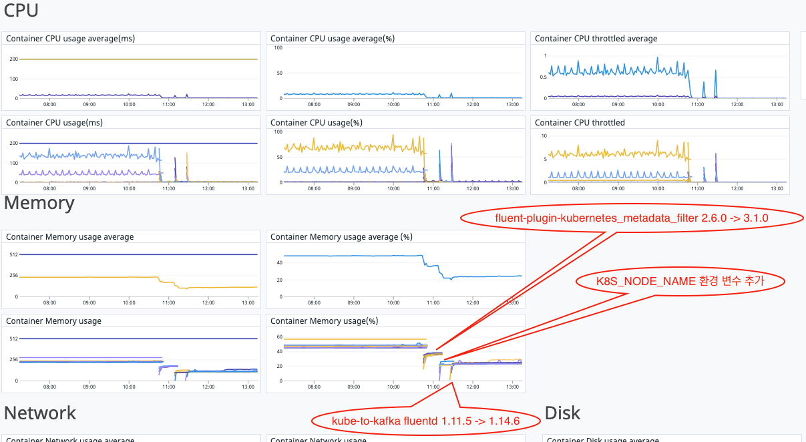

# [Fluentd] Upgrade fluent-plugin-kubernetes_metadata_filter
> date - 2024.01.16  
> keyword - fluentd, kubernetes  
> fluent-plugin-kubernetes_metadata_filter upgrade 과정에서 겪었던 이슈 정리  

<br>

## Requirement

### Dependency
| Name | Version |
|:--|:--|
| [Fluentd](https://www.fluentd.org) | v1.14.6 |
| [fluent-plugin-kubernetes_metadata_filter](https://github.com/fabric8io/fluent-plugin-kubernetes_metadata_filter) | v3.1.0 |

### Log pipeline
```
fluentd(collector) -> kafka -> fluentd(aggregator) -> opensearch
```


<br>

## Issue
* k8s 1.21의 변경점인 BoundServiceAccountTokenVolume를 대응 필요

<br>

### BoundServiceAccountTokenVolume란?
* service account token 1시간 만료
* [Kubernetes Client SDK](https://kubernetes.io/docs/reference/using-api/client-libraries)는 자동으로 refresh
  * Go 버전 0.15.7 이상
  * Python 버전 12.0.0 이상
  * Java 버전 9.0.0 이상
* token 발급 90일 이후 API가 거부되므로 이전 버전을 사용하는 경우 업데이트 필요
* Kubernetes API를 사용하는 workload에 영향

<br>

### Upgrade fluent-plugin-kubernetes_metadata_filter
* [#337](https://github.com/fabric8io/fluent-plugin-kubernetes_metadata_filter/pull/337)를 보면 fluent-plugin-kubernetes_metadata_filter gem: 2.11.1에서 조치되었으므로 2.11.1 이상으로 upgrade 진행
  * fluentd v1.11.5 -> v1.14.6
  * fluent-plugin-kubernetes_metadata_filter 2.6.0 -> 3.1.0
* upgrade 후 평균 memory 사용률이 15% 낮아지고, CPU throttling이 사리진 것을 확인

<div align="center">
  
</div>

* 그러나 아래의 error 발생
```sh
2022-08-25 11:42:27 +0000 [warn]: #0 dump an error event: error_class=Fluent::Plugin::ElasticsearchErrorHandler::ElasticsearchError error="400 - Rejected by Elasticsearch [error type]: mapper_parsing_exception [reason]: 'Could not dynamically add mapping for field [app.kubernetes.io/component]. Existing mapping for [kubernetes.labels.app] must be of type object but found [text].'" location=nil tag="kubernetes" time=2022-08-25 11:42:22.329983361 +0000
 record={"log"=>"2022-08-25 11:42:15 UTC | PROCESS | INFO | (collector.go:222 in logCheckDuration) | Finish pod check #320 in 4.96753ms\n", "stream"=>"stdout", "time"=>"2022-08-25T11:42:15.879446273Z", "kubernetes"=>{"container_name"=>"process-agent", "namespace_name"=>"monitoring", "pod_name"=>"datadog-xxxx", "container_image"=>"gcr.io/datadoghq/agent:7.38.2-jmx", "labels"=>{"app"=>"datadog", "app.kubernetes.io/component"=>"agent", "app.kubernetes.io/instance"=>"datadog", "app.kubernetes.io/managed-by"=>"Helm", "app.kubernetes.io/name"=>"datadog", "controller-revision-hash"=>"6ccb7c976c", "pod-template-generation"=>"8"}, "master_url"=>"https://172.20.0.1:443/api"}}
```
* 위 로그에서 핵심은 `mapper_parsing_exception [reason]: 'Could not dynamically add mapping for field [app.kubernetes.io/component]. Existing mapping for [kubernetes.labels.app] must be of type object but found [text]`로
기존에 사용하던 kubernetes.labels.app와 app.kubernetes.io/component가 있을 떄 opensearch로 indexing되지 않는 것으로 helm으로 배포한 app의 로그가 opensearch에 indexing되지 않는 것을 확인


<br>

## Why?
* [Remove de_dot functionality from plugin #320](https://github.com/fabric8io/fluent-plugin-kubernetes_metadata_filter/issues/320) , [Performance and deprecation refactorings #347](https://github.com/fabric8io/fluent-plugin-kubernetes_metadata_filter/pull/347) 으로 인해 kubernetes_metadata_filter 3.0.0 부터 de_dot 기능 제거
* [fluent-plugin-kubernetes_metadata_filter 2.13.0](https://github.com/fabric8io/fluent-plugin-kubernetes_metadata_filter/tree/v2.13.0#configuration) 을 보면 해당 옵션은 DEPRECATED된 것을 확인할 수 있다


<br>

## Resolve
해결 방안으로는 3가지 정도가 떠오른다

1. [recommended labels](https://kubernetes.io/docs/concepts/overview/working-with-objects/common-labels)을 따라 labels.app을 labels.app.kubernetes.io/name 으로 수정
2. labels.app.kubernetes.io/name을 labels.app으로 수정하고 나머지는 drop
3. app.kubernetes.io/xxx를 app_kubernetes_io/xxx로 변환

이중 1과 2는 하위 호환성을 보장할 수 없고, 추후 다른 필드 추가시에 지속적인 관리가 필요하므로 제외하고 3번으로 해결

* [fluent-bit Namespace annotations to prevent mapping collisions #854](https://github.com/fluent/fluent-bit/issues/854)에서는 `Replace_Dots: On` 사용하여 `.`을 `_`로 replace
* [fluent-plugin-elasticsearch #787](https://github.com/uken/fluent-plugin-elasticsearch/issues/787) 와 [Remove de_dot functionality from plugin #320](https://github.com/fabric8io/fluent-plugin-kubernetes_metadata_filter/issues/320) 에서는 fluent-plugin-record-modifier로 위와 같이 동작하게 설정하거나 [fluent-plugin-dedot_filter](https://github.com/lunardial/fluent-plugin-dedot_filter) 사용
* [fluentd-kubernetes-daemonset:v1.15-debian-elasticsearch7-1](https://github.com/fluent/fluentd-kubernetes-daemonset/blob/master/docker-image/v1.15/debian-elasticsearch7/Gemfile#L21)에서 사용 중
* fluent-plugin-dedot_filter에서 de_dot_nested=true로 설정해야 record를 재귀로 돌며 기존과 동일하게 kubernetes=>labels=>app, kubernetes=>labels=>app.kubernetes.io/component, kubernetes=>labels=>app.kubernetes.io/instance가 indexing 된다
* fluentd(collector) -> fluentd(aggregator)로 de_dot 기능이 이동하여 fluentd(aggregator)의 리소스 사용률이 증가하여 scale up 진행한 후 마무리!


<br><br>

> #### Reference
> * [Kubernetes Client SDK](https://kubernetes.io/docs/reference/using-api/client-libraries)
> * [Refresh k8s client on 'Unathorized' exceptions #337](https://github.com/fabric8io/fluent-plugin-kubernetes_metadata_filter/pull/337)
> * [Remove de_dot functionality from plugin #320](https://github.com/fabric8io/fluent-plugin-kubernetes_metadata_filter/issues/320)
> * [Performance and deprecation refactorings #347](https://github.com/fabric8io/fluent-plugin-kubernetes_metadata_filter/pull/347)
> * [fluent-plugin-kubernetes_metadata_filter 2.13.0](https://github.com/fabric8io/fluent-plugin-kubernetes_metadata_filter/tree/v2.13.0#configuration)
> * [recommended labels](https://kubernetes.io/docs/concepts/overview/working-with-objects/common-labels)
> * [fluent-bit Namespace annotations to prevent mapping collisions #854](https://github.com/fluent/fluent-bit/issues/854)
> * [fluent-plugin-elasticsearch #787](https://github.com/uken/fluent-plugin-elasticsearch/issues/787)
> * [Remove de_dot functionality from plugin #320](https://github.com/fabric8io/fluent-plugin-kubernetes_metadata_filter/issues/320)
> * [fluent-plugin-dedot_filter](https://github.com/lunardial/fluent-plugin-dedot_filter)
> * [fluentd-kubernetes-daemonset:v1.15-debian-elasticsearch7-1](https://github.com/fluent/fluentd-kubernetes-daemonset/blob/master/docker-image/v1.15/debian-elasticsearch7/Gemfile#L21)
