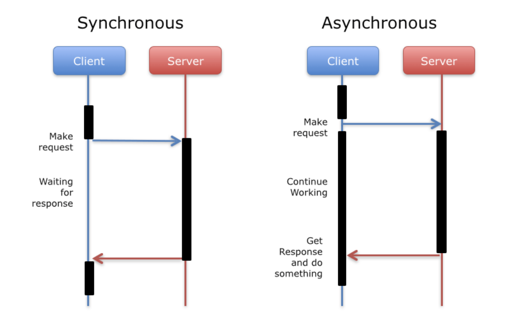
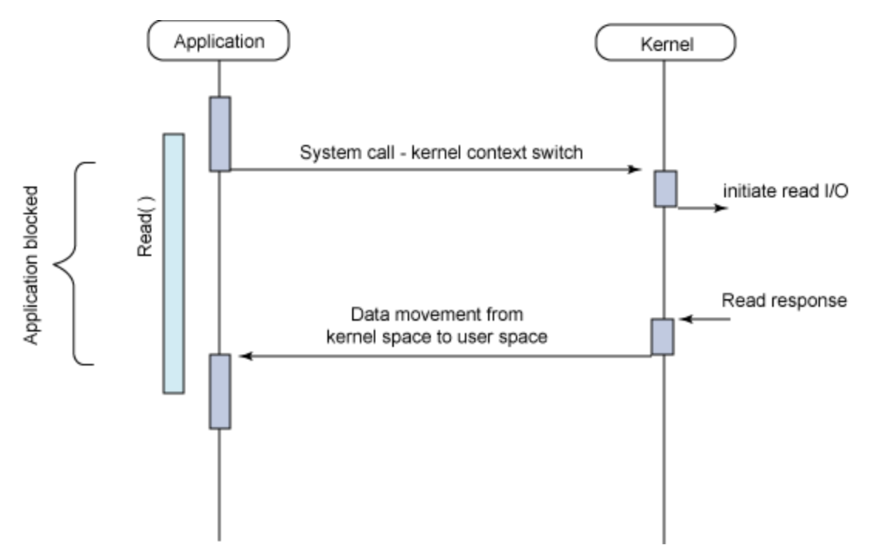
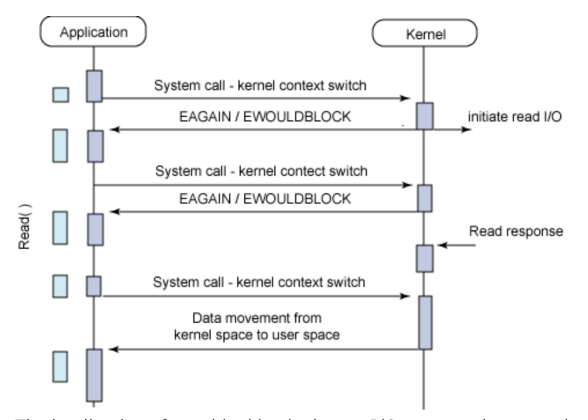
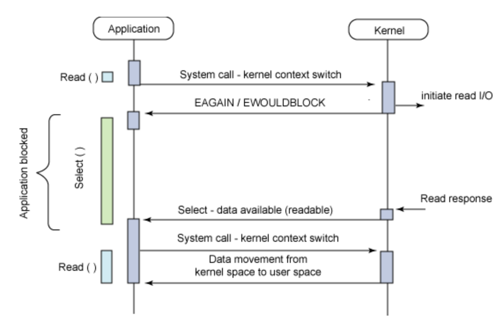
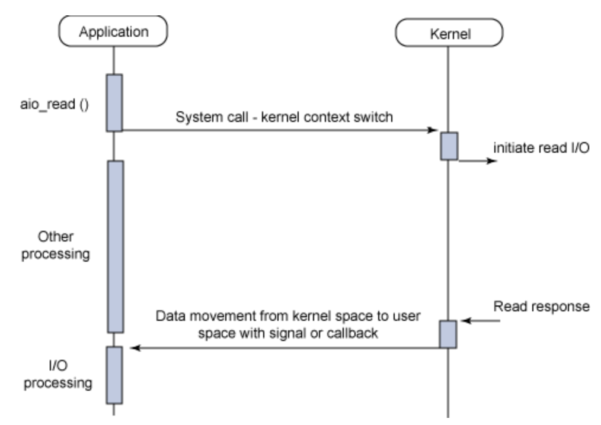

# [Foundation] Synchronous, Asynchronous vs Blocking, Non-blocking
> date - 2020.06.21  
> keyworkd - io,  synchronous, asynchronous, blocking, non-blocking  
> synchronous, asynchronous, blocking, non-blocking에 대해 정리

 

## Synchronous vs Asynchronous

* **함수의 작업 결과가 어떻게 전달되는지 여부**
  * I/O나 특정 작업 모두 포함

 

### Synchronous
* **호출한 함수가 작업 결과를 기다린다**
* e.g. polling - 작업 결과를 지속적으로 확인 관점에서 synchronous

 

### Asynchronous
* **호출되는 함수가 작업 결과를 호출하는 함수에게 알려준다**
  * 호출되는 함수에게 callback을 전달하여 작업 완료시 전달 받은 callback을 실행
  * Asynchronous, Non-blocking이면 호출한 함수가 작업 결과를 가디리지 않고 다른 일을 할 수 있다
* e.g. push - 작업 결과를 기다리지 않고 전달 받는 관점에서 asynchronous

 

## Blocking vs Non-blocking
* **작업의 결과를 기다리는지 아닌지 여부**
  * I/O나 특정 작업 모두 포함

 

### Blocking
* **작업 결과를 기다린다**
* multi-thread라면 하나의 thread가 blocking 상태여도 다른 thread가 동작하므로 전체적으로 보면 blocking되지 않아 보인다
  * thread 생성 등의 리소스와 context switching으로 인한 리소스를 소비

 

### Non-blocking
* **작업 결과를 기다리지 않고, 다른 일을 한다**
* Synchronous Non-blocking의 경우 주기적으로 작업 완료를 확인한다
  * 주기적으로 작업 완료를 확인하는 방식을 `Polling`이라고 한다
  * 작업이 완료되기 전까지 주기적으로 확인하는 과정에서 리소스를 소비

 

## I/O models
| | Blocking | Non-blocking |
|:--:|:--:|:--:|
| Synchronous | Read/Write | Read/Write (Polling) |
| Asynchronous | I/O Multiplexing (Select / Poll) | Asynchronous I/O |

 

### Synchronous Blocking

* 작업 결과를 기다렸다가 전달 받는다

 

### Synchronous Non-blocking

* 작업 결과를 가디리지 않고, 다른 일을 하다가 주기적으로 확인한다

 

### Asynchronous Blocking

* 작업 결과를 기다렸다가 작업 결과를 알림 받는다
* e.g. Node.js + MySQL 조합

 

### Asynchronous Non-blocking

* 작업 결과를 가디리지 않고, 다른 일을 하다가 작업 결과를 알림 받는다

  

> #### Reference
> * [Boost application performance using asynchronous I/O](https://developer.ibm.com/technologies/linux/articles/l-async)
