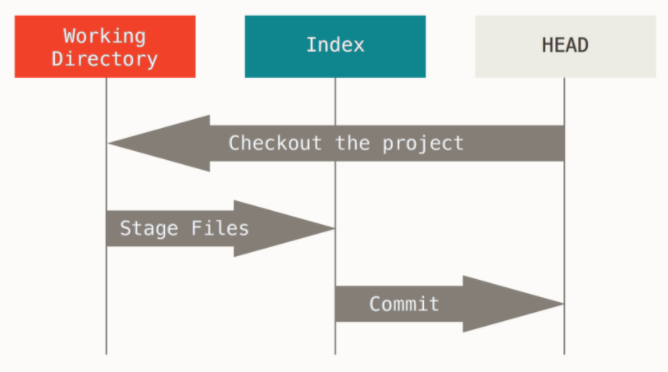

# [Git] Reset & Revert
> date - 2020.10.03  
> keyword - git, reset, revert  
> Git에서 revision을 되돌리는 방법 중 헷갈리는 reset, revert에 대해 정리  

<br>

## Git의 3개의 Tree
* tree - 파일의 묶음

| Tree | Role |
|:--|:--|
| HEAD | 마지막 commit snapshot, 다음 commit의 parent commit |
| Index | 다음에 commit할 snapshot |
| Working directory | SandBox |

<br>

### HEAD
* 현재 branch 마지막 commit의 snapshot
* 다음 commit의 parent commit

<br>

### Index
* 바로 다음에 commit할 변경 사항
* `Staging Area`에 있는 변경 사항

<br>

### Working directory
* HEAD, Index tree는 파일과 내용을 효율적인 형태로 `.git` directory에 저장
* `.git`은 사람이 눈으로 인식하기 어렵지만 Working directory에는 실제 파일로 존재
* Working directory에서 commit 전에는 Index(Staging Area)에 올려 놓고 언제든 변경 가능

<br>

### Workflow
* Git의 주 목적은 project의 snapshot을 3개의 tree를 이용하여 지속적으로 저장하는 것




<br>

## reset & revert
* reset - revision을 당시로 되돌린다
* revert - revision은 그대로 두고, commit의 code만 원복


<br>

## reset
```sh
$ git reset [option] [commit]

## example
$ git reset bd343j3
```

<br>

### 옵션 중 자주 사용하는 hard, mixed, soft에 대해 알아보자

#### soft
* **reset only HEAD**
* 특정 revision으로 돌아가고, 이후의 모든 변경 사항을 stage에 유지
* `Index`, `Working Directory`는 유지, `HEAD` 변경
  * `HEAD`가 가리키는 commit을 변경

```sh
$ git reset --soft [commit]

## example
$ git reset --soft bd343j3

### 바로 이전 commit으로 reset
### HEAD^(HEAD의 parent commit)
$ git reset --soft HEAD~
```

<br>


> #### `^` -  1번에 하나의 commit 위를 표현
> HEAD^ - parents commit
> HEAD^^ - grandparents commit
> 
> #### `~[num]` - 1번에 여러 commit 위를 표현
> HEAD~1 - parents commit
> HEAD~2 - grandparents commit

<br>

#### mixed(default behavior)
* **reset HEAD and index**
* 특정 revision으로 돌아가고, 이후의 모든 변경 사항은 유지되지만 stage 초기화
* `Working Directory`만 유지, `HEAD`, `Index` 변경
  * `HEAD`가 가리키는 commit을 변경
  * `Index`를 `HEAD`가 가리키는 상태로 변경

```sh
$ git reset --mixed [commit]

## example
$ git reset --mixed bd343j3
```

#### hard
* **reset HEAD, index and working tree**
* 특정 revision으로 돌아가고, 이후의 모든 변경 사항을 제거
* `HEAD`, `Index`, `Working Directory` 변경
  * `HEAD`가 가리키는 commit을 변경
  * `Index`를 `HEAD`가 가리키는 상태로 변경
  * `Working Directory`를 `Index`의 상태로 변경

```sh
$ git reset --hard [commit]

## example
$ git reset --hard bd343j3
```

<br>

## revert
* revision은 유지되지만, 해당 commit의 변경사항을 원복하면서 새로운 revision(revert commit) 추가
```sh
$ git revert [option] [commit]

## example
$ git revert bd343j3

### 여러개 revert
$ git revert f7ecdff 46c184d ...
```


<br>

## reset, revert를 언제 사용해야할까???
* push한 상태라면 revert 후 conflict resolve 권장
  * 다른 local git repository의 commit들이 꼬일 수 있으므로...
* push를 하지 않은 상태 or 혼자 작업하는 branch라면 reset 권장
  * commit history를 깔끔하게 관리할 수 있으므로


<br><br>

> #### Reference
> * [[초보용] Git 되돌리기( Reset, Revert)](http://www.devpools.kr/2017/02/05/%EC%B4%88%EB%B3%B4%EC%9A%A9-git-%EB%90%98%EB%8F%8C%EB%A6%AC%EA%B8%B0-reset-revert/)
> * [7.7 Git 도구 - Reset 명확히 알고 가기](https://git-scm.com/book/ko/v2/Git-%EB%8F%84%EA%B5%AC-Reset-%EB%AA%85%ED%99%95%ED%9E%88-%EC%95%8C%EA%B3%A0-%EA%B0%80%EA%B8%B0)
