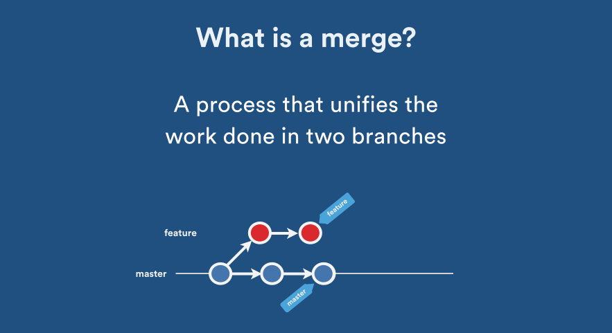

# [Git] Git Rewriting history with rebase, squash
> date - 2020.10.11  
> keyworkd - git, commit history, rebase, squash, merge, pull request  
> git을 사용하다 보면 commit을 하나로 합치거나, 여러 개로 분리하는 등의 방법을 통해 commit history를 관리하는게 편하고, 그 방법들을 정리  

<br>

## 마지막 commit 수정하기
* 마지막 commit을 수정하는 것은 가장 자주하는 일로 2가지로 나눌 수 있다
  * 단순히 commit message를 수정
  * 마지막 commit에 새로운 변경 사항 적용
* commit revision(SHA-1)이 변경된다

<br>

### 단순히 commit message를 수정
```sh
$ git commit --amend
```

<br>

### 마지막 commit에 새로운 변경 사항 적용
```sh
$ git add [file name]

$ git commit --amend

## commit message 수정 skip
$ git commit --amend --no-edit
```


<br>

## Squash로 여러 개의 commit 합치기

### Why?
* git 사용시 여러 개의 commit을 하나의 commit으로 모으는 것을 통해 git history를 관리하면 **commit history tracking이 편하다**
* `Squash` 기능을 사용하여 commit을 모으면 편하다

<br>

### What?
* `git squash`라는 명령어는 없고, `interactive rebase`시 사용하는 명령어 중 하나다

<br>

### How?
```sh
$ git log --pretty=oneline

1764635d6265d7261f0c0dd75e31eac9e0e3b70c (HEAD -> feature/rebase-tutorial) task 3
c0eaacb759af83f6e71729aa73cb8b46ae972bea task 2
53b1d59cac013e2c3f0fb658c10d4391f350dca6 task 1
```
* task 1 ~ 3을 하나의 commit으로 묶는다

```sh
$ git rebase -i HEAD~3
```
* `HEAD~3` - HEAD로부터 최근 3개의 commit

```sh
pick 53b1d59 task 1
pick c0eaacb task 2
pick 1764635 task 3

# Rebase d3ed984..1764635 onto d3ed984 (3 commands)
#
# Commands:
# p, pick <commit> = use commit
# r, reword <commit> = use commit, but edit the commit message
# e, edit <commit> = use commit, but stop for amending
# s, squash <commit> = use commit, but meld into previous commit
# f, fixup <commit> = like "squash", but discard this commit's log message
# x, exec <command> = run command (the rest of the line) using shell
# b, break = stop here (continue rebase later with 'git rebase --continue')
# d, drop <commit> = remove commit
# l, label <label> = label current HEAD with a name
# t, reset <label> = reset HEAD to a label
# m, merge [-C <commit> | -c <commit>] <label> [# <oneline>]
# .       create a merge commit using the original merge commit's
# .       message (or the oneline, if no original merge commit was
# .       specified). Use -c <commit> to reword the commit message.
#
# These lines can be re-ordered; they are executed from top to bottom.
#
# If you remove a line here THAT COMMIT WILL BE LOST.
#
# However, if you remove everything, the rebase will be aborted.
```

* 위의 3줄을 아래와 같이 수정 후 저장(:wq)하고
```sh
pick 53b1d59 task 1
squash c0eaacb task 2
squash 1764635 task 3
```

* 다음 창에서 commit message를 rewirte하면 완료
```sh
# This is a combination of 3 commits.
# This is the 1st commit message:

task 1

# This is the commit message #2:

task 2

# This is the commit message #3:

task 3

# Please enter the commit message for your changes. Lines starting
# with '#' will be ignored, and an empty message aborts the commit.
#
# Date:      Sun Oct 11 17:02:59 2020 +0900
#
# interactive rebase in progress; onto d3ed984
# Last commands done (3 commands done):
#    squash c0eaacb task 2
#    squash 1764635 task 3
# No commands remaining.
# You are currently rebasing branch 'feature/rebase-tutorial' on 'd3ed984'.
#
# Changes to be committed:
#       modified:   README.md
```

<br>

### 최근 N개의 commit squash
* `interactive rebase`의 squash와 동일한 결과를 아래 명령어를 통해 얻을 수 있다
```sh
$ git reset --soft HEAD~N

$ git commit
```


<br>

## Commit 분리하기
```sh
$ git rebase -i HEAD^
```

* 해당 commit을 edit으로 수정 후 저장(:wq)하면 `rebase` 상태가 되고
```sh
edit 53b1d59 task 1
...

Stopped at 9b6eff3...  task 1
You can amend the commit now, with

  git commit --amend

Once you are satisfied with your changes, run

  git rebase --continue
```

* `git reset` 후 원하는대로  commit을 하면 된다

```sh
$ git reset HEAD^

Unstaged changes after reset:
M       README.md

$ git add README.md

$ git commit -m "task 1 ~3"
[detached HEAD 8dcbeff] task 1 ~3
 1 file changed, 2 insertions(+)

$ git rebase --continue    
Successfully rebased and updated refs/heads/feature/rebase-tutorial.
```


<br>

## Merge strategies
* 일반적으로 사용하는 Merge strategies 아래의 3가지가 있고, 그것들의 대해 알아보자
  * Explicit, non `fast-forward` merge
  * Implicit, `rebase` or `fast-forward` merge
  * Squash on merge

<br>

### Explicit merges(aka. non fast-forward)


* 가장 간단하고 기본적
* [recursive 3-way merge](https://en.wikipedia.org/wiki/Merge_(version_control))로 merge commit 생성하기 때문에 2개의 parents commit를 가진다
* commit history가 merge commit으로 인해 복잡해 보일 수 있다
* 시각적으로는 복잡하지만 **feature branch의 변경 사항이 어떻게 적용되었는지 더 정확하게 나타난다**


<br>

### Implicit merge(rebase or fast-forward merge)
* `rebase` or `fast-forward` merge를 사용하여 feature branch의 commit을 그대로 mainline branch에 적용
* merge commit이 생성되지 않는다


#### Rebase


* 특정 commit을 mainline branch에 재생성
* commit의 원래 parents를 잃는다
* commit revision(SHA-1)이 변경된다


#### fast-forward merge


* mainline branch의 `HEAD`를 최신 commit으로 이동
* commit revision(SHA-1)이 변경되지 않는다
* mainline branch에 최근 commit이 없는 경우에만 가능


<br>

### Squash on merge


* `rebase` or `fast-forward` merge 전 feature branch의 변경 상항을 단일 commit으로 `squash`하는 것
* git commit history와 commit message를 깔끔하게 유지할 수 있다
* feature branch의 commit들은 main branch에서 중요하지 않기 때문에 해당 workflow를 더 많이 선호


<br><br>

> #### Reference
> * [Squash your commits](https://github.blog/2016-04-01-squash-your-commits/)
> * [7.6 Git 도구 - 히스토리 단장하기](https://git-scm.com/book/ko/v2/Git-%EB%8F%84%EA%B5%AC-%ED%9E%88%EC%8A%A4%ED%86%A0%EB%A6%AC-%EB%8B%A8%EC%9E%A5%ED%95%98%EA%B8%B0#_squashing)
> * [Pull Request Merge Strategies: The Great Debate](https://blog.developer.atlassian.com/pull-request-merge-strategies-the-great-debate/)
