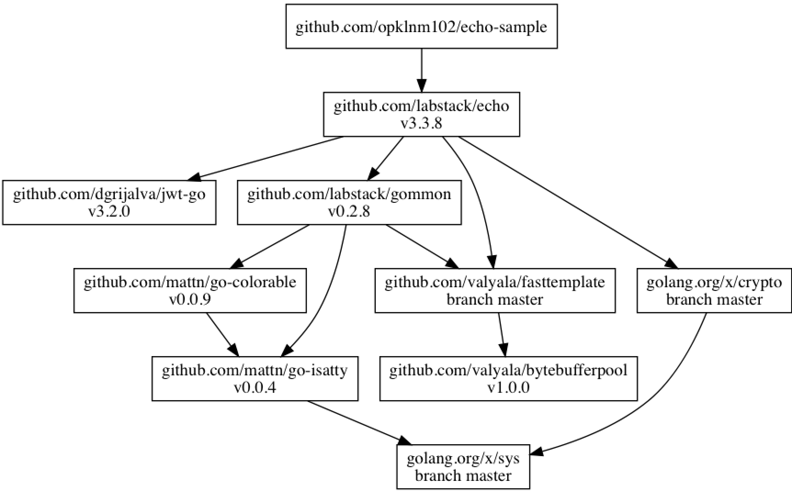
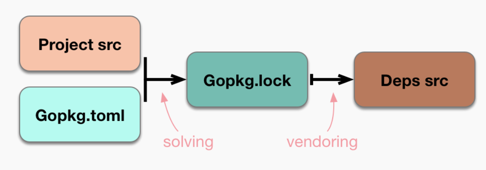
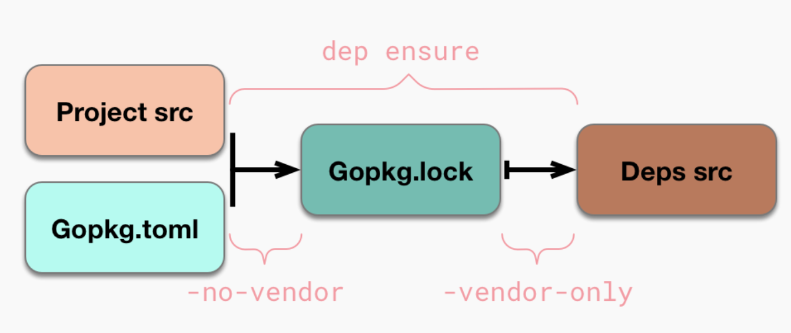

# [Go] About dep
> date - 2019.01.03  
> keyword - go, dependency management  
> [Dependency management - K8S](https://github.com/kubernetes/community/blob/master/contributors/devel/development.md#dependency-management)를 보면 K8S는 dependency 관리를 위해 dep을 사용하는데 go module을 보기 전에 dep에 대해 알아보고자 함  

<br>

## Dep이란?
* Golang을 위한 Dependency management Tool
* go 1.9 이상 필요
* official experiment project로 go 1.11에서 dep과 다른 방식의 go module 도입으로 인해 major update는 중단될지도...?
* 기존에 `go get`으로 일일이 설치하는 번거로움을 줄이고, 버전 호환성 관리를 해주기 때문에 편리하다


<br>

### Project 구조
```
- $GOPATH/src/myProject (Your project)
  ├── Gopkg.toml
  ├── Gopkg.lock
  ├── main.go (Your main go code can live here)
  ├── mySubpackage (You can create your own subpackages, too)
  |    ├── foo.go
  ├── vendor
       ├── github.com
            ├── Masterminds
                  ├── ... etc.
```


<br>

### Work Flow
* `dep init`으로 Gopkg.toml, Gopkg.lock, vendor 디렉토리 생성
* `dep ensure -add`로 dependency 추가
* `dep ensure`로 dependency install


<br>

### Gopkg.toml
* dep의 동작에 대한 설정 파일

* `dep init` 시 모습
```sh
# Gopkg.toml example
#
# Refer to https://golang.github.io/dep/docs/Gopkg.toml.html
# for detailed Gopkg.toml documentation.
#
# required = ["github.com/user/thing/cmd/thing"]
# ignored = ["github.com/user/project/pkgX", "bitbucket.org/user/project/pkgA/pkgY"]
#
# noverify = ["github.com/something/odd"] 
#
# [[constraint]]
#   name = "github.com/user/project"
#   version = "1.0.0"
#
# [[constraint]]
#   name = "github.com/user/project2"
#   branch = "dev"
#   source = "github.com/myfork/project2"
#
# [[override]]
#   name = "github.com/x/y"
#   version = "2.4.0"
#
# [prune]
#   non-go = false
#   go-tests = true
#   unused-packages = true

[metadata]
maintainer = "Hue Kim"
version = "1.0.0"

[prune]
  go-tests = true
  unused-packages = true
```

* `constraints`, `overrides`
  * Dependency rules
  * 사용할 의존성의 버전과 어디서 가져와야 하는지 지정
  * version - 버전, 2.4.0
  * branch, source -  소스 경로, branch 지정
  * revision - git hash
  * name만 정의하면 `dep: WARNING: branch, version, revision, or source should be provided for "github.com/xxx"`와 같은 warning message를 확인할 수 있으니 같이 명시하자
* `required`, `ignored`
  * Package graph rules
  * import 경로를 추가하거나 제외해서 import graph를 조작할 수 있디
* `metadata`
  * 사용자가 정의한 key-value로 dep은 무시
* `prune`
  * 불필요한 파일을 설정해서 `vendor/`에서 제거
* `noverify`
  * vendor 확인을 건너띈 project list

> 좀더 자세한 내용은 [Gopkg.toml - dep docs](https://golang.github.io/dep/docs/Gopkg.toml.html)를 참고하자


<br>

### Gopkg.lock
* 의존성에 대한 snapshot을 가진 파일
  * 버전 등의 의존성이 locking 해주기 때문에 안전하게 의존성을 관리할 수 있다
  * test된 의존성을 deploy시 동일하게 사용하게해서 안전
* `dep ensure`시 autogenerate 되는 파일로 수정하지 않는다
  * `Gopkg.toml`을 기반으로 생성


<br>

### vendor
* 의존성이 설치되는 경로


<br>

### vendor를 git에서 관리해야 할까..?
* 장점
  * upstream rename, delete, commit history overwrite를 방지하기 때문에 재현 가능한 빌드를 얻는 유일한 방법
  * vendor를 Gopkg.lock과 동기화하는 단계가 필요하지 않다
* 단점
  * repository의 용량이 커질 수 있다
  * Gopkg.lock이 수정되었을 때 vendor에 대한 변경 사항이 PR diffs에는 포함되지만 GitHub에서는 숨겨진다

> * Gopkg.toml, Gopkg.lock는 git에서 관리
> * vendor는 선택적


<br>

## Install
```sh
## macOS 기준
$ brew install dep
$ brew upgrade dep

## other platforms
$ curl https://raw.githubusercontent.com/golang/dep/master/install.sh | sh

## check
$ dep version

dep:
 version     : v0.5.0
 build date  : 2018-07-26
 git hash    : 224a564
 go version  : go1.10.3
 go compiler : gc
 platform    : darwin/amd64
 features    : ImportDuringSolve=false
```


<br>

## Usage

### dep init
```sh
$ dep init

├── Gopkg.toml
├── Gopkg.lock
└── vendor/  
```


<br>

### dependency install
```sh
$ dep ensure
```
* `Gopkg.lock`을 기반으로 의존성을 설치한다


<br>

### dependency 추가
```sh
$ dep ensure -add github.com/labstack/echo

Fetching sources...

"github.com/labstack/echo" is not imported by your project, and has been temporarily added to Gopkg.lock and vendor/.
If you run "dep ensure" again before actually importing it, it will disappear from Gopkg.lock and vendor/.
```
* Gopkg.toml에 추가되고, `Gopkg.lock`, `vendor`에는 임시로 추가
  * code에서 import하지 않으면 dep ensure시 `Gopkg.lock`, `vendor`에서 제거된다

```sh
# Gopkg.toml
...
[[constraint]]
  name = "github.com/labstack/echo"
  version = "3.3.8"
```

* import 안하면 아래와 같이 제거된다
```sh
$ dep ensure

Warning: the following project(s) have [[constraint]] stanzas in Gopkg.toml:

  ✗  github.com/labstack/echo

However, these projects are not direct dependencies of the current project:
they are not imported in any .go files, nor are they in the 'required' list in
Gopkg.toml. Dep only applies [[constraint]] rules to direct dependencies, so
these rules will have no effect.

Either import/require packages from these projects so that they become direct
dependencies, or convert each [[constraint]] to an [[override]] to enforce rules
on these projects, if they happen to be transitive dependencies.
```


<br>

### dependency update
* Gopkg.toml을 확인 후 lock된 dependency를 update 한다

```sh
## Gopkg.toml에서 version 등을 올린 후

## 모든 dependency
$ dep ensure -update

## 특정 dependency
$ dep ensure -update github.com/labstack/echo
```

<br>

> #### dep ensure시 하는 일은..?
> * 새로운 dependency 추가
> * 기존의 dependency update
> * project에 추가된 dependency나 사용 안하는 dependency 확인
> * Gopkg.toml의 변경사항 확인


<br>

### dep status
* 현재 사용하고 있는 dependency를 확인할 수 있다

```sh
$ dep status
PROJECT                            CONSTRAINT     VERSION        REVISION  LATEST   PKGS USED
github.com/dgrijalva/jwt-go        v3.2.0         v3.2.0         06ea103   v3.2.0   1
github.com/labstack/echo           ^3.3.6         v3.3.8         c7eb8da   v3.3.8   2
github.com/labstack/gommon         v0.2.8         v0.2.8         7fd9f68   v0.2.8   4
github.com/mattn/go-colorable      v0.0.9         v0.0.9         167de6b   v0.0.9   1
github.com/mattn/go-isatty         v0.0.4         v0.0.4         6ca4dbf   v0.0.4   1
github.com/valyala/bytebufferpool  v1.0.0         v1.0.0         e746df9   v1.0.0   1
github.com/valyala/fasttemplate    branch master  branch master  dcecefd   dcecefd  1
golang.org/x/crypto                branch master  branch master  8d7daa0   8d7daa0  2
golang.org/x/sys                   branch master  branch master  82a175f   82a175f  1
```


<br>

### Visualizing dependencies
* macOS
```sh
$ brew install graphviz

$ dep status -dot | dot -T png | open -f -a /Applications/Preview.app
```

* Linux
```
$ sudo apt-get install graphviz

$ dep status -dot | dot -T png | display
```




<br>

## constraint에 revision 지정하기

### Before: short git version hash를 사용
```
## Gopkg.toml

...
[[constraint]]
  name = "github.com/golang/glog"
  revision = "23def4e"
...

$ dep ensure

dep: WARNING: revision "23def4e" should not be in abbreviated form
```
* short git version hash를 사용하면 warning... `full hash를 사용`하자


### After: full hash 사용
```
[[constraint]]
  name = "github.com/golang/glog"
  revision = "23def4e6c14b4da8ac2ed8007337bc5eb5007998"
```


<br>

## Docker에서 dep 사용하기
* `dep ensure -vendor-only`는 Gopkg.toml, Gopkg.lock과 code의 유효성 체크를 하지 않고 vendor 폴더를 생성
* cache layer를 사용하는 docker 내부 빌드에 유용
  * 각 build를 docker를 사용할 경우 사용

```
FROM golang:1.11.4 AS builder

RUN curl -fsSL -o /usr/local/bin/dep https://github.com/golang/dep/releases/download/vX.X.X/dep-linux-amd64 && chmod +x /usr/local/bin/dep

RUN mkdir -p /go/src/github.com/xxx
WORKDIR /go/src/github.com/xxx

COPY Gopkg.toml Gopkg.lock ./

# install the dependencies without checking for go code
RUN dep ensure -vendor-only
```


<br>

## Travis CI에서 dep 사용하기
```yaml
...

env:
  - DEP_VERSION="0.5.0"

before_install:
  - curl -L -s https://github.com/golang/dep/releases/download/v${DEP_VERSION}/dep-linux-amd64 -o $GOPATH/bin/dep
  - chmod +x $GOPATH/bin/dep

install:
  - dep ensure

...
```

### Travis CI Cache 사용시 주의할 점
* build가 깨뜨린다면 간헐적인 cache 손상이 발생
* 너무 큰 cache는 권장하지 않는다
* cache 사용시 안전한 `URL을 사용해 storage provider에 업로드`해 보안 및 개인정보 보장
  * cache 성능은 로컬이 아니기 때문에 S3의 `네트워크 대역폭, DNS 성능`에 따라 달라진다
  * cache로 수백 MB보다 큰걸 저장하면 속도가 크게 향상되진 않는다
* Travis CI에서 caching하려면 `GOPATH/pkg/dep(dep cache 기본 경로)`를 cache directory에 추가
```yaml
...
cache:
  directories:
    - $GOPATH/pkg/dep
...
```


<br>

## Models and Mechanisms

### States and flows
* package manager가 상호작용하는 disk의 state를 4가지로 분류한 **4 state system** 기반으로 동작
  * `current project`의 source code
  * current project의 dependency requirements가 정의된 `manifest`인 `Gopkg.toml`
  * dependency graph의 transitively-complete, reproducible description이 담긴 `lock`인 `Gopkg.lock`
  * dependency의 source code인 `vendor/`


<br>

### Functional flow
* `dep`은 state 사이의 관계에 대한 단방향, functional flow를 부과하는 시스템



#### solving
* current project의 import set과 `Gopkg.toml`의 rule로 **transitive-complete, immutable dependency grpah**인 `Gopkg.lock` 생성
* 코드에서는 `Solver` type을 생성한 후 `Solve()`를 호출, input으로는 `SolveParameters` 사용
```go
type SolveParameters struct {
    RootPackageTree pkgtree.PackageTree  // Parsed project src; contains lists of imports
    Manifest gps.RootManifest  // Gopkg.toml
    ...
}
```

* `Gopkg.toml`이 없다면 `dep init`으로 생성할 수 있다
  * `GOPATH`와 다른 tool의 metadata로 부터 정보를 가져오기 때문에 migration할 수 있다

#### vendoring
* 컴파일러가 `Gopkg.lock`에 지정된 버전을 사용할 수 있도록 소스파일의 배치를 보장
* 코드에서는 `gps.WriteDepTree()`에 `gps.Lock`을 input으로 사용
  * gps.Lock - `Gopkg.lock`을 추상화한 interface


<br>

### Staying in sync
* function이 모두 자신이 수행하는 작업과 출력해서 유도하는 변경을 최소화
* 두기능 모두 pre-existing output을 보고 실제로 수행할 작업을 이해
* `solving`
  * Gopkg.lock을 검사해 모든입력이 만족하는지 확인
  * 그럴 경우 solving을 패스
  * 아니라면 solving이 진행되고 Gopkg.lock에서 선택항목을 변경 시도
* `vendoring`
  * disk의 코드가 Gopkg.lock에 있는것을 확인하기 위해 `verdor/`의 프로젝트들을 hashing
  * hash가 불일치한 프로젝트만 재작성

| Sync invariant | Resolution when desynced | func |
|:--|:--|:--|
| Gopkg.toml의 모든 `required`는 Gopkg.lock의 `input-imports`에 존재 | Re-solve, Gopkg.lock, vendor/를 업데이트 | Solving |
| current project의 non-ignored, non-hidden package의 모든 `import`는 Gopkg.lock의 input-imports에 존재  | Re-solve, Gopkg.lock, vendor/를 업데이트 | Solving |
| Gopkg.lock의 모든 `version`은 Gopkg.toml의 `[[constraint]]`, `[[override]]`를 허용 해야 한다 | Re-solve, Gopkg.lock, verdor/를 업데이트 | Solving |
| Gopkg.lock의 각`[[project]]`의 `pruneopts`는 Gopkg.toml과 같아야 한다 | Gopkg.lock, verdor/를 업데이트 | Vendoring |
| Gopkg.lock의 각`[[project]]`의 `digest`는 `verdor/`의 hashing과 같아야 한다 | vendor/를 regenerate 후 새로운 hash digest로 Gopkg.lock을 업데이트 | Vendoring |

* sync invariant가 이미 충족되었는지 알면, dep은 해당 function을 skip
* `dep ensure`가 끝나면 모든 sync invariants가 유지된 **known good state**를 보장
* `dep check`는 위의 모든 관계를 평가 후 invariant가 충족되지 않으면 desync와 exit 1을 출력
  * Gopkg.toml의 `noverifty`로 project별로 해제 가능


<br>

### dep ensure flags and behavior variations
`dep ensure`의 flag는 solving, vendoring function에 영향을 준다
    일시적으로 project가 sync되지 않을 수 있다

#### -no-vendor and -vendor-only


* `-no-vendor`
  * solving만을 무조건 수행하여 Gopkg.lock 생성하기 때문에 기존에 생성된 Gopkg.lock을 검증할 수 있다
* `-vendor-only`
  * solving을 skip하고 vendoring만 수행하여 vendor/ 생성

#### -add
* depgraph에 새로운 dependency 추가
* `-update`는 project root(e.g. github.com/foo/bar)로 제한되지만, `-add`는 package import path(e.g. github.com/foo/bar/baz)를 argument로 사용할 수 있다
* `dep ensure -add`를 사용하는 경우
  * 새로운 dependency로 solving을 수행해 Gopkg.lock 생성할 때
  * Gopkg.toml에 version constraint 추가할 때
* `dep ensure -add`를 사용하기 위한 조건
  * current project에 import가 없고, Gopkg.toml에 required로 없을 때
  * Gopkg.toml의 `[[constraint]]`가 없을 때

```sh
## Gopkg.toml에 있는 경우
$ dep ensure -add github.com/foo/bar
Fetching sources...

Failed to add the dependencies:

  ✗ nothing to -add, github.com/foo/bar is already in Gopkg.toml and the project's direct imports or required list

adding dependencies failed

## import path가 있는 경우
$ dep ensure -add github.com/foo/bar
Fetching sources...

Failed to add the dependencies:

  ✗ github.com/foo/bar is already imported or required, so -add is only valid with a constraint

adding dependencies failed
```

* version 명시 가능
  * 명시된 version이 없으면 최신 버전 사용

```sh
$ dep ensure -add github.com/foo/bar@v1.0.0
```

#### -update
* solver의 동작과 밀접하게 연결
* solving function은 기존 Gopkg.lock을 고려
* solver가 이전에 선택한 버전을 보존하려면 Gopkg.lock이 필요

```go
type SolverParameters struct {
    ...
    Lock gps.Lock  // Gopkg.lock
    ToChange []gps.ProjectRoot  // args to -update
    ChangeAll bool  // true if no -update args passed
    ...
}
```

> -update는 중간에서 중지...


<br>

## Glossary

### Atom
* 특정 버전의 소스
* project root와 version을 의미
  * github.com/foo/bar@master
* solver 내부에서 사용되며 다른곳에서는 거의 사용되지 않는다

### Cache lock
* `sm.lock`이라는 파일은 1번에 1개의 dep process가 local cache에 대해 접근하도록 하는데 사용
* 아직 dep이 multi process에 대해 안전하지 않기 때문

### Current Project
* Gopkg.lock과 vendor에 대해 dep이 작업하는 project
* root project라고도 함

### Deduction
* source root에 해당하는 import path를 결정하는 프로세스
* 일부는 선언(static), 일부는 network를 통해(dynamic) 발견되야 한다

### Direct Dependency
* 하나 이상의 package를 import하거나 Gopkg.toml의 `required`에 선언된 것들
* A -> B -> C -> D로 단일 package만 가져오는 경우
  * B는 A의 `direct Dependency`
  * C, D는 A의 `transitive dependencies`

### External Import
* 다른 package를 가리키는 import
`import github/foo/bar`는 stdlib 또는 github/foo/bar/*가 아닌 다른 package면 external import

### GPS
* Go packaging solver
* dep 하위의 library-style package

### Local cache
* dep이 관리하는 upstream source
* `$GOPATH/pkg/dep`

### Lock
* `Gopkg.lock`에서 관리

### Manifest
* `Gopkg.toml`에서 관리

### Project Root
* current project면 `Gopkg.toml`이 위치한 곳
* dependency project면 VCS의 root

### Solver
* `GPS`내부의 domain-specific SAT solver에 대한 reference
* [The Solver](https://golang.github.io/dep/docs/the-solver.html) 참고

### Source
* versioning된 remote entities
* code를 포함하는 entity며 code의 특정버전이 아니다

### Source Root
* Source를 network에서 import하기 위한 location
* Projetc Root와 비슷하지만 network-oriented

### Sync
* dep은 4가지 상태 사이의 잘 정의된 관계를 중심으로 설계
  * .go 파일의 `import` statements
  * `Gopkg.toml`
  * `Gopkg.lock`
  * `vendor` directory
* 충족되지 않은 경우 `out of sync`

### Vendor Verification
* dependency package를 hashing한 digest를 `Gopkg.lock`에 저장해 `vendor/`의 정확성을 보장
* digest는 `vendor/`의 내용을 `dep ensure`시 재생성해야 하는지 결정하는데 사용
* `dep check`는 digest로 `Gopkg.lock`과 `vendor/`가 sync되었는지 확인
* Gopkg.toml의 `noverify`는 vendor verification을 회피하는데 사용


<br><br>

> #### Reference
> * [dep: Dependency management for Go](https://golang.github.io/dep/)
> * [golang/dep - GitHub](https://github.com/golang/dep)
> * [Gopkg.toml - dep docs](https://golang.github.io/dep/docs/Gopkg.toml.html)
