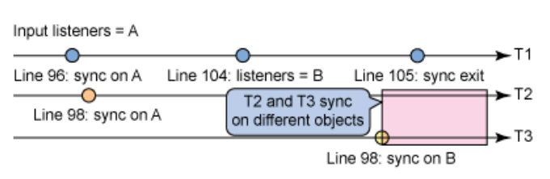

# [Java] Java concurrency bug patterns for multicore systems
> date - 2018.09.23  
> keyword - java, concurrency  
> [Java concurrency bug patterns for multicore systems](https://www.ibm.com/developerworks/java/library/j-concurrencybugpatterns/j-concurrencybugpatterns-pdf.pdf)를 요약 정리  
> concurrency bug pattern을 공부함으로써 동시성 프로그래밍에 대한 전반적인 인식을 높이고 작동하지 않거나 작동하지 않을 수도 있는 coding idiom을 인식하자


<br>

## Multi Thread Programming에 익숙하지 않은 경우 알아야할 점
1. 동시성은 재현 및 진단하기 매우 어려운 data race와 deadlock 같은 bug를 발생시킨다
2. multi thread programming idiom의 미묘함을 인식하지 못하면 bug를 발생시킨다

<br>

> #### 동시성 이슈를 쉽게 방지하기
> * multi thread/concurrency 문제는 비용을 지불할 준비가 되어있기 전까진 직업 작업을 최대한 회피한다
> * 객체의 상태저장을 최소화하고, 가능하다면 immutable 객체로 만든다

<br>


> TODO: 잘 알려진  concurrency bug pattern을 정리
## 잘 알려진 concurrency bug pattern
Double Checked Locking, Wait Not In Loop, Unconditional Wait, Mismatched Wait and Notify, Two Locks Held While Waiting 등등 

### Double Checked Locking
```java
static ClassA field;
static ClassA createdSingleton() {
    if (field == null) {
        synchronized (lock) {
            if (field == null) {
                ClassA obj = new ClassA();
                field = obj;
            }
        }
    }
    return field;
}
```

<br>

## 6개의 덜 알려진 Java concurrency bug pattern

### 1. An antipattern from Jetty
* Jetty에서 발견된 버그

```java
// Jetty 7.1.0
// SelectorManager.java line 105

private volatile int _set;
...
public void register(SocketChannel channel, Object att) {
    int s = _set++;
    ...
}
...
public void addChange(Object point) {
    synchronized (_chages) {
        ...
    }
}
```
* `_set`은 `volatile`로 선언 여러 스레드가 접근할 수 있다
* `_set` 은 atomic 하지 않다
* `read-modify-write` 3가지 작업 시퀀스를 줄이는게 좋다
* lock으로 보호되지 않았다
  * race condition으로 _set의 값이 잘못될 수 있다
* variable i에 대한 연산
```java
i++
--i
i += 1
i -= 1
i *= 2
```
* i++은 non-atomic
  * read - modify - write로 구성

#### volatile은 visibility는 보장하지만 non-atomic
* 각 thread에서 최신값을 읽을 수 있다
* lock에 의해 보호되지 않는 volatile field는 race condition을 초래할 수 있다
  * non-atomic 연산이 multi thread에 의해 동시에 엑세스되는 경우
* volatile field는 `1개의 thread에서만 값을 변경`할 수 있어야 한다
* 코드가 버그인지 여부는 `엑세스할 수 있는 thread 수`에 따라 다르다
  * start-join 관계로 인해 하나의 thread에서 호출되는 경우나 external locking을 사용하는 경우 thread safe
* 가변 연산이 non-atomic이고 multi thread가 접근할 수 있다면 volatile에 의존하지 말고 thread safe를 위해 java.util.concurrent의 `synchronized block`, `lock class`, `atomic class`를 사용

<br>

### 2. Synchronization on mutable fields
* `synchronized`를 사용해 mutual-exclusion(상호 배제) lock을 획득
* multi thread 환경에서 shared-resource access를 보호
* mutable field에서 동기화시 허점이 있어 mutual-exclusion를 무너뜨릴 수 있다
  * 해결책은 synchronized field를 `private final`로 선언
* synchronized block는 필드 자체가 아닌 필드에서 참조된 객체로 보호
  * 동기화된 필드가 변경 가능하면 다른 스레드가 서로 다른 객체에서 동기화 할 수 있다

```java
public void addInstanceListener(InstanceListener listener) {
    synchronized(listeners) {
        InstanceListener results[] = new InstanceListener[listeners.length + 1];
        for(int i = 0; i< listeners.length; i++) {
            results[i] = listeners[i];
        }
        results[listeners.length] = listener;
        listeners = results;
    }
}
```



* Listener가 Array A를 참조하고 Thread T1이 먼저 Array A의 lock을 획득하고, Array B를 생성하는 것으로 바쁘다고 가정
* 그동한 Thread T2는 Array A의 lock을 얻기 위해 block을 따라간다
* T1이 Array B에서 Listener를 설정하고 block을 종료하면 T2는 Array A를 잠그고 Array B의 복사본을 만들기 시작
* 그런 다음 T3가 Array B를 잠근다
* 서로 다른 lock을 획득했으므로 T2와 T3는 동시에 Array B의 복사본을 만든다
* 최소한 새로운 리스너 중 하나가 손실되거나 스레드 중 하나가 ArrayIndexOutOfBoundsException을 발생할 수 있다(Listener가 참조하는 길이가 메소드의 어느 지점에서나 바뀔 수 있기 때문에)
* 동기화된 필드를 `항상 private final로 선언`하면 lock 객체가 변경되지 않고 mutex가 보장된다

<br>

### 3. java.util.concurrent lock leak
* `java.util.concurrent.locks.Lock` interface를 구현하는 lock은 multi thread가 shared resource에 대한 접근을 제어
* 이런 lock에는 block 구조가 필요하지 않으므로 synchronized method나 statement보다 유연
* block 없이는 lock이 자동으로 해제되지 않으므로 `lock leak`이 발생할 수 있다
  * Lock.lock()을 호출한 인스턴스가 unlock()을 호출하지 않을 경우

```java
private final Lock lock = new ReentrantLock();

public void lockLeak() {
    lock.lock()
    try {
        // access the shared resource
        accessResource();
        lock.unlock();  // exception 발생시 호출되지 않아 lock leak 발생
    } catch (Exception e) {
    }
}

public void accessResource() thrwos InterruptedException {
    ...
}
```

* `finally`로 lock leak 방지
```java
public void lockLeak() {
    lock.lock()
    try {
        // access the shared resource
        accessResource();
    } catch (Exception e) {
    } finally {
        lock.unlock();  // 여기
    }
}
```

<br>

### 4. Performance tuning synchronized blocks
* concurrency bug로 인해 application `성능이 저하`될 수 있다
  * synchronized block을 주의

```java
public class Operator {
    private int generation = 0;  // shared resource
    private float totalAmount = 0;  // shared resource
    private final Object lock = new Objcet();

    public void workOn(List<Operand> operands) {
        synchronized (lock) {
            int curGeneration = generation;  // requires sync
            float amountForThisWork = 0;
            for (Operand op : operands) {
                op.setGeneration(curGeneration);
                amountForThisWork += op.amount;
            }
            totalAmount += amountForThisWork;  // required sync
            generation++;  // required
        }
    }
}
```
* 2개의 shared resource에 대한 동기화는 이루어지지만, `synchronized block에서 많은 계산이 필요`

```java
public void workOn(List<Operand> operands) {
    int curGeneration;
    float amountForThisWork = 0;
    synchronized (lock) {
        int curGeneration = generation++;
    }
    for (Operand op : operands) {
        op.setGeneration(curGeneration);
        amountForThisWork += op.amount;
    }
    synchronized (lock) {
        totalAmount += amountForThisWork;
    }
}
```
* synchronized block을 분리해 시`간이 많이 걸리는 loop는 병렬로 여러 thread`에서 실행
  * thread safe를 유지하면서 성능을 끌어올린다

<br>

### 5. Multi-stage access
* 2개의 테이블이 있을 때 하나는 사원 이름을 id에 매핑, 다른 하나는 id를 급여에 매핑
  * 이 데이터는 동시 엑세스와 갱신을 지원
  * thrad safe를 위해 ConcurrentHashMap 사용

```java
public class Employees {
    private final ConcurrentHashMap<String, Integer> nameToNumber;
    private final ConcurrentHashMap<Integer, Salary> numberToSalary;

    ...

    public int getBonusFor(String name) {
        Integer serialNum = nameToNumber.get(name);
        Salary salary = numberToSalary.get(serialNum);
        return salary.getBonus();
    }
}
```
* thread safe한것처럼 보이지만, getBonusFor()는 not thread safe
* serialNum를 얻고, Salary를 조회하는 사이에 다른 스레드가 직업을 제거할 수 있다
  * NPE 발생
* 의존성이 있는 2개의 Map에 대한 atomic access 필요
  * 각 ConcurrentHashMap은 thread safe하지만 atomic 하지 않다
  * HashMap 같은 not thread safe Collection을 사용하고, 명시적으로 동기화로 thread safe를 보장

<br>

### 6. Symmetric lock deadlock
* thread safe container class는 container의 사용을 중심으로 동기화
  * client에 thread safe를 보장하는 data structure
  * 수정 가능한 멤버는 데이터를 저장하고 잠금 객체는 모든 액세스를 보호

```java
public <E> class ConcurrentHeap {
    private E[] elements;
    private final Object lock = new Object();  // protects elements

    public void add(E newElement) {
        synchronized(lock) {
            ...
        }
    }

    public E removeTop() {
        synchronized(lock) {
            E top = elements[0];
            ...
            return top;
        }
    }

    public void addAll(ConcurrentHeap other) {
    synchronized(other.lock) {
        synchronized(this.lock) {
            ...
        }
    }
}
```
* thread 1이 heap1.addAll(heap2), thread 2가 heap2.addAll(heap1)을 호출하면 deadlock 발생
* `인스턴스간의 순서를 결정`하여 Symmetric lock deadlock을 방지
  * [Java Concurrency in Practice](https://www.amazon.com/Java-Concurrency-Practice-Brian-Goetz/dp/0321349601) 참고


---

<br>

> #### Reference
> * [Java concurrency bug patterns for multicore systems](https://www.ibm.com/developerworks/java/library/j-concurrencybugpatterns/j-concurrencybugpatterns-pdf.pdf)
