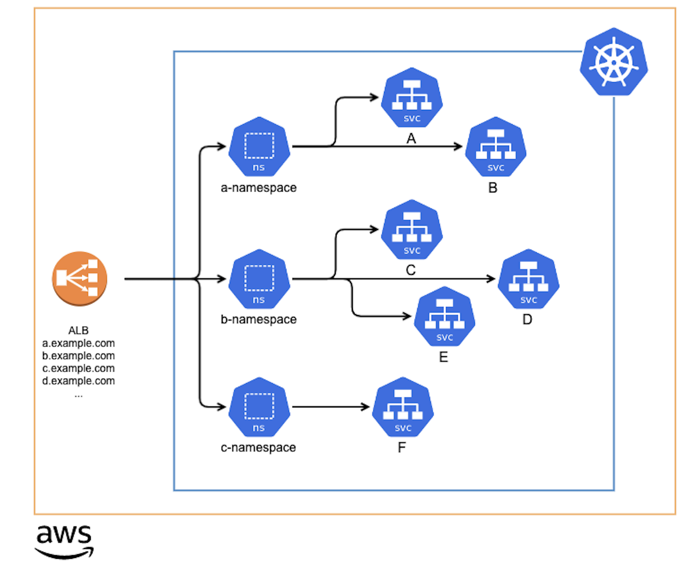

# [k8s] Share single ALB with multiple Ingress
> date - 2023.04.28  
> keyworkd - kubernetes, k8s, aws alb, ingress  
> 하나의 ALB(Application Load Balancer)를 여러 ingress에서 공유하여 ALB 비용을 절약하는 내용에 대해 정리  

<br>

## TL;DR
* ingress group을 사용하면 서로 다른 namespace의 여러 ingress에서 하나의 ALB를 공유할 수 있어서 비용 절감 가능
* ALB의 hard limit 주의 필요


<br>

## Requirements
* [AWS Load Balancer Controller](https://kubernetes-sigs.github.io/aws-load-balancer-controller)는 기본적으로 Ingress를 생성하면 ALB가 1:1로 생성되는 형태
* ALB는 많은 양의 traffic을 처리할 수 있으므로 사용률이 낮은 ALB에서 비용 낭비가 발생하게 되는데 절약할 수 있는 방법이 있을까?


<br>

## Ingress Group
* AWS Load Balancer Controller 2.0 이전에는 Ingress와 ALB의 1:1 구성만을 지원했으나 여러 Service, Namespace에서 ALB를 공유하는 니즈가 있었고 [2.0](https://github.com/kubernetes-sigs/aws-load-balancer-controller/releases/tag/v2.0.0)에 추가된 Ingress Group을 통해 공유가 가능
* Ingress를 grouping하는 Ingress Group에는 [alb.ingress.kubernetes.io/group.name](https://kubernetes-sigs.github.io/aws-load-balancer-controller/v2.0/guide/ingress/annotations/#group.name), [alb.ingress.kubernetes.io/group.order](https://kubernetes-sigs.github.io/aws-load-balancer-controller/v2.0/guide/ingress/annotations/#group.order)을 통해 하나의 ALB를 **서로 다른 Namespace의 여러 Ingress가 공유할 수 있다**
* Ingress Group의 모든 Ingress에 설정된 ingress rule을 자동으로 병합하여 단일 ALB에 설정한다

<br>

### Architecture
<div align="center">
  
</div>

<br>

### Ingress
* ssl-redirect ingress
```yaml
apiVersion: networking.k8s.io/v1
kind: Ingress
metadata:
  name: ssl-redirect
  namespace: test
  labels:
    app: ssl-redirect
  annotations:
    alb.ingress.kubernetes.io/group.name: retail-app  # ingress group
    alb.ingress.kubernetes.io/group.order: "0"
    alb.ingress.kubernetes.io/listen-ports: '[{"HTTP":80,"HTTPS": 443}]'
    alb.ingress.kubernetes.io/actions.ssl-redirect: >
      {"type": "redirect", "redirectConfig": { "protocol": "HTTPS", "port": "443", "statusCode": "HTTP_301"}}
    alb.ingress.kubernetes.io/ssl-policy: ELBSecurityPolicy-TLS13-1-2-2021-06
    alb.ingress.kubernetes.io/scheme: internal
    alb.ingress.kubernetes.io/subnets: subnet-xxxxxxxxx,subnet-xxxxxxxxxxx
    alb.ingress.kubernetes.io/tags: |-
      service=ssl-redirect,
      environment=dev
    alb.ingress.kubernetes.io/load-balancer-attributes: |-
      idle_timeout.timeout_seconds=60,
      access_logs.s3.enabled=false
spec:
  ingressClassName: alb
  rules:
    - http:
        paths:
          - path: /
            pathType: Prefix
            backend:
              service:
                name: ssl-redirect
                port:
                  name: use-annotation
```
* order ingress
```yaml
apiVersion: networking.k8s.io/v1
kind: Ingress
metadata:
  name: order
  namespace: order
  labels:
    app.kubernetes.io/name: order
  annotations:
    alb.ingress.kubernetes.io/group.name: retail-app  # ingress group
    alb.ingress.kubernetes.io/group.order: "1"  # rule 순서를 결정하며 작을수록 우선 순위가 높다
    alb.ingress.kubernetes.io/listen-ports: '[{"HTTP":80,"HTTPS": 443}]'
    alb.ingress.kubernetes.io/ssl-policy: ELBSecurityPolicy-TLS13-1-2-2021-06
    alb.ingress.kubernetes.io/scheme: internal
    alb.ingress.kubernetes.io/subnets: subnet-xxxxxxxxx,subnet-xxxxxxxxxxx
    alb.ingress.kubernetes.io/tags: |-
      service=order,
      environment=dev
spec:
  ingressClassName: alb
  rules:
    - host: order.example.com
      http:
        paths:
          - path: /
            pathType: Prefix
            backend:
              service:
                name: order
                port:
                  number: 80
```
* catalog ingress
```yaml
apiVersion: networking.k8s.io/v1
kind: Ingress
metadata:
  name: catalog
  namespace: catalog
  labels:
    app.kubernetes.io/name: catalog
  annotations:
    alb.ingress.kubernetes.io/group.name: retail-app
    alb.ingress.kubernetes.io/group.order: "2"
    alb.ingress.kubernetes.io/listen-ports: '[{"HTTP":80,"HTTPS": 443}]'
    alb.ingress.kubernetes.io/ssl-policy: ELBSecurityPolicy-TLS13-1-2-2021-06
    alb.ingress.kubernetes.io/scheme: internal
    alb.ingress.kubernetes.io/subnets: subnet-xxxxxxxxx,subnet-xxxxxxxxxxx
    alb.ingress.kubernetes.io/tags: |-
      service=catalog,
      environment=dev
spec:
  ingressClassName: alb
  rules:
    - host: catalog.example.com
      http:
        paths:
          - path: /
            pathType: Prefix
            backend:
              service:
                name: catalog
                port:
                  number: 80
```

* ingress의 ADDRESS가 모두 동일한 ALB로 설정됨을 확인
```sh
$ kubectl get ing

NAMESPACE  NAME          CLASS  HOSTS                ADDRESS                                                                        PORTS   AGE
catalog    catalog       alb    catalog.example.com  internal-k8s-retailapp-f00fb3fb4d-166175112.ap-northeast-2.elb.amazonaws.com   80      15m
order      order         alb    order.example.com    internal-k8s-retailapp-f00fb3fb4d-166175112.ap-northeast-2.elb.amazonaws.com   80      11m
ingress    ssl-redirect  alb    *                    internal-k8s-retailapp-f00fb3fb4d-166175112.ap-northeast-2.elb.amazonaws.com   80      10m
```
* 위처럼 구성하면 HTTP Listener Rule을 최소화하며 모든 ingress에 ssl redirect 설정을 추가할 수 있다

<br>

## Conclusion
* [ALB의 hard limit](https://docs.aws.amazon.com//elasticloadbalancing/latest/application/load-balancer-limits.html)을 주의하며 ingress group을 사용하면 ALB에 대한 비용 절감이 가능하다


<br><br>

> #### Reference
> * [Share single ALB with multiple Ingress - EKS Immersion Workshop](https://catalog.workshops.aws/eks-immersionday/en-US/services-and-ingress/multi-ingress)
> * [Using a Single ALB Ingress Across Multiple Kubernetes Namespaces](https://medium.com/@philipdam8/using-a-single-alb-ingress-across-multiple-kubernetes-namespaces-556df9b51f80)
> * [Multiple Ingress pattern - EKS Workshop](https://www.eksworkshop.com/docs/fundamentals/exposing/ingress/multiple-ingress/)
> * [IngressGroup - AWS Load Balancer Controller Docs](https://kubernetes-sigs.github.io/aws-load-balancer-controller/v2.5/guide/ingress/annotations/#ingressgroup)
> * [Quotas for your Application Load Balancers](https://docs.aws.amazon.com//elasticloadbalancing/latest/application/load-balancer-limits.html)
