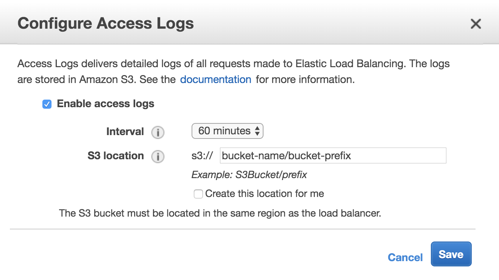
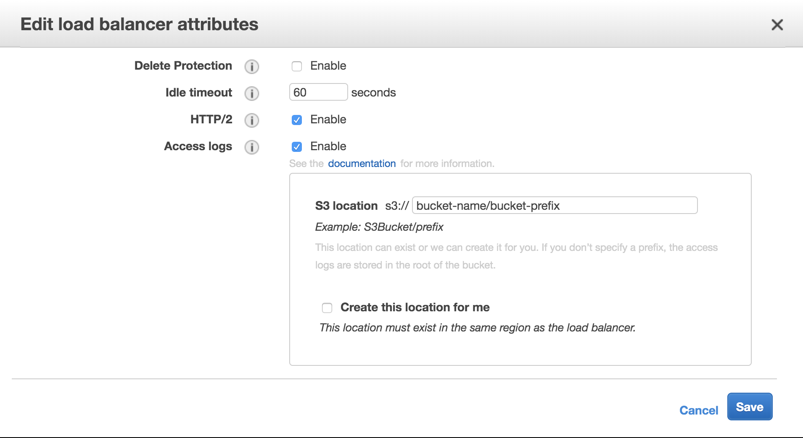

# [k8s] Saving access logs with kubernetes from AWS
> date - 2019.06.09  
> keyword - kubernetes, k8s, aws, access log  
> AWS에 구축된 kubernetes cluster에서 access log를 쌓는 방법을 정리

<br>

Cloud Provider AWS를 사용할 때 kubernetes의 service와 ingress를 사용해 access log를 남길 수 있다

<br>

## Service 사용
* annotation 기반으로 설정할 수 있다

```yaml
apiVersion: v1
kind: Service
metadata:
  annotations:
    service.beta.kubernetes.io/aws-load-balancer-access-log-enabled: "true"
    # access log emit interval - 5 or 60(minutes)
    service.beta.kubernetes.io/aws-load-balancer-access-log-emit-interval: "60"
    service.beta.kubernetes.io/aws-load-balancer-access-log-s3-bucket-name: "bucket-name"
    service.beta.kubernetes.io/aws-load-balancer-access-log-s3-bucket-prefix: "bucket-prefix"
...
```

* 위의 설정으로 service를 생성하면 AWS ELB에는 아래와 같이 설정된다


* 그리고 AWS S3의 `bucket-name/bucket-prefix/AWSLogs/{id}/elasticloadbalancing/{region}/yyyy/mm/dd`에 다음과 같은 format으로 저장된다
  * e.g. Amazon S3/prod-access-log/products/AWSLogs/319070278709/elasticloadbalancing/ap-northeast-1/2019/06/09

```
2019-06-08T23:34:32.394790Z a2295542a67ea11e9ae69064a7a77211 110.70.14.160:62611 10.16.2.81:32346 0.000062 0.000997 0.000023 307 307 280 327 "POST https://my-web.com:443/v1/log HTTP/1.1" "passd/1.0 CFNetwork/978.0.7 Darwin/18.6.0" ECDHE-RSA-AES128-GCM-SHA256 TLSv1.2
```

> TODO: Cloud provider aws를 사용해서  
> service-controller에서 provisioning하는 코드 찾아보면 좋을지도..?  
> Controller manager의 service-controller가 어떻게 cloud provider를 사용하는지…?  
> 따로 Pod으로 뜨는건 아닌듯한데...


<br>

## Ingress 사용
* [kubernetes-sigs/aws-alb-ingress-controller](https://github.com/kubernetes-sigs/aws-alb-ingress-controller/)를 사용하면 ingress마다 AWS ELB를 ALB type으로 provisioning 해준다

```yaml
apiVersion: extensions/v1beta1
kind: Ingress
metadata:
  annotations:
    alb.ingress.kubernetes.io/load-balancer-attributes: access_logs.s3.enabled=true,access_logs.s3.bucket=bucket-name,access_logs.s3.prefix=bucket-prefix
...
```

> load-balancer-attributes에는 access log 말고도 http2, idle_timeout 등 [Load Balancer Attribbutes](https://docs.aws.amazon.com/elasticloadbalancing/latest/APIReference/API_LoadBalancerAttribute.html)를 설정할 수 있다

* 위의 설정으로 service를 생성하면 AWS ELB에는 아래와 같이 설정된다


* 그리고 AWS S3의 `bucket-name/bucket-prefix/AWSLogs/{id}/elasticloadbalancing/{region}/yyyy/mm/dd`에 다음과 같은 format으로 저장된다
  * e.g. Amazon S3/prod-access-log/products/AWSLogs/319070278709/elasticloadbalancing/ap-northeast-1/2019/06/09

```
https 2019-06-08T23:56:03.131195Z app/18c1ed0b-default-mywebingre-454b/937bdb626ff71e41 18.217.88.49:48502 10.16.3.21:31967 0.001 0.014 0.000 404 404 849 689 "GET https://my-web.com:443/health HTTP/1.1" "Mozilla/5.0 (X11; Linux x86_64) AppleWebKit/537.36 (KHTML, like Gecko) Chrome/36.0.1985.67 Safari/537.36" ECDHE-RSA-AES128-GCM-SHA256 TLSv1.2 arn:aws:elasticloadbalancing:ap-northeast-1:319070278709:targetgroup/18c1ed0b-4ad07f2c3fd997784c4/d2c728912ecbac85 "Root=1-5cfc4b13-01af84409ebe06d6aadbcb40" "my-web.com" "session-reused" 2 2019-06-08T23:56:03.115000Z "forward" "-" "-"
```

> TODO: 저장했으니 이걸 읽어서 활용하는 것도 정리하면 좋을듯

<br><br>

> #### Reference
> * [ELB Access Logs on AWS - k8s Docs](https://kubernetes.io/docs/concepts/services-networking/#elb-access-logs-on-aws)
> * [Ingress annotations - AWS ALB Ingress Controller Docs](https://kubernetes-sigs.github.io/aws-alb-ingress-controller/guide/ingress/annotation/#custom-attributes)
